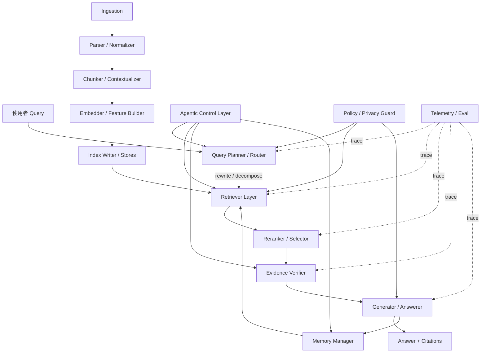
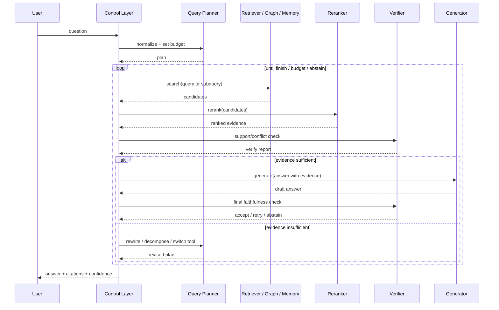

# RAG 共同架構深度研究報告

## Executive summary

截至 **2026-07-04**，把「RAG 共同架構」理解成單一固定流程已經不夠準確；更接近研究與工程現況的說法是：**現代 RAG 的共同架構不是 Naive RAG，而是以 Modular RAG 為骨架、在其上疊加 query understanding、retrieval、validation、agentic control、memory 與 observability 的可組裝系統**。這個判斷同時受到近年的 RAG 綜述、Modular RAG 論文、A-RAG、Agentic GraphRAG、Infini Memory、RAG-Anything、NodeRAG、Hyper-RAG 等方向支持；它們彼此沒有單一統一標準，但已經在「模組化資料面 + agentic 控制面 + 結構化知識面 + 持久化記憶面」上形成明顯收斂。你上傳的 Markdown 也已把 Naive/Advanced/Modular 與 cross-cutting components 分開，這與最新研究趨勢高度一致。citeturn0academia0turn0academia1turn6academia2turn6academia0turn6academia1turn5academia0turn4academia1turn3academia0 fileciteturn0file0

## 共同架構的定義與設計原則

「RAG 共同架構」在本文中指的不是某一篇論文或某個框架的私有 pipeline，而是**一組可互換、可觀測、可迴圈、可擴充的模組化 backbone**：資料先經 ingestion、parsing、chunking、indexing 形成可檢索表徵；查詢經 routing 或 rewriting 後進入 retriever；候選證據再經 reranking、validation 或 conflict resolution；最後由 generator 生成答案，並在需要時走 agentic loop、多輪 tool use、或 memory read/write。Gao 等人的 survey 已將 RAG 發展整理成 Naive、Advanced、Modular 三個主幹，而 2024 年的 Modular RAG 更進一步把現代 RAG 定義為由 modules 與 operators 組成、可支援 linear、conditional、branching、looping pattern 的可重組框架。citeturn0academia0turn0academia1

因此，**Naive RAG 更像最小執行單元，不是現代共同骨架**。這一點和你上傳的整理一致：Naive RAG 適合作為 core primitive；真正能承載 GraphRAG、Agentic RAG、Memory RAG 的，是更高一層的 Modular backbone。A-RAG 明確反對「單次 retrieval + 預定 workflow」的舊範式，轉而把 keyword search、semantic search、chunk read 直接暴露成 agent 可用的層級化工具；Infini Memory 也把 memory retrieval 改成可迭代 tool call，而不是一次取回 top-k 記憶。citeturn6academia2turn6academia1 fileciteturn0file0

共同架構若要在工程上成立，核心設計原則通常有六個。第一是 **module isolation**，也就是每一層都有清楚輸入輸出，便於替換 retriever、reranker、verifier 或 generator。第二是 **data plane 與 control plane 分離**，讓 retrieval/index/memory 屬於資料面，而 planning/tool selection/loop termination 屬於控制面。第三是 **evidence-first generation**，先建立 provenance、confidence、conflict 狀態，再決定輸出策略。第四是 **late binding**，盡量在執行期才決定是否查圖、查記憶、查 web，而不是在 pipeline 一開始寫死。第五是 **observability by default**，每一步都必須記錄 query、候選證據、rerank 分數、latency、token cost、final citation。第六是 **policy hooks**，在 query 入站、retrieval 出站、generation 入站都能插入 PII、ACL、federated、compliance 規則。這些原則可以從 Modular RAG、RAGLAB、GraphRAG repo 與 Haystack component 化設計中看到清楚影子。citeturn0academia1turn8academia4turn19view3turn16view0turn16view3

從最新文獻來看，還有一個非常實務的重要現象：**名稱不再等於層級**。例如 Hybrid Retrieval、Contextual Retrieval、metadata filtering、PII redaction 並不是獨立主架構，而是可橫向疊加在多種 RAG 上的元件。反過來，GraphRAG、A-RAG、Infini Memory、HM-RAG 則是在共同骨架之上，分別往知識結構、控制層、持久記憶、多代理多模態延伸。這也是為什麼單一樹狀 taxonomy 會開始失真，而「共同骨架 + 橫向元件 + 高階變體」更接近工程真相。citeturn11view1turn16view2turn25view0turn6academia0turn6academia2turn6academia1turn5academia2

## 模組、責任與介面契約

下表不是某個單一框架的原封不動 API，而是根據 Modular RAG、RAGLAB、Haystack component taxonomy、GraphRAG/A-RAG/Infini Memory 等公開實作**抽象出的建議介面**。如果你的目標是讓團隊可替換不同 retrieval 與 control 策略，這種 contract-first 設計通常比先綁死在某個 vendor SDK 更耐用。citeturn0academia1turn8academia4turn16view0turn16view3turn18view0turn19view3

| 模組 | 主要責任 | 建議 API 風格 | 典型輸入 | 典型輸出 | 常見實作選項 | 延遲 / 成本 / 風險重點 |
|---|---|---|---|---|---|---|
| Ingestion Connector | 接外部資料源與版本同步 | `pull(source_spec) -> RawDocument[]` | 檔案、DB、API、web、消息流 | `RawDocument{id, uri, mime_type, content, metadata}` | filesystem、S3、SharePoint、SQL、Graph API、web crawler；Haystack 也把 connector/document store 分開處理 citeturn16view0 | I/O 與資料新鮮度是主成本；若資料源權限複雜，ACL 失誤會直接污染整個 index。 |
| Parser / Normalizer | 把 PDF、HTML、表格、圖片等轉成統一中介格式 | `parse(raw_doc) -> CanonicalDoc` | `RawDocument` | `CanonicalDoc{text, blocks, tables, images, spans, metadata}` | Docling / MinerU 類 parser；RAG-Anything 明確把 multimodal parsing 與知識表示分層處理 citeturn5academia0turn18view1 | PDF/多模態 parsing 的錯誤會向下游擴散；這一層常是 multimodal RAG 的瓶頸。 |
| Chunker / Contextualizer | 切塊、重疊、章節保持、上下文補強 | `chunk(doc, policy) -> Chunk[]` | `CanonicalDoc` | `Chunk{id, text, parent_id, offsets, metadata}` | recursive/paragraph/semantic chunking；Anthropic 的 Contextual Retrieval 會為每個 chunk prepend 50–100 token 的 contextual text citeturn11view1 | 這是 offline 成本大戶；Anthropic 在其假設下估算 contextualization 約 **$1.02 / 百萬文件 token** 的一次性處理成本。citeturn11view1 |
| Embedder / Feature Builder | 產生 dense / sparse / hybrid / graph features | `encode(chunks, mode) -> FeatureSet` | `Chunk[]` | 向量、稀疏詞項、entity/relation、graph node | dense embedding、BM25/TF-IDF、SPLADE、entity extraction；Haystack 把 sparse / dense / sparse-embedding retriever 分開列類別 citeturn16view0 | Dense 準確但需要 embedding 成本；sparse 便宜但對語義改寫較弱；graph extraction 額外吃 LLM token。 |
| Index Writer | 將 feature 寫入檢索儲存層 | `upsert(features) -> IndexReceipt` | `FeatureSet` | `IndexReceipt{index_ids, version, stats}` | vector DB、OpenSearch、Neo4j、hypergraph DB、memory docs；GraphRAG 與 LightRAG 都明確有獨立 indexing pipeline citeturn19view3turn13view0 | GraphRAG repo 特別警告 indexing 可能很昂貴；建圖與摘要前處理通常比 plain vector indexing 更花錢。citeturn19view3 |
| Query Planner / Router | 正規化 query、分流工作模式、設定 budget | `plan(user_query, session_state) -> Plan` | 使用者 query、歷史、tenant policy | `Plan{rewrites, subqueries, route, budget, stop_criteria}` | query rewriting、Typed-RAG、intent router、A-RAG agent prompt citeturn30academia0turn18view0 | 做得好可減少無謂檢索；做不好會造成 loop 爆炸與 retrieval drift。 |
| Retriever | 從對應 index 找候選證據 | `search(plan) -> Candidate[]` | `Plan`、filters、index namespace | `Candidate{id, content, score, provenance, metadata}` | BM25、dense、hybrid、Cypher/graph retriever、SQL retriever、memory retriever；Haystack 提供 BM25 / Embedding / Hybrid / Cypher / SQL / Metadata 等多類 retriever citeturn16view0turn16view2 | 線上延遲通常主要在 retriever + reranker；hybrid recall 高但成本較高；graph/memory retrieval 需要更多 tool orchestration。 |
| Reranker / Selector | 重排候選、控制 token 預算 | `rerank(query, candidates) -> RankedCandidates` | query + top-N 候選 | `RankedCandidate[]` | cross-encoder、late interaction、LLMRanker、MetaFieldRanker；Haystack 列出 Cohere/Jina/Fastembed/LLMRanker 等 citeturn16view3 | Reranking 幾乎是最穩定的精度提升槓桿之一，但會增加線上耗時；N 太大會讓成本急升。 |
| Evidence Verifier | 檢查相關性、支持度、矛盾、因果一致性 | `verify(query, answer?, evidence) -> VerificationReport` | query、候選證據、可選答案草稿 | `VerificationReport{support, conflict, faithfulness, causal_ok}` | CRAG retrieval evaluator、Self-RAG reflection token、Causal validation、NLI verifier、MADAM-RAG aggregator citeturn1academia1turn1academia0turn29academia0turn3academia1 | 這層直接換來 faithfulness，但若 verifier 本身不穩會生成「假確信」。 |
| Generator / Answerer | 以證據與 policy 生成答案 | `generate(query, evidence, policy) -> Answer` | query、最終 evidence set、style/citation policy | `Answer{text, citations, abstain_flag}` | frontier LLM、domain LM、citation-aware prompt、InstructRAG 類訓練 citeturn32academia0turn1academia0 | 主成本通常是 token；長 context 成本高，且容易掉入 lost-in-the-middle。 |
| Control Layer / Agent | 決定何時 search、何時 finish、是否再驗證 | `step(state) -> Action` | `AgentState{query, evidence, cost, trace}` | `Action{search|read|rerank|verify|finish|write_memory}` | ReAct、A-RAG、ReaRAG、MCTS-RAG、HM-RAG、Agentic GraphRAG citeturn28academia0turn6academia2turn8academia1turn2academia0turn5academia2turn6academia0 | 這層是最新研究的主戰場；同時也是 latency、token、可觀測性最難控的地方。 |
| Memory Manager | 讀寫長期記憶、episodic / semantic consolidation | `read(topic|query)`, `write(events)`, `consolidate()` | session trace、new facts、memory query | topic docs / memory snippets / update receipt | Infini Memory、memory retriever、topic documents；Haystack 已有 memory retriever 類型，Infini Memory 則提出 topic-structured docs 架構 citeturn17academia3turn16view1 | 若沒有 revision policy，memory 會累積衝突與陳舊事實。 |
| Policy / Privacy Guard | PII、ACL、tenant boundary、compliance | `sanitize(payload)`, `authorize(query)` | query、retrieved docs、generated answer | redacted payload、allow/deny | Presidio、federated retrieval、privacy-preserving RAG citeturn25view0turn23academia2turn23academia0 | 不能只在輸出端做；最好在入站 query、檢索結果、觀測日志三處都做。 |
| Telemetry / Eval | tracing、offline eval、A/B、regression | `log(trace)`, `score(runset)` | full trace、gold set、judge config | dashboard、metrics、regression alerts | RAGLAB、RAGAS、eRAG、Langfuse/RAGAS integration 類生態 citeturn8academia4turn22academia1turn15academia0turn13view0 | 沒有 eval，團隊幾乎無法知道是 retriever 壞、reranker 壞，還是 generator 壞。 |

如果要從 API 設計再往下收斂，最值得先標準化的是 **Chunk、Candidate、VerificationReport、AgentState** 這四個資料結構。它們本質上對應 chunk-based RAG、graph RAG、memory RAG 的共同交會點。即使底層檢索來源不同，線上協議仍可盡量統一成下列形狀。這也是為什麼 A-RAG 能把 keyword / semantic / chunk-read 三種工具掛在同一 agent interface 上，而 HM-RAG 能讓多來源檢索代理被 Decision Agent 統一整合。citeturn18view0turn19view2

```json
{
  "Chunk": {
    "chunk_id": "doc123#p4#c2",
    "content": "....",
    "modality": "text|table|image|graph|memory",
    "metadata": {"source":"sec_10q", "tenant":"acme", "timestamp":"2026-06-01"},
    "provenance": {"doc_id":"doc123", "offsets":[1024,1536]}
  },
  "Candidate": {
    "chunk": "Chunk",
    "retrieval_score": 0.82,
    "retrieval_mode": "dense|sparse|hybrid|graph|memory",
    "ranker_score": 0.91,
    "support_labels": ["relevant", "partial_support"]
  },
  "VerificationReport": {
    "faithfulness": 0.88,
    "conflict": [{"with":"doc999#c5", "type":"temporal_conflict"}],
    "causal_ok": true,
    "decision": "accept|retry|abstain|ask_clarification"
  }
}
```

## 資料流、控制流與索引選型

你提供的 Markdown 把現代 RAG 重新整理成「core primitive → common framework → cross-cutting components → higher-level variants」，這個拆法非常接近本文研究結論：資料面的最小單元仍然是 index → retrieve → generate，但控制面已經變成獨立一層；GraphRAG、A-RAG、Infini Memory、RAG-Anything 則是在同一 backbone 上沿不同方向演化。fileciteturn0file0 citeturn0academia1turn6academia2turn6academia0turn6academia1turn5academia0

```text
                     ┌──────────────────────────────┐
                     │         Control Plane         │
                     │ plan / route / loop / stop    │
                     │ agent / verify / memory write │
                     └──────────────┬───────────────┘
                                    │
                     ┌──────────────▼───────────────┐
                     │          Data Plane           │
                     │ ingest → parse → chunk       │
                     │ encode → index → retrieve    │
                     │ rerank → compose → generate  │
                     └──────────────┬───────────────┘
                                    │
                     ┌──────────────▼───────────────┐
                     │      Observability Plane      │
                     │ trace / cost / latency / eval │
                     └──────────────────────────────┘
```

下圖把共同架構的資料流與控制流分開畫。這不是任何單一論文原圖，而是綜合 Modular RAG、A-RAG、GraphRAG、Infini Memory、HM-RAG 的工程抽象。它的重點在於：**retrieval 與 generation 是資料流；是否要再次 retrieval、是否要切換工具、是否要寫回記憶，則是控制流。**citeturn0academia1turn6academia2turn6academia1turn6academia0turn19view2



如果系統採用 agentic loop，sequence 會更像下面這樣。這也是 A-RAG、ReaRAG、Agentic GraphRAG、Infini Memory 最值得工程團隊重視的差異：它們不再假設「只 search 一次」。citeturn18view0turn8academia1turn6academia0turn6academia1



在索引層，近兩年最大的共識不是「哪一種 index 絕對最好」，而是**索引結構必須和問題型態匹配**。Haystack 的 retriever taxonomy 已把 sparse、dense、sparse-embedding、hybrid、metadata、SQL、Cypher 等明確拆開；GraphRAG、LightRAG、NodeRAG、Hyper-RAG 則證明在多跳、全域摘要、關係密集領域裡，結構化 index 能超越 flat chunk 檢索；Infini Memory 進一步把「記憶文件」視為一種 persistent retrievable store。citeturn16view0turn20academia0turn12academia0turn4academia1turn3academia0turn17academia3

| 類型 | 核心表徵 | 優點 | 缺點 | 適合場景 | 代表實作 / 論文 |
|---|---|---|---|---|---|
| Sparse | 詞項 / BM25 / lexical match | 對專有名詞、product code、錯拼變體、exact match 很強；便宜、可解釋 | 對語意改寫與跨句關係較弱 | 法規、程式碼、錯誤碼、企業術語 | Haystack 的 BM25 / keyword retriever 類與 OpenSearch / Elasticsearch / Weaviate keyword retriever citeturn16view0 |
| Dense | embedding 向量 | 對語義相似度、改寫、口語提問友善 | 容易漏掉 exact token；需要 embedding 成本與向量庫 | FAQ、客服、通用知識問答 | Haystack embedding retriever family citeturn16view0 |
| Hybrid | sparse + dense 融合 | 通常是最穩定的 recall/precision 折衷；可同時抓 exact 與 semantic evidence | 線上與離線兩套表徵都要維護，成本較高 | 多數 production QA、金融文本、表格+文字 | Anthropic 將標準 RAG 明確寫成 BM25 + embeddings + rank fusion；Haystack 也提供 hybrid retriever citeturn11view1turn16view0 |
| Graph | entity-relation / community summary / path | 適合 multi-hop、global question、跨文件推理、圖式摘要 | 建圖昂貴且維護複雜；抽取錯誤會污染全局 | 研究助理、法務、商業調查、知識密集問答 | Microsoft GraphRAG、LightRAG、NodeRAG、GraphRAG-Bench citeturn20academia0turn19view3turn12academia0turn13view0turn4academia1turn22academia0 |
| Hypergraph | 超邊同時連多節點 | 能表示 beyond-pairwise 關係，對多實體共同事件更自然 | 工具鏈少、工程成熟度較低、建模更難 | 醫療、科研、事件分析、高階關聯檢索 | Hyper-RAG / Hyper-RAG-Lite citeturn3academia0turn19view0 |
| Memory Store | topic docs / episodic records / semantic memory | 跨 session 持久化、可合併與修訂事實、利於 agent personalization | 容易累積陳舊與衝突記憶，需要 consolidation policy | 長期助理、copilot、跨工單客服、研究副手 | Infini Memory；Haystack 已列出 memory retriever 類型 citeturn17academia3turn16view1 |

實際選型時，可以用一條很務實的規則：**先用 hybrid 當 baseline；只有在多跳/全域摘要/跨模態/跨 session 真的成為主要誤差來源時，才升級到 graph、multimodal graph 或 memory store。**原因很簡單：Hybrid 幾乎總是最容易上 production，而 GraphRAG 與 multimodal graph 往往把工程難度帶到另一個量級。Microsoft GraphRAG repo 直接提醒 indexing 成本高；LightRAG 則把「雙層檢索 + 增量更新」作為降低成本的主要工程手段。citeturn19view3turn12academia0turn13view0

## 控制層、驗證與衝突處理

近兩年的真正分水嶺不在 retriever，而在 **control layer**。傳統 RAG 先 retrieve 再 generate；agentic RAG 則把 retrieval 視為可被模型主動呼叫的工具。A-RAG 將「自主選策略、可多輪執行、ReAct 式交錯 tool use」總結成 agentic autonomy 的三條件；ReaRAG 把 loop 簡化成很工程化的 `Search / Finish` action space；MCTS-RAG 則把整個過程變成 inference-time tree search；InstructRAG 把 task planning 跟 instruction graph、RL 與 meta-learning 接起來。citeturn18view0turn8academia1turn2academia0turn32academia0

| 設計模式 | 代表方法 | 核心機制 | 優點 | 代價 / 風險 | 何時優先採用 |
|---|---|---|---|---|---|
| Search / Finish loop | ReaRAG | 每一步只決定「繼續查」或「結束回答」 | 簡單、好除錯、好記錄 trace；很適合先做 production 版 agentic control | 工具集合較窄；遇到複雜多源策略彈性不足 | 先從 single-corpus multi-hop QA 起步時 citeturn8academia1 |
| TAO loop | InstructRAG；也可視為 ReAct 家族的一種 | Thought → Action → Observation 交錯，並在 task planning 場景中接 instruction graph | 適合規劃型任務與多步驟 agent | training 與設計成本較高；trace 更複雜 | 任務需要 sequence planning，而不只是 fact lookup 時 citeturn32academia0turn28academia0 |
| ReAct-style tool use | A-RAG、Agentic RAG | 模型直接呼叫 keyword / semantic / read 等工具，根據 observation 再決定下一步 | 最符合 2026 agentic 趨勢；可自然接 web、graph、memory | token 成本與 loop budget 容易失控；termination policy 很重要 | 想把 retrieval 視為通用工具，而不是固定步驟時 citeturn6academia2turn18view0 |
| MCTS search | MCTS-RAG | 用 tree search 探索不同 reasoning-retrieval 路徑 | 在高難度 reasoning 問題上可用 test-time compute 換精度 | 線上延遲與成本最高；不適合多數即時應用 | 小模型要追高階推理表現時 citeturn2academia0 |
| Multi-agent coordination | HM-RAG、MADAM-RAG、Agentic GraphRAG | 將 decomposition / retrieval / decision 或 debate 分配給不同 agent | 容易把多來源問題模組化；對 multimodal、conflict 場景很強 | orchestration、監控、成本都更複雜 | 資料模態很多，或衝突證據需要顯式仲裁時 citeturn5academia2turn29academia0turn6academia0 |
| Memory read / write loop | Infini Memory | retrieval 以 topic docs 為單位讀取；新觀察先入 buffer，再 consolidation | 很適合跨 session 助理與可維護長期記憶 | 沒有 revision policy 會越用越亂；需要記憶治理 | 任務跨多天、多輪、要持續追蹤事實變化時 citeturn6academia1turn17academia3 |

證據驗證層則是另一個共同元件。從 2024 到 2026，大量方法開始把 faithfulness 問題往獨立模組外移，而不是只靠 generator 自己「乖乖引用」。CRAG 用 lightweight retrieval evaluator 決定文檔品質夠不夠；Self-RAG 讓模型生成 reflection tokens 自評是否要檢索、是否有支撐；MADAM-RAG 用多 agent debate + aggregator 處理 ambiguity、misinformation、noise 同時存在的場景；CDF-RAG 則用 causal graph 與 causal pathway validation 去驗證答案是否真的沿正確因果鏈推導。citeturn1academia1turn1academia0turn29academia0turn3academia1turn19view1

| 驗證 / 衝突策略 | 代表方法 | 驗證對象 | 典型指標 | 強項 | 風險 |
|---|---|---|---|---|---|
| Reranker | Haystack rankers、cross-encoder 類 | query-candidate 相關度 | Recall@k、MRR、NDCG、Context Precision | 最穩定的 first-line filter；能明顯減少雜訊 | 只看相關，不一定保證支持度或事實一致性 citeturn16view3turn11view1 |
| Retrieval evaluator | CRAG | retrieved docs 的整體品質 | downstream accuracy、faithfulness、retrieval confidence | 可決定是否 fallback 到 web search 或 rewrite | evaluator 錯判會造成不必要的 loop 或錯失補查機會 citeturn1academia1 |
| Self-reflection verifier | Self-RAG | 生成中間步與最終答案 | factuality、citation accuracy、answer quality | 不需額外 verifier pipeline 也能做自評 | 高度依賴模型是否真的學會 reflection token semantics citeturn1academia0 |
| Debate aggregator | MADAM-RAG | 多來源、模糊查詢、錯誤資訊 | EM、FaithEval、AmbigDocs 類任務分數 | 特別擅長 ambiguous / conflicting evidence | 多 agent 成本高，且 aggregator 仍可能被不平衡證據誤導 citeturn29academia0 |
| Causal validation | CDF-RAG | 因果路徑與 response consistency | accuracy、causal correctness、explainability | 適合醫療、政策、決策支援等需要 causal story 的場景 | 依賴因果圖品質；建圖成本高 citeturn3academia1turn19view1 |
| NLI-guided search / self-correction | Self-Correcting RAG | answer-faithfulness under token budget | fact-checking / multi-hop QA 指標 | 對複雜推理與 hallucination 抑制有潛力 | 2026 新方法，工程成熟度仍在早期 citeturn30academia1 |

如果要評估這些模組是否真的有價值，不建議只看最後答案的 EM 或 F1。比較好的做法是把評估拆成三層。**第一層是 retrieval quality**，例如 Recall@k、MRR、NDCG、context precision。**第二層是 evidence-grounded generation**，例如 faithfulness、citation accuracy、abstention / refusal 適切性。**第三層是 end-to-end task success**，例如 EM、F1、LLM-as-a-judge、turn success rate。eRAG 說明單純 relevance label 和下游表現的相關性其實有限；CRAG benchmark、CRUD-RAG、GraphRAG-Bench、T²-RAGBench、mmRAG、LIT-RAGBench 都在嘗試把評估拆得更細。citeturn15academia0turn15academia2turn15academia1turn22academia0turn20academia2turn20academia3turn20academia1

這裡還有一個很容易被忽略、但研究時必須寫進風險清單的點：**`CoRAG` 這個縮寫在 2025–2026 的文獻裡有 acronym collision**。一個是 2025 的 **Collaborative Retrieval-Augmented Generation**，講的是 clients 共享 passage store 的協作式 RAG；另一個是 2026 的 **Cooperative Retrieval-Augmented Generation**，講的是 reranker 與 generator 作為 peer decision-maker 的協作決策框架。若團隊要做閱讀清單或 benchmark automation，最好把 citation key 拆開，不然很容易混淆。citeturn2academia1turn30academia3

## 可疊加元件與工程注意事項

在 production 中，真正決定穩定性的常常不是某個大論文名稱，而是那些**橫向可疊加的 cross-cutting components**。你上傳的 Markdown 把 Hybrid Retrieval、Contextual Retrieval、Reranking、Query Rewriting、RAGLAB 抽成平行元件，這個做法是對的，因為它們大多不是互斥主架構，而是可以直接疊到 Dense RAG、GraphRAG、Agentic RAG 之上的工程能力。fileciteturn0file0

| 元件 | 作用層 | 主要價值 | 典型做法 | 工程注意事項 |
|---|---|---|---|---|
| Contextual chunking / Contextual Retrieval | chunking / indexing | 減少 chunk 脫離原文脈絡而導致的誤檢索 | 為 chunk prepend 文件層上下文，再一起做 embedding 與 BM25 index | Anthropic 顯示 contextual embeddings + contextual BM25 可把 top-20 retrieval failure rate 從 5.7% 降到 2.9%，若再加 reranking 可降到 1.9%；但這是 offline 預處理成本換來的改善。citeturn11view1 |
| Query rewriting | query understanding | 把口語化、指代不清的 query 轉成更可查詢的形式 | LLM rewrite、template rewrite、typed decomposition | rewrite 漂移會破壞 exact match；最好保留原 query 與 rewritten query 並聯檢索。citeturn30academia0turn5academia2 |
| Reranking | post-retrieval | 高性價比提升 precision，壓低 prompt 噪音 | cross-encoder、late interaction、LLMRanker | top-N 選太大會傷 latency；選太小會傷 recall。Haystack 列出多種 ranker，可直接替換。citeturn16view3turn11view1 |
| Metadata filtering | retrieval / policy | 限縮 tenant、時間範圍、來源可信度 | filter policy、metadata retriever、meta-field ranker | 一定要在 retriever 前就下 filter，不要只在生成前才排除。Haystack 提供 FilterRetriever 與 MetadataRetriever 類型。citeturn16view2turn16view0 |
| Privacy / PII handling | policy guard | 避免 query、context、logs 洩漏個資 | 入站 redaction、context redaction、log scrubbing；Presidio 是常見 OSS 選項 | Presidio 官方也提醒自動偵測不能保證抓到所有敏感資訊，因此不能把它視為唯一防線。citeturn25view0 |
| Federated retrieval | retrieval / governance | 讓資料留在本地，只交換摘要、分數、表徵 | 協作 passage store、federated retriever、anonymized summaries | 2025–2026 文獻顯示這條路線在隱私敏感場景很重要，但評估與部署複雜度高。citeturn2academia1turn23academia0turn23academia1turn23academia2 |
| Research / evaluation framework | observability / research | 讓團隊能公平替換組件並做 regression | RAGLAB、benchmark harness、trace store | 沒有統一 eval harness，團隊很容易陷入「換模型好像有進步，但不知道為什麼」的狀態。citeturn8academia4turn18view2 |

從效能角度看，RAG 成本最好分成 **offline indexing cost** 與 **online serving cost** 兩筆帳。GraphRAG 這種需要 entity extraction、community summary、graph build 的方法，成本主要在 offline；A-RAG、ReaRAG、MCTS-RAG、Infini Memory 則把更多成本搬到 online，因為 loop、tool use、memory inspection 都在回答時發生。Anthropic 的 Contextual Retrieval則是標準的「榨乾 offline 換 online 精度」案例；GraphRAG repo 直接提醒 index 很貴；MCTS-RAG 則明確用更多 inference-time compute 換來小模型更強推理。citeturn11view1turn19view3turn2academia0

實務上可用兩個公式先估成本。這兩式是工程化摘要，不是單一文獻原式：  
`T_total ≈ T_rewrite + T_retrieve + T_rerank + N_loop*(T_reason + T_tool + T_verify) + T_generate`  
`C_total ≈ C_offline_embed + C_offline_index + Σ_loop(token_in + token_out + rerank_calls + infra_reads)`  
其中，**loop 次數**、**rerank 候選數**、**是否建圖**、**是否做 multimodal parsing**，通常是四個最強的成本驅動因子；這個判斷和 A-RAG、GraphRAG、HM-RAG、RAG-Anything、Infini Memory 的系統型研究方向一致。citeturn6academia2turn19view3turn5academia2turn5academia0turn6academia1

## 最新趨勢、落地路線與優先閱讀

若只看 2026 年，最值得工程團隊追的不是「又多一個 RAG 名稱」，而是四條真正改變共同架構的路線：**Agentic Retrieval、Agentic GraphRAG、Memory-augmented RAG、Multimodal Knowledge RAG**。A-RAG 已把層級化 retrieval interface 概念講得非常清楚；Agentic GraphRAG 把圖查詢與 bounded reflection loop 結合；Infini Memory 把長期記憶從片段索引改成可修訂的 topic documents；RAG-Anything 則把 multimodal content 直接視為可建圖、可混合檢索的 knowledge entities。citeturn6academia2turn6academia0turn6academia1turn5academia0

| 趨勢 | 關鍵 paper / repo | 關鍵訊號 | 你該如何解讀 |
|---|---|---|---|
| Agentic Retrieval | A-RAG paper + repo citeturn6academia2turn18view0 | retrieval 被正式做成 agent 直呼的工具介面；repo 也直接暴露 `keyword_search`、`semantic_search`、`chunk_read` | 這代表未來「retriever」會更像 toolset，而不是單一 stage。 |
| Agentic GraphRAG | Agentic GraphRAG paper citeturn6academia0 | graph build、intent routing、bounded reflection、tool-mediated graph access 放在同一架構 | GraphRAG 正從「靜態圖查詢」變成「圖工具 + agent 控制」。 |
| Memory-augmented RAG | Infini Memory citeturn6academia1turn17academia3 | topic-structured documents、buffer + consolidation、iterative memory retrieval | 長期記憶開始被當成一種可維護的 retrieval substrate，而不是聊天歷史拼接。 |
| Multimodal Knowledge RAG | RAG-Anything；另可參考 MG²-RAG citeturn5academia0turn5academia1 | dual-graph / multimodal KG / cross-modal hybrid retrieval | 文字、表格、圖片會逐步走向同一個 retrieval plane。 |
| Graph-native efficiency | NodeRAG、LightRAG、E²GraphRAG citeturn4academia1turn12academia0turn12academia3 | 大家都在試圖把 graph-based RAG 做得更快、更便宜、更可維護 | GraphRAG 不是只有精度競賽，工程效率已成主要戰場。 |
| Privacy-preserving / federated RAG | CoRAG、FedE4RAG、HyFedRAG、PRAG citeturn2academia1turn23academia1turn23academia0turn23academia2 | 不共享原始資料、只共享表徵/摘要/加密信息的架構開始成型 | 對醫療、金融、政府是高優先級研究方向。 |

如果從 **PoC 到 production** 規劃，我建議不要一開始就衝 GraphRAG + agent + memory + multimodal 全上。比較穩的順序是：先建立可觀測 baseline，再逐層加 complexity。下表的時間、人力與成本是**基於模組數量與架構難度的範圍推估**，不是文獻直接報價；假設團隊有 2–4 名工程師、1 名產品/資料方對接，且已有基礎雲端與向量庫資源。複雜度估算的依據來自 GraphRAG 的高 indexing 成本提醒、A-RAG/Infini Memory 的 loop 與 tool 成本、以及 RAG-Anything / HM-RAG 對 multimodal orchestration 的額外要求。citeturn19view3turn6academia2turn6academia1turn5academia0turn5academia2

| 階段 | 目標 | 主要 deliverables | 估計時間 | 人力假設 | 成本假設 |
|---|---|---|---|---|---|
| Baseline PoC | 先拿到可評估的 RAG | ingestion、parser、chunking、dense/hybrid retrieval、basic rerank、offline eval | 2–4 週 | 2 位工程師 | 低到中；主要是 embedding、向量庫、少量 LLM 調用 |
| Production Alpha | 讓結果可觀測、可回歸 | tracing、regression set、metadata filtering、PII guard、citation formatting、SLA dashboard | 再 3–5 週 | 2–3 位工程師 | 中；在線 rerank 與 eval 成本開始上升 |
| Advanced Retrieval | 提升 recall / precision | hybrid + contextual retrieval + better reranker + query rewriting | 再 2–4 週 | 2–3 位工程師 | 中；offline contextualization 增加預處理費用 |
| Agentic Beta | 引入 controlled loop | Search/Finish loop 或 A-RAG style tools、budget policy、abstain policy | 再 4–8 週 | 3 位工程師 | 中到高；token cost 與 observability 工作量上升 |
| Structured RAG | 圖或表格強化 | GraphRAG / LightRAG / NodeRAG 之一；GraphRAG-Bench 類測試集 | 再 6–10 週 | 3–4 位工程師 | 高；建圖、摘要、重建索引是主成本 |
| Memory / Multimodal | 做跨 session 或多模態 | topic memory、memory consolidation、RAG-Anything / multimodal parser | 再 6–12 週 | 3–4 位工程師 + 1 MLE | 高到很高；解析、索引、tool orchestration 明顯複雜 |
| Privacy / Federated | 對敏感場景上線 | local retrieval、de-identification、federated exchange / encryption | 視法規要求再加 6–12 週 | 4 位工程師 + security 支援 | 高；法遵與 infra 額外成本高 |

測試矩陣最好至少包含四個維度：**retrieval、generation、workflow、operations**。retrieval 看 Recall@k、MRR、NDCG、context precision；generation 看 EM/F1、faithfulness、citation accuracy、abstention rate；workflow 看 agent loop 長度、tool success rate、retry rate、memory hit rate；operations 看 p50/p95 latency、tokens、retrieval cost、cache hit ratio、index freshness。若是 graph/multimodal 系統，再加 graph construction quality、entity resolution precision、tool-routing accuracy、table grounding 或 multimodal grounding。這種多層評估方式，和 eRAG、CRAG、CRUD-RAG、GraphRAG-Bench、T²-RAGBench、LIT-RAGBench 的方向一致。citeturn15academia0turn15academia2turn15academia1turn22academia0turn20academia2turn20academia1

最後附上**優先閱讀的 paper / repo 清單**。我把它分成「共同骨架」、「檢索結構」、「控制層」、「評估與工程」四群，便於工程團隊排讀。若某項只有論文、未見正式 repo，我明確標示為「未提供實作細節」。citeturn0academia1turn8academia4

| 類別 | 優先度 | 項目 | 類型 | 用途 |
|---|---|---|---|---|
| 共同骨架 | 高 | Retrieval-Augmented Generation for LLMs: A Survey citeturn0academia0 | arXiv | 建立 Naive / Advanced / Modular 主幹，適合作為全團隊共同語言 |
| 共同骨架 | 高 | Modular RAG citeturn0academia1 | arXiv | 最直接回答「共同架構」問題的核心文獻 |
| 工程框架 | 高 | RAGLAB paper + repo citeturn8academia4turn18view2 | arXiv + GitHub | 做公平比較、建立研究型 regression harness |
| 基礎元件 | 高 | Anthropic Contextual Retrieval citeturn11view1 | 官方工程文 | 目前最值得加入的 chunk/context 前處理參考 |
| Graph | 高 | GraphRAG paper + repo citeturn20academia0turn19view3 | arXiv + GitHub | 理解 local/global graph RAG 與高 indexing 成本 |
| Graph | 中高 | LightRAG paper + repo citeturn12academia0turn13view0 | arXiv + GitHub | 看雙層檢索與可用性導向的 graph RAG |
| Graph | 中高 | NodeRAG paper + repo citeturn4academia1turn18view3 | arXiv + GitHub | 看 heterogeneous nodes 如何改善 graph design |
| Hypergraph | 中高 | Hyper-RAG paper + repo citeturn3academia0turn19view0 | arXiv / Nature Comm + GitHub | 看 beyond-pairwise relation 的價值與代價 |
| Query-aware | 中高 | Typed-RAG citeturn30academia0 | arXiv | 適合非事實型問題與 multi-aspect decomposition |
| Agentic | 高 | A-RAG paper + repo citeturn6academia2turn18view0 | arXiv + GitHub | 最值得追的 2026 agentic retrieval 基準 |
| Agentic | 高 | ReaRAG paper + repo citeturn8academia1turn10view2 | arXiv + GitHub | production 友善的 Search/Finish loop 範例 |
| Agentic | 中高 | MCTS-RAG citeturn2academia0 | arXiv | 看 test-time compute 換精度的上限，未見廣泛成熟 repo |
| Planning | 中高 | InstructRAG citeturn32academia0 | arXiv | 看 instruction graph + TAO + RL/meta-learning 的規劃型 RAG |
| Multimodal | 高 | HM-RAG paper + repo citeturn5academia2turn19view2 | arXiv + GitHub | 了解 multi-agent multimodal orchestration 的實作形式 |
| Multimodal | 高 | RAG-Anything paper + repo citeturn5academia0turn18view1 | arXiv + GitHub | 看 multimodal knowledge representation 如何與 RAG 合體 |
| Memory | 高 | Infini Memory citeturn6academia1turn17academia3 | arXiv | 2026 記憶型 RAG 最值得先讀的論文；repo 未提供實作細節 |
| Causal | 中高 | CDF-RAG paper + repo citeturn3academia1turn19view1 | arXiv + GitHub | 適合決策支援、醫療、政策等需要 causal validation 的場景 |
| Conflict | 中高 | MADAM-RAG citeturn29academia0 | arXiv | 處理 ambiguity + misinformation + noise 的多代理人框架 |
| Federated | 中高 | CoRAG collaborative / HyFedRAG / PRAG citeturn2academia1turn23academia0turn23academia2 | arXiv | 需要隱私與分散部署時可沿這條線閱讀 |
| 評估 | 高 | eRAG、CRAG benchmark、GraphRAG-Bench、T²-RAGBench、LIT-RAGBench citeturn15academia0turn15academia2turn22academia0turn20academia2turn20academia1 | arXiv | 建立 retrieval / generation / graph / table / abstention 的多層測試矩陣 |

若只允許先做五件事，我建議順序如下。  
**第一，先把 `Chunk / Candidate / VerificationReport / AgentState` 四個共通資料結構定下來。** 這會直接決定你之後是否能替換 retriever、reranker、graph store、memory store。citeturn0academia1turn8academia4  
**第二，先做 hybrid retrieval + reranker + metadata filtering 的 baseline，再建立 regression set。** 這通常是 production 最穩的起點。citeturn11view1turn16view0turn16view3  
**第三，把 evidence validation 獨立成模組。** 先做 CRAG-style evaluator 或簡單 verifier，也比把 faithfulness 全壓在 generator 身上安全。citeturn1academia1turn15academia0  
**第四，agentic loop 先從 ReaRAG 或 A-RAG 的小工具集合開始，不要直接上多代理人。** 也就是先做 Search/Finish 或三工具 ReAct，而不是一開始就做全功能 agent framework。citeturn8academia1turn18view0  
**第五，只有當 error analysis 清楚顯示 plain/hybrid RAG 不夠時，才升級到 GraphRAG、memory RAG 或 multimodal graph。** 這樣最能控制 indexing 成本、系統複雜度與營運風險。citeturn19view3turn12academia0turn6academia1turn5academia0