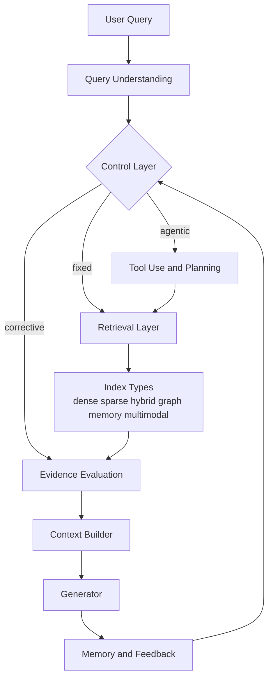
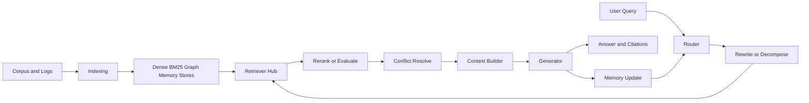

# RAG 共同架構研究報告

## 執行摘要

截至 **2026-07-04**，學術界與主流開源框架**尚未形成單一官方標準的 RAG 共同架構**；但 2024–2026 的論文、官方文件與開源實作已明顯收斂到同一個工程骨架：**以 Modular RAG 為底座，將 indexing、retrieval、evidence processing、generation、memory 與 control loop 模組化，再依任務需要疊加 hybrid retrieval、contextual retrieval、reranker、graph/causal/hypergraph、agentic tool use 與 long-term memory**。因此，**Naive RAG 是最小 primitive，不是現代共同骨架；共同骨架更接近「可重組、可分支、可迴圈」的 Modular RAG**。2026 年的新進展則集中在三件事：讓模型直接參與檢索決策的 A-RAG、把 GraphRAG 與 agent loop 合流、以及把長期記憶當成可維護知識庫的 memory-augmented RAG。citeturn0academia0turn0academia1turn12academia0turn12academia1turn11academia2

## 共同架構的核心判斷

你提供的 MD 檔把 **Naive RAG 視為最小單元、Modular RAG 視為共同骨架**，這個主張與最新文獻基本一致。RAG survey 把範式演進明確整理為 **Naive、Advanced、Modular**；Modular RAG 論文則進一步指出，新方法已無法再用單一 retrieve-then-generate 描述，必須拆成**independent modules**與**routing / scheduling / fusion / looping**等 operator。你的 MD 對這一點的判斷是正確的。citeturn0academia0turn0academia1turn0academia3turn0file0

更值得注意的是，官方實作也朝同一方向發展。Microsoft GraphRAG 官方 repo 自稱是 **“a modular graph-based RAG system”**；GraphRAG 官方文件把流程拆成 **index / query / prompt tuning**，而查詢又分成 **global、local、DRIFT、basic** 等模式。LangGraph 則把 agent 實作成**stateful、durable、memory-aware orchestration**，實際上正對應 Modular RAG 的控制層。這代表共同架構不再只是資料流，而是**資料層 + 控制層 + 記憶層**的組合。citeturn7view1turn13view0turn8view0

上圖不是任何單篇論文原圖，而是依據 survey、Modular RAG、GraphRAG、A-RAG、Infini Memory 與 LangGraph 官方文件抽象出的「收斂骨架」。它最關鍵的特徵是：**retrieval 已不再固定只跑一次，而是被 control layer 反覆呼叫的工具**。citeturn0academia1turn13view0turn12academia0turn11academia2turn8view0

## 維度比對與演進趨勢

下表把你要求的比對維度壓縮成工程上最常見的共同層級與 trade-off。來源以 2024–2026 論文、官方 docs、官方 repo 為主。citeturn0academia1turn6view0turn6view1turn19academia1turn12academia0turn11academia2

| 維度 | 共同架構中的位置 | 代表做法 | 主要收益 | 主要代價 | 代表來源 |
|---|---|---|---|---|---|
| Control | 最上層 orchestrator | fixed / CRAG / Self-RAG / ReaRAG / A-RAG / MCTS | 自適應檢索、少走冤枉路 | latency、debug 難度上升 | CRAG 2401.15884；ReaRAG 2503.21729；A-RAG 2602.03442 citeturn18academia1turn18academia0turn12academia0 |
| Indexing | 資料預處理與表示 | chunk、metadata、contextual、graph、causal graph、topic docs | 提升 recall 與多跳能力 | 建索引成本、更新成本 | Anthropic Contextual Retrieval；GraphRAG；CDF-RAG；Infini Memory citeturn6view0turn13view0turn10academia1turn11academia2 |
| Retrieval | runtime evidence access | dense、BM25、hybrid、graph、memory、multimodal | 對應不同資訊型態 | 介面與融合複雜 | Haystack Hybrid；GraphRAG；RAG-Anything citeturn7view0turn13view0turn19academia0 |
| Evidence | 檢索後過濾與對齊 | rerank、retrieval evaluator、debate、conflict resolution | 降 hallucination、提 groundedness | 額外模型呼叫 | Anthropic reranking；MADAM-RAG；RAGBench citeturn6view0turn9academia0turn17academia2 |
| Generation | context build + answer | citation、abstention、summary fusion | 可讀性與可驗證性 | prompt/token 成本 | Self-RAG；LIT-RAGBench citeturn12academia2turn15academia3 |
| Memory | 長期狀態與回寫 | LongMemEval 設計、AgeMem、Infini Memory | 長時任務、個人化 | 一致性、遺忘與隱私難題 | LongMemEval；Agentic Memory；Infini Memory citeturn17academia0turn14academia1turn11academia2 |
| Structured support | graph / causal / hypergraph | GraphRAG、NodeRAG、HeteRAG、CDF-RAG、Hyper-RAG | multi-hop、global QA、因果一致性 | storage、indexing、更新流程更重 | citeturn19academia1turn10academia3turn10academia2turn10academia1turn11academia0 |
| Multimodal | image/table/formula | HM-RAG、RAG-Anything | 處理真實文件庫 | embedding 與 benchmark 尚不成熟 | citeturn10academia0turn19academia0turn17academia1 |
| Privacy / federation | 分散式知識 | CoRAG | 資料不離地、跨 client 協作 | hard negatives、shared store 污染 | citeturn11academia1turn16academia3 |
| Evaluation | 全流程量測 | Recall@k、MRR、nDCG、EM/F1、Groundedness、Hallucination Rate、TRACe | 可做 regression 與 ablation | 指標仍分散 | RAGBench；CDF-RAG；LongMemEval citeturn17academia2turn20view2turn17academia0 |

## 與 MD 檔比對與修正

你的 MD 檔大方向成熟，但有幾個地方需要校正。fileciteturn0file0

| MD 摘要主張 | 證據比對 | 判斷 |
|---|---|---|
| 「Modular RAG 是共同骨架，Naive 只是最小單元」 | 與 survey 與 Modular RAG 論文一致。citeturn0academia0turn0academia1 | **正確** |
| 「Hybrid / Contextual / Rerank / Query Rewrite 應視為可疊加元件」 | Anthropic 與 Haystack 官方文件都把它們放在 preprocessing / retrieval / reranking 層，而非獨立端到端範式。citeturn6view0turn7view0 | **正確** |
| 「GraphRAG 是 structured / hierarchical RAG 支柱」 | Microsoft 官方 docs 與 GraphRAG 論文支持。citeturn13view0turn19academia1 | **正確** |
| 「RAG-Anything 是 2026 趨勢，arXiv:2603.00000」 | 實際 paper 是 **arXiv:2510.12323**，日期為 **2025-10-14**；概念正確，編號與年份錯。citeturn19academia0 | **需修正** |
| 「A-RAG code / eval 將釋出」 | 2026-07 時 paper 與 repo 已公開。citeturn12academia0turn20view0 | **已過時** |
| 「CoRAG = Collaborative RAG」 | 需加註**命名衝突**：2025 還有另一篇 *Chain-of-Retrieval Augmented Generation* 也簡寫 CoRAG。citeturn16academia3turn11academia3 | **需補充註記** |

## 共同架構參考實作藍圖

若把「RAG 共同架構」落成可複製系統，推薦先做 **九模組 MVP**，再按需求升級。這個藍圖綜合了 RAGLAB、Haystack、GraphRAG、LangGraph、Anthropic Contextual Retrieval 與 2025–2026 新論文的共同實作模式。citeturn7view2turn7view0turn13view0turn8view0turn6view0

| 模組 | 功能 | I/O | 推薦工具 | 優先順序 |
|---|---|---|---|---|
| Query Router | 判斷 direct / retrieve / abstain / agentic | query → route | LangGraph、LangChain | 高 |
| Query Rewrite / Decompose | 改寫與拆子題 | query → queries | Typed-RAG 思路、LLM prompt | 高 |
| Indexer | chunk、metadata、embedding、BM25 | docs → indices | Haystack、Qdrant / pgvector | 高 |
| Retriever Hub | dense / sparse / hybrid / graph / memory | queries → candidates | Haystack、GraphRAG、Neo4j | 高 |
| Reranker / Evaluator | 排序與質檢 | query+candidates → top-k | cross-encoder、CRAG evaluator | 高 |
| Evidence Resolver | conflict / citation / merge | top-k → evidence pack | MADAM-RAG / rules | 中 |
| Context Builder | 壓縮與拼接 | evidence → prompt context | Anthropic contextual pattern | 高 |
| Generator | grounded answer + citation | prompt → answer | 任一強 LLM | 高 |
| Memory / Observability | session state、trace、eval | run logs → memory / metrics | LangGraph、LangSmith 類工具 | 中 |

**MVP 步驟**建議是：先做 `BM25 + dense + reranker + citation answer`；再加 `query rewrite`；之後視場景再加 `graph` 或 `memory`；最後才上 `agentic loop`。原因很簡單：官方與開源文件都顯示，**hybrid retrieval、contextualization、reranking** 是最穩定的前期收益，而 graph、memory、agentic 會明顯拉高索引、延遲與觀測難度。citeturn7view0turn6view0turn13view0turn8view0

若預算與 SLA **未指定**，可用下列三種配置做初始選型；以下數值為工程估算，前提是假設 **100 萬 chunks、768 維 embedding、外部 API LLM**：raw embedding 約 **1.5–3 GB**，含 ANN 與 metadata 的向量索引常落在 **5–15 GB**，BM25 通常再加 **10–30 GB**，若有 graph / memory store 再上升。GraphRAG 與 Contextual Retrieval 官方文件都提醒：索引與 prompt tuning 成本不可忽視。citeturn13view0turn6view0

| 情境 | 建議配置 | 預估延遲 | 適合場景 |
|---|---|---|---|
| 低成本 | 8–16 vCPU、32–64GB RAM、CPU index、API embeddings/LLM、Qdrant/pgvector | 2.5–6s | 內部 FAQ、POC |
| 低延遲 | 16–32 vCPU、64–128GB RAM、1×L4/A10 用於 embeddings/rerank、hybrid + rerank | 0.8–2s | 線上客服、搜尋助手 |
| 高可靠 | 32+ vCPU、128GB RAM、分離 vector + graph + memory store、rerank + evaluator + abstention | 3–8s | 醫療、法務、研究助理 |

## 開放問題與資源清單

2026 以前，RAG 的核心難題已從「怎麼檢索」轉成「怎麼控制、評估與維護」。下表列出最值得追的 **10 個研究 / 工程問題**。citeturn18academia2turn17academia2turn17academia0turn11academia1turn12academia1turn11academia2

| 問題 | 建議方向 |
|---|---|
| 何時該檢索、何時該停止 | 用 A-RAG / ReaRAG 類 action policy 做 test-time control |
| 多來源證據衝突 | 把 rerank 與 conflict resolution 分層，不要混成單一 prompt |
| graph index 更新成本高 | 先做 hybrid + metadata；只把高價值實體升級到 graph |
| memory 容易髒化 | 採 topic documents / append-only + consolidation |
| 評估指標分散 | retrieval、grounding、abstention、latency 要分開做 regression |
| multimodal benchmark 不成熟 | 以 T²-RAGBench、RAG-Anything 類資料做 domain-specific eval |
| federation 會引入 hard negatives | 在 shared store 前做 relevance filtering 與 provenance 標記 |
| agentic loop 難 debug | 使用 stateful trace、tool log、human-in-the-loop checkpoint |
| causal / hypergraph 值不值得做 | 僅在高風險與多跳因果任務導入，避免過度設計 |
| 安全與隱私 | 對 memory、graph、federated retrieval 做 access control 與 provenance logging |

精簡資源表如下；完整清單可下載：[rag_common_architecture_resources.csv](sandbox:/mnt/data/rag_common_architecture_resources.csv)。

| 類型 | 名稱 | 用途 |
|---|---|---|
| Paper | 2312.10997 | RAG 三段演進與總覽 |
| Paper | 2407.21059 | Modular RAG 骨架 |
| Paper | 2408.11381 | RAGLAB 評測框架 |
| Paper | 2407.11005 | RAGBench / TRACe |
| Paper | 2503.21729 | ReaRAG |
| Paper | 2504.01883 | CoRAG / CRAB |
| Paper | 2504.11544 | NodeRAG |
| Paper | 2602.03442 | A-RAG |
| Paper | 2605.18770 | Agentic GraphRAG |
| Paper | 2606.10677 | Infini Memory |
| Repo | microsoft/graphrag | graph-based modular RAG |
| Repo | fate-ubw/RAGLAB | 研究框架 |
| Official Doc | Anthropic Contextual Retrieval | contextual retrieval |
| Official Doc | Haystack Hybrid Retrieval | hybrid + rerank pipeline |

## 參考來源

- 你提供的 MD 檔整理，作為我方主張的對照基準。fileciteturn0file0  
- Gao et al., *Retrieval-Augmented Generation for Large Language Models: A Survey*，arXiv:2312.10997。citeturn0academia0  
- Gao et al., *Modular RAG*，arXiv:2407.21059。citeturn0academia1  
- Anthropic 官方工程文件 *Introducing Contextual Retrieval*。citeturn6view0  
- Haystack 官方教學 *Creating a Hybrid Retrieval Pipeline*。citeturn7view0  
- Microsoft GraphRAG 官方 docs 與 repo。citeturn13view0turn7view1  
- RAGLAB 論文與官方 repo。citeturn12academia3turn7view2  
- A-RAG、Agentic GraphRAG、Infini Memory、Agentic Memory、LongMemEval、RAGBench 等 2024–2026 主來源。citeturn12academia0turn12academia1turn11academia2turn14academia1turn17academia0turn17academia2