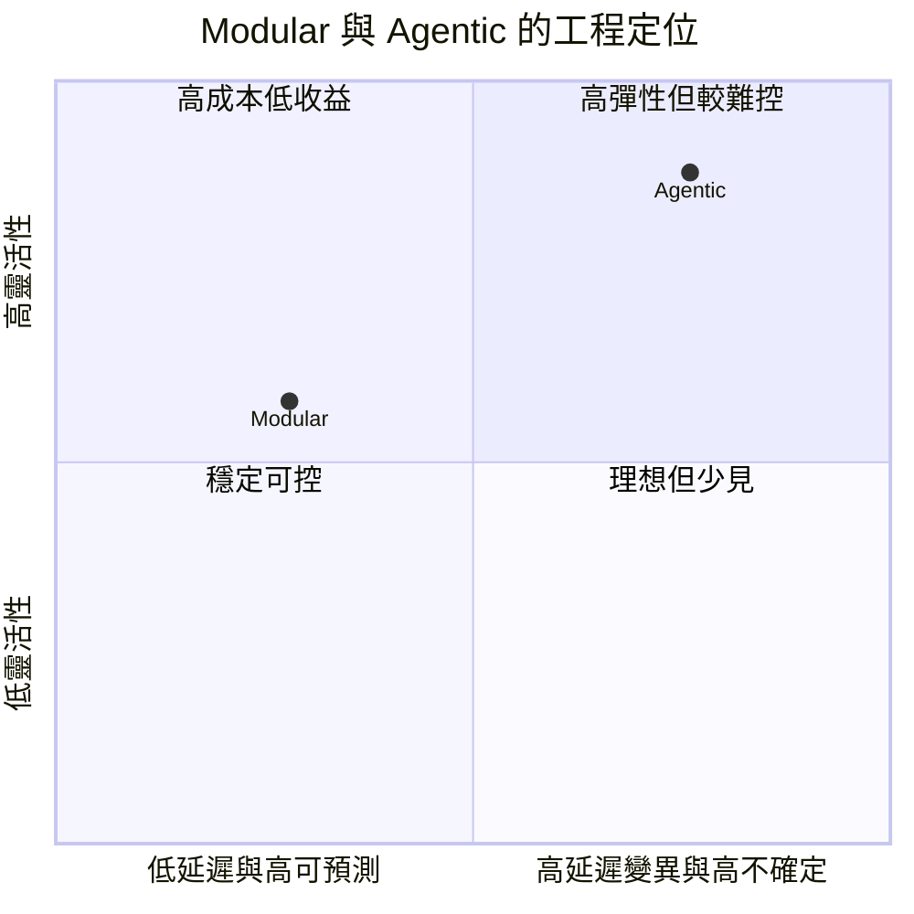
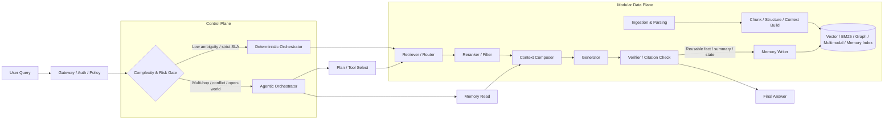
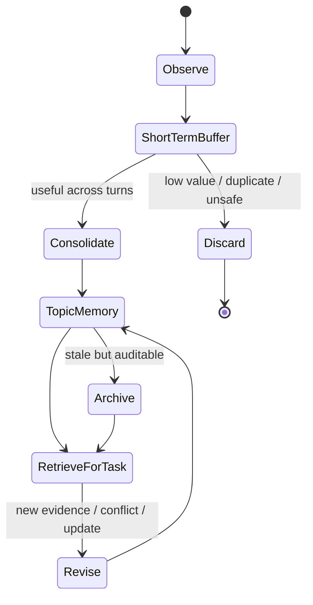

# RAG 共同骨架之爭：Modular 還是 Agentic

## 執行摘要

這份研究的核心結論很明確：**如果你問的是「RAG 家族的共同工程骨架是什麼」，目前最有證據支持的答案不是 Agentic RAG，而是 Modular RAG；如果你問的是「未來高難度 RAG 的控制方式往哪裡走」，答案則明顯偏向 Agentic。** 換句話說，**Modular 比較像共同的資料平面與執行骨架，Agentic 比較像疊在上面的控制平面**。這個判斷同時得到三條證據支持：一是 2023–2024 的 RAG 綜述與 Modular RAG 論文把 RAG 演進明確整理為 Naive/Advanced/Modular，並把模式擴展到 linear、conditional、branching、looping；二是 2025–2026 的 Agentic RAG 文獻與官方框架文件普遍把 agent 定義為「在工具迴圈裡決定何時檢索、用什麼工具、是否重試」；三是 2026 最新的 Memory 與 GraphRAG 工作，雖然更進一步加入長期記憶、圖結構、多代理，但底層仍然依賴可插拔的 retrieval、read、rerank、compose、verify、memory-update 等模組。citeturn17academia2turn0academia2turn1academia1turn0academia1turn11academia3turn29academia2

你上傳的 MD 檔把問題設定為「Modular 是共同骨架、Agentic/Graph/Memory 是上層變體」，並且主張單一樹狀分類不足以同時表達時間演化與功能差異；這個 framing 作為研究假說是成立的，而且相當有洞察力。真正需要修正的，不是大方向，而是幾個容易被混淆的地方：**第一，Modular 與 Agentic 不是互斥範式，而是常常疊加；第二，Contextual Retrieval 比較像 indexing/preprocessing operator，不宜和 GraphRAG、A-RAG 並列為同一層級的「架構正規軍」；第三，部分 2026 條目其實是 2025 論文在 2026 持續活躍，而不是 2026 才首次出現。** fileciteturn0file0 citeturn27view0turn11academia0turn23view0

就工程選型而言，**預設應先選 Modular，只有在任務真的需要動態規劃、跨來源工具、長期記憶、多跳追問、衝突解消、開放網路搜尋時，再加上 Agentic 控制層**。這不是保守，而是因為官方框架文件與近年 benchmark 都指向同一件事：固定流程在延遲、可測試性、可觀測性與治理上比較穩；agentic 迴圈則在多步任務、動態環境與複雜資訊尋徑上更強，但也更容易出現延遲飄移、步驟爆炸、錯誤傳染與安全面擴張。citeturn15view0turn25view3turn25view1turn21academia0turn9academia0

## 研究設計與來源

本報告把「共同骨架」定義為：**不管你是做 baseline RAG、GraphRAG、Memory RAG、Multimodal RAG 或 Agentic RAG，系統在工程落地時最穩定、最可復用、最容易抽象成 API 契約與運行時狀態機的那一層。** 這個定義偏工程，不是純學術 taxonomy；若某論文僅提出某一個 retrieval trick 或 chunking trick，而沒有形成完整控制與資料流，我將它視為「operator／technique」，不直接升格成共同骨架候選。你上傳的 MD 檔本身也是沿著這個工程定義去拆分「時間演化」與「功能屬性」，因此我把它當成研究起點，而不是最後答案。fileciteturn0file0

本次檢索時間點為 **2026-07-04 Asia/Taipei**。來源優先順序依序是：**arXiv 與會議論文、官方 GitHub repo、官方工程文件、官方技術部落格**；只有當某個說法無法在前述來源找到時，才採用次級來源，而且必須與主要來源交叉驗證。這樣做的原因很直接：你問的是「共同骨架之爭」，這不是只看行銷敘述就能回答的題目，而必須同時看 taxonomy、runtime、repo 結構、文件中暴露出的實際 API 與 state/memory 機制。citeturn17academia2turn0academia2turn24view3turn24view4turn24view1turn30view0

本次實際優先檢索的關鍵字群組包括：**“Modular RAG” “Agentic RAG” “A-RAG” “GraphRAG” “LightRAG” “RAGLAB” “FlashRAG” “RAG-Anything” “Infini Memory” “Agentic Memory” “InfoDeepSeek” “mmRAG” “Contextual Retrieval” “LangChain retrieval docs” “Haystack agents” “LlamaIndex workflow memory”**。納入條件是：與 RAG 架構、控制邏輯、檢索介面、記憶系統、評估 benchmark、或開源 runtime 直接相關；排除條件是：純市場評論、沒有原始論文或官方 repo 背書的二手轉述。citeturn0academia2turn1academia1turn0academia1turn11academia3turn21academia0turn21academia1turn27view0

下表整理本報告最重點的優先來源群：

| 類型 | 主要用途 | 優先來源 |
|---|---|---|
| 基礎 taxonomy | 定義 Naive / Advanced / Modular 與 RAG 演進邏輯 | *Retrieval-Augmented Generation for Large Language Models: A Survey* citeturn17academia2；*Modular RAG: Transforming RAG Systems into LEGO-like Reconfigurable Frameworks* citeturn0academia2 |
| Agentic 定義與最新趨勢 | 判斷 agentic 是否為共同骨架或僅是控制層 | *Agentic Retrieval-Augmented Generation: A Survey on Agentic RAG* citeturn1academia1；*A-RAG: Scaling Agentic Retrieval-Augmented Generation via Hierarchical Retrieval Interfaces* citeturn0academia1turn28view0 |
| 評估與風險 | 檢驗 agentic 是否真的比固定流程更值得替代 | *InfoDeepSeek* citeturn21academia0；*CHARM* citeturn9academia0；*mmRAG* citeturn21academia1 |
| Graph / Multimodal / Memory | 檢查新方向是否仍回到 modular substrate | Microsoft GraphRAG repo citeturn31view2；LightRAG repo citeturn23view2；*NodeRAG* citeturn4academia0；*RAG-Anything* citeturn11academia0turn28view4；*Infini Memory* citeturn11academia3；*Agentic Memory* citeturn29academia0 |
| 開源執行框架 | 看實際系統是如何暴露 modular 與 agentic 能力 | RAGLAB citeturn17academia1turn28view2；FlashRAG citeturn3academia3turn28view5；Haystack docs/repo citeturn24view3turn25view3；LangChain docs/repo citeturn15view0turn24view1；LlamaIndex docs/repo citeturn24view4turn25view0 |
| 索引前處理與上下文建構 | 釐清哪些是 technique，不是共同架構 | Anthropic *Introducing Contextual Retrieval* citeturn27view0 |

## 核心證據與判斷

先講最重要的判斷：**文獻現在比較支持「Modular 是骨架、Agentic 是控制」這種雙層解法，而不是二選一。** 2023 的 RAG survey 已經把 Naive、Advanced、Modular 明確地放成一條演進線；2024 的 Modular RAG 進一步把 RAG 拆成 operators 與 pattern，明講系統不應只被理解成 retrieve-then-generate 的線性流程，而應該容納 conditional、branching、looping。到了 2025–2026，Agentic RAG 與 A-RAG 的推進並沒有推翻 modular thinking，反而是把 retrieval、read、planning、tool use 這些能力，以 agent 可決策的形式重新包進 runtime。這也是為什麼我不建議把「Modular vs Agentic」畫成非黑即白的二分法；**更準確的說法是：Agentic RAG 多半以 Modular substrate 為底座，只是把流程控制從工程師手寫邏輯，部分移交給模型。** citeturn17academia2turn0academia2turn1academia1turn0academia1turn15view0turn25view3

下表是本議題最具代表性的論文與官方來源。我把它們分成「支持 Modular 作為骨架」、「支持 Agentic 作為控制升級」、「揭露 agentic 風險與評估需求」、「說明 graph/memory/multimodal 其實仍可落在 modular substrate」四類來看：

| 證據 | 核心貢獻 | 與本題的關係 | 主要實驗或結果 | 限制 |
|---|---|---|---|---|
| *RAG Survey* citeturn17academia2 | 系統化整理 Naive / Advanced / Modular | 提供共同骨架討論的taxonomy起點 | 奠定 RAG 演進框架 | 時點早於 2025–2026 agentic wave |
| *Modular RAG* citeturn0academia2 | 將 RAG 拆為模組與 operators，提出 linear / conditional / branching / looping patterns | 直接支持「共同骨架」應以模組化與控制流抽象來理解 | 重點是概念統一與模式抽象 | 偏框架性論文，不是統一 benchmark 勝負論文 |
| *Self-RAG* citeturn1academia0 | 以 reflection tokens 讓模型決定是否檢索與自我批判 | 顯示「agentic 行為」可內生在模型中，但仍是疊在 retrieval substrate 上 | 在 QA、reasoning、fact verification 上優於多個 baseline | 依賴專門訓練與特殊 token 設計 |
| *CRAG* citeturn1academia2 | 加入 retrieval evaluator，低品質檢索時可修正或擴大到 web search | 說明 corrective/reflective operator 可作為 modular component 插入 | 在四個資料集上提升 robustness | 仍不是完整 agent runtime |
| *Agentic RAG Survey* citeturn1academia1 | 歸納 reflection、planning、tool use、multi-agent collaboration | 明確把 agentic 視為彈性與多步任務升級 | 提供 agentic taxonomy 與應用版圖 | 定義較寬，含很多 prompt-scripted workflow |
| *A-RAG* citeturn0academia1turn28view0 | 以 hierarchical retrieval interfaces 暴露 `keyword_search` / `semantic_search` / `chunk_read` 三種工具，讓 agent 自主使用 | 強化「Agentic 是控制層」這個論點，因為它明確把 retrieval interface 工具化 | 在多個 QA benchmark 上，以相當或更少 retrieved tokens 優於既有方法 | 目前 repo 還是研究原型，重點偏文字 QA |
| *InfoDeepSeek* citeturn21academia0 | 為動態 web 環境的 agentic information seeking 建 benchmark | 支持「agentic 需要新評估，不應套用靜態 corpus 的老 protocol」 | 曝露不同 LLM/search engine 的 agent 行為差異 | benchmark 不是完整生產環境 |
| *CHARM* citeturn9academia0 | 定義 cascading hallucination，提出 stage-level mitigation framework | 說明 agentic 不是白拿性能，會引入跨步驟錯誤傳染 | 報告 89.4% cascade detection、5.3% false positive、平均每 stage 增加 215ms | 仍是 2026 preprint，且主要在 LangChain agent pipeline 上驗證 |
| *NodeRAG* citeturn4academia0 | 用 heterogeneous nodes 重構 graph-based RAG workflow | 顯示 graph RAG 的創新重心多半在 index/retrieval structure，而不在 agent control | 在 indexing time、query time、storage efficiency 與 QA 表現上優於 GraphRAG/LightRAG | 主要論點是 graph design，不直接回答 agentic 控制 |
| *Infini Memory* citeturn11academia3 | 把長期記憶做成 topic documents，並以 iterative tool calls 讀取記憶 | 清楚展現「memory substrate + agentic access policy」的雙層結構 | 在 MemoryAgentBench 取得 64.7% overall score | 目前屬新近 preprint，生態系仍在形成 |
| *Agentic GraphRAG* citeturn29academia2 | 在 graph substrate 上疊加 modular agent、bounded reflection loop、HITL dashboard | 最能說明「graph 與 agentic 可共存，而不是替代關係」 | 在 Swiss registry 場景上優於 agentic vector-RAG baseline | 領域特定，移植成本高 |

這些證據合起來，會導向一個比「Modular 還是 Agentic」更準確的答案：**Modular 比較像共同骨架的結構描述語言，Agentic 比較像共同骨架上的策略執行模式。** 這也是為什麼 LangChain 官方在 retrieval 文件中直接把 2-step RAG、Agentic RAG、Hybrid 並列為不同 architecture，而不是說 agentic 已經取代 2-step；同時，Haystack、LangChain、LlamaIndex 又都把 agent 寫成「tool loop + state/memory + stopping condition」的 runtime，而不是重新發明一套與 modular component 完全斷裂的資料平面。citeturn15view0turn25view3turn25view1turn25view0

這裡還有一個很值得保留的修正點：**Contextual Retrieval 不應被高估成「新的共同骨架」。** Anthropic 官方自己把它定義為 *preprocessing technique*，核心是把 chunk-specific context prepend 到 chunk，再做 embeddings 與 BM25；它可以顯著提升 retrieval，但本質仍是 indexing/representation operator，而不是完整 system architecture。Anthropic 報告它可把 top-20 retrieval failure rate 降低 49%，加 reranking 可到 67%，但這個成果的正確解讀是「強 operator」，不是「新骨架」。你上傳的 MD 先前把它抽離成橫向可疊加技術，這點其實是對的。citeturn27view0 fileciteturn0file0

同理，**GraphRAG、LightRAG、RAG-Anything 也比較像 specialized retrieval/index substrates，而不是自動把控制層變成 agentic。** Microsoft GraphRAG repo 自己就把專案稱為 *a modular graph-based RAG system*；LightRAG 說自己是 dual-layer、同時管理 knowledge graphs 與 vector embeddings 的輕量框架；RAG-Anything 則把 document parsing、content analysis、knowledge graph、intelligent retrieval 排成一個 multi-stage multimodal pipeline。這些都支持同一個觀察：**新 RAG 變體常常是在改「索引與檢索 substrate」，但共同工程骨架仍然可以用 modular interfaces 來統一描述。** citeturn28view3turn31view2turn23view2turn28view4

## 開源實作與工程比較

如果只看論文，Modular 與 Agentic 很容易被講成抽象理念；但一看開源實作，脈絡就清楚很多。**今天主流框架幾乎沒有把兩者做成互斥選擇。它們的共同做法，是先把資料 ingestion、retrieval、ranking、generation、state、tooling 做成可替換元件，再在上面提供 agent loop。** 這正是「Modular 是骨架、Agentic 是控制層」在工程上的具體樣子。citeturn24view3turn24view1turn24view4turn25view3turn25view1turn25view0

下圖不是單一 benchmark 的輸出，而是根據論文、官方文件與 repo 能力所做的**工程面綜合定位圖**。如果把 X 軸看成延遲/流程不確定性，Y 軸看成靈活性/控制彈性，Modular 與 Agentic 大致會落在下面的位置。這個位置和 LangChain 官方對 2-step / Agentic / Hybrid 的對照、A-RAG 對多輪自主檢索的強調，以及 Haystack/LlamaIndex 對 stateful agent runtime 的設計是一致的。citeturn15view0turn0academia1turn25view3turn25view0

接著看開源專案本身。下面這張表刻意把「模組化程度」和「agent 控制層」分成兩欄，因為它們不是同一件事。

| 專案 | 主要定位 | 官方來源 | 模組化程度 | Agent 控制層 | Memory 支援 | License | 活躍度快照 | 研究判讀 |
|---|---|---|---|---|---|---|---|---|
| LangChain | 通用 agent/LLM app 框架 | repo/docs citeturn24view1turn15view0turn15view1 | 高 | 明確；`create_agent`、tool loop、Hybrid/2-step/Agentic 都有 | 有；`thread_id` + checkpointer + state | MIT | 141k stars、16,363 commits、2026-06-18 最新 release citeturn24view0 | 最接近「Modular substrate + Agentic runtime」的通用代表 |
| Haystack | 生產級 orchestration for RAG & agents | repo/docs citeturn24view3turn14view5 | 高 | 明確；內建 `Agent`、tool loop、HITL、MCP | 有；`state_schema`、typed state | Apache-2.0 | 25.8k stars、5,587 commits、2026-06-18 最新 release citeturn24view2turn20view0 | 很適合企業級 modular-first、逐步加 agent |
| LlamaIndex | agentic applications / document agent | repo/docs citeturn24view4turn25view0 | 高 | 明確；workflow/function-calling agents | 有；stateful with memory、LlamaTrace | MIT | 50.6k stars、7,855 commits citeturn20view1turn23view6 | 明顯把 agent runtime 與 doc/index substrate 合在一起 |
| RAGLAB | 研究導向 modular RAG framework | paper/repo citeturn17academia1turn28view2 | 很高 | 弱；偏研究比較框架，不是 agent runtime | 幾乎無內建長期 memory primitive | MIT | 311 stars、36 commits citeturn7view1turn28view2 | 最適合做「共同骨架」實驗基座 |
| FlashRAG | 高效率研究 toolkit | paper/repo citeturn3academia3turn28view5 | 很高 | 中；支援 reasoning-based methods，但不是完整 agent OS | 有限；偏 evaluation/reproduction | MIT | 3.5k stars、799 commits citeturn18view0turn23view5 | 比 RAGLAB 更完整，但仍偏 research substrate |
| GraphRAG | 模組化 graph-based RAG system | repo/docs citeturn31view2 | 中高 | 預設不強；主要是 graph indexing/query substrate | 非通用 memory；偏 knowledge-graph memory structures | MIT | 34.2k stars、468 commits、2026-05-28 最新 release citeturn31view1 | 證明 graph 不會自動等於 agentic |
| LightRAG | 輕量 dual-layer KG + vector RAG | repo citeturn23view2turn23view0 | 中高 | 預設不強 | 無通用長期記憶 | MIT | 37.3k stars、8,600 commits、2026-06-24 最新 release citeturn7view0turn23view0 | 很強的 specialized retrieval substrate，不是控制層替代品 |
| RAG-Anything | all-in-one multimodal RAG，built on LightRAG | paper/repo citeturn11academia0turn23view3turn28view4 | 中高 | 未把 agent loop 當核心賣點 | 非通用 agent memory；重點是 multimodal KG | MIT | 19.4k stars、378 commits citeturn12view1 | 是 multimodal pipeline 擴張，不是 agentic 骨架勝利 |
| A-RAG | 2026 agentic retrieval prototype | paper/repo citeturn0academia1turn28view0turn28view1 | 中 | 很高；三層 retrieval tool + iterative decisions | 有 context/state tracking，但無完整 persistent memory | MIT | 307 stars、5 commits citeturn7view2turn6view6 | 是 agentic 控制層的前沿樣板，但仍是早期研究實作 |

從工程面來看，這張表有三個很清楚的訊號。**第一，真正成熟的大框架都沒有放棄 modularity；它們只是把 agent 做成可選的 runtime。第二，圖結構、多模態、contextual retrieval 這些方向，多數都落在 substrate/operator 層，不自動改寫控制層。第三，agentic 走得最前面的研究原型，反而通常依賴更清楚的 retrieval interface 與 state tracking；這不是「去模組化」，而是「更依靠模組契約」。** citeturn24view3turn24view1turn24view4turn28view0turn31view2turn23view2turn28view4

## 設計模式與實作藍圖

如果你現在要建一個真正可交付的 RAG 系統，我的建議不是先問「我要不要全上 agent」，而是先問三件事：**你的知識源是否穩定、你的延遲/成本邊界有多硬、你的任務是否真的需要多步動態搜尋。** 若語料相對封閉、查詢類型穩定、可接受的答案形式明確，而且治理比探索更重要，**Modular-first** 幾乎總是比較好的起點；若問題是模糊的、常需要追問、需要跨工具、會碰到衝突證據、或要持續跨 session 記憶，那就該在 modular substrate 上加入 **Agentic control plane**。LangChain 自己把 2-step、Agentic、Hybrid 三種架構並列，Haystack 把 Agent 寫成完整 tool-calling loop，A-RAG 則進一步把 retrieval tools 分成 keyword/semantic/chunk read 三種粒度，這些官方設計都指向相同策略：**先明確模組，再決定是否讓 LLM 控制模組。** citeturn15view0turn25view3turn28view0

我會推薦以下的漸進遷移路線。這條路線的核心原則是：**把 agentic 能力當成「有門檻、有成本、可觀測」的升級件，而不是預設開啟。**

| 階段 | 建議重點 | 適用情境 |
|---|---|---|
| Modular baseline | document parsing、chunking、BM25+dense retrieval、rerank、citation-aware answer | 內部知識庫、FAQ、文件助理 |
| Modular enriched | 加 router、multi-query、contextual retrieval、fallback retriever、verification operator | 查詢分布較複雜，但延遲仍要穩 |
| Gated agentic | 只在複雜查詢、衝突查詢、失敗重試時啟用 agent loop | 多跳、模糊、需要多來源工具 |
| Stateful hybrid | 對 agent 啟用 checkpointer / state_schema / memory buffer / topic memory | 跨 session 助理、長任務 |
| Specialized substrate | 視資料型態導入 GraphRAG、LightRAG、RAG-Anything、memory documents | 圖結構、多模態、長期記憶、跨模態 reasoning |

這種設計背後的直覺，其實可以畫成一張高階架構圖。**資料平面保持 modular；控制平面決定何時走 deterministic path、何時升級到 agent loop；graph/multimodal/memory 都作為 specialized retriever/index backend 接進來。** 這樣比較符合 2024–2026 論文與框架文件的共同收斂方向。citeturn0academia2turn0academia1turn31view2turn28view4turn11academia3

若要把這套架構落成實際 API，我建議介面契約至少分成六塊，而且每塊都要是**可單測、可記錄、可替換**的：

| 契約 | 最小欄位 | 目的 |
|---|---|---|
| `QueryRequest` | `query_id`, `user_query`, `session_id`, `constraints`, `risk_level` | 統一入口；避免 agent 直接吃裸字串 |
| `PlanDecision` | `mode`, `reason`, `tool_budget`, `max_steps`, `route` | 把「走 deterministic 還是 agentic」顯式化 |
| `EvidenceHit` | `source_id`, `chunk_id`, `score`, `modality`, `timestamp`, `citation` | 不管是 BM25、vector、graph、memory，都要回同構 evidence |
| `EvidenceBundle` | `hits[]`, `dedup_log`, `fusion_log`, `coverage_estimate` | 讓 rerank / compose / verify 有共同輸入 |
| `AnswerDraft` | `answer`, `citations[]`, `support_map`, `uncertainty` | 把生成與支撐對齊，便於 verifier 檢查 |
| `MemoryEvent` | `kind`, `payload`, `topic`, `retention`, `privacy_tag` | 把 memory 寫入和一般回答解耦 |

如果系統要支援長期記憶，我不建議一開始就把所有對話 turn 原封不動塞進向量庫。近年的 memory 論文與框架文件都顯示，**記憶必須有 buffer、consolidation、topic unit、revision、retrieval policy**，否則很快就會變成噪音堆積。Infini Memory 把 LTM 做成 topic documents，Agentic Memory 把 memory operations 變成工具動作，Haystack 與 LangChain 也都明確把 state/memory 暴露成 runtime primitive。citeturn11academia3turn29academia0turn25view3turn25view1

最後是 metrics 與 benchmark。這裡最常見的錯誤，是只看最終 answer accuracy。那樣很難分辨你是 retriever 爛、router 爛、agent loop 爛、還是 verifier 失效。比較好的做法，是把指標拆成四層：**retrieval、generation、agent runtime、ops/safety**。研究工具鏈也已經朝這個方向前進：RAGLAB 強調可比較的 evaluation ecosystem，FlashRAG 內建多資料集與多方法重現，InfoDeepSeek 專門評估動態 web agentic information seeking，mmRAG 則把 text / table / KG 多源評估模組化。citeturn17academia1turn3academia3turn21academia0turn21academia1

| 指標層 | 建議指標 | 為什麼要看 |
|---|---|---|
| Retrieval | Recall@k、MRR/NDCG、evidence coverage、source freshness | 骨架之爭的第一層，根本是檢索 substrate 是否可靠 |
| Generation | exact match / task accuracy、citation faithfulness、unsupported claim rate | 避免只看「答對」卻忽略支撐是否真存在 |
| Agent runtime | steps per query、tool success rate、retry rate、retrieved tokens、stall rate | 專門量化 agentic 的成本與失控風險 |
| Ops / safety | p50/p95 latency、cost/query、prompt injection catch rate、PII exposure、HITL escalation rate | 生產環境真正會卡住團隊的地方 |

在 benchmark 選擇上，我會建議至少覆蓋四種壓力面：**靜態多跳 QA、動態 web information seeking、多模態/多結構 source、長期記憶任務。** 對應資料集可以選擇 A-RAG 使用的 QA setting、InfoDeepSeek、mmRAG，以及 Infini Memory 使用的 MemoryAgentBench；若你的系統要面對企業文件，還應另外做一套內部 gold set，因為公開 benchmark 很少能覆蓋真實的權限、時間性、衝突證據與業務規則。citeturn28view0turn21academia0turn21academia1turn11academia3

## 反駁、結論與參考來源

你上傳的 MD 檔整體方向是強的，但如果要做成嚴謹報告，有幾點必須修正或加註限定語。我把最重要的幾條列成對照表：

| MD 中的說法 | 判定 | 修正後較準確的表述 |
|---|---|---|
| 「共同架構候選是 Modular RAG」 fileciteturn0file0 | **大方向正確，但要加限定語** | 更精確的說法應是：**在工程抽象層，Modular RAG 是目前最好的共同骨架候選；但學界尚未形成官方唯一共識。** citeturn0academia2turn1academia1turn0academia1 |
| 「Naive RAG 是最小單元，但不是共同控制架構」 fileciteturn0file0 | **正確** | Survey、LangChain 文件與 A-RAG 都支持這個方向：Naive/2-step 適合當 primitive，不適合代表 2026 runtime。 citeturn17academia2turn15view0turn0academia1 |
| 「Agentic 可以與 Modular 對立比較」 fileciteturn0file0 | **過度二分** | 更好的寫法是：**Agentic 通常建立在 modular interfaces 之上；兩者多半是疊加關係，不是互斥關係。** citeturn28view0turn25view3turn25view1turn25view0 |
| 「Contextual Retrieval 應獨立抽出去，不跟主架構並列」 fileciteturn0file0 | **正確** | Anthropic 自己把它定義成 preprocessing technique，不是完整 system architecture。 citeturn27view0 |
| 「RAG-Anything arXiv:2603.00000」 fileciteturn0file0 | **錯誤** | 我查到的正式 arXiv 條目是 **2510.12323**，日期是 **2025-10-14**；它在 2026 確實活躍，但不是 2026 首發。 citeturn11academia0turn12view1 |
| 「2026 最新 RAG 架構」將 LightRAG、RAG-Anything 與 A-RAG並列 | **需區分『論文首次出現年份』與『2026 仍活躍』** | LightRAG 的 arXiv eprint 是 **2410.05779**，repo 在 2026 仍非常活躍；RAG-Anything 則是 2025 論文、2026 持續擴展。 citeturn23view0turn12view1 |
| 「Graph / Memory / Agentic 是不同大類」 fileciteturn0file0 | **作圖有用，但太剛性** | 2026 的 Agentic GraphRAG 與 Infini Memory 都在說明：**graph、memory、agentic 可以交疊，最好理解成 substrate + control 的組合。** citeturn29academia2turn11academia3 |

所以，最後我會把你的原始命題改寫成一句更耐用、也更接近現在證據的結論：

**RAG 的共同骨架，不宜直接說是 Agentic，也不宜只說是 Naive；目前最穩妥的工程結論是：共同骨架應以 Modular interfaces 來表述，而 Agentic 是在這個骨架之上負責規劃、反思、重試、記憶與工具選擇的控制層。** 對大多數團隊而言，最值得執行的策略不是「二選一」，而是 **Modular-first, Agentic-when-needed**。citeturn0academia2turn0academia1turn15view0turn25view3turn25view1

若把這個結論翻成更務實的工程推薦，那就是：

- **你要寫 team-wide architecture spec、API contract、測試方案、評估基線時，請以 Modular 為主語。** 這一層最穩、最可測、最容易跨專案複用。citeturn0academia2turn17academia1turn3academia3  
- **你要解決複雜多跳、開放網路、長期記憶、跨工具任務時，再引入 Agentic 控制層。** 這時 agent 才真的有成本效益。citeturn0academia1turn21academia0turn11academia3turn29academia0  
- **Graph、Multimodal、Memory 不要先拿來替代骨架，而是當成 specialized retriever / index / memory backend 插到 modular substrate。** 這樣才能保持治理與可觀測性。citeturn31view2turn23view2turn28view4

**參考來源**  
本報告若你只想保留最核心的原始材料，優先看這四組：**RAG 基礎 taxonomy 與 modular 抽象** 看 *RAG Survey* 與 *Modular RAG*。citeturn17academia2turn0academia2 **Agentic 控制層** 看 *A-RAG* 與 *Agentic RAG Survey*。citeturn0academia1turn1academia1 **工程實作與開源 runtime** 看 Haystack、LangChain、LlamaIndex 的官方 docs/repo。citeturn24view3turn25view3turn24view1turn15view0turn24view4turn25view0 **specialized substrate 的前沿方向** 看 GraphRAG、RAG-Anything、Infini Memory。citeturn31view2turn11academia0turn11academia3