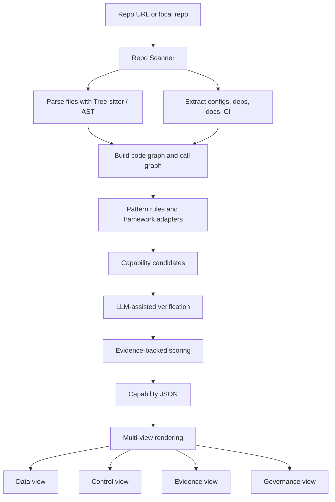

# RAG 共同架構的可行性與適用性研究

## Executive Summary

這份研究的核心結論是：**到了 2026 年，單獨把「Modular RAG」說成所有 RAG/Agent 系統的共同骨架，已經不夠精準；但若把它改成「共同能力地圖」或「data / service plane 的參考底圖」，它仍然非常有用。真正更符合 2026 趨勢的說法，是採用一個**雙層到三層模型**：**Modular capability plane + Agentic control plane + Governance / observability plane**。** Modular RAG 仍然是最適合拿來做 repo 對位、能力盤點、證據標註與靜態比較的底圖；但若你在談的是系統執行時的「runtime backbone」，那麼 2026 的 A-RAG、LangGraph、Haystack Agents、Agentic GraphRAG、Infini Memory 都顯示：**控制平面**才是現代系統真正的主軸。citeturn0academia3turn0academia2turn4view0turn8view0turn0academia0turn11academia0

因此，對你的專案來說，最穩健的定位不是「Modular RAG 取代一切」，也不是「Agentic orchestration 完全取代 Modular RAG」，而是：**用 Modular RAG 當共同地圖，用 Agentic Orchestration 當控制層補強，再把 memory、graph、multimodal、validation、governance 視為可掛載的專門能力區。** 這樣既保留了模組化的可分析性，也能反映 2026 年多輪工具調用、長期記憶、圖檢索與多模態處理已成主流的事實。citeturn0academia3turn7view0turn8view0turn12view2turn13view0turn11academia0

從工程可行性看，你想做的 **capability mapping** 工具是可行的，而且比「自動畫一張漂亮架構圖」更有研究與實用價值。原因是 2026 已經出現幾個很接近的方向：AgentFlow 把 agent 程式轉成 Agent Dependency Graph，RIG / SPADE 產出 deterministic、evidence-backed 的 repo architecture JSON，Codebase-Memory 則用 Tree-sitter 與知識圖來支援 code exploration。這些工作說明：**“把 repo 轉成可驗證的能力地圖”** 已經是有研究價值、而且可落地的問題，只是目前還沒有一個工具把 **RAG、agent、memory、graph、evidence、governance** 全部整合到同一張能力圖裡。citeturn9academia0turn9academia3turn9academia2turn9academia1

如果你要做 MVP，我的建議是：**先把產品定義成 evidence-backed capability mapper，而不是 universal architecture generator。** 第一版只解三件事：判斷 repo 是否有 RAG、是否有 agentic control、是否有 memory / graph / governance；每個判斷都要附可追溯證據、信心分數與「未找到 / 未指定 / partial」狀態。這會比直接嘗試自動生成完美 taxonomy 更可靠，也更容易做出差異化。citeturn9academia0turn9academia3turn14view0turn8view1

## 最新研究對共同骨架的啟示

RAG 在 2024 年的主流整理，仍然可以用 **Naive → Advanced → Modular** 這條演進軸來描述。Gao 等人的 survey 把 Naive RAG、Advanced RAG、Modular RAG 視為清楚的 paradigms；而 2024 年的 Modular RAG 論文更進一步指出，傳統 `retrieve-then-generate` 已經不足以統一新的方法，原因是現代 RAG 日益包含 routing、scheduling、fusion，以及 linear、conditional、branching、looping 等 pattern。這些文獻支持一件事：**Modular RAG 在概念上很適合拿來當抽象框架。** citeturn0academia1turn0academia3

但 2026 的前沿方向也很明確地對這個框架提出補充。A-RAG 直接批評兩種舊做法：一種是 single-shot retrieval，另一種是預先寫死的 workflow；作者認為，這兩種做法都沒有讓模型真正參與 retrieval decision，因此無法隨模型能力成長而同步擴展。A-RAG 提供的是 keyword search、semantic search、chunk read 三層 retrieval interface，讓模型能自己決定怎麼查、查到哪裡停。這代表：**在 runtime 層，2026 的主流方向已經不是“模組是否存在”，而是“由誰決定何時調用模組”。** citeturn0academia2

同樣的趨勢也出現在官方框架文件裡。LangChain 目前把 RAG 直接分成 **2-step RAG、Agentic RAG、Hybrid RAG** 三種，並明確寫出：2-step RAG 是固定先檢索再生成；Agentic RAG 則是由 LLM-powered agent 在推理過程中決定何時、如何檢索；Hybrid RAG 則加上 query enhancement、retrieval validation、answer validation 等中介步驟。這說明官方工程生態也已經把「控制方式」視為第一級差異，而不只是 retriever 的差異。citeturn7view0

Haystack 與 LangGraph 的官方文件進一步把這個趨勢工程化。Haystack 的 Agent component 明確負責 **tool-calling loop、state management、human-in-the-loop、multi-agent、MCP tools、multimodal inputs**；Haystack pipelines 則原生支援 **branching、loops、async pipelines、validation、serialization**。LangGraph README 也把自己定義成 **low-level orchestration framework for building, managing, and deploying long-running, stateful agents**，並強調 durable execution、human-in-the-loop、short-term / long-term memory、debugging / observability、deployment。這些都顯示：**2026 的共同骨架，若從實際運作來看，已經至少是“模組 + 控制”的二層結構。** citeturn8view0turn8view1turn4view0

圖結構、記憶與多模態也都朝同一方向演進。Microsoft GraphRAG repo 把 GraphRAG 描述成把非結構文字轉成 structured data 的 pipeline / transformation suite，並自稱為 **modular graph-based RAG system**；但 2026 的 Agentic GraphRAG 論文又在其上加了 zero-shot intent routing、bounded reflection loop、tool-mediated graph access、state-aware response synthesis。Infini Memory 則把長期記憶做成 topic-structured documents，並讓 agent 透過 iterative tool calls 讀取與維護記憶；RAG-Anything 則用 dual-graph 與 cross-modal hybrid retrieval，把多模態內容放入單一整合框架。這些發展共同指向一個結論：**資料平面仍可被模組化，但控制平面正快速 agent 化。** citeturn12view2turn0academia0turn11academia0turn11academia1turn13view0

## 你的 Markdown 哪些觀點被支持，哪些需要修正

你的 `rag_architecture_map_clean.md` 有三個核心判斷，目前大方向都站得住腳：第一，Naive RAG 只是最小執行單元；第二，Modular RAG 比 Naive RAG 更適合作為現代系統的共同骨架；第三，Hybrid Retrieval、Contextual Retrieval、Reranking、Query Rewriting 更像橫向可疊加元件，而不是完整主架構。這些判斷與 2024 的 Modular RAG 論文、LangChain 的 RAG 分類，以及 Anthropic 對 Contextual Retrieval 的定位是相容的。fileciteturn0file0 citeturn0academia3turn7view0turn19view0

但你的文件裡有幾個地方需要明確修正。最重要的一點是：**“Modular RAG 是現代系統的共同骨架”** 這句如果拿來做 taxonomy 或 repo 對位工具，仍然成立；如果拿來描述 2026 系統的 runtime execution backbone，則需要修成 **“Modular RAG 是共同能力底圖，但 modern runtime backbone 應加上 Agentic Orchestration control plane”**。A-RAG、Haystack Agent、LangGraph、Agentic GraphRAG、Infini Memory 都證明了「決策與循環」不再只是附屬能力，而是架構中心。fileciteturn0file0 citeturn0academia2turn8view0turn4view0turn0academia0turn11academia0

第二個需要修正的是 **RAG-Anything 的年份與 arXiv 編號**。你的文件把它寫成 2026 方向，並給了 `2603.00000` 這樣的 placeholder 式編號；我查到的公開 technical report 是 **2025-10 的 arXiv:2510.12323**，而 GitHub repo 在 2026-06 才新增與 LightRAG 的整合資訊。也就是說，它當然可以列在 2026 仍然重要的多模態趨勢裡，但文獻標註應修正成 **2025 論文 + 2026 社群 / repo 持續演進**，而不是 2026 首發。fileciteturn0file0 citeturn11academia1turn13view0

第三個需要修正的是 **Agentic GraphRAG 的代表性**。你的文件把它放成一般性的 2026 趨勢，這個方向可以保留，但要加註它目前是**非常有代表性的“方向性訊號”，而不是已經成為整個 GraphRAG 生態的統一定義**。現有 paper 的成功示範很強，但場景主要是商業 / 法規資料分析；將它直接概括成所有 GraphRAG 的下一代通用骨架，證據還不夠。更保守的說法是：**GraphRAG 正向 tool-mediated、agent-mediated 查詢邏輯演進。** fileciteturn0file0 citeturn0academia0turn12view2

最後還有一個名詞邊界要收斂：**Long-term Memory RAG** 這個分類在工程上很好用，但從研究角度它更常被視為 agent memory architecture、context management、persistent memory retrieval 的交叉地帶；不一定所有作者都會把它單列為 “RAG family” 的同層類型。因此你的文件若要更嚴謹，建議把這一層命名成 **Memory-augmented systems / Persistent memory retrieval**，並說明它是與 RAG 高度重疊的相鄰層，而不是所有文獻都承認的獨立主分支。fileciteturn0file0 citeturn11academia0turn18academia2

下表整理哪些觀點被支持、哪些被修正：

| 你的 md 觀點 | 研究結論 | 說明 | 主要依據 |
|---|---|---|---|
| Naive RAG 不是現代共同架構 | **支持** | Naive 更像最小 primitive，不足以描述循環、決策、驗證與記憶 | fileciteturn0file0 citeturn0academia1turn0academia2turn7view0 |
| Modular RAG 比較適合作為共同骨架 | **有條件支持** | 對 taxonomy、repo mapping、capability inventory 很合適；對 runtime backbone 需補 control plane | fileciteturn0file0 citeturn0academia3turn4view0turn8view0 |
| Hybrid / Contextual / Rerank 是橫向元件 | **支持** | 官方文件與工程文章都把它們定位在 retrieval / preprocessing / validation 層 | fileciteturn0file0 citeturn7view0turn19view0 |
| Graph / Memory / Agentic 是疊加在 Modular 之上 | **部分支持，需改成分層模型** | 更準確應為：Modular capability plane + Agentic control plane + graph/memory substrates | fileciteturn0file0 citeturn12view2turn0academia0turn11academia0 |
| RAG-Anything 是 2026 首發 | **修正** | 公開 technical report 為 2025-10；2026 是持續演進 | fileciteturn0file0 citeturn11academia1turn13view0 |
| Agentic GraphRAG 可直接視為 GraphRAG 的新標準 | **保守修正** | 是強烈信號，但目前仍偏場景型與早期代表案例 | fileciteturn0file0 citeturn0academia0 |

## 共同骨架應如何重新定義

我認為 2026 年最穩健的定義，不是二選一地在 **Modular RAG** 與 **Agentic Orchestration** 之間站隊，而是改用**分層骨架**。簡單說：**Modular RAG 負責描述“有哪些能力區塊”；Agentic Orchestration 負責描述“誰在什麼條件下調用這些能力”；Governance / observability plane 負責描述“如何看見、限制、審計這個過程”。** 這個分法和 LangGraph、Haystack、LangChain 的實際工程設計，以及 AgentFlow 的 ADG 方向最一致。citeturn4view0turn8view0turn8view1turn7view0turn9academia0

下面這張示意圖是我建議你在專案中採用的「共同骨架」表示法。它不是某篇論文原圖，而是依據上述文獻做出的工程綜合：

```text
                    ┌─────────────────────────────┐
                    │  Governance / Observability │
                    │  policy · HITL · tracing    │
                    └──────────────┬──────────────┘
                                   │
                    ┌──────────────▼──────────────┐
                    │   Agentic Control Plane     │
                    │ plan · route · reflect      │
                    │ tool select · stop/update   │
                    └──────────────┬──────────────┘
                                   │
        ┌──────────────────────────▼──────────────────────────┐
        │            Modular Capability / Service Plane       │
        │ query rewrite · retriever · graph access · memory  │
        │ reranker · validator · generator · citation map    │
        └──────────────────────────┬──────────────────────────┘
                                   │
                  ┌────────────────▼────────────────┐
                  │     Knowledge / Memory Substrate │
                  │ vector DB · BM25 · graph · docs │
                  │ multimodal store · episodic mem │
                  └──────────────────────────────────┘
```

這個模型的關鍵好處是：它能同時容納 2-step RAG、Hybrid RAG、Agentic RAG、GraphRAG、Agentic GraphRAG、Memory systems、Multimodal systems，而且不需要假裝它們在同一層。當你做 repo 分析時，也比較容易把元件放進正確位置：retriever 是 service plane，planner 是 control plane，policy guardrail 是 governance plane，Neo4j / vector DB / memory store 則是 substrate。citeturn7view0turn8view0turn12view2turn11academia0turn13view0

如果要用一句話回答你原本的爭議題：**Modular RAG 不應被取代，但它應被重新定位。** 在 2026，它最適合作為 **common map**，而不是唯一的 **runtime backbone**。真正的現代共通骨架是：**Modular capability map overlaid by agentic orchestration**。這個說法既保留了 2024 Modular RAG 的統整能力，也能吸收 2026 agentic systems 的新事實。citeturn0academia3turn0academia2turn4view0turn8view0

## 如何把 Modular 能力地圖設計成 capability mapping 工具

如果你的目標是分析任意 repo，而不是教學式分類，那麼能力地圖應該先是一個**證據驅動的 schema**，再來才是可視化。AgentFlow 證明了把 agents、prompts、models、capabilities、memory states、control policies 表示成 typed nodes/edges 是有效的；RIG / SPADE 證明了 deterministic、evidence-backed、trace-to-source 的 JSON map 對 agent 理解 repo 很有幫助；Codebase-Memory 則說明 Tree-sitter + knowledge graph + call-graph traversal 能有效降低純 grep / file read 的成本。綜合這三者，最合理的做法是：**先抽取 evidence graph，再做 capability classification，再輸出多視圖。** citeturn9academia0turn9academia3turn9academia2

我建議你的 schema 至少分成十個 plane。這不是因為一定要把系統切得很細，而是因為實務上，如果 plane 太少，agent、RAG、memory、governance 就會全部擠在一起，反而無法比較。下表是一個可直接拿去實作的 capability schema 提案：

| Plane | Capability key | 判定重點 | 典型證據 |
|---|---|---|---|
| Input & Intent | `user_input`, `session_context`, `query_classifier` | 是否理解輸入並建立 request context | input route、session loader、classifier |
| Control | `planner`, `router`, `agent_loop`, `orchestrator`, `stop_policy`, `approval_gate` | 是否存在自主決策、循環與停止條件 | agent class、state machine、graph edges |
| Ingestion & Indexing | `document_loader`, `parser`, `chunker`, `metadata_extractor`, `embedder`, `index_builder` | 是否能把來源轉成可查詢索引 | connector、parser、chunk config、index write |
| Retrieval | `dense_retriever`, `sparse_retriever`, `hybrid_retriever`, `graph_retriever`, `memory_retriever`, `web_retriever` | 是否從索引或外部來源取回候選 | vector store call、BM25 lib、graph query、search tool |
| Extension Subsystems | `graph_rag_system`, `rag_anything_system`, `infini_memory_system`, `corag_federated_system` | 是否存在可展開的專門子系統 | adapters、subgraph、專用 pipeline |
| Evidence | `reranker`, `conflict_checker`, `citation_mapper`, `evidence_pack` | 是否整理與驗證證據 | rerank model、conflict step、citation map |
| Generation | `context_composer`, `prompt_builder`, `llm_answerer`, `tool_using_generator`, `output_guardrail` | 如何組裝 context、prompt、工具與輸出 | templates、LLM wrapper、tool schema、guardrail |
| Memory & State | `session_state`, `working_memory`, `long_term_memory`, `memory_reader`, `memory_writer` | 是否跨輪維持、讀取與更新狀態 | session store、checkpoint、memory DB |
| Governance & Observability | `input_guardrail`, `permission_policy`, `human_approval`, `trace_store`, `eval_harness`, `cost_monitor`, `latency_monitor` | 是否能限制、觀測與審計系統行為 | middleware、approvals、traces、evals、metrics |
| Deployment Topology | `client_app`, `api_server`, `agent_runtime`, `worker_queue`, `tool_network`, `federated_clients` | 是否可部署、排程、隔離與擴展 | API server、queue、worker、network policy |

Capability 的狀態不要只用布林值，而要用五態：`found`、`partial`、`unknown`、`not_found`、`contradicted`。這一點其實和 RIG / SPADE 的 evidence-backed 思想非常一致：如果沒有可追溯證據，就不應該假定 repo 真的具有某能力；如果 README 說有，但程式碼找不到呼叫路徑，也要允許標成 `contradicted`。這會讓你的工具比一般的「repo summary bot」更可信。citeturn9academia3turn9academia0

信心分數也應該是分層計算，而不是把 LLM 的主觀口氣當成 confidence。比較合理的做法是：**syntax evidence + semantic evidence + runtime / dependency evidence** 三路加權。舉例來說，若在 repo 中看到 `langchain`、`langgraph` 或 `haystack` 依賴，這只能算弱證據；若又看到 `create_agent`、tool decorator、state schema、loop / graph edge，信心就該上升；若還有評估或 tracing 配置，才更能判定它不是示範 toy code。這種多訊號做法，和 AgentFlow 強調 framework-induced semantics、以及 Codebase-Memory 的結構探索方向是一致的。citeturn9academia0turn9academia2

你還要求 multi-view 輸出，我認為最值得做的不是單一架構圖，而是四種視圖：**data view、control view、evidence view、governance view**。data view 看知識流與索引；control view 看決策路由與工具調用；evidence view 看 citation / rerank / validation / conflict resolution；governance view 看 human-in-the-loop、policy、trace 和 deployment boundary。這四個視圖能覆蓋你最在意的「有沒有 RAG、有沒有 agent、有沒有治理」三件事。citeturn8view0turn8view1turn9academia1turn9academia0

下面是一個適合放到 README 或設計文件中的 mapping pipeline：



以下是一份可直接重用的 sample JSON output。這是示意，不代表任何單一 repo 的真實結果：

```json
{
  "repo": "example/agentic-rag-system",
  "system_types": ["RAG", "Agentic", "Memory-Augmented"],
  "summary": {
    "overall_confidence": 0.84,
    "notes": [
      "Graph index not found",
      "Governance partially implemented"
    ]
  },
  "capabilities": {
    "planner": {
      "status": "found",
      "confidence": 0.91,
      "evidence": [
        {
          "file": "src/agent/planner.py",
          "symbol": "Planner.run",
          "reason": "Contains looped tool-selection and stop condition"
        }
      ]
    },
    "dense_retriever": {
      "status": "found",
      "confidence": 0.95,
      "evidence": [
        {
          "file": "src/retrieval/vector_store.py",
          "symbol": "VectorRetriever.search",
          "reason": "Embeds query and searches a vector store"
        }
      ]
    },
    "graph_index": {
      "status": "not_found",
      "confidence": 0.78,
      "evidence": []
    },
    "long_term_memory": {
      "status": "partial",
      "confidence": 0.63,
      "evidence": [
        {
          "file": "src/memory/session_store.py",
          "symbol": "SessionStore",
          "reason": "Persistent session state exists, but no topic-document maintenance"
        }
      ]
    },
    "governance_hitl": {
      "status": "unknown",
      "confidence": 0.32,
      "evidence": []
    }
  },
  "views": {
    "data_plane": ["dense_retriever", "reranker", "generator"],
    "control_plane": ["planner", "tool_selector", "loop_controller"],
    "evidence_plane": ["reranker", "citation_mapper"],
    "governance_plane": ["trace_logging"]
  }
}
```

## 可直接重用或需擴充的開源專案

就你要做的 capability mapper 來看，現在最值得優先重用的東西不是單一 repo，而是一組彼此互補的 repo / 論文。下表先給你一個總覽，之後我再講具體重用策略。

| 專案 / 論文 | 類型 | 可直接重用部分 | License | 主要限制 | 綜合判斷 | 來源 |
|---|---|---|---|---|---|---|
| AgentFlow | 論文 / 靜態分析方法 | ADG schema、Agent BOM、prompt-to-tool risk 概念 | 未指定/未找到公開 repo | 目前主要是論文成果，repo 未找到 | **高優先概念重用** | citeturn9academia0 |
| RIG / SPADE | 論文 / repo architecture mapping | evidence-backed JSON、deterministic extractor 思想 | 未指定/未找到公開 repo | 偏 build/test architecture，不懂 RAG semantics | **高優先方法重用** | citeturn9academia3 |
| Codebase-Memory | 論文 / code graph | Tree-sitter、多語言 parse、call-graph、community discovery | 未指定/未找到公開 repo | 偏 code exploration，不做 capability taxonomy | **高優先底層技術重用** | citeturn9academia2 |
| RepoAgent | GitHub / 文檔工具 | AST 分析、物件層次與 invocation relation | Apache-2.0 | 目標是文件生成，不是能力判定 | **中優先，偏 parser / structure layer** | citeturn14view0turn5view2 |
| RAGLAB | GitHub + 論文 | modular RAG taxonomy、benchmark / eval structure | MIT | 偏研究重現，不分析他人 repo | **高優先，定義 capability 參考** | citeturn12view3turn18academia1 |
| FlashRAG | GitHub + 論文 | 更完整的 RAG component 生態與 method zoo | MIT | 偏演算法重現，不含 governance / agent graph | **高優先，擴充 taxonomy 參考** | citeturn16view2turn18academia0 |
| LangGraph | GitHub + 官方 docs | control plane、state、memory、observability 的 target schema | MIT | 它是被分析對象，不是 analyzer | **高優先，control plane 標準樣本** | citeturn4view0turn7view0 |
| Haystack | 官方 docs | pipelines、loops、validation、Tool / MCP / HITL 模式 | 未指定/未查 repo於本文 | 主要是框架文件，不是分析器 | **高優先，pipeline 與 governance 樣本** | citeturn8view0turn8view1 |
| GraphRAG | GitHub + docs | graph substrate、structured data pipeline 的 target schema | MIT | 著重 graph pipeline，不是 repo analyzer | **高優先，knowledge plane 樣本** | citeturn12view2turn16view1 |
| A-RAG repo | GitHub + 論文 | agentic retrieval interface 樣本 | MIT | 範圍集中在 retrieval control | **中高優先，agentic retrieval 標準樣本** | citeturn0academia2turn16view4 |
| ReaRAG repo | GitHub + 論文 | reasoning + retrieval 交錯樣本 | 未指定/未找到 license | repo 小、成熟度有限 | **中優先，reasoning pattern 樣本** | citeturn5view3 |
| RAG-Anything | GitHub + 論文 | multimodal / dual-graph substrate 樣本 | MIT | 偏多模態文件處理，不是ทั่วไป RAG analyzer | **中高優先，multimodal 樣本** | citeturn13view0turn16view3turn11academia1 |
| FROAV | 論文 / 平台 | RAG observation、LLM-as-a-Judge、HITL 研究流程 | 未指定/未找到公開 repo | 比較像研究平台，不是 repo static analyzer | **中優先，evaluation / observability 重用** | citeturn9academia1 |

若只看「專案是否能直接成為你的基底」，我會把它們分成三層。**第一層是概念骨架**：AgentFlow、RIG / SPADE。這兩個最能提供你 evidence-backed map 的設計靈感。**第二層是底層抽取技術**：Codebase-Memory、RepoAgent。它們能幫你做 Tree-sitter、AST、call graph、global structure。**第三層是 domain taxonomy 與 target cases**：RAGLAB、FlashRAG、LangGraph、Haystack、GraphRAG、A-RAG、RAG-Anything。這層不是拿來“分析 repo”本身，而是用來定義你要辨識哪些能力、以及用哪些 repo 當金標樣本。citeturn9academia0turn9academia3turn9academia2turn14view0turn12view3turn16view2turn4view0turn8view0turn12view2turn16view4

如果你要優先整合現成開源 repo，我建議的順序如下：

| 優先級 | 專案 | 為什麼先接這個 | 你可以直接拿什麼 |
|---|---|---|---|
| 高 | RAGLAB | 已把 RAG algorithm 拆成 modular research framework | capability vocabulary、評估任務分類 |
| 高 | FlashRAG | 支援更多方法與 reasoning-based methods | retriever / reranker / generator / compressor taxonomy |
| 高 | LangGraph | 最能代表 2026 agent control plane | planner / state / memory / observability 樣本 |
| 高 | GraphRAG | 最能代表 knowledge structure plane | graph build / graph query / structured extraction 樣本 |
| 中高 | A-RAG | 最能代表 agentic retrieval interface | keyword/semantic/chunk-read tool pattern |
| 中高 | RAG-Anything | 最能代表 multimodal + graph substrate | multimodal index / dual-graph sample |
| 中 | RepoAgent | 可借 AST 與 invocation relation 的實作線索 | structure extraction、hierarchy printing |
| 中 | FROAV | 可借 evaluation / verification 設計 | LLM-as-a-Judge、研究平台觀測流程 |

## 工程實作方案與 MVP 路線

若你要落地成一個可跑的系統，建議先把整體拆成 **Scanner、Extractor、Mapper、Verifier、Renderer** 五層。Scanner 負責拿 repo 與檔案；Extractor 負責 AST / Tree-sitter / dependency / config / docs；Mapper 依規則把證據對位到 capability schema；Verifier 用 LLM 輔助判斷 ambiguous case；Renderer 則輸出 JSON、Markdown 和 Mermaid。這種分層方式能讓你把 deterministic 部分與 LLM-assisted 部分清楚分開，也比較符合 AgentFlow 與 RIG 強調的“先建圖、再分析”。citeturn9academia0turn9academia3turn9academia2

我建議的 repo-to-map mapping algorithm outline 如下：

| 步驟 | 作法 | 關鍵 heuristics |
|---|---|---|
| Collect | clone repo、讀 README、pyproject/package.json、CI、Dockerfile | repo description 只算弱證據 |
| Parse | Tree-sitter / language parser 解析 code、symbol、imports | 優先支援 Python / TS / JS |
| Structure graph | 建 module graph、call graph、config graph | 一檔可對多能力；一能力也可分散多檔 |
| Framework adapters | 對 LangGraph / Haystack / LangChain / LlamaIndex / GraphRAG 等做規則 | `create_agent`, `StateGraph`, `Tool`, `Pipeline.connect`, `vector_store`, `Neo4j` |
| Capability candidates | 依 pattern 產生候選能力 | deps 只加少量分數；必須有語義呼叫路徑 |
| LLM verification | 只在 ambiguous case 啟用 LLM 讀局部 context | 節省 token，避免 LLM 胡猜 |
| Scoring | 綜合 syntax / semantic / runtime / docs 分數 | 文件與程式碼衝突時可標 `contradicted` |
| Output | JSON + Markdown + Mermaid + confidence heatmap | 每項 capability 都附 evidence |

具體 heuristics 可以寫成簡單規則。例如：若看到 `StateGraph` 或顯式 graph nodes / edges，再加上 tool-calling loop、state persistence，則 control plane 的 `planner`, `loop_controller`, `stateful_agent` 信心分數上升；若只看到 `vector_store.as_retriever()` 但沒有 agent loop，則判為 `retrieval: found`、`agentic_control: not_found / unknown`。又如看到 `Neo4j`, graph extraction scripts, community summaries，則可判 `graph_index: found`；若只是 README 提到 GraphRAG 而程式沒有任何建圖元件，則標 `contradicted`。這種 heuristic-first、LLM-second 的順序比較穩。citeturn12view2turn4view0turn8view1turn14view0

輸出格式除了 JSON 外，還建議自動生成 Mermaid 視圖，因為使用者不一定想讀 raw JSON。你可以固定產出四張圖：module graph、control graph、evidence flow、governance map。Haystack 官方已明確提到 pipeline 可以用 Mermaid graph 視覺化，這點可以直接借用。citeturn8view1

MVP 路線我建議是三階段，而不是一開始就硬打全語言全框架：

| 階段 | 目標 | 主要輸出 | 估時 | 人力 |
|---|---|---|---|---|
| 第一階段 | Python-only capability detector for RAG / agent basics | JSON + Markdown summary | 2–3 週 | 1 位工程師 |
| 第二階段 | 加入 LangGraph / Haystack / LangChain / GraphRAG adapters | multi-view report + Mermaid | 3–5 週 | 1–2 位工程師 |
| 第三階段 | 加入 memory / multimodal / governance scoring 與 LLM verification | confidence model + contradiction detection + UI | 4–6 週 | 2 位工程師 |

若做得更務實，我會把第一版功能壓到這六項：`retriever`, `planner`, `tool_loop`, `memory`, `graph_index`, `governance_trace`。能把這六項做準，你就已經比一般 repo summarizer 有明顯區隔了。後續再慢慢擴到 reranker、validator、citation mapper、MCP、HITL、multimodal。這樣的策略風險最低，資料標註成本也比較可控。

## 風險、限制與結論建議

最大的風險不是寫不出 parser，而是**誤判語義**。2026 的 agent / RAG repo 很常把框架名稱和產品詞彙混著用：有些 repo 依賴 LangChain 或 Haystack，但實際只用到 prompt wrapper；有些叫 GraphRAG，實際上只有簡單的 graph DB 示例；有些寫 `memory.py`，其實只是 session cache。這代表你的系統若只靠 dependency 或檔名來分類，誤判率會很高。AgentFlow 和 RIG 都在某種程度上告訴我們：**一定要把框架語義與具體證據綁在一起。** citeturn9academia0turn9academia3

第二個風險是 **agent vs workflow 的邊界**。LangChain 官方把 Agentic RAG 定義成「agent during reasoning decides when and how to retrieve」，而 Haystack 也把 Agent component 定義成 manage full tool-calling loop, update state, continue until stopping condition。這表示只要有一個順序呼叫工具的 script，還不能直接說它是 agent；你應至少看到 **state、decision、tool selection、termination** 四項證據。若這四項不齊，就應保守標成 workflow / chain，而不是 agent。citeturn7view0turn8view0

第三個風險是 **治理證據不足**。Governance、policy、PII、HITL、trace 這些資訊往往不會在 README 寫清楚，也常散落在 middleware、deployment config、SaaS product 文檔裡。這一塊最容易因 repo 公開資訊不足而低估能力。比較正確的做法是把它標成 `unknown` 或 `未指定/未找到`，而不是直接說系統沒有治理。FROAV、LangGraph、Haystack 都強調觀測與人審的重要性，但這些能力未必出現在每個公開 repo 的核心程式碼中。citeturn9academia1turn4view0turn8view0

第四個限制是 **並不存在一個官方、唯一、被全產業承認的 RAG common backbone**。這個結論要誠實講。2026 的證據支持的是一個**收斂中的工程共識**：大家都在走向模組化資料平面、agentic 控制平面、以及更強的記憶 / 圖結構 / 多模態 substrate；但各家對 memory layout、verification strategy、graph update、governance instrumentation 的做法仍差異很大。因此你的專案不應宣稱自己找到了唯一真理，而應宣稱：**你提供的是一張 evidence-backed common map，用來比較 heterogeneous systems。** 這樣最準確，也最不容易被反駁。citeturn0academia2turn0academia0turn11academia0turn11academia1turn9academia0

從最終建議來看，我會下三個結論。第一，**Modular RAG 仍然適用，但要換用途**：它最適合做共同地圖，而不是單獨代表 runtime backbone。第二，**Agentic Orchestration 應補強，而不是取代**：你需要把 control plane 獨立出來，否則 2026 的 systems 不好放。第三，**你的產品定位應是 capability mapper，不是 architecture truth machine**：只要你堅持 evidence-backed、confidence scoring、unknown / contradicted 狀態與 multi-view 輸出，這個專案是可行而且有差異化價值的。citeturn0academia3turn0academia2turn9academia0turn9academia3

## 結論建議

最實際的一句總結是：

> **把 Modular RAG 保留為共同能力地圖，把 Agentic Orchestration 加上去作為 control plane，並用 evidence-backed mapping 來分析 repo。**

如果你希望我把這份研究再進一步轉成你專案可以直接用的產物，下一步最有價值的不是再寫一篇摘要，而是直接落成三個檔案：  
第一個是 `capability_schema.json`；第二個是 `framework_adapters.yaml`；第三個是 `repo_report_template.md`。  
因為到這一步，討論就會從 taxonomy 進入真正可執行的工程系統。

## 參考來源

- 使用者上傳的 `rag_architecture_map_clean.md`，用於對照你原本對 Naive / Modular / Agentic / Graph / Memory / Cross-cutting components 的分層主張，以及其中需修正之處。fileciteturn0file0
- Gao et al., *Retrieval-Augmented Generation for Large Language Models: A Survey*；Gao et al., *Modular RAG: Transforming RAG Systems into LEGO-like Reconfigurable Frameworks*，用於確認 Naive / Advanced / Modular 演進與 modular patterns。citeturn0academia1turn0academia3
- Du et al., *A-RAG*；Capozzi & Helbing, *Agentic GraphRAG*；Ji et al., *Infini Memory*；Guo et al., *RAG-Anything*，用於分析 2026 前沿趨勢與 control plane、graph、memory、multimodal 的演進方向。citeturn0academia2turn0academia0turn11academia0turn11academia1
- LangChain Retrieval docs、LangGraph README、Haystack Agents/Pipelines docs、Microsoft GraphRAG repo、Anthropic Contextual Retrieval，作為官方工程生態的實務依據。citeturn7view0turn4view0turn8view0turn8view1turn12view2turn19view0
- AgentFlow、RIG / SPADE、Codebase-Memory、FROAV、RAGLAB、FlashRAG、RepoAgent 等 2024–2026 論文與官方 repo，用於 capability mapping、evidence-backed extraction、repo analysis 與 modular RAG research framework 的重用評估。citeturn9academia0turn9academia3turn9academia2turn9academia1turn12view3turn18academia1turn16view2turn14view0
