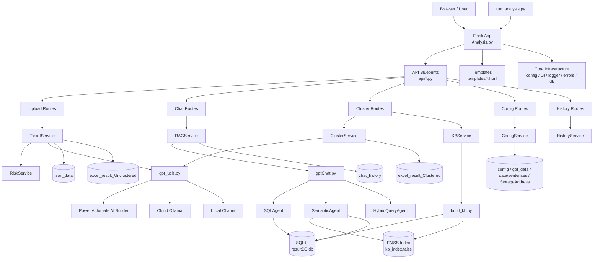
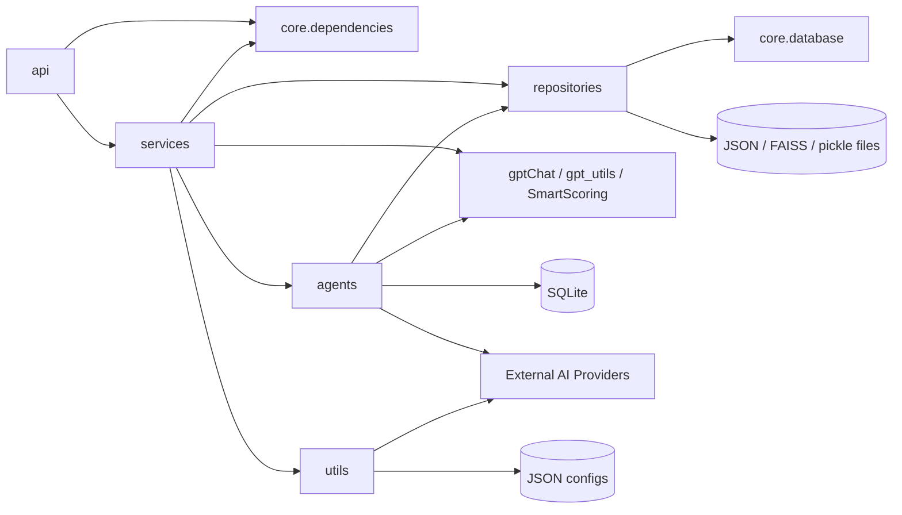
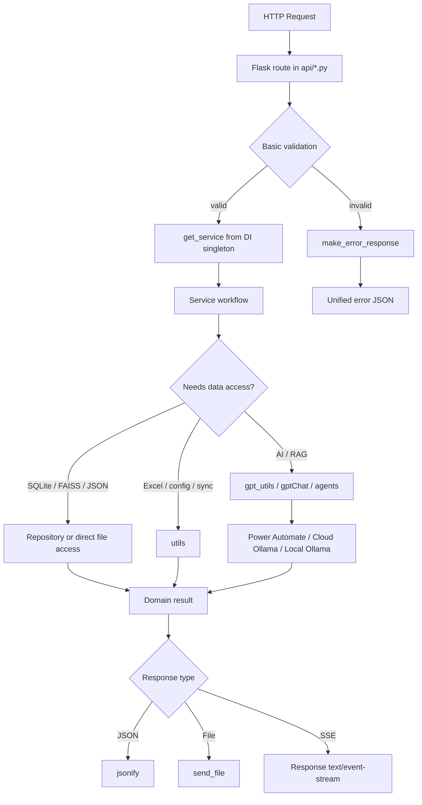
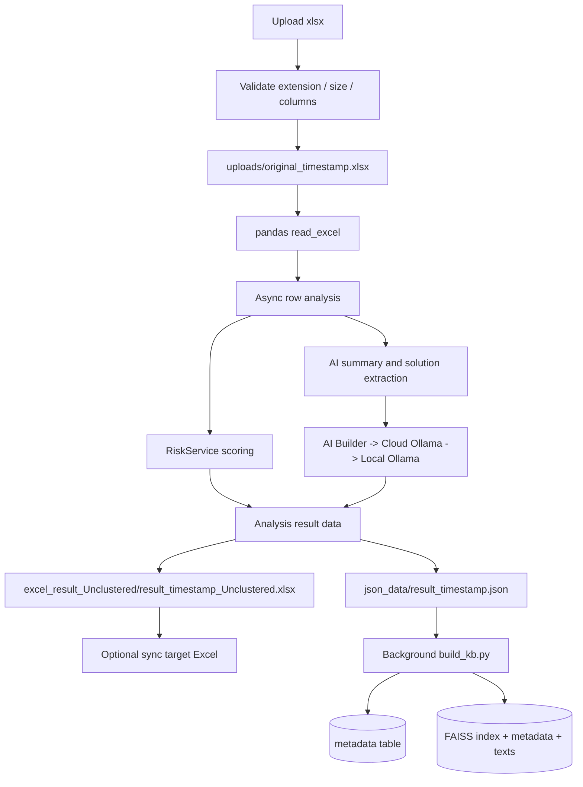
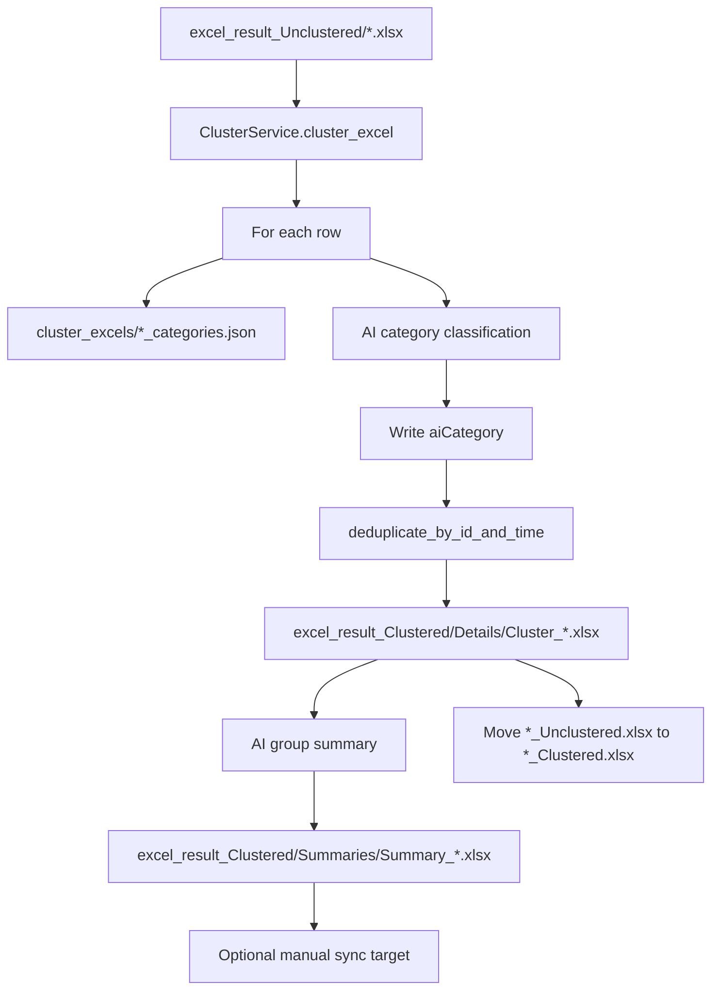
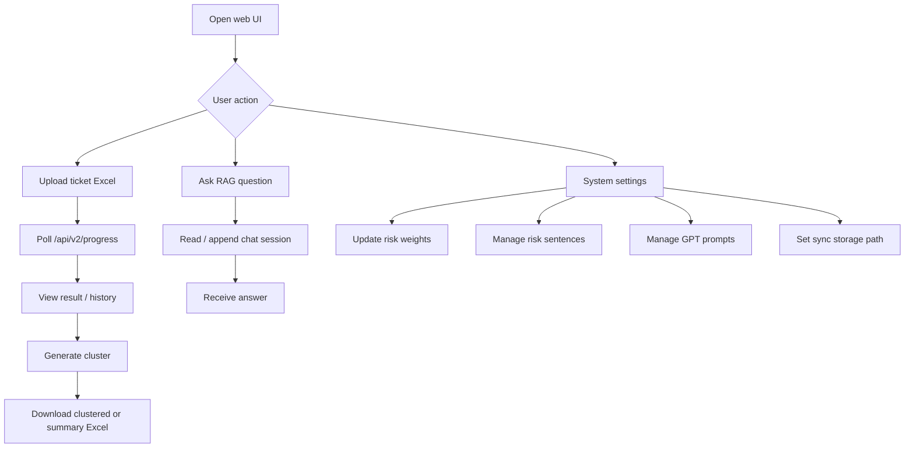
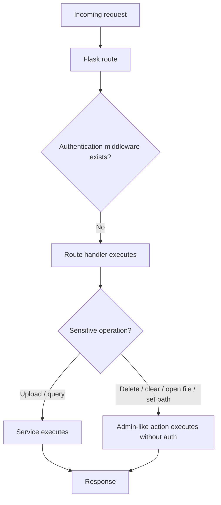
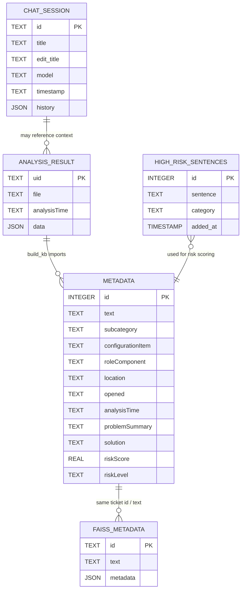

# Backend Architecture Diagrams

本文件用 Mermaid 描述目前後端架構、模組依賴、請求生命週期、資料流、使用者流程、認證現況與資料庫關係。

## 後端整體架構圖



說明：Flask route 是入口，service 層承載主要 workflow，repository / utils / agents 負責資料存取、AI 呼叫與 Excel/FAISS/SQLite 操作。此架構已往分層前進，但仍保留 `gptChat.py`、`gpt_utils.py`、`ClusterService` 等大型 orchestration 模組。

## 模組依賴圖



說明：依賴方向大致是 API -> Services -> Repositories/Utils/Agents。主要例外是 `gptChat.py` 在 import 時建立 repository 與 agent singleton，且 agents 直接讀 `.env` 與呼叫外部 AI，這讓測試與併發隔離變困難。

## API Request Lifecycle



說明：route 本身多數只做 request parsing。錯誤處理同時存在 route try/except 與 app error handler，短期可接受，但長期應統一，避免錯誤格式漂移。

## 上傳分析資料流



說明：上傳流程會產生 JSON、Excel，再觸發背景 KB rebuild。這符合實用流程，但背景 subprocess 沒有佇列、去重或狀態追蹤，併發上傳時容易互相踩到 KB lock / output files。

## RAG 查詢資料流

```mermaid
flowchart TD
  Query[User query] --> ChatRoute[/api/v2/chat or /chat/stream]
  ChatRoute --> RAG[RAGService]
  RAG --> LoadHistory[Load chat_history/chat_id.json]
  LoadHistory --> GPTChat[gptChat orchestration]
  GPTChat --> Classifier[AutoGen classifier]
  Classifier --> SQL[SQLAgent]
  Classifier --> Semantic[SemanticAgent]
  Classifier --> Hybrid[HybridQueryAgent]
  SQL --> SQLite[(SQLite metadata)]
  Semantic --> FAISS[(FAISS vector search)]
  Semantic --> SQLite
  Hybrid --> SQL
  Hybrid --> Semantic
  SQL --> LLM[LLM summarization]
  Semantic --> LLM
  Hybrid --> LLM
  LLM --> Answer[Answer text]
  Answer --> SaveHistory[Append chat history]
  SaveHistory --> Response[JSON or SSE complete event]
```

說明：RAG 使用 agent 分派，能處理 SQL、語意與混合查詢。但 `gptChat.py` 使用 module-level singleton 與全域 callback，對多使用者、多執行緒 Flask 不安全。

## 分群資料流



說明：分群流程以檔案為主，逐列呼叫 AI。優點是操作直觀；缺點是部分 exception 被吞掉，出錯時可能仍顯示完成。

## 使用者流程圖



說明：使用者主要工作流是上傳分析、看結果、分群、RAG 查詢、系統設定。設定 API 目前沒有權限保護，因此應優先補上管理員邊界。

## 認證 / 授權流程圖



說明：目前沒有認證與授權流程。這張圖刻意保留 `No` 分支，表示安全邊界不存在，而不是漏畫。若系統只在受控內網單機執行，風險較低；若對多人或網路開放，這是 Critical。

## Entity Relationship Diagram



說明：只有 `metadata` 與 `high_risk_sentences` 是程式碼中明確建立的 SQLite 表。`CHAT_SESSION`、`ANALYSIS_RESULT`、`FAISS_METADATA` 是檔案型 entity，列入 ERD 是為了呈現實際資料關係。

