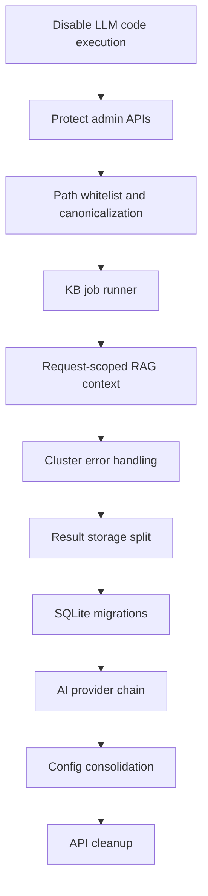

# Backend Refactor Roadmap

目標：先處理會造成安全事故、資料毀損或併發錯亂的真問題，再改善模組邊界、測試與部署。這份 roadmap 盡量保持相容，不要求一次重寫。

## Critical：立即處理

### C1. 停用或沙箱化 LLM 產出的 pandas code execution

- 問題：`agents/sql_agent.py` 對 LLM 產出的 pandas code 執行 `eval()` / `exec()`。
- 影響：任意程式碼執行、資料外洩、主機檔案被讀寫。
- 修改方向：
  - 第一階段：feature flag 關閉 pandas filter execution。
  - 第二階段：改成有限 DSL 或 AST allowlist。
  - 第三階段：必要時把執行放進獨立低權限 process。
- 驗收：
  - 惡意輸入如 `__import__("os").system(...)` 必須被拒絕。
  - Hybrid 查詢仍可走 SQL SELECT 或 Semantic search。

### C2. 保護破壞性 API

- 問題：`/clear-folder`、`/clear-history`、`/delete-result/<uid>`、`/open-clustered`、storage path API 沒有 auth。
- 影響：任何可連線者都能刪檔、改設定或開本機檔案。
- 修改方向：
  - 新增最小 `X-Admin-Token` middleware。
  - 管理 API 加 `@admin_required`。
  - 對 delete / clear API 加 explicit confirmation field。
- 驗收：
  - 未帶 token 回 401。
  - 非管理 API 不受影響。
  - 舊前端在設定 token 後仍可操作。

### C3. 檔案路徑正規化與白名單

- 問題：`chat_id`、`uid`、`file_name`、`folder` 直接組路徑。
- 影響：path traversal、任意刪除、越權下載。
- 修改方向：
  - 增加 `utils/path_security.py`。
  - ID 只允許 `^[A-Za-z0-9_-]+$`。
  - download/open/delete 使用 `Path.resolve().relative_to(base)`。
  - `clear_folder` 改成 enum：`uploads`、`json_data`、`unclustered`、`clustered`、`cache`。
- 驗收：
  - `../`、絕對路徑、symlink escape 測試全部失敗。

## High：短期 1-2 週

### H1. 以 job runner 取代裸 `subprocess.Popen(build_kb.py)`

- 問題：每次上傳都開背景程序，沒有去重與狀態。
- 修改方向：
  - 建立 `kb_jobs` SQLite table 或 `kb_job.json`。
  - 單 worker 負責 rebuild，pending job 合併。
  - `/kb-status` 回傳 job state、started_at、finished_at、error。
- 效益：避免多個 rebuild 搶 FAISS/SQLite 檔案。

### H2. 移除 RAG module-level request state

- 問題：`gptChat.py` 的 `_current_status_callback`、`_current_step_tracker` 是全域。
- 修改方向：
  - 建立 `RAGExecutionContext(chat_id, status_callback, step_tracker)`。
  - context 由 `RAGService` 傳入 `gptChat` 與 agent tools。
  - 不再在 module-level 保存 request callback。
- 效益：SSE 多使用者不會互相污染狀態。

### H3. 分群與 Excel 輸出錯誤不可吞掉

- 問題：`ClusterService` 多處 `except Exception: pass`。
- 修改方向：
  - 對每個檔案建立 `ClusterFileResult`。
  - 可恢復錯誤記錄在 response `failed_files`。
  - 不可恢復錯誤直接 raise。
- 效益：UI 能呈現部分成功/失敗，不再假成功。

### H4. 拆出結果儲存層

- 問題：`TicketService.save_analysis_files()` 同時寫 JSON、Excel、sync。
- 修改方向：
  - `AnalysisResultRepository`：JSON result。
  - `ExcelReportExporter`：Unclustered / clustered / summary Excel。
  - `SyncService`：manual/cloud sync 狀態。
- 效益：降低 service 複雜度，測試更好寫。

## Medium：中期 3-6 週

### M1. 建立 SQLite schema version 與 migration runner

- 修改方向：
  - 新增 `schema_migrations` 表。
  - 將 `CREATE_METADATA_TABLE` 搬到 migration scripts。
  - 為常用查詢加索引：`opened`、`configurationItem`、`roleComponent`、`subcategory`。
- 效益：部署與資料演進可追蹤。

### M2. 統一 AI provider fallback

- 問題：Power Automate / cloud Ollama / local Ollama fallback 分散在 `gpt_utils.py`、`gptChat.py`、agents、ClusterService。
- 修改方向：
  - `AIProviderChain.generate(prompt, purpose, status_callback)`。
  - provider 回傳統一 metadata：provider、model、latency、error。
  - 所有 service / agent 只依賴 provider chain。
- 效益：減少重複、改善可觀測性。

### M3. 統一 ConfigLoader / ConfigRepository

- 修改方向：
  - 決定單一設定來源與檔名。
  - 舊檔名保留讀取相容，寫入只寫新檔。
  - 加 migration / warning。
- 效益：避免設定漂移。

### M4. API 設計整理

- 修改方向：
  - 保留 `/api/v2`。
  - 標記 legacy endpoints：`/chat-history-list`、`/rename-chat`、`/delete-chat`。
  - 新增 RESTful alias：`/chat/sessions/<id>`。
  - 統一 error response 與 pagination response。
- 效益：前端與測試更穩定。

## Low：長期與清理

### L1. 精簡入口檔與 legacy 註解

- 修改方向：
  - `Analysis.py` 只保留 app setup、route registration、health check。
  - migration notes 搬到 docs。

### L2. 依賴拆分

- 修改方向：
  - `requirements-core.txt`
  - `requirements-ai.txt`
  - `requirements-dev.txt`
  - `requirements-windows.txt`
- 效益：安裝更快，部署風險更低。

### L3. 程式註解與 debug output 語系一致

- 修改方向：
  - 新增程式碼註解用英文。
  - UI / user-facing response 可用正體中文。
  - debug print 改 logger。

## 建議執行順序

## 每階段測試策略

| 階段 | 必加測試 |
|---|---|
| Critical | path traversal、unauthorized admin API、malicious pandas code、safe folder whitelist |
| High | concurrent SSE queries、duplicate KB rebuild request、cluster partial failure |
| Medium | migration idempotency、provider fallback order、config backward compatibility |
| Low | smoke tests、lint-like checks、dependency install check |

## 預期效益

- Critical 完成後：大幅降低資料刪除、任意程式碼執行、越權存取風險。
- High 完成後：併發查詢、KB rebuild、分群輸出更可靠。
- Medium 完成後：資料庫演進、AI provider 維護、API 相容策略更清楚。
- Low 完成後：入口與依賴更乾淨，開發者 onboarding 成本下降。

