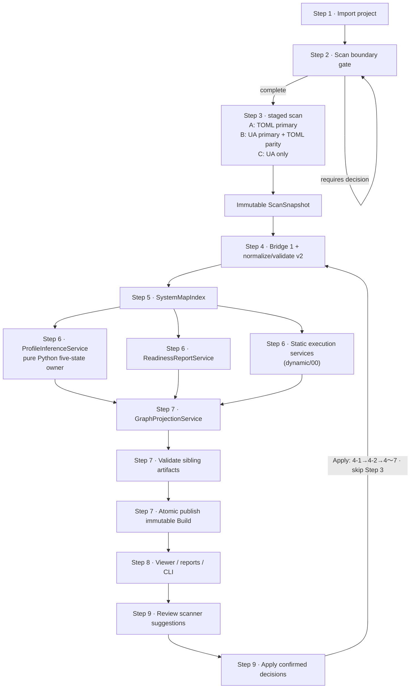
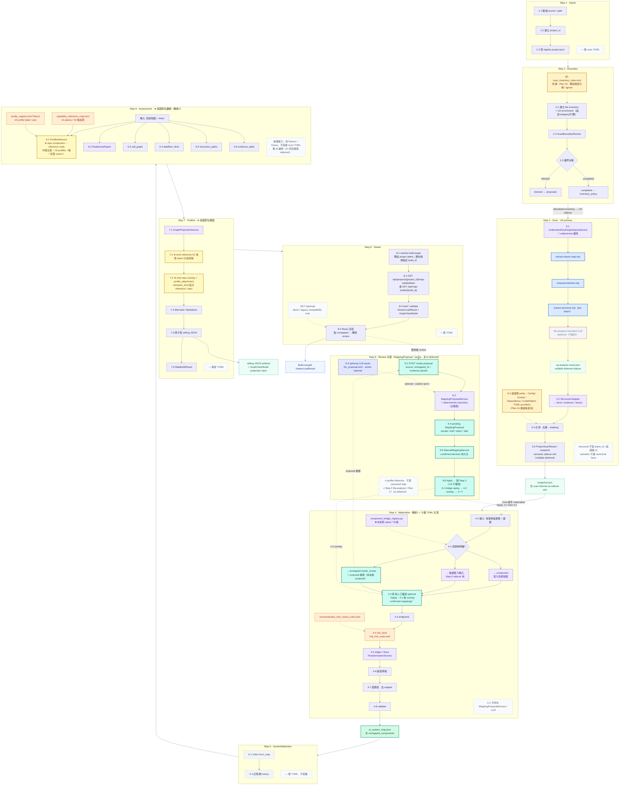

# Epic 1 Phase 2 Canonical Design：Evidence-backed AI System Release Readiness

Status: canonical design baseline for regenerating Phase2 plans.

Implementation status: mixed. Current repo still runs the v1 map-build/session
pipeline; Phase2 v2 map, build lineage, local JSON persistence, readiness
sidecars and static execution artifacts are accepted targets.

Owner: Timmy

Last repo/spec review: 2026-07-07（同日修訂已套用：Step 6 取消 AI 編排，回歸純 Python 評估）

## 1. 文件目的與狀態

本文件是 Epic 1 Phase 2 的 canonical design。它用來重新拆解 Phase2 implementation
plans，不是 implementation plan，也不聲稱 target modules 已經存在。

設計輸入包含：

- `docs/spec/` formulation / discovery / clarify 後的 active 規格；
- `docs/spec/erm.dbml` 的 DB staging model；
- `docs/spec/features/` 的 BDD 使用者規格；
- `docs/MODEL-CONTRACT.md` 與 `docs/API-GUIDE.md` 的 active contract；
- `docs/work/Timmy/design/EPIC1/frontend-json-handoff/` 的 target payload handoff；
- `docs/work/Timmy/schedule/plan/unfinish/phase2/` 的 Phase2 plan set；
- current repo code、schemas、tests、frontend types、dependency files 與 GitHub templates。

本文件的裁決原則是：current implementation 用來證明現在實際存在什麼；accepted target
用來定義 Phase2 要落到哪裡。兩者不同時，所有 plan 必須寫成 current → migration →
target，不得把 planned modules、mock samples 或文件 claim 寫成已實作。

### 2026-07-07 UA 整合決策（含同日修訂）

> 修訂紀錄：2026-07-07 同日修訂——Step 6 取消 AI 編排（不建立 `AssessmentOrchestrator`，
> Plan 17 deferred），回歸純 Python 評估；UA 語意分析結果 Phase2 不產生、不消費。
> 修訂決策以 `phase4-scanner-expansion/00-phase2-pipeline-ascii-map.md`（§2 第 4 順位）
> 為準，下表已套用修訂後定案。
>
> 下表「白話定案」供快速理解；括號內為實作錨點（模組名、identity、plan id），細節見後文各節。
>
> **為什麼 Step 3 要 Phase A / B / C（分三階段上線）？** 若一次把主掃描器換成 UA，Step 1～9、
> `ScanSnapshot`、Apply、持久化與 Gate 驗收會同時賭在 Node runtime、adapter 正確性與 facts
> 差異上，回歸面太大。**Phase A** 先用已存在的 KAI TOML 掃描跑通整條 pipeline 與 Apply（Gate-1），
> 證明 `ua_analysis_result=null` 也能完成 build。**Phase B** 才把 UA 結構分析升為主掃描，
> 舊 TOML 只跑 parity 對照，用真實 repo / fixture 驗 diff（Plan 14 前）。**Phase C** 對照通過後
> （Plan 18）退役主掃描 TOML，只留 UA，避免長期維護兩套 primary facts。

| 決策面 | 2026-07-07 定案（白話） |
|---|---|
| Step 3 scanner | **分三階段上線（理由見上）：** ① **Phase A** 先用現有 KAI TOML 規則掃描，把 Step 1～9 + Apply 跑通（**Gate-1**）；② **Phase B** 改由 `UnderstandAnythingAnalysisService` 呼叫 **UA 外部分析**當主掃描，舊 KAI 規則只跑 **parity 對照**；③ **Phase C**（**Plan 14** 通過後 **Plan 18**）舊主掃描規則退役，**只留 UA**。 |
| UA 採用範圍 | Phase2 **只用 UA 的結構分析**（`extract-import-map` → `compute-batches` → `extract-structure`），**不用 LLM 猜語意**。不跑 `scan-project.mjs`；語言 / `fileCategory` / 行數改在 **Step 2 inventory** 補。不跑 `file-analyzer`；`ua-analysis-result.json` 的 semantic 欄位 **可留空（nullable deferred）**。 |
| Step 6 assessment | 能力 **五態只用 Python 規則**（`ProfileInferenceService`），不用 AI 編排。Plan 17 / `AssessmentOrchestrator` **先不做**，不擋 Plan 14。**五態只能 Python 定案**；`detected` **必須有 direct evidence**。 |
| Apply / Rescan | **Apply：** 不重掃 repo、不重跑 UA；**同一個 `scan_id`**，重放 `ScanSnapshot.scan_result` 的 facts/evidence，從 Step 4 重算 → **新 `build_id`**。UA 原始 JSON（`ua-analysis-result`）**不變、Phase2 不讀**。**Rescan：** 新 `scan_id`；Phase B/C 會再跑 UA。 |
| Artifact / failure boundary | **① LLM 語意（`file-analyzer` → `ua-analysis-result.semantic`）：** Phase2 不當正式產物；frontend 不加欄位；**無 consumer** = Step 4～7 / Apply / Viewer **都不讀**這段（scan 內可 **null 留存** 即可）。<br>**② 失敗規則：** **Phase A** 不跑 UA 仍可正常 build；**Phase B/C** 若 UA **結構分析** / Node / 必要 batch 失敗 → **整次 scan fail-closed**（不是「UA 失敗還能運作」— 指的是結構路徑，不是 LLM 語意）。<br>**③ 本階段不做（也不算失敗）：** `file-analyzer`、UA Phase 3～7、`knowledge-graph.json`、dashboard。<br>**對照：** UA **結構**結果 → adapter → `scan_result`（**有 consumer**）；**LLM 語意**結果 → **無 consumer**。 |

## 2. Source of Truth / conflict resolution

發生 contract 衝突時採用下列優先序：

1. current code、schemas、tests 與實際 generated artifacts，只能證明 current state；
2. `docs/spec/` 經 clarify 後的 active 規格；
3. `docs/MODEL-CONTRACT.md` / `docs/API-GUIDE.md` 的 superseding sections；
4. `docs/work/Timmy/schedule/plan/unfinish/phase4-scanner-expansion/00-phase2-pipeline-ascii-map.md`
   的 Step 1～9 pipeline 邊界與 2026-07-07 同日修訂決策（視覺 source of truth）；
5. `ref-opensource/kai-mind-understand-anything-integration-boundary.md` 的 2026-07-07 Accepted UA
   整合決策（其 Step 6 `AssessmentOrchestrator` / semantic candidate 段落已被第 4 項同日修訂取代）；
6. `phase2/capability-map-assessment-decision-summary.md` 與 Phase2 indexes；
7. Phase2 個別 plan 中日期較新且明確標示 confirmed / superseding 的內容；
8. 舊 design、raw data、prototype HTML、handoff mock，只能作歷史或 target sample 參考。

本文件採用的關鍵裁決：

- 產品定位是 scanner / release-readiness gate，不是 builder、chatbot 或完整 observability。
- input 是 AI system repo / workflow artifacts，不預設一定是 RAG 或 Agent。
- active target 是 generic `ai-system-map/v2`；`ai-system-map/v1` 只保留 expand-and-contract
  migration/read path。
- `rag-core-v1` 與舊 RAG feature 是 legacy compatibility input，不是 active product surface。
  Plan `00` **freezes** shipped `rag-core-v1@1.0.0` (13 slots / 2 flows); Phase2 does not
  update the template unless a separate approved template contract migration is opened.
- Phase2 active `ai_system_map.json` is materialized by **Step 4 deterministic bridge rules**
  (`component_bridge_registry.py`: `rule_id` + evidence → generic components/edges), not by
  filling `rag-core-v1` slots.
- canonical truth 只有 `ai_system_map.json`；profile、readiness、viewer projection、static
  execution、runtime trace 都不得 write back canonical map。
- formal field name 是 `activation`；`activation_state` 只可出現在 legacy plan/handoff
  migration note，不可作為 persisted 或 projection 欄位。
- active artifacts 使用 `generated_from_build_id`；`generated_from_run_id` / `run_id`
  只限 legacy migration 說明。
- `generated_from_build_id` 必須等於目前 artifact/build 的 `build_id`；parent lineage 只由
  `based_on_build_id` 表示。
- Phase2 `environment_id` 固定為 `environment:default-static`，不提供建立、選擇或切換環境。
- all JSON core artifacts 屬於 atomic publish set；Markdown / Mermaid 只能在明確 warning
  下 degraded publish。
- Dynamic runtime implementation 是 post-Phase2；Plan 12 只凍結 static/runtime contract 邊界。
- Step 3 依 Phase A TOML-primary → Phase B UA-primary + TOML parity → Phase C UA-only 漸進切換。
- Step 6 在 Phase2 是純 Python deterministic assessment；Plan 17 AI candidate flow deferred。
- Apply 重放 `scan_id` 對應的 immutable scan，不重跑 UA；Rescan 才建立新 scan，並重跑
  deterministic structural extraction。
- semantic sidecar 是 reserved nullable scan internal slot，不列 public artifact、不新增 frontend
  public 欄位，Phase2 active path 不產生、不消費。

## 3. Product positioning

KAI-Mind / Local AI Health Doctor 是 **AI Agent / RAG / agentic RAG** 等 AI system 的
release-readiness gate。它在 demo、交付、部署或 CI/CD 前，以 read-only scanner 盤點**既有的**
local AI system **repo 或 workflow artifacts**（不修改被掃專案），輸出可追溯 evidence 的
system map、capability assessment、readiness report，以及 **static / dynamic execution view**
（見下段時程；仍不是完整 APM）。

**掃描對象包括（不限單一框架或產品形態）：**

- 傳統 RAG pipeline（retriever、vector store、embedding、generation 等）；
- **agentic RAG**（retrieval 包成 tool、agent routing、多步 workflow、human-in-the-loop 等）；
- tool-using **AI Agent** 系統（MCP、function calling、sub-agent、orchestration 等）；
- 平台/workflow 匯出的設定或 artifact（例如 workflow JSON、部署描述檔），只要落在 Step 2
  核准的掃描邊界內。

input **不預設**一定是 RAG 或 Agent；Phase2 active target 是 generic `ai-system-map/v2`
（`system_type="ai_system"`），以 ten-plane / 52-node capability map 評估**各類** AI system，
而非只用 legacy RAG slot checklist 判斷 non-RAG 專案。

**Execution view 時程（Phase 2）：**

- **Static execution view**（Phase 2 **前半～Plan 14 前**，`dynamic/00`）：從 source/config
  evidence **靜態推論**可走路徑（`call_graph.json`、`execution_paths.json`、`execution_map.mmd`
  等）；`runtime_verified=false`；不宣稱實際跑過。
- **Dynamic execution view**（Phase 2 **後半段**，Plan `12` contract + `dynamic/01`）：**opt-in**
  runtime / query trace overlay，在 Viewer 上**暫時**高亮實際請求走過的 component path；不寫回
  `ai_system_map.json` / `profile_signals.json`；reload 可清除。**不納入** Phase 2 前半
  Gate-1～Gate-3 的 completion gate（見 §14、§21）。

它不是：

- chatbot、RAG builder、Agent builder 或 workflow editor；
- 通用 codebase knowledge graph；
- 完整 runtime observability / APM / RAG evaluation 平台；
- 企業級資安掃描器；
- 讓 LLM 直接吃整包 raw source 後黑箱猜 architecture 的工具。

## 4. Goals / Non-Goals

Goals：

- 將 active target 收斂到 generic `ai-system-map/v2`。
- 保留 v1 artifact 可讀性與 v1→v2 adapter，完成 expand-and-contract cutover。
- 以 **Two-Phase Analysis** 原則建立 evidence-backed map：**第一階段** deterministic structural
  facts（Phase2 **active path 只做到這**）；**第二階段** bounded semantic analysis（UA
  `file-analyzer` / LLM 語意候選）**Phase2 不執行**，Plan 17 deferred，不得進 canonical map
  或五態定案。
- 產生 fixed ten-plane / 52-node capability reference map + repo overlay。
- 產生五態 assessment、六態 activation、evidence kinds、Mapping Completeness 與 readiness
  findings。
- 分離 `project_id`、`scan_id`、`build_id`、`environment_id`；`scan_id` 本身就是 immutable scan
  snapshot identity，不另設第二層 snapshot identity。
- 讓 Apply 重用 immutable scan，建立 immutable child build，不重掃 repo、不 patch 舊 JSON。
- **持久化：** 先把「讀寫 project / scan / build / mapping」的**儲存介面**定好；Phase2 用**本機
  JSON 檔**落地（整份寫完才切換，避免寫一半 corrupt）；backend 重啟後可恢復 Apply 與
  lineage。**Phase2 不做** PostgreSQL / SQLite——以後若要上資料庫，只換底層實作，不改
  `scan_id` / `build_id` / Apply 語意（Plan 03A）。
- 讓 frontend 只 render backend projection，不自行推論 status、activation、readiness 或
  completeness。

Non-Goals：

- Phase2 不導入 PostgreSQL、SQLite、ORM、migration framework、pgvector 或 multi-tenant 平台。
- Phase2 不建立 authentication、remote sync、任意 build branching 或 shared server state。
- Query Trace 結果不寫回 canonical/profile/readiness artifacts。
- Manual mapping decision 不直接修改既有 `ai_system_map.json`。
- 不啟動 target app、不安裝 target dependencies、不修改被掃描 repo。
- 不把 dynamic runtime trace implementation 納入 Phase2 completion gate。
- **Phase2 不執行 bounded semantic analysis**（不跑 UA `file-analyzer`、不產不消費 LLM 語意
  graph；第二階段留待 Plan 17 或 post-Phase2，且即使重啟也只能是候選輸入，五態仍由 Python
  定案）。
- 不把舊 legacy RAG feature 或相容建圖介面當成 active design。

## 5. Current implementation baseline

Current backend 可確認狀態：

- Canonical model/schema 仍是 `ai-system-map/v1`：
  - `src/kai_mind/core/models/system_map.py` 定義 `RagSystemMap`、`SCHEMA_VERSION =
    "ai-system-map/v1"`、`SystemType = "rag"`。
  - `schemas/ai-system-map.v1.schema.json` 是目前 checked-in schema。
  - `tests/integration/test_map_build_service.py` 驗證 current output schema version 是 v1。
- Current map build pipeline：
  - `MapBuildService` 跑 precondition → `ProjectScanService` deterministic providers →
    `ComponentDetectionService` → endpoint/risk/flow/normalize/validate → `OutputArtifactProvider`
    寫 `ai_system_map.json`、`ai_system_map.md`。
  - current artifact writer 不是 atomic sibling artifact publisher；沒有 build manifest、profile
    sidecar、readiness report、static execution artifacts。
- Current project/session persistence：
  - `POST /api/projects/import` 建立 process-local `project_id`。
  - `POST /api/scans` 產生 process-local `scan_id`，但沒有 durable immutable scan、
    `build_id` lineage 或 restart recovery。
  - `InMemorySessionStore` 保存 project、latest viewer payload、project build result；backend
    restart 後消失。
- Current mapping/proposal behavior：
  - `ManualMappingService` 與 `MappingProposalService` 已有 in-memory repository protocols、
    Pydantic models 與 routes。
  - Current model 仍有 legacy `existing_slot_mapping` / `new_extension_component`，不是 final
    non-baseline capability candidate contract。
  - Proposal 可由 bounded evidence packet 建立；accept/edit 寫入 manual mapping，reject/skip
    更新 proposal status。Current reject/skip 尚未都保存 durable `ManualMapping` audit decision。
- Current detail scan / query trace / viewer：
  - Detail scan 會 mutate current in-memory `RagSystemMap` 並更新 viewer payload；Phase2 target
    必須改為 immutable child build。
  - Query Trace 是 explicit runtime endpoint probe，已具備 timeout、egress guard、masking 與
    no map mutation 測試；Phase2 target 要改為 build-scoped transient session overlay。
  - Viewer API 目前回傳 `ViewerPayload` / `GraphViewModel` for v1；frontend zod types 也以
    current payload 為主。
- Current safety：
  - Tests 已覆蓋 secret masking、absolute path rejection、snapshot safety、filesystem provider
    read-only 行為、provider partial failure、cross-platform relative path。
  - API middleware 對 1 MB request limit 與 unhandled error 回 stable safe `{detail}`。

Target modules 目前不存在或只在文件中：

- `AiSystemMapV2` / v2 JSON schema / v1-to-v2 adapter active producer；
- durable `Project` / `ScanSnapshot` / `Build` / `Artifact` repositories；
- atomic local JSON state store；
- `UnderstandAnythingAnalysisService` / UA sidecar request-result validator-adapter；
- `SystemMapIndex`；
- `ProfileInferenceService` / `profile_signals.json` writer；
- `ReadinessReportService` / `readiness_report.json` writer；
- `EvidenceTable` / static call graph / dataflow / execution path writers；
- `GraphProjectionService` for fixed reference map + repo overlay；
- project-scoped `GET /api/map-builds*` 與 `POST /api/map-builds/{base_build_id}/apply`。

## 6. Target architecture 與 dependency direction

Target dependency direction：

```text
Web / CLI adapters
  -> application services
    -> domain models + repository protocols
      -> providers / filesystem / local JSON adapters
```

Rules：

- Core engine 不依賴 FastAPI、Typer、React、ORM row 或 filesystem storage layout。
- Web / CLI adapters 不重作 scanner、assessment、projection 或 Apply 邏輯。
- Storage adapters 不重新定義 identity、lineage、validation 或 API semantics。
- Frontend 不持有 business semantics；它只 render backend-provided projection。

Target high-level pipeline：

> Apply 跳 Step 3/UA；**4-1 bridge replay → 4-2 confirmed mappings overlay** → Step 4
> normalize/validate → Step 5～7（勿將「4-2 replay」讀成跳過 4-1）。



Step ownership：

| Step | Owner | Input | Output | Hard boundary |
|---|---|---|---|---|
| Import | project registry service | local path | `project_id` | 不修改 target repo |
| Boundary gate | scan boundary service + Plan `19` inventory rules（metadata） | inventory + same-run decisions | continue / proposals | unresolved gate 不跑 providers |
| Step 3 Scan | Phase A existing KAI providers；Phase B `UnderstandAnythingAnalysisService` + UA structural adapter；Phase C UA-only | Step 2 allowlisted inventory | bounded facts + evidence + issues；reserved nullable semantic sidecar slot | 不寫 plane/profile/canonical verdict；Phase2 active path 不產生、不消費 semantic sidecar |
| Step 4 Bridge 1 | Python component bridge + `SystemMapNormalizeService` / `SystemMapValidationService` | rule id + evidence + replayed mappings | validated `ai_system_map.json` + repo component / unmapped / candidate input | 不做 reference node assessment |
| Step 5 Index | `SystemMapIndex` | validated v2 map | read-only lookup | 不 validate、不 infer、不 project |
| Step 6 Assessment | Python `ProfileInferenceService` + readiness services + static execution（`dynamic/00`） | map + index + catalogs + confirmed non-baseline candidates | `profile_signals.json`（含 52 格 `reference_capability_assessments`）+ readiness + static execution artifacts | 純 deterministic；Phase2 active path 不產生、不讀取 UA semantic sidecar；不 mutate canonical map |
| Step 7 Publish & Projection | Plan `03` `OutputArtifactProvider` + per-artifact validators + `GraphProjectionService` | same-build artifacts | sibling JSON artifacts + `GraphViewModel`（API projection 輸入，非獨立落盤 canonical JSON） | frontend 不重算 semantics；任一 core JSON 失敗整包不 publish |
| Step 8 Viewer | `ViewerSessionService` + build-scoped GET routes | published immutable build | `ViewerLoadResult`（`profile_inference_result` ≡ 已驗證 `profile_signals.json`） | 不重算五態/activation/Mapping Completeness；sidecar 缺失 degraded load（`profile_signals_missing` / `profile_signals_invalid`） |
| Step 9 Review/Apply | proposal/mapping/apply services | unmapped + bounded packet | durable decision + child build | Apply 不重掃 repo、不重跑 UA；**4-1 bridge replay → 4-2 overlay** → Step 4～7 |

> **Step 編號對照：** 本表 Step 7 = Publish + Projection + sibling validate；Step 8 = Viewer load。
> §6.1 快照與 `00-phase2-pipeline-ascii-map.md` 使用相同編號。Assessment scope 固定
> `scan_id` + `build_id` + `environment_id`（Phase2 `environment:default-static`）。

### 6.1 Step 1～9 完整 pipeline 總圖（snapshot copy）

> 本節是
> `docs/work/Timmy/schedule/plan/unfinish/phase4-scanner-expansion/00-phase2-pipeline-ascii-map.md`
> 的 2026-07-07 快照複本。該文件是 Step 1～9 的**視覺 source of truth**（見 §2 第 4 順位）；
> 兩邊不一致時以該文件為準並回填本節。
>
> 圖示為 Phase2 target 狀態（Phase B/C UA-primary）。Phase A 的 TOML-primary 過渡期
> Step 3 改由現有 KAI scan TOML providers 提供 primary facts（見 §7.3），圖中 UA 節點
> 在 Phase A 不存在、`sidecar=null`。
>
> 名詞對照：圖中「系統地圖」= `ai_system_map.json`（canonical）、「能力底圖」=
> `capability_reference_map.toml`（10 planes / 52 reference nodes）、「對不上项」=
> `unmapped_components[]`、「候選能力輸入」= non-baseline capability candidate input、
> 「snapshot.json」= 以 `scan_id` 為 identity 的 immutable `ScanSnapshot` record。

圖例：

| 標記 / 配色 | class | 意義 |
|-------------|-------|------|
| 🔵 **UA structural sidecar**（藍底） | `ua` | Understand-Anything deterministic structural subset（import map、batches、structure）；Phase B/C 的 Step 3 primary 掃描來源 |
| 📦 **TOML 掃描規則**（黃底） | `toml` | 加 `rule_id` + 匹配條件 → 產掃描事實（Phase A primary；Phase B **parity only**，Plan 14 後由 Plan 18 退役；Step 2 `scan_inventory_rules.toml` 保留） |
| 🏷️ **TOML metadata**（橘底） | `tomlMeta` | 只放 label / 文案 / 座標；**不含** threshold / regex（例如 `risk_hint_rules.toml`、`profile_registry.toml`、`capability_reference_map.toml`） |
| ⚙️ **TOML runtime config**（靛紫底） | `runtimeConfig` | **Phase2 active-optional** 外部 provider 設定；目前範例 = Step 9 `llm_proposal.toml`。provider 不可用時 fallback deterministic heuristics |
| 🐍 **Python**（紫底） | `py` | 橋接 / 五態 / 投影 / **Step 9 proposal deterministic heuristics**；**不要**把 executable 規則塞進 TOML |
| ★ **底圖對位**（淺黃底） | `match` | 系統地圖 repo 元件 ↔ 10 planes / 52 格 reference node（Step 6 邏輯、Step 7 畫圖） |
| 🔖 **Proposal 流程**（青綠底） | `proposal` | **Phase2 active** review 流程：`4-1` bridge replay、`4-2` confirmed mappings overlay、Step 9 `ManualMapping` / pending `MappingProposal` |
| ★ **Canonical 產物**（綠底粗框） | `canon` | `ai_system_map.json` — 唯一 repo 真相 |
| 📄 **Derived artifact**（淺綠底） | `artifact` | `snapshot.json`、sibling sidecar JSON（`profile_signals.json` 等） |
| 🔒 **Scan-internal slot**（灰綠底虛線） | `scanInternal` | `ua-analysis-result.json` — 存在於 snapshot 內、**非** public artifact / API artifact path |
| 🌐 **API 聚合**（藍底） | `api` | build-scoped `ViewerLoadResult` / 內嵌 `GraphViewModel`（ephemeral projection，非 sibling JSON 檔） |
| 💾 **記憶體 only**（灰底虛線） | `mem` | `SystemMapIndex` — 不寫檔、不產新 facts |
| ⛔ **AI deferred**（灰底紅框虛線） | `ai` | **Phase2 整條不執行**：UA `file-analyzer`、semantic sidecar、Plan 17。**圖上唯一使用紅框虛線的 class = deferred** |
| ⬜ **備註 / 邊界**（灰底） | `noToml` | 此步無 TOML 擴充，或標示「不做」的邊界說明 |
| （預設白底） | — | 一般 pipeline 子步驟（組裝、validate、Viewer 載入等） |

**易混對照（Step 9 vs Step 3 semantic）— 記法：圖上只有 `ai`（灰底紅框虛線）代表 deferred：**

| 路徑 | class | Phase2 | 白話 |
|---|---|---|---|
| Step 3 `file-analyzer` / semantic sidecar | `ai`（灰底紅框虛線） | **不做** | 掃描期語意 LLM；Phase2 不跑 |
| Step 9 MappingProposal + ManualMapping + Apply | `proposal`（青綠底）+ `py`（紫底） | **要做** | 使用者 review scanner suggestions；deterministic 主路徑永遠存在 |
| Step 9 optional LLM assist（`llm_proposal.toml`） | `runtimeConfig`（靛紫底） | **可選加強** | 有 key 才啟用；失敗不阻 scan/build，fallback `py` heuristics |



Rescan 與 Apply 的重入路徑：

```text
Rescan   Step 2→3→4→5→6→7→8     新 scan（Phase B/C 重跑 UA），掃描事實會變
Apply    跳 Step 3/UA；4-1→4-2→4～7→8   同 scan（重放 immutable scan facts）；先 bridge replay 再 overlay confirmed mappings
```

### 6.2 兩段橋接（橋接 1 / 橋接 2）與模組分工

Pipeline 的核心解讀邏輯集中在兩段 Python 橋接；掃描層與投影層都不做語意判定：

```text
橋接 1  Step 4   rule_id + 證據強度  →  系統地圖（repo component / unmapped / 候選能力輸入）
橋接 2  Step 6   系統地圖 + 證據      →  能力評估（底圖 52 格五態 + profiles）
Step 7           系統地圖 + 能力評估  →  疊圖（reference 格 + repo 節點並列，不 merge）
```

模組分工（誰做對位、誰不做）：

| 模組 / 步驟 | 角色 | 是否比對 plane / 52 格 |
|-------------|------|----------------------|
| `component_bridge_registry.py`（Step 4 橋接 1） | `rule_id` → repo component / unmapped / 候選能力輸入 | ❌ 不比對 plane |
| `SystemMapIndex`（Step 5） | 記憶體 lookup：component id、evidence id、edge 查詢 | ❌ 不比對、不寫檔 |
| **`ProfileInferenceService`（Step 6 橋接 2 ★）** | **專門**讀系統地圖 + reference catalog → 每格五態、repo↔node refs、15 profiles | ✅ **唯一對位定案 owner** |
| `GraphProjectionService`（Step 7） | 依 Step 6 結果**畫** reference 格 + repo overlay | ❌ 不重算五態 |
| `capability_reference_map.toml`（Plan 01A） | plane id、52 node id、label、display order | ❌ metadata only |

橋接 2 輸入 / 輸出契約：

```text
輸入（唯讀）
  · ai_system_map.json（Step 4 定稿的 repo 真相）
  · SystemMapIndex（Step 5 lookup，可選加速）
  · confirmed non-baseline capability candidates（Step 9 Apply 後才穩定）
  · capability_reference_map.toml（10 planes / 52 nodes metadata）
  · profile_registry.toml（15 profile 顯示 metadata，Plan 11）

ProfileInferenceService.infer(...)     ← 橋接 2 定案入口（Python）
  · 對每個 reference node_id 產五態（detected / partial / undetermined / not_detected / conflicted）
  · detected 需 direct evidence（MODEL-CONTRACT）
  · 記錄哪些 repo component / unmapped / capability candidate 支撐哪個 plane 下的哪格
  · 產 stackable profile checklist（可同時多個 detected）
  · 重算 Mapping Completeness（derived metric，非 readiness 總分）

輸出
  · profile_signals.json（sidecar；含 `reference_capability_assessments[]` 52 格五態 +
    `profiles[]` + `mapping_completeness`；不 mutate `ai_system_map.json`）
  · API 載入時同一 payload 以 `ViewerLoadResult.profile_inference_result` 暴露
  · Step 7 將 52 格 assessment 投影為 `GraphViewModel.reference_capability` nodes
  · readiness / static execution sibling artifacts 供 Step 7 與 reports 消費

（AI candidate 評估路徑 deferred：`infer(...)` 介面保留 optional `validated_candidates`
  輸入接縫、預設為空；未來重啟 Plan 17 不需改動 deterministic 定案邏輯）
```

對位規則放哪裡（Python vs TOML）：

```text
capability_reference_map.toml        →  「第幾 plane、第幾格、叫什麼名字」（座標）
ProfileInferenceService（Python）    →  「這個 repo 的 retriever 證據是否支撐 retrieval plane 的某格」（判定）
Step 3 掃描層（UA adapter / TOML）   →  只產 facts；禁止寫 plane_id / reference_node_id
```

與 Step 9 proposal 的邊界：橋接 2 **不**呼叫 `MappingProposalService`；使用者確認 mapping
後，Apply replay Step 4，**再**用新系統地圖重跑橋接 2。「確認 non-baseline capability
candidate」≠ 某 profile 已 `detected`；五態仍只由橋接 2 依 evidence threshold 判定。

## 7. End-to-end pipeline / data flow

### 7.1 Import

`POST /api/projects/import` 建立 project registry entry。Phase2 identity 以 resolved true path +
filesystem case semantics 產生 `canonical_path_digest`，相同 digest 重用 `project_id`；API、
logs、reports、artifacts 不輸出 raw absolute path。

### 7.2 Scan boundary

`POST /api/scans` 在 provider collection 前執行 scan boundary gate：

- no proposals：自動繼續；
- proposals present：必須一次提交全部 same-run `target_path + fingerprint` decisions；
- unresolved / missing / stale decision：不執行 provider scan、不建立 snapshot/build、不寫 artifacts、
  不切 latest viewer；
- boundary decision 只適用當次 scan，不保存為長期偏好。

`skipped_items` audit trail 由 `POST /api/scans` response 提供 bounded summary；不把 hard-skip
target 變成人工 decision proposal。

### 7.3 Staged deterministic scan

Step 2 先建立 KAI-Mind allowlisted `FileInventory`，並承接原 `scan-project.mjs` 有價值的
enrichment（language、file category、line count）。KAI-Mind 不執行 `scan-project.mjs`，避免
Understand-Anything 另行決定掃描邊界。

Step 3 依序採三階段切換：

1. **Phase A — TOML primary：** 現有 KAI scan TOML providers 先打通 Step 1～9、
   deterministic assessment 與 Apply。此階段 `ua_analysis_result=null` 必須可完成 build / Apply。
2. **Phase B — UA primary + TOML parity：** Gate-1 通過後才執行 Plan 16；UA structural facts
   成為 primary，TOML providers 只產 parity report。
3. **Phase C — UA only：** Plan 14 保存 parity / fail-closed / Apply replay report 後，Plan 18
   才退役 TOML providers 的主掃描路徑。

Phase B/C 的 Step 3：

```text
FileInventory（Step 2 已核准 + enrichment）
  -> UnderstandAnythingAnalysisService（Python subprocess）
       extract-import-map
       -> compute-batches
       -> extract-structure
       -> file-analyzer（bounded LLM）deferred；不執行
       -> ua-analysis-result.json nullable deferred sidecar
  -> UA structural adapter：facts / evidence / issues
  -> semantic sidecar：reserved nullable internal sidecar（Phase2 不產生、不消費）
  -> 過渡期 KAI scan TOML providers 並跑 parity（Plan 14 通過後由 Plan 18 退役）
```

Scanner 只產生 bounded facts、evidence、issues、skipped summaries：

- location 使用 project-relative POSIX path、symbol、line range、config key 或 JSON pointer；
- raw source、raw secret、unmanaged absolute path 不進 artifact；
- Phase A 由 KAI TOML providers 提供 primary facts；Phase B/C 才由 UA structural result 提供 primary facts；
- Phase B/C 的 UA schema 不合法、Node runtime 缺失或必要 batch 失敗時 fail-closed，不建立可進 Step 4 的 immutable scan；Phase A 的 nullable sidecar 不屬於 failure。

Two-Phase Analysis：**Phase2 active path 只執行第一階段** deterministic structural facts。
**第二階段** bounded semantic analysis（`file-analyzer` bounded LLM）**現階段不做（deferred）**；
未來若重啟（Plan 17），也只能進 scan 內部 nullable 留存或候選 pipeline，**不得**直接建立
canonical truth 或五態。

### 7.4 Immutable scan

Provider collection 完成後建立以 `scan_id` 為 identity 的 immutable `ScanSnapshot` record：

- 一次 completed scan 對應一個 `scan_id`；不另設第二層 snapshot identity；
- boundary 未完成時不得建立 domain `scan_id`、Build 或 artifacts；若 transport 需要 request id，
  它不得冒充 scan identity；
- repo evidence 改變時必須 explicit rescan，產生新 `scan_id`；
- Phase B/C scan 可保存 nullable `ua-analysis-result` internal sidecar；它不屬於 public artifact set，
  只供 Apply 重播 structural facts，semantic payload 在 Phase2 無 consumer。

### 7.5 Materialization and publication

Build pipeline 從 immutable scan materialize all sibling artifacts。`initial_scan`、`apply_confirmations`、
`detail_scan` 都產生 immutable `build_id`；任一 core JSON 驗證失敗時整個 build 不 publish，
`Project.latest_build_id` 保持原值。

## 8. Canonical / derived / projection boundaries

Canonical truth：

- `ai_system_map.json` 是唯一 canonical artifact。
- 它只包含 project/build scope、repo components、edges、evidence、endpoints、risk hints、
  unmapped components 與可驗證 metadata。

Derived sidecars：

- `profile_signals.json`
- `readiness_report.json`
- `evidence_table.json`
- `call_graph.json`
- `dataflow_hints.json`
- `execution_paths.json`

Projection / rendering：

- `GraphViewModel`
- `ai_system_map.md`
- `system_map.mmd`
- `execution_map.mmd`
- Viewer aggregate payload

Hard rules：

- Derived sidecars 不可 write back `ai_system_map.json`。
- Viewer aggregate 是 ephemeral API projection，不是 persisted source of truth。
- Static execution artifacts 不宣稱 runtime executed。
- Runtime trace overlay 不得變成 canonical graph 或 readiness evidence，除非後續版本另定 explicit
  telemetry contract。
- Handoff samples 是 target mocks；除非通過 current Pydantic/OpenAPI/schema/tests，不可當成
  current runtime contract。

## 9. Identity、scan/build lineage 與 Apply semantics

| Identity | Meaning | Changes when |
|---|---|---|
| `project_id` | local project registry identity | new canonical path digest |
| `scan_id` | one immutable repo scan snapshot | completed initial scan / explicit rescan |
| `build_id` | immutable artifact set materialized from scan | initial / Apply / detail build |
| `environment_id` | assessment scope | Phase2 fixed `environment:default-static` |
| `mapping_id` | durable review decision | decision creation; updates keep ID |

Build invariants：

- `initial_scan`：no parent；first scan has empty `applied_mapping_ids`。
- explicit rescan：new scan + initial build；same-project confirmed mappings may replay only
  if new scan evidence revalidates them。
- `apply_confirmations`：must use latest base build, non-empty unique confirmed mapping ids, same project。
- `detail_scan`：creates child build; does not overwrite parent。
- `generated_from_build_id` equals current `build_id` for Build/Artifact/CanonicalMap。
- `based_on_build_id` is the only parent lineage pointer。
- Build history default order is newest first: `generated_at DESC`, tie-break by `build_id DESC`。

Apply semantics：

1. Apply does not rescan repo and does not rerun filesystem/provider collection or UA sidecar.
2. Apply reuses base build's `scan_id`.
3. Apply replays only the immutable `ScanSnapshot.scan_result` facts/evidence;
   nullable `ua-analysis-result` remains stored unchanged and has no Phase2 consumer.
4. Apply replays from Step 4 **`4-1` bridge replay**, then **`4-2` confirmed mappings overlay**,
   then reruns Step 4 normalize/validate through Step 7（勿跳過 4-1）。
5. Apply writes a new build directory / manifest and validates all core JSON.
6. Apply succeeds only after atomic publish, then updates `latest_build_id` and response viewer payload.
7. Apply failure leaves previous latest build and pending confirmations intact.
8. Same base + sorted mapping ids + mapping digests must be idempotent.

Rescan semantics：explicit rescan creates a new `scan_id` and, in Phase B/C, reruns UA sidecar before materialization.

## 10. Capability reference map、五態、activation、evidence 與 coverage gate

Phase2 viewer uses a fixed ten-plane / 52-node reference map plus a repo overlay.

Planes：

1. `input_intent`
2. `control`
3. `ingestion_indexing`
4. `retrieval`
5. `extension_subsystems`
6. `evidence`
7. `generation`
8. `memory_state`
9. `governance_observability`
10. `deployment_topology`

Reference node 是 stable product coordinate；repo component 是 current build 的 evidence-backed fact。
兩者必須使用不同 semantic kind 與 visual semantics。

Assessment status uses five states：

```text
detected | partial | undetermined | not_detected | conflicted
```

Rules：

- `detected` requires direct evidence and a capability-specific gate.
- indirect-only evidence is always `partial`.
- `undetermined` means evidence, coverage or wiring is insufficient.
- `not_detected` requires a completed bounded coverage gate.
- `conflicted` is field-specific and retains both sides' evidence.

對不上底圖時的處理（Phase2 已定，對照 ASCII map）：

| 情況 | 系統地圖 | 能力評估（reference node） | 疊圖 |
|------|----------|---------------------------|------|
| **A 明確對得上** | repo component | 相關格 `detected` / `partial` | reference 格 + repo 節點並列 |
| **B 疑似某格** | unmapped 或 候選能力輸入 | 疑似格 `undetermined` + related refs | review 節點 + reference 格 `undetermined`；**不猜 anchor** |
| **C 底圖沒這概念** | repo component 或 unmapped | 不硬評估專屬格；readiness 可記載 | 只畫 repo 層；**不擴充第 53 格** |

三個語意不可混用：

```text
not_detected  = 底圖某格，scan coverage 完成，仍無證據
undetermined  = 有相關訊號，但不足以判定
unmapped      = repo 有東西，無法可靠對到底圖語意（等 Step 9 review）
```

Activation is separate from assessment：

```text
enabled | disabled | conditional | unknown | conflicted | not_applicable
```

Valid examples include `detected + disabled` and `partial + conditional`。
`not_applicable` is allowed only when catalog metadata says the reference node has no activation
semantics.

Evidence kinds：

```text
direct | indirect | explicit_negative
```

`explicit_negative` requires an explicit disabled, bypassed, forbidden, deny/skip or incompatible
declaration. Absence, unsupported parser or excluded file is not explicit-negative evidence.

Mapping Completeness：

| Status | Weight |
|---|---:|
| `detected` | 1.0 |
| `not_detected` | 1.0 |
| `partial` | 0.5 |
| `undetermined` | 0.0 |
| `conflicted` | 0.0 |

Denominator is every fixed reference node. Activation `not_applicable` does not shrink the denominator.
This metric must be named Mapping Completeness; it is not confidence, accuracy, readiness score or
quality score.

Python / TOML ownership：

- Python owns executable semantics: matching, bridge, five-state inference, activation inference,
  coverage gates, conflicts, weights, validation and lifecycle actions.
- Phase A KAI providers own primary scan facts；Phase B/C UA structural adapter owns primary scan
  `rule_id` mapping，且 TOML providers 只在 Phase B 暫時並跑 parity。
- Step 6/7 metadata TOML may define ids, labels, order, legend wording, activation applicability,
  uncertainty text and recommended next checks only.
- TOML metadata may not contain thresholds, lifecycle actions, prompts, component verdicts, profile
  triggers or manual/proposal actions.

## 11. Legacy grounding migration validation

Phase2 active product surface 只有 generic AI-system readiness。舊 RAG feature / gate 名稱不得
進入 active model、API、artifact、frontend 或 acceptance criteria。V1→v2 adapter 只需要驗證
legacy grounding/citation/source evidence 沒有在 migration 中無聲遺失，並將結果正規化成：

- Capability Map nodes in retrieval/evidence/generation planes;
- `profile_signals.json` profiles such as `rag-grounding`, `hybrid-retrieval`, `reranking`,
  `graph-retrieval` or related generic capabilities;
- `readiness_report.json.findings[]` categories such as `source_traceability`, `evidence_gap`,
  `schema_contract` and `static_uncertainty`.

- RAG-like retrieval/grounding path applicable 時，才產生對應的 generic capability assessment；
- non-RAG AI apps 不執行 legacy missing-slot checklist；
- 不建立舊 RAG slots 作為 active product nodes；
- 所有缺口只以 generic readiness findings、evidence refs 或明確 reason 表達。

This preserves migration safety without reviving the legacy RAG System Map feature files as Phase2
active scope.

## 12. Manual mapping / proposal boundary

User-facing wording is "review scanner suggestions"; internal domain may still use mapping/proposal.

> **配色提醒（§6.1）：** Step 9 MappingProposal 是 **Phase2 active**（`proposal` **青綠底** +
> `py` 紫底 deterministic 主路徑）。`llm_proposal.toml` 是 **active-optional assist**（`runtimeConfig`
> **靛紫底**）。**Deferred** 的只有 Step 3 semantic / Plan 17（`ai` **灰底紅框虛線** — 圖上唯一紅框）。

Boundary：

- Proposal is a question + candidate options.
- ManualMapping is the durable saved decision.
- Apply is the operation that replays durable decisions into a new build.
- Proposal review must not block first scan result.
- Proposal must be source-build scoped and use bounded, masked evidence packet.
- Proposal cannot decide profile status, readiness, Mapping Completeness or canonical truth.
- Server owns audit metadata: project id, source build, evidence ids, digest, timestamps and proposal link.
- Client sends only allowed editable decision content.

Decision persistence：

- accept/edit produce confirmed ManualMapping;
- reject/skip also produce durable ManualMapping audit decisions in Phase2 target;
- only confirmed decisions can affect Apply/rescan replay;
- rejected/skipped decisions never mutate canonical map or sidecars.

Non-baseline capability candidate：

- A confirmed non-baseline decision materializes into `CapabilityCandidateComponent` in derived overlay.
- `capability_candidate_id` comes from the durable ManualMapping decision and stays stable across child
  builds or verified rescan replay.
- It does not create legacy extension product surface.

## 13. Artifact lifecycle 與 atomic publication

Required Phase2 static outputs:

```text
ai_system_map.json
profile_signals.json
readiness_report.json
evidence_table.json
call_graph.json
dataflow_hints.json
execution_paths.json
ai_system_map.md
system_map.mmd
execution_map.mmd
```

Atomic core JSON set:

- `ai_system_map.json`
- `profile_signals.json`
- `readiness_report.json`
- `evidence_table.json`
- `call_graph.json`
- `dataflow_hints.json`
- `execution_paths.json`

Publication policy：

1. Write artifacts to a same-filesystem temporary build directory.
2. Validate schema, cross-artifact references, build/snapshot/environment scope, digest, ordering,
   path safety and secret safety.
3. Promote atomically only if every core JSON passes.
4. Update build manifest and `Project.latest_build_id` only after atomic publish.
5. Markdown/Mermaid renderer failure may degraded publish only with explicit warning and valid core JSON.
6. No half-published build may be loadable as latest.

All sibling artifacts in one build must carry same `build_id`, `scan_id`, `environment_id` and
`generated_from_build_id`, and may only reference same-build ids.

## 14. Static execution / runtime boundary

Phase2 P0 static execution artifacts：

- `call_graph.json`
- `dataflow_hints.json`
- `execution_paths.json`
- `evidence_table.json`
- `execution_map.mmd`

Static execution answers "what path can be inferred from source/config evidence." It must set
`runtime_verified=false` and display limitations.

Static rules：

- status uses the same five-state enum;
- unresolved static refs preserve safe `source_ref` / `target_ref`;
- scanner must not invent component ids when component mapping fails;
- every edge/step must cite evidence ids or provide `undetermined_reason`;
- static execution view must not display runtime latency/status;
- static execution must not mutate canonical graph.

Runtime boundary：

- Plan 12 freezes terminology and contract boundary only.
- Runtime component trace implementation is post-Phase2.
- Runtime trace requires explicit opt-in target envelope or trusted telemetry, bounded/masked payloads
  and local egress policy.
- Query Trace current feature remains a transient session overlay; reload clears it.

## 15. 持久化（本機 JSON）與將來換資料庫的邊界

Phase2 **先把儲存怎麼讀寫定成介面**（`ProjectRepository`、`ScanSnapshotRepository`、
`MapBuildRepository`、`ManualMappingRepository` 等），**現在**用本機 JSON 實作；**以後**若要
PostgreSQL / SQLite，只換 adapter，業務層與 API 不改。

**會存什麼（預設 `~/.kai-mind/projects/{project_id}/`）：**

- 專案登記與路徑指紋（`project.json`、`canonical_path_digest`）；
- 不可變的 scan 快照（`scans/{scan_id}/snapshot.json`）；
- 不可變的 build 清單、血緣與 **latest 指標**（`builds/`、`latest.json`）；
- 產物 metadata 與 digest（不另存第二份 canonical map）；
- proposal 生命週期與 **ManualMapping 決策**（`mappings/`）；
- 供 **重啟恢復** 的 project-scoped 索引。

**本機 JSON 怎麼寫才安全（atomic publish）：**

- 同目錄先寫暫存檔 → `flush` / `fsync` → `os.replace()` 一次替換（要嘛整份成功，要嘛保留舊檔）；
- inventory / artifact / mapping 用 canonical-json + SHA-256 digest 校驗；
- **單一 project 的 JSON 壞掉**只 fail 該 project，不影響其他 project；
- 重複 id、跨 project 誤讀、寫入中斷、digest 不符 → fail-closed；
- **壞狀態不得覆蓋有效的 `latest_build_id`**（Apply 失敗時 B1 仍是 latest）；
- 持久化內容不得含 raw 絕對路徑、完整 secret、raw prompt/query/output。

**將來換資料庫時：**

- 實作**同一套** repository 介面；
- **不改** API / domain 的 `project_id`、`scan_id`、`build_id` 語意；
- **不讓** `MapBuildService` 等 core service 直接依賴 ORM row；
- **不在** Phase2 必做範圍內（Non-Goals 已排除 PostgreSQL / ORM）。

## 16. API/CLI 與 compatibility paths

Current API supports two flows:

- Project session: `POST /api/projects/import` → `POST /api/scans` → project-scoped detail scan,
  mapping proposal, manual mappings.
- Viewer demo: `POST /api/map/build` → `GET /api/map`; no project session.

Phase2 primary API surface:

```text
POST /api/projects/import
POST /api/scans
GET  /api/projects/{project_id}/map-builds
GET  /api/projects/{project_id}/map-builds/latest
GET  /api/map-builds/{build_id}
POST /api/map-builds/{base_build_id}/apply
POST /api/map-builds/{build_id}/detail-scans
POST /api/map-builds/{build_id}/trace
```

Compatibility rules：

- `POST /api/map/build` and process-wide `GET /api/map` remain demo/compatibility paths.
- Project-scoped APIs must use `project_id` / `build_id`, not global latest process state.
- Current CLI builds v1 artifacts; Phase2 CLI must preserve v1 compatibility while adding explicit v2
  build/load/validate commands.
- Error response remains safe `{detail}` or stable typed error; no raw exception, raw secret or local
  absolute path.
- API, Pydantic models, JSON Schema, frontend types and handoff samples must be generated or validated
  from the same contract before cutover.

## 17. Security / privacy / cross-platform

Scanner safety：

- scanner is read-only by default;
- tests must prove target repo is not modified;
- target app is not started, dependency install is not run, generated/cache/model files are bounded or
  skipped.

Secret / path safety：

- no full secret values in logs, reports, snapshots, tests, PR comments or artifacts;
- all evidence paths are project-relative POSIX;
- raw absolute paths are local-only and not emitted;
- Windows drive, UNC, parent traversal and backslash path forms are rejected or normalized at boundaries.

Network / runtime safety：

- network exposure findings express static uncertainty;
- static config evidence does not prove endpoint reachability;
- Query Trace uses opt-in, loopback/local policy, bounded timeout/response and egress guard;
- optional LLM provider failure cannot block deterministic base scan.

## 18. Error / failure semantics

| Failure | Required behavior |
|---|---|
| Boundary unresolved/missing/stale | `requires_boundary_decision`; no provider scan, snapshot, build, artifact or latest mutation |
| Phase B/C UA sidecar schema invalid / Node runtime missing / required batch failed | fail closed; no completed scan/build/artifact or latest mutation；Phase A `sidecar=null` 可正常建置 |
| Parser/provider partial failure | keep bounded issues/warnings; continue deterministic aggregation where safe |
| Canonical validation failure | no downstream artifacts; no latest update |
| Any core JSON sidecar failure | entire build not published; previous latest remains |
| Markdown/Mermaid renderer failure | degraded publish only with explicit warning and valid core JSON |
| Profile sidecar missing | normal viewer degraded load with stable warning |
| Profile sidecar invalid in strict mode | HTTP 422 `profile_sidecar_contract_invalid`; no viewer payload |
| Apply stale base | 409 `base_build_not_latest`; pending confirmations retained |
| Cross-project/unconfirmed/duplicate mapping | 422; no build |
| Apply publish failure | no latest switch; current graph and pending confirmations retained |
| Single project local JSON corrupt | fail closed that project only; other projects load |
| Optional LLM unavailable | deterministic scan/report completes; proposal assist returns bounded error |

## 19. TDD/BDD、contract、integration、E2E 與 real-world validation

Required delivery order for behavior changes:

1. characterization tests for current v1/session behavior;
2. failing contract/unit tests for target behavior;
3. minimal implementation;
4. integration / BDD acceptance;
5. safety and regression validation.

Required test layers：

- Pydantic + Draft 2020-12 JSON Schema contract tests；
- cross-artifact build/snapshot/environment/reference validation；
- provider/service unit tests for bounds, warnings, unknown refs and deterministic ordering；
- repository contract tests shared by in-memory, local JSON and future DB adapters；
- scan → build → viewer → proposal → decision → Apply integration tests；
- B1 → Apply B2 → restart recovery → explicit rescan replay E2E；
- secret/path/snapshot safety regression；
- Windows/macOS path normalization and digest tests；
- frontend parser/rendering tests proving UI does not recompute backend semantics；
- fixed-SHA external repos and bounded fixtures；
- `git status --short` or equivalent proof that scanner did not modify target repo.

Cutover validation must include real current repo fixture, existing RAG fixtures, non-RAG AI app fixture,
ambiguous evidence fixture, corrupted local JSON fixture and cross-platform path cases.

## 20. Delivery slices、dependency DAG 與 cutover gates

Recommended staged dependency DAG（以 static-trace-plan README gates 為準）:

```text
S0  00 -> 00A -> Gate-0
S1  01 -> 01B -> 01A -> 02 -> 03 -> 03A -> 04
      Track-A: 05 -> 06 -> 07 -> 08 -> 09
      Track-B: 10 -> 11
      Track-C: dynamic/00 after 03/05, before 14
      Track-D: 19 before 16
    13 -> Gate-1（TOML-primary Step 1～9 + Apply；sidecar=null）
S2  16 -> Gate-2（UA structural + internal sidecar + parity）
S3  14 -> Gate-3 -> 18 -> Gate-4 -> 15

Deferred: 17 AssessmentOrchestrator / AI semantic candidates
Boundary only: 12
Post-Phase2: dynamic/01 runtime implementation
```

Plan responsibility mapping：

| Existing plan | Design responsibility | Gate |
|---|---|---|
| `00` | legacy `rag-core-v1` template boundary | superseded by active v2 for product surface |
| `00A` | v2 model/schema/adapter/dual-read compatibility | required before cutover |
| `01` | manual mapping and candidate target contract | before Apply |
| `01A` | ten-plane / 52-node reference catalog | before profile/projection |
| `01B` | Step 4 Python component bridge | before profile inference |
| `02` | Step 6 stackable profile/reference assessment | before sidecars |
| `03` | profile/readiness artifact lifecycle | before publication |
| `03A` | `scan_id` / `build_id`, Apply, local JSON | before restart/Apply E2E |
| `04` | proposal separated from profile inference | before review queue |
| `05` | read-only `SystemMapIndex` | before projection and consumers |
| `06` | graph/reference projection | before frontend cutover |
| `07` | shared lookup contract | before consumer migration |
| `08` | migrate selected consumers | before legacy lookup removal |
| `09` | consolidate removed legacy lookups | before active cutover |
| `10` | Python executable semantics / TOML metadata boundary | before catalog hardening |
| `11` | packaged metadata TOML catalog | before final validation |
| `12` | static/runtime boundary only | not a static MVP gate |
| `dynamic/00` | static call graph/dataflow/execution artifacts | before Plan 14 |
| `13` | active v2 cutover | after 00A + consumers |
| `14` | local import, fixture, real-world, safety validation | final Phase2 validation |
| `15` | legacy v1 retirement after compatibility gates | after 13/14 |
| `16` | UA sidecar service (`UnderstandAnythingAnalysisService`) | before Plan 14 parity validation |
| `17` | `AssessmentOrchestrator` / AI semantic candidate experiment | deferred；不阻擋 14/18/15 |
| `19` | Step 2 inventory rules metadata | before 16 recommended |
| `18` | retire TOML scan providers after Plan 14 parity gate | after 14 validates UA parity |
| `dynamic/01` | runtime component trace implementation | post-Phase2 |

The prompt mentioned `00B`, but no `00B` file exists in the active Phase2 folder. No design
responsibility is inferred for a missing file.

Cutover gates：

1. v1 characterization passes.
2. v1→v2 adapter preserves semantic evidence and reports compatibility gaps.
3. v2 producer, sidecars, APIs, frontend samples and schemas validate together.
4. Apply/restart/local JSON E2E passes.
5. static execution P0 artifacts validate.
6. Gate-1 proves TOML-primary Step 1～9 and `sidecar=null` Apply before Plan 16 starts.
7. Phase B UA-primary parity gate passes on real-world import and fixtures, including fail-closed sidecar errors.
8. real-world import, fixtures, secret/path safety and cross-platform validation pass.
9. active v2 cutover completes before legacy retirement and TOML scan-provider retirement.

## 21. Phase2 completion criteria

Phase2 is complete only when all are true:

- active producer emits validated `ai-system-map/v2`;
- v1 is readable only through explicit compatibility/migration path;
- `ai_system_map.json`, profile, readiness, evidence table, static execution and viewer projection share
  same `build_id`, `scan_id`, `environment_id` and `generated_from_build_id`;
- all five statuses, six activation values, evidence kinds, conflict semantics, coverage gates and
  Mapping Completeness are consistent across backend, schemas, API, CLI, report and frontend;
- readiness report provides `summary`, backend-derived `release_verdict`, findings, recommended next
  checks and limitations;
- non-RAG AI app is not judged by legacy RAG missing slots;
- Apply builds immutable child build without rescanning repo;
- Apply replays the immutable scan without rerunning Step 3 / UA; explicit Rescan creates a new
  `scan_id` and reruns UA only in Phase B/C;
- detail scan builds immutable child build and updates latest only after atomic publish;
- backend restart recovers project, immutable scan, build history, latest pointer, proposals and mappings;
- scanner remains read-only against target repo;
- core tests, contract tests, BDD features, frontend parser tests, real-world imports, safety and
  cross-platform checks pass;
- dynamic runtime implementation remains outside Phase2 critical path.

## 22. Current contract drift 與 plan regeneration rules

Current vs target matrix：

| Area | Current state | Target state | Status |
|---|---|---|---|
| Canonical schema | `ai-system-map/v1`, `system_type="rag"` | generic `ai-system-map/v2`, `system_type="ai_system"` | Planned |
| Project import | process-local `project_id`, raw path response | stable digest-backed project registry, no raw path in artifacts | Partially implemented |
| Scan identity | process-local API `scan_id`, no durable scan record | `scan_id` is the immutable scan snapshot identity | Planned |
| Build identity | `MapBuildResult`, no durable `build_id` | immutable `Build` + latest pointer | Planned |
| Persistence | `InMemorySessionStore`（重啟即失） | 儲存介面 + 本機 JSON（`~/.kai-mind/`，atomic 寫入；將來可換 DB adapter） | Planned |
| Mapping repository | in-memory protocols exist | durable decisions with confirmed/rejected/skipped audit | Partially implemented |
| Proposal | bounded packet and candidate lifecycle exists | source-build scoped proposal + stable Apply integration | Partially implemented |
| Detail scan | mutates current in-memory map | immutable child build | Planned migration |
| Query Trace | transient runtime probe by `project_id` / endpoint | build-scoped transient overlay | Partially implemented |
| Profile sidecar | not produced | `profile_signals.json` | Planned |
| Readiness report | recommended checks/risk hints only | `readiness_report.json` + release verdict | Planned |
| Static execution | no P0 artifacts | call graph, dataflow hints, execution paths, evidence table | Planned |
| Frontend | current v1 viewer payload zod types; target mocks separate | backend v2 projection; no UI recomputation | Partially implemented |
| Security/path | many tests already exist | same safety extended to all new artifacts/state | Partially implemented |
| Database | none | future adapter after Phase2 | Deferred |
| Runtime component trace | query trace only | explicit telemetry runtime trace | Deferred |
| Legacy RAG feature files | deleted/non-active | not used for active design | Superseded |

Contract drift decisions to apply when regenerating plans：

- Replace `activation_state` with `activation` in persisted and projection contracts.
- Replace `generated_from_run_id` with `generated_from_build_id`.
- Replace `run_id` / `previous_run_id` / `based_on_run_id` with `scan_id`, `build_id`,
  `based_on_build_id`.
- Replace three-state or detected-only wording with five-state enum.
- Replace v1 slot-missing readiness with generic capability/readiness findings.
- Replace legacy extension product surface with non-baseline capability candidate overlay.
- Treat frontend handoff JSON as target samples until validated by backend schemas/tests.
- Treat `POST /api/map/build` as demo/compatibility path, not project-scoped persistence.
- Treat dynamic runtime trace plan as deferred implementation.

Plan regeneration rules：

1. Start from current characterization tests before changing behavior.
2. Every plan must state current state, target state, migration path, rollback/compatibility gate and
   acceptance tests.
3. Plans must not modify unrelated Phase2 plan files as part of design generation.
4. Target modules must be introduced once with clear owner; do not duplicate v2 model, profile writer,
   projection service, Apply service or persistence adapter across plans.
5. All new external contracts require schema/Pydantic/API/frontend validation in the same slice or an
   explicit gate before cutover.
6. Security/path/secret checks are required for every new artifact, persistence file and API error path.
7. Database and runtime component trace work stay outside Phase2 static-readiness critical path.

No blocker remains that prevents plan generation from this design. Remaining work is implementation and
validation, not product/spec clarification.

## 23. 實際讀取的 source inventory

Repository policy and prompt rules：

- `AGENTS.md`
- `/Users/linjunting/.codex/prompts/00-core-engineering-policy.md`
- `/Users/linjunting/.codex/prompts/60-requirements-clarification-specification-breakdown.md`
- `/Users/linjunting/.codex/prompts/65-database-api-schema-changes.md`
- `/Users/linjunting/.codex/agents/rules/agent-shared-research-verification.md`
- `docs/spec/prompts/4.design_prompt.md`
- `ref-opensource/kai-mind-understand-anything-integration-boundary.md`
- `docs/work/Timmy/schedule/plan/unfinish/phase4-scanner-expansion/00-phase2-pipeline-ascii-map.md`

Spec inputs：

- `docs/spec/draft/epic1-phase2.md`
- `docs/spec/erm.dbml`
- `docs/spec/.clarify/overview.md`
- `docs/spec/.clarify/resolved/` 23 resolved decision files
- `docs/spec/features/匯入專案.feature`
- `docs/spec/features/掃描專案.feature`
- `docs/spec/features/檢查掃描器建議.feature`
- `docs/spec/features/套用確認對應.feature`
- `docs/spec/features/執行詳細掃描.feature`
- `docs/spec/features/執行查詢追蹤.feature`
- `docs/spec/features/檢視Readiness報告.feature`
- `docs/spec/features/檢視建置報告.feature`
- `docs/spec/features/檢視靜態執行路徑.feature`
- `docs/spec/features/重新載入專案狀態.feature`

Active contracts and handoff：

- `docs/MODEL-CONTRACT.md`
- `docs/API-GUIDE.md`
- `docs/work/Timmy/design/EPIC1/frontend-json-handoff/README.md`
- `docs/work/Timmy/design/EPIC1/frontend-json-handoff/step-01-import/README.md`
- `docs/work/Timmy/design/EPIC1/frontend-json-handoff/step-02-boundary-gate/README.md`
- `docs/work/Timmy/design/EPIC1/frontend-json-handoff/step-03-deterministic-scan/README.md`
- `docs/work/Timmy/design/EPIC1/frontend-json-handoff/step-04-normalize-validate/`
- `docs/work/Timmy/design/EPIC1/frontend-json-handoff/step-05-read-only-index/README.md`
- `docs/work/Timmy/design/EPIC1/frontend-json-handoff/step-06-derived-assessment/`
- `docs/work/Timmy/design/EPIC1/frontend-json-handoff/step-07-projection-publication/`
- `docs/work/Timmy/design/EPIC1/frontend-json-handoff/step-08-viewer/`
- `docs/work/Timmy/design/EPIC1/frontend-json-handoff/step-09-review-apply/`
- `docs/work/Timmy/design/EPIC1/frontend-json-handoff/deferred/`

Phase2 plan folder：

- `docs/work/Timmy/schedule/plan/unfinish/phase2/README.md`
- `docs/work/Timmy/schedule/plan/unfinish/phase2/capability-map-assessment-decision-summary.md`
- `docs/work/Meeting-Sync/meeting_sync_2026_07_07/frontend-p0-artifact-output-contract.md`
- `docs/work/Timmy/schedule/plan/unfinish/phase2/static-trace-plan/README.md`
- `docs/work/Timmy/schedule/plan/unfinish/phase2/static-trace-plan/s0-contract-compatibility/00-define-rag-core-v1-legacy-template-boundary.md`
- `docs/work/Timmy/schedule/plan/unfinish/phase2/static-trace-plan/00A-introduce-ai-system-map-v2-compatibility-migration.md`
- `docs/work/Timmy/schedule/plan/unfinish/phase2/static-trace-plan/01-rework-manual-mapping-capability-candidates.md`
- `docs/work/Timmy/schedule/plan/unfinish/phase2/static-trace-plan/01A-define-ai-system-capability-map-reference-catalog.md`
- `docs/work/Timmy/schedule/plan/unfinish/phase2/static-trace-plan/01B-extract-step4-component-bridge-registry.md`
- `docs/work/Timmy/schedule/plan/unfinish/phase2/static-trace-plan/02-implement-stackable-profile-inference.md`
- `docs/work/Timmy/schedule/plan/unfinish/phase2/static-trace-plan/03-consolidate-profile-sidecar-lifecycle.md`
- `docs/work/Timmy/schedule/plan/unfinish/phase2/static-trace-plan/03A-implement-apply-build-lineage-and-local-json-persistence.md`
- `docs/work/Timmy/schedule/plan/unfinish/phase2/static-trace-plan/04-separate-profile-inference-from-mapping-proposal.md`
- `docs/work/Timmy/schedule/plan/unfinish/phase2/static-trace-plan/05-add-read-only-system-map-index.md`
- `docs/work/Timmy/schedule/plan/unfinish/phase2/static-trace-plan/06-deepen-graph-projection-module.md`
- `docs/work/Timmy/schedule/plan/unfinish/phase2/static-trace-plan/07-expand-system-map-index-to-shared-lookup-contract.md`
- `docs/work/Timmy/schedule/plan/unfinish/phase2/static-trace-plan/08-migrate-mapping-consumers-to-system-map-index.md`
- `docs/work/Timmy/schedule/plan/unfinish/phase2/static-trace-plan/09-consolidate-legacy-system-map-lookups.md`
- `docs/work/Timmy/schedule/plan/unfinish/phase2/static-trace-plan/10-define-profile-rule-catalog-boundary.md`
- `docs/work/Timmy/schedule/plan/unfinish/phase2/static-trace-plan/11-migrate-profile-rule-metadata-to-toml-catalog.md`
- `docs/work/Timmy/schedule/plan/unfinish/phase2/static-trace-plan/12-add-runtime-component-trace-contract.md`
- `docs/work/Timmy/schedule/plan/unfinish/phase2/static-trace-plan/13-retire-legacy-extension-contract.md`
- `docs/work/Timmy/schedule/plan/unfinish/phase2/static-trace-plan/14-local-project-import-and-test.md`
- `docs/work/Timmy/schedule/plan/unfinish/phase2/static-trace-plan/15-complete-legacy-v1-retirement-after-compatibility.md`
- `docs/work/Timmy/schedule/plan/unfinish/phase2/static-trace-plan/16-implement-understand-anything-sidecar-service.md`
- `docs/work/Timmy/schedule/plan/unfinish/phase2/static-trace-plan/17-implement-assessment-orchestrator-candidate-flow.md`（deferred）
- `docs/work/Timmy/schedule/plan/unfinish/phase2/static-trace-plan/18-retire-kai-scan-toml-providers-after-parity.md`
- `docs/work/Timmy/schedule/plan/unfinish/phase2/static-trace-plan/19-add-scan-inventory-rules-toml.md`
- `docs/work/Timmy/schedule/plan/unfinish/phase2/dynamic-trace-plan/README.md`
- `docs/work/Timmy/schedule/plan/unfinish/phase2/dynamic-trace-plan/00-implement-static-call-graph-and-execution-path-mvp.md`
- `docs/work/Timmy/schedule/plan/unfinish/phase2/dynamic-trace-plan/01-implement-runtime-component-trace-mvp.md`

Current repo truth：

- `src/kai_mind/core/models/system_map.py`
- `src/kai_mind/core/models/map_build.py`
- `src/kai_mind/core/models/mapping.py`
- `src/kai_mind/core/models/scan.py`
- `src/kai_mind/core/models/trace.py`
- `src/kai_mind/core/models/viewer.py`
- `src/kai_mind/core/providers/`
- `src/kai_mind/core/services/`
- `src/kai_mind/storage/repositories.py`
- `src/kai_mind/web/schemas.py`
- `src/kai_mind/web/session_store.py`
- `src/kai_mind/web/routes/`
- `schemas/ai-system-map.v1.schema.json`
- `tests/contracts/`
- `tests/unit/core/`
- `tests/integration/`
- `tests/cli/`
- `frontend/src/types.ts`
- `frontend/src/services/`
- `frontend/src/data/`
- `pyproject.toml`
- `uv.lock`
- `frontend/package.json`
- `frontend/pnpm-lock.yaml`
- `.github/ISSUE_TEMPLATE/`
- `.github/PULL_REQUEST_TEMPLATE.md`

CI workflow inventory found no `.github/workflows/*` files in the current checkout.
