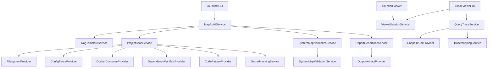

# Epic 1 Design Plan

> Status: Design Plan  
> Date: 2026-05-20  
> Scope: Epic 1 - RAG System Map Builder  
> Output: `docs/design/epic1.md`

## 1. Executive Summary

Epic 1 要建立 KAI-Mind 的第一個可交付核心能力：把一個既有 RAG 專案資料夾掃描成標準化、可追溯 evidence 的 `ai_system_map.json`，再輸出人類可讀的 `ai_system_map.md` 與互動式 RAG System Map Viewer。

設計方向是「deterministic scanner first, AI-assisted explanation second」。scanner 以 RAG reference architecture 的 component slot 為骨架，透過檔案、設定、Docker、dependency 與有限程式碼 pattern 產生 facts。LLM 或 local LLM 可以協助摘要、label、detail explanation，但不能創造沒有 evidence 的 component，也不能成為 JSON contract 的 source of truth。

本文件用途是交接給工程師實作 Epic 1。文件只做設計與規劃，不包含 production code。

## 2. Goals and Non-Goals

### Goals

- 建立 `rag-core-v1` reference architecture template。
- 建立穩定的 `ai-system-map/v1` JSON contract。
- 以 read-only scanner 掃描 project folder、config、Docker、dependency 與 RAG code signals。
- 偵測 RAG component slots：data source、loader、chunking、embedding、vector store、orchestrator、retriever、prompt builder、LLM、citation、guardrails、observability。
- 產出 evidence-based component instances、endpoints、risk hints 與 recommended next checks。
- 支援 `kai-mind map <project_path>` 輸出 JSON 與 Markdown。
- 支援 `kai-mind viewer <map_json>` 載入互動式 graph，並可點選 node / edge 查看 evidence。
- 支援 GUI filter，但套用 filter 時保留完整 graph，只高亮符合項目。
- 支援 query trace / replay MVP：找到 detected RAG endpoint 後呼叫一次，收集 basic trace 並映射到 slots / nodes / edges。
- 保持跨平台：Windows 與 macOS 的 evidence file path 一律輸出 project-relative POSIX path。

### Non-Goals

- 不做完整 runtime health check；留給 Epic 2。
- 不做完整 port security / secret scanning；留給 Epic 3。
- 不做 Agent tool policy 判斷；留給 Epic 4。
- 不做 RAG groundedness / citation correctness 評估；留給 Epic 5。
- 不做 `READY` / `RISKY` / `NOT_READY` gate verdict；留給 Epic 6。
- 不做完整 dashboard、graph editor、多架構自動 classifier 或企業級 observability 平台。
- 不讓 packaging / launcher 重複實作 core scanner logic。

## 3. Source Materials Reviewed

### Local project materials

- `AGENTS.md`
- `README.md`
- `docs/spec/draft/overview.md`
- `docs/spec/draft/epic1.md`
- `docs/spec/erm.dbml`
- `docs/spec/features/建立RAG系統地圖.feature`
- `docs/spec/features/檢視RAG系統地圖.feature`
- `docs/spec/features/重播RAG查詢軌跡.feature`
- `docs/spec/.clarify/overview.md`
- `docs/spec/.clarify/resolved/data/*.md`
- `docs/spec/.clarify/resolved/features/*.md`
- `docs/spec/prompts/4.design_prompt.md`

### Current repository state

目前 repo 主要是規格與設計資料；未發現 `src/`、`tests/`、`pyproject.toml` 或 `package.json` 等 implementation scaffold。`docs/design/epic1.md` 原本是空檔。以下設計因此以現有規格為 contract，提出建議模組邊界與落地順序，而不是描述已存在 production code。

### External references checked on 2026-05-20

- GitDiagram: https://github.com/ahmedkhaleel2004/gitdiagram
- GitDiagram DeepWiki overview: https://deepwiki.com/ahmedkhaleel2004/gitdiagram/1-overview
- Arize Phoenix: https://github.com/Arize-ai/phoenix
- Langfuse: https://langfuse.com/ and https://github.com/langfuse/langfuse
- OpenTelemetry GenAI semantic conventions: https://opentelemetry.io/docs/specs/semconv/gen-ai/
- OpenInference specification: https://arize-ai.github.io/openinference/spec/
- Gitingest: https://github.com/coderamp-labs/gitingest
- MorphArch: https://morpharch.dev/
- CodeMap: https://polprog.pl/pl/apps/CodeMap/

### Context7 queries

- LangChain docs: RAG pipeline signals around loaders, splitters, vector stores, retrievers, tools, agents and tracing.
- LlamaIndex docs: ingestion, readers, indexes, retrievers, query engines, workflow steps and observability.
- OpenTelemetry docs: traces, logs, spans, trace IDs, span IDs, context correlation and diagnostic event model.

## 4. Epic 1 Requirement Summary

Epic 1 的使用者輸入是一個既有 RAG project folder。輸出至少包含：

- `outputs/ai_system_map.json`
- `outputs/ai_system_map.md`
- Local RAG System Map Viewer

核心使用者場景：

- 使用者執行 `kai-mind map ./example-project`，得到 JSON 與 Markdown。
- project folder 不存在或不可讀時，操作失敗並輸出 `outputs/map-error.md`，不輸出正常 map。
- `outputs/` 已有舊檔時，產生 timestamped output directory，不能覆寫舊檔。
- config / docker-compose 解析失敗時，仍產生 partial System Map，並把 parse error 記錄成 evidence / risk hint。
- 使用者執行 `kai-mind viewer outputs/ai_system_map.json`，GUI 載入 graph。
- map JSON 不存在或格式無效時，GUI 啟動但顯示 error state，不顯示 graph。
- 使用者可以在 GUI 點選 node / edge，看 slot、status、evidence、risk hints 與 relationship。
- 使用者可以套用 filter；filter 只高亮符合項目，不隱藏其他 graph elements。
- 使用者可以輸入測試問題；若 map 中找不到 app API endpoint，顯示 `endpoint_not_found` 且不送出 query。
- query trace step error / timeout 時保留 partial replay，錯誤 step 高亮，detail panel 顯示 error。

成功標準：

- 每個 detected component 都有 slot、status、name、evidence。
- 沒有 evidence 的 slot 不得標示 detected。
- JSON 不包含 `confidence`。
- secret-like value 只可顯示前後少量字元，中間遮罩。
- evidence file path 使用 project-relative POSIX path。
- risk hint 必須有 target、target_type、evidence_id、rule_id、rationale、uncertainty。

## 5. Existing Architecture Analysis

現有文件定義的產品架構是：

```text
Core Engine + CLI
        |
        +-- Local Web UI
        +-- Windows launcher
        +-- macOS launcher
        +-- CI / GitHub Actions
```

這表示 Core Engine 應該獨立於 platform launchers。CLI、GUI、launcher 與未來 CI integration 都應呼叫同一組 core services，不應各自重寫 scanner logic。

### Provider-Service interpretation

目前 repo 尚未有實作，但 prompt 明確要求 Provider-Service 架構。本設計採用以下邊界：

- Provider：負責與外部或低階來源互動，例如 filesystem、config parser、Docker compose parser、dependency parser、HTTP endpoint caller、local LLM adapter。
- Service：負責 orchestration、domain rules、schema normalization、validation、report generation、trace mapping。
- Agent：Epic 1 不需要 autonomous agent。若使用 LLM，只是 bounded extraction / explanation helper，不能改變 scanner facts。
- API boundary：CLI 與 Local Web UI 都走 service-level use case，不直接呼叫 low-level providers。
- Data model：以 `docs/spec/erm.dbml` 為 contract source，產出 `ai-system-map/v1`。
- Config：第一版以 explicit CLI args + project config scan 為主，避免隱式全域設定造成不可重現。
- Logging / observability：記錄 scanner stage、file count、parse errors、evidence count、risk hint count、trace event count，不記錄 full secret。
- Error handling：區分 fatal precondition failure 與 partial scan failure。
- Testing：scanner 必須使用 sample projects / fixtures；schema contract 需要 snapshot 或 JSON schema validation。

## 6. Design Principles

- 資料結構先行：先定義 slot、evidence、endpoint、risk hint 與 trace event，再談圖形呈現。
- Rule-based scanner 優先：deterministic evidence 是 source of truth。
- 最小可用抽象：Provider-Service 是邊界，不是為了每個小函式建立 framework。
- read-only 預設：除輸出目錄外，不修改被掃描專案。
- schema 相容性：`schema_version` 必須明確，破壞性變更需要 migration note。
- evidence-based findings：所有 component、endpoint、risk hint 都要能回到來源檔案或解析錯誤。
- secret-safe by default：序列化、logs、Markdown、GUI、test snapshot 都必須走同一個 masker。
- partial failure 可診斷：解析錯誤不應讓整張 map 消失。
- local-first privacy：預設不把被掃描 repo 送到雲端 LLM。
- 漸進式交付：先穩定 core scanner 與 JSON，再做 Markdown、GUI、query trace。

## 7. Proposed Architecture

### High-level architecture



### Module boundaries

建議未來實作路徑：

- `src/kai_mind/core/models/`: domain models and DTOs。
- `src/kai_mind/core/providers/`: filesystem、parser、endpoint providers。
- `src/kai_mind/core/services/`: map build、normalization、validation、report、trace services。
- `src/kai_mind/core/templates/`: `rag-core-v1` reference architecture template。
- `src/kai_mind/cli/`: CLI commands，只做 argument parsing 與 use-case invocation。
- `src/kai_mind/web/`: Local Web UI / viewer adapter。
- `tests/fixtures/rag_projects/`: sample RAG projects。
- `tests/contracts/`: JSON schema / snapshot contract tests。

若團隊最後採 Node/TypeScript 而非 Python，仍應保留同樣邊界；路徑可對應到 `src/core/providers`、`src/core/services` 等。

### Data flow

```text
project_path
  -> validate readable directory
  -> create output run directory
  -> load rag-core-v1 template
  -> collect file inventory
  -> parse supported config / manifests / Docker files
  -> extract evidence facts
  -> map facts to RAG component slots
  -> derive endpoints and risk hints
  -> validate ai-system-map/v1
  -> write ai_system_map.json
  -> write ai_system_map.md
  -> viewer loads JSON
  -> optional query trace calls detected endpoint and maps events to slots
```

Dependency direction:

- CLI / GUI depend on services.
- Services depend on provider interfaces and models.
- Providers do not depend on CLI / GUI.
- Models do not depend on providers.
- Report generation reads normalized map; it does not rescan files.

## 8. Provider Design

| Provider | Responsibility | Input | Output | Errors | Tests |
|---|---|---|---|---|---|
| `FilesystemProvider` | read-only file inventory, bounded file reads, POSIX relative path normalization | project root, include patterns, ignore rules | file metadata, file contents for candidates | unreadable root is fatal; unreadable file is partial evidence | Windows/macOS path fixtures, symlink and permission fixtures |
| `ConfigParseProvider` | parse `.env`, YAML, JSON, TOML-like config when supported | candidate config files | structured key/value facts and parse-error facts | malformed file becomes parse_error evidence | malformed YAML/JSON, comments, empty values |
| `DockerComposeProvider` | parse compose services, ports, env, volumes, image names | compose files | service facts, port facts, endpoint hints | malformed compose becomes partial parse_error | Qdrant/Ollama/FastAPI compose fixtures |
| `DependencyManifestProvider` | parse `requirements.txt`, `pyproject.toml`, `package.json` | dependency manifests | dependency facts | malformed manifest is partial evidence | LangChain/LlamaIndex/Qdrant/Chroma/Ollama deps |
| `CodePatternProvider` | bounded scan for explicit RAG patterns in candidate files | selected source files | pattern facts with file/path/value | large/binary files skipped with reason | retriever, chunking, prompt, citation pattern fixtures |
| `EndpointCallProvider` | call detected app endpoint for query trace MVP | endpoint, query, timeout, optional method config | basic response trace event(s) | timeout/error becomes trace event error | mock HTTP server, timeout, non-JSON response |
| `LocalLlmProvider` | optional bounded extraction / wording helper | evidence facts and selected snippets | labels / explanations only | unavailable provider degrades gracefully | fake model provider, evidence-only constraints |
| `OutputArtifactProvider` | create output directory and write artifacts | map, markdown, errors | file paths | write failure is fatal after scan | existing outputs timestamp behavior |

Provider rules:

- Providers must not log full secrets.
- Providers must not mutate scanned project files.
- Providers return structured results; they do not decide final slot status.
- Provider parse failures must include scan stage, file and failure reason.

## 9. Service Design

| Service | Responsibility | Dependencies | Main output |
|---|---|---|---|
| `MapBuildService` | top-level `kai-mind map` use case orchestration | all scanner and report services | output artifact set |
| `ProjectScanService` | coordinate providers and aggregate raw facts | filesystem, config, compose, dependency, pattern providers | `ScanFact[]`, `ParseIssue[]` |
| `RagTemplateService` | load `rag-core-v1` slots, flows and requiredness rules | template store | `ReferenceArchitecture` |
| `ComponentDetectionService` | map facts to component slots and instances | template, scan facts | `ComponentSlot[]`, `ComponentInstance[]` |
| `EndpointDetectionService` | derive local/external endpoints from evidence | scan facts, masker | `Endpoint[]` |
| `RiskHintService` | create initial hints for exposure, external provider, parse errors | evidence, endpoints, components | `RiskHint[]` |
| `SystemMapNormalizeService` | merge, dedupe and assemble `RagSystemMap` | all domain outputs | normalized map |
| `SystemMapValidationService` | enforce schema invariants | JSON schema / model validators | validation result |
| `MarkdownSummaryService` | render `ai_system_map.md` from normalized map | map only | Markdown |
| `ViewerSessionService` | load map JSON and expose graph view model | map parser, validator | GUI graph model or error state |
| `QueryTraceService` | run query trace MVP and persist/display trace events | endpoint caller, mapper, masker | `QueryTraceEvent[]` |
| `TraceMappingService` | map basic response events to slots/edges | map, endpoint response | replay steps |
| `SecretMaskingService` | one canonical masking policy | none | masked strings |

Service rules:

- `ComponentDetectionService` cannot use `confidence`.
- `SystemMapValidationService` rejects detected slots with zero evidence.
- `MarkdownSummaryService` and GUI must consume already masked values.
- `QueryTraceService` must not send query if endpoint is missing.
- `RiskHintService` emits uncertainty when Epic 1 cannot prove true exposure severity.

## 10. Data Models and Contracts

Canonical contract is `ai-system-map/v1`, aligned with `docs/spec/erm.dbml`.

Required top-level fields:

- `schema_version`
- `system_type`
- `classification`
- `project`
- `reference_architecture`
- `components_by_slot`
- `endpoints`
- `flows`
- `risk_hints`
- `recommended_next_checks`
- `query_trace_events` when trace has been run

Important invariants:

- `system_type` is `rag` in Epic 1.
- `classification.mode` is `user_selected_or_default`.
- `classification.selected_template` is `rag-core-v1`.
- `ComponentSlot.status` is one of `detected`, `missing`, `not_configured`, `not_applicable`.
- `required_for_rag` is scanner-derived, not globally fixed.
- `Endpoint.endpoint_type` is `local` or `external`.
- `RiskHint.target_type` is `component_instance`, `endpoint` or `component_slot`.
- `QueryTraceEvent.sequence_index` controls replay order; `timestamp` records actual event time.
- `Evidence.file` uses project-relative POSIX path.
- Full secret values never appear in evidence, logs, Markdown, GUI or test snapshots.

Recommended JSON schema strategy:

- Keep a checked-in schema file, e.g. `schemas/ai-system-map.v1.schema.json`.
- Validate generated JSON before writing success artifacts.
- Use contract tests to detect accidental field removal, enum changes or unmasked secrets.
- Add migration notes before introducing `ai-system-map/v2`.

## 11. API and CLI Design

### CLI

```bash
kai-mind map <project_path> [--output outputs] [--system-type rag]
kai-mind viewer <map_json>
```

`map` behavior:

- Validate `project_path` is readable.
- If invalid, write `outputs/map-error.md` and exit non-zero.
- If output directory already contains prior artifacts, create timestamped subdirectory.
- On parse failures, continue and emit partial map with parse_error evidence.
- Exit zero only when valid JSON and Markdown artifacts are written.

`viewer` behavior:

- Starts Local Web UI session.
- If map JSON missing or invalid, UI shows an error state with `map_json` and `error_reason`.
- Graph is hidden when map cannot load.

### Local UI/API boundary

The UI should call a local service API or in-process adapter with these conceptual endpoints:

- `GET /map`: load current map graph view model.
- `POST /trace`: submit test query for query trace MVP.
- `GET /trace/{id}`: read replay events if trace results are persisted.

These are internal Local Web UI boundaries, not public cloud API contracts. They should remain thin adapters over `ViewerSessionService` and `QueryTraceService`.

### Versioning

- CLI output contract is governed by `schema_version`.
- CLI command names should stay stable after first release.
- Add new optional fields in v1 when possible.
- Rename/remove/enum changes require v2 or explicit migration documentation.

## 12. Error Handling and Fault Tolerance

Error classes:

- `PreconditionError`: project folder missing/unreadable; fatal for map generation.
- `OutputError`: cannot create or write output artifacts; fatal.
- `ParseError`: config / YAML / JSON / Docker parse issue; partial map allowed.
- `ScanLimitError`: file too large, binary, unreadable individual file; partial evidence.
- `ValidationError`: normalized map violates schema; fatal for success artifacts.
- `EndpointNotFoundError`: query trace cannot run; GUI shows `endpoint_not_found`.
- `TraceTimeoutError`: trace step records error; partial replay retained.
- `ProviderUnavailableError`: optional local LLM unavailable; deterministic scan continues.

Fault tolerance rules:

- Parse failures become evidence plus risk hints, not silent skips.
- Partial scan output must clearly mark uncertainty.
- Retry only for transient endpoint calls and optional LLM calls, with short bounded timeout.
- Do not retry filesystem reads indefinitely.
- Query trace failures must not discard prior map.
- Viewer invalid JSON must show error state instead of blank UI.

## 13. Observability and Logging

Epic 1 logging should be structured and low-volume:

- `scan_started`: project root, run id, schema version.
- `file_inventory_completed`: file counts by type, skipped counts.
- `provider_completed`: provider name, facts count, parse issues count, duration.
- `component_detection_completed`: detected / missing / not_configured / not_applicable counts.
- `risk_hint_created`: rule_id, target_type, severity_hint, evidence_id.
- `artifact_written`: artifact type and path.
- `viewer_map_load_failed`: map_json and error_reason.
- `query_trace_started`: endpoint id and trace id.
- `query_trace_step`: sequence_index, slot, latency, error presence.

Do not log:

- full secret values
- raw request body containing user query if it may include sensitive content, unless explicitly configured
- full retrieved chunks by default

OpenTelemetry / OpenInference / Phoenix / Langfuse inspired design:

- Use trace/span concepts for internal diagnostics even before integrating a backend.
- Keep trace IDs and span-like stage names in logs to correlate scanner stages.
- For future observability export, map query trace steps to GenAI/OpenInference-style span categories: retriever, vector store, LLM, tool, response.

## 14. Testing Strategy

### Unit tests

- Path normalization returns POSIX relative paths on Windows/macOS samples.
- Secret masker exposes only small prefix/suffix and masks middle.
- `ComponentDetectionService` maps known facts to expected slots.
- `RiskHintService` emits network exposure and external provider hints with uncertainty.
- `SystemMapValidationService` rejects `confidence`, invalid statuses and detected components without evidence.

### Integration tests

- `kai-mind map ./fixtures/basic-rag` writes JSON and Markdown.
- Existing output directory creates timestamped run directory.
- Missing project writes `map-error.md` and no normal map.
- Malformed compose yields partial map plus parse_error risk hint.
- Viewer invalid map shows error state.
- Query trace missing endpoint returns `endpoint_not_found`.
- Query trace timeout preserves partial replay with error event.

### Contract tests

- JSON schema validation for `ai-system-map/v1`.
- Golden snapshots for representative maps, with snapshot scanner asserting no full secret values.
- Markdown section presence tests.
- GUI graph view model contract tests for nodes, edges, filters and detail panel fields.

### Fixture strategy

Create small sample projects:

- `basic_qdrant_ollama_rag`: Docker compose with Qdrant/Ollama and Python RAG code.
- `openai_external_provider_rag`: `.env.example` and code using OpenAI embeddings.
- `malformed_config_rag`: invalid YAML/compose for partial map tests.
- `missing_slots_rag`: only README and data folder to test missing statuses.
- `viewer_invalid_map`: invalid JSON fixtures.

### Local LLM mock strategy

- Treat LLM helper as optional.
- Unit tests use fake provider returning deterministic labels.
- Contract tests verify disabling LLM produces the same JSON facts.

### Acceptance criteria

Epic 1 is acceptable when all feature examples in the three `.feature` files can be mapped to automated tests or documented manual UI checks.

## 15. Incremental Delivery Plan

| Milestone | Goal | Deliverables | Dependencies | Done when |
|---|---|---|---|---|
| M1 | Schema and template | `rag-core-v1`, JSON schema, core models | specs/ERM | schema tests pass |
| M2 | File inventory and parsers | filesystem, config, compose, dependency providers | M1 | fixtures produce raw facts |
| M3 | Component detection | slot mapping, endpoints, risk hints, normalization | M2 | JSON maps pass contract tests |
| M4 | CLI map artifacts | `kai-mind map`, output directory policy, Markdown | M3 | feature scenarios for map command pass |
| M5 | Viewer base | graph view model, load/error state, node/edge detail | M3 | viewer scenarios pass |
| M6 | Filters and interaction | highlight filters, zoom/pan/drag adapter | M5 | UI tests or visual QA pass |
| M7 | Query trace MVP | endpoint call, basic trace events, replay mapping | M5 | endpoint missing/timeout/success scenarios pass |
| M8 | Hardening | cross-platform tests, secret snapshot checks, docs | M1-M7 | release checklist passes |

建議依序完成 M1 到 M8。不要在 JSON contract 驗證前先啟動 GUI 開發，避免 viewer 反過來定義另一套資料模型。

## 16. 兩位工程師分工

| 項目 | 工程師 A | 工程師 B |
|---|---|---|
| 主要負責範圍 | Core scanner、schema、CLI | Viewer、graph UX、query trace UI/API |
| 主要交付物 | models、providers、services、JSON schema、`kai-mind map`、Markdown summary | `kai-mind viewer`、graph view model、detail panel、filters、query trace replay |
| 測試責任 | scanner 與 CLI 的 unit / integration / contract tests | UI / view-model tests、trace replay tests、error state tests |
| 共同介面 | `ai-system-map/v1`、graph view model DTO、`QueryTraceEvent` | 同左 |
| 協作邊界 | A 負責 facts 與 map normalization；B 不應在 viewer 重新掃描檔案 | B 負責呈現與互動；A 需要提供穩定 DTO |
| Code review 重點 | B review schema 是否足夠支援 GUI 與使用者理解 | A review evidence 完整性，以及是否重複實作 scanner logic |

建議開發順序：

1. A 定義 schema、template 與 sample fixtures。
2. B 使用靜態 fixtures，先依 schema 草擬 graph view model。
3. A 實作 scanner providers 與 map normalization。
4. B 實作 viewer 的 load、error、detail、filter 行為。
5. A 提供 endpoint detection contract。
6. B 使用 detected endpoint data 實作 query trace replay。
7. A 與 B 共同檢查 secret masking、schema stability 與跨平台 path 行為。

交叉 review 重點：

- A 檢查 viewer 不得推論 JSON 中不存在的新 component。
- B 檢查 JSON 是否有足夠 evidence 與 label 支援可用的 UI。
- A 與 B 都要檢查 logs、snapshots、Markdown、UI 不得出現完整 secret。
- A 與 B 都要確認 feature file scenarios 能追溯到測試或手動驗收項目。

## 17. Risks, Trade-offs, and Mitigations

| Risk | Type | Mitigation |
|---|---|---|
| Scanner misses uncommon RAG frameworks | technical | Start with explicit evidence and fixtures; add provider rules incrementally. |
| LLM-generated nodes pollute source of truth | architecture | LLM output cannot write components/endpoints/risk hints; JSON facts remain deterministic. |
| GUI pushes schema toward visual-only graph | architecture | Treat graph as projection of `ai_system_map.json`, not primary model. |
| Query trace endpoint contract unknown | requirements | MVP supports detected endpoint with configurable method/path later; missing endpoint is explicit error. |
| Full runtime trace becomes too large | scope | Proxy wrapper and trace hooks stay advanced; MVP stores bounded basic trace. |
| Network exposure hint overstates risk | release-readiness | Include `uncertainty` and defer final judgment to Epic 3. |
| Secret leakage via snapshots or UI | security | One masking service plus snapshot scanner tests. |
| Cross-platform path differences break contracts | compatibility | POSIX relative evidence paths; preserve original root only in `Project.root_path`. |
| Output overwrites prior scan | usability | Timestamped output directory when outputs already exist. |
| Provider-Service over-engineering | maintainability | Keep providers coarse-grained and focused on external boundaries, not every rule. |
| JSON schema changes break later epics | compatibility | Contract tests, schema versioning, migration notes. |

## 18. Open Questions

Assumptions:

- Epic 1 implementation language is not fixed by current repo. The design is language-neutral but examples assume Python-like package names because scanner and CLI fit Python well.
- Local Web UI can be a lightweight local server or embedded frontend; exact framework is not yet chosen.
- Query trace MVP will need either a default endpoint convention or user-configurable endpoint path once real sample projects exist.
- `required_for_rag` is scanner-derived, so the first implementation must define conservative heuristics per fixture.
- Local LLM support is optional for Epic 1 JSON correctness.

Open questions:

- Should `kai-mind map` expose `--endpoint` or `--trace-endpoint` in Epic 1, or should query trace be configured only in GUI?
- Should `ai_system_map.md` include parse errors in a dedicated section or only under risk hints?
- What is the maximum file size and total scan size for Epic 1 default mode?
- Should source snippets be included in evidence, or only file/path/value to reduce secret leakage risk?
- Which UI stack should be selected for the first Local Viewer implementation?
- Should generated maps preserve absolute `Project.root_path` in CI artifacts, or support a redacted root path option?

## 19. References and Inspirations

- GitDiagram inspired the staged repo-to-graph flow: collect file tree/README, filter noisy files, generate structured graph, validate paths, render interactive diagram. KAI-Mind should adopt staged validation and clickable evidence paths, but not GitDiagram's LLM-first architecture understanding as source of truth.
- Gitingest inspired simple local/remote repo ingestion and prompt-friendly file filtering. KAI-Mind should borrow file selection discipline, not text-dump-only output.
- MorphArch and CodeMap support the idea that large codebase maps need clustering, focused navigation and local-first processing. Epic 1 should keep graph navigation usable and avoid raw graph chaos.
- LangChain and LlamaIndex docs confirm common RAG signals: document loaders/readers, text splitters, vector stores/indexes, retrievers/query engines, tools, prompts and LLM calls. These become scanner patterns and fixture examples.
- Phoenix, Langfuse, OpenInference and OpenTelemetry inform the trace/event model: use trace IDs, span-like stages, structured logs and replayable LLM/RAG events. Epic 1 should only implement basic trace replay, not a full observability platform.
- OpenTelemetry GenAI semantic conventions are still marked development/experimental, so Epic 1 should align conceptually but avoid making those conventions a hard public contract yet.
