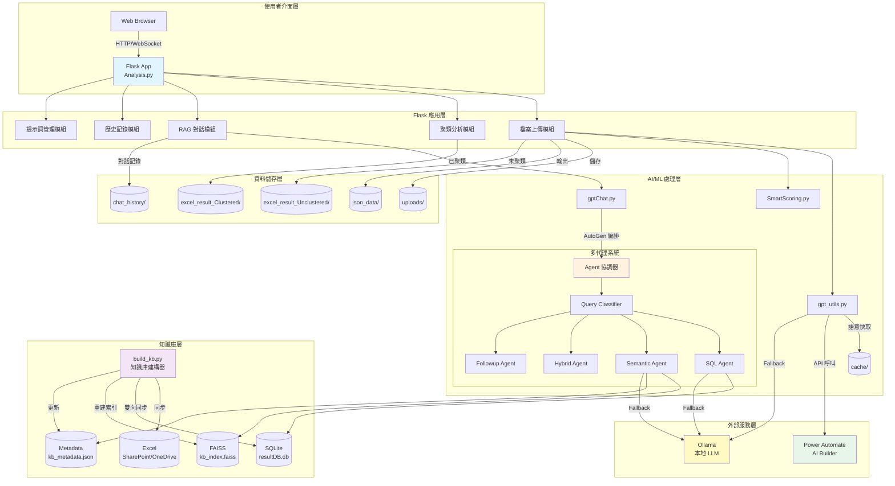

# 系統架構圖 (System Architecture)

## 圖表說明

### 使用者介面層
- **Web Browser**: 使用者透過瀏覽器訪問系統
- 支援 HTTP 請求和 WebSocket 即時通訊

### Flask 應用層 (Analysis.py)
- **檔案上傳模組**: 處理 Excel 上傳與分析
- **聚類分析模組**: 執行 KMeans/HDBSCAN 聚類
- **RAG 對話模組**: 處理智能問答
- **歷史記錄模組**: 管理分析歷史
- **提示詞管理模組**: 自訂 GPT 提示詞

### AI/ML 處理層
- **gpt_utils.py**: AI 工具集，包含語意快取
- **SmartScoring.py**: 風險評分與關鍵字抽取
- **gptChat.py**: RAG 編排中樞，協調多代理系統

### 多代理系統 (AutoGen)
- **Query Classifier**: 分類查詢意圖
- **SQL Agent**: 處理結構化查詢
- **Semantic Agent**: 處理語意搜尋
- **Hybrid Agent**: 處理混合查詢
- **Followup Agent**: 處理追問查詢

### 知識庫層
- **build_kb.py**: Excel ↔ SQLite ↔ FAISS 三向同步
- **SQLite**: 結構化資料儲存
- **FAISS**: 向量索引檢索
- **Metadata**: 結構化 metadata

### 外部服務層
- **Power Automate AI Builder**: 雲端 LLM (優先)
- **Ollama**: 本地 LLM (fallback)

### 資料儲存層
- **uploads/**: 原始上傳檔案
- **json_data/**: JSON 格式分析結果
- **excel_result_Unclustered/**: 未聚類 Excel
- **excel_result_Clustered/**: 已聚類 Excel
- **chat_history/**: 對話記錄
