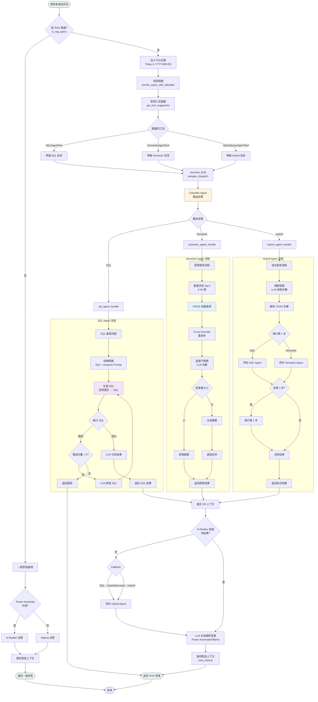

# RAG 對話流程 (RAG Chat Flow)



## 流程說明

### 1. RAG 問題判斷
- **判斷邏輯**：
  ```python
  if is_rag_query_via_powerautomate(message):
      # 進入 RAG 流程
  else:
      # 一般對話處理
  ```
- **判斷標準**：
  - 需要查詢知識庫？→ RAG
  - 一般閒聊、問候？→ 一般對話

### 2. 問題改寫
- **目的**：
  - 標準化問題格式
  - 補充時間資訊
  - 結構化查詢條件
- **範例**：
  ```
  原始: 最近一個月 Teams 問題
  改寫: Please list the Teams-related incidents in the past month.
  ```

### 3. 工具選擇
- **AI Builder 預先建議**：
  - 分析問題類型
  - 建議最適合的代理
- **選擇邏輯**：
  - 統計查詢 → SQL Agent
  - 語意搜尋 → Semantic Agent
  - 複雜多步驟 → Hybrid Agent

### 4. AutoGen 多代理協作
- **Classifier Agent**：
  - 接收工具建議
  - 最終路由決策
  - 呼叫對應代理

### 5. SQL Agent 處理
- **自動錯誤修復**：
  - 捕獲 SQL 執行錯誤
  - LLM 分析錯誤原因
  - 重新生成正確 SQL
  - 最多重試 5 次

### 6. Semantic Agent 處理
- **動態 top-k**：
  - LLM 預測需要檢索的文件數
  - 範圍：3-50 筆
  - 依查詢具體程度調整
- **重排序機制**：
  - FAISS 初步檢索
  - Cross-Encoder 精確重排
  - LLM 過濾不相關內容
- **遞迴摘要**：
  - 結果集過大時分段處理
  - 每段獨立摘要
  - 遞迴合併成最終摘要

### 7. Hybrid Agent 處理
- **管線規劃**：
  ```json
  [
    {"tool": 1, "prompt": "Filter incidents by location..."},
    {"tool": 2, "prompt": "Find similar cases in filtered set..."}
  ]
  ```
- **步驟執行**：
  - 依序執行每個步驟
  - 前一步結果傳遞給下一步
  - 最後合併所有結果

### 8. Fallback 機制
- **觸發條件**：
  - AI Builder 判斷無有效結果
  - 查詢失敗
- **Fallback 策略**：
  - SQL Agent 無結果 → 切換 Hybrid Agent
  - Semantic Agent 無結果 → 切換 Hybrid Agent
  - 確保使用者得到最佳答案

### 9. 答案合成
- **Context 組合**：
  ```
  Knowledge Base Entries:
  [檢索到的知識庫內容]

  User Question:
  [使用者問題]
  ```
- **LLM 合成**：
  - Power Automate (優先)
  - Ollama (fallback)
  - 生成人類可讀的答案

### 10. 對話記錄
- **儲存位置**：`chat_history/{chatId}.json`
- **記錄內容**：
  - 使用者問題
  - 系統回答
  - 查詢類型
  - 過濾條件
  - 結果摘要
