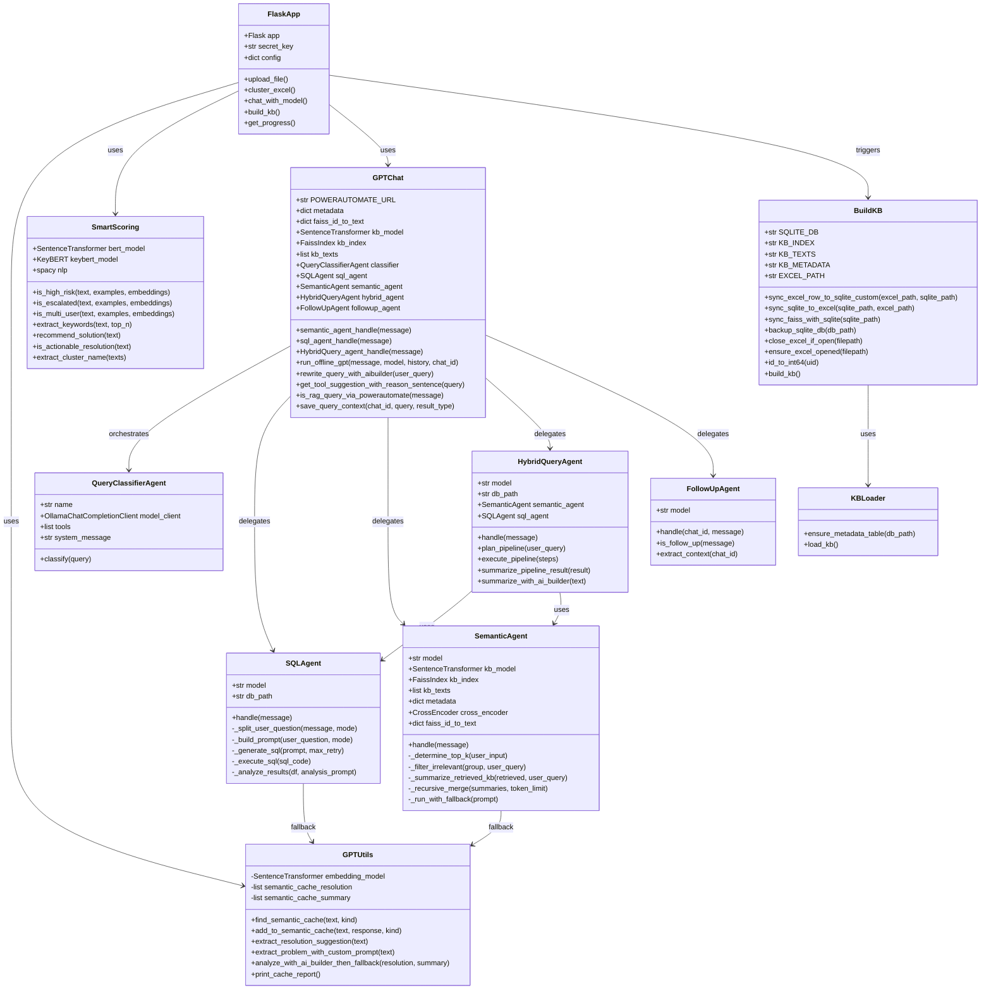

# UML 類別圖 (Class Diagram)

## 類別說明

### FlaskApp (Analysis.py)
**職責**：Web 應用程式主控制器
- 處理所有 HTTP 路由
- 協調各模組運作
- 管理 session 與進度追蹤

**主要方法**：
- `upload_file()`: 處理檔案上傳與分析
- `cluster_excel()`: 執行聚類分析
- `chat_with_model()`: 處理 RAG 對話
- `build_kb()`: 觸發知識庫建構
- `get_progress()`: 查詢處理進度

### GPTUtils
**職責**：AI 工具集與快取管理
- 語意快取機制 (SHA-256 + Cosine)
- LLM 呼叫與 fallback
- 摘要與解決方案抽取

**快取機制**：
- `resolution`: 解決方案快取
- `summary`: 問題摘要快取
- 閾值：0.92 (cosine 相似度)
- 上限：3000 條/檔案

### SmartScoring
**職責**：風險評估與語意分析
- 高風險偵測 (語意相似度)
- 升級處理判斷
- 多人影響偵測
- 關鍵字抽取 (KeyBERT)
- 解決方案有效性檢查

**模型**：
- BERT: `paraphrase-MiniLM-L6-v2`
- spaCy: `en_core_web_sm`
- KeyBERT: 自動關鍵字抽取

### GPTChat
**職責**：RAG 編排中樞
- AutoGen 多代理協調
- 查詢重寫與分類
- 工具選擇建議
- 對話上下文管理

**代理編排**：
- Classifier Agent: 路由決策
- SQL/Semantic/Hybrid/Followup: 專業代理

### BuildKB
**職責**：知識庫建構與同步
- Excel ↔ SQLite 雙向同步
- FAISS 索引重建
- COM 自動化 (Excel)
- 自動備份

**同步邏輯**：
1. Excel → SQLite (增量)
2. SQLite → Excel (補寫)
3. SQLite → FAISS (重建索引)

### QueryClassifierAgent
**職責**：查詢分類路由
- 接收工具建議
- 最終路由決策
- 呼叫對應代理

**工具清單**：
- SQLAgentTool
- SemanticAgentTool
- HybridQueryAgentTool

### SQLAgent
**職責**：結構化查詢處理
- 自然語言 → SQL
- 自動錯誤修復 (最多 5 次)
- Pandas 進階篩選
- 結果分析與摘要

**模型**：`deepseek-coder-v2:latest`

### SemanticAgent
**職責**：語意搜尋與摘要
- FAISS 向量檢索
- Cross-Encoder 重排序
- 動態 top-k (3-50)
- 遞迴分段摘要

**模型**：
- Encoder: `all-MiniLM-L6-v2`
- Cross-Encoder: `ms-marco-MiniLM-L-6-v2`
- LLM: `orca2:13b`

### HybridQueryAgent
**職責**：混合查詢處理
- 多步驟管線規劃
- SQL + Semantic 串接
- 結果合併與摘要

**管線類型**：
- SQL → Semantic: 先過濾後搜尋
- Semantic → SQL: 先搜尋後聚合

### FollowUpAgent
**職責**：追問查詢處理
- 上下文感知
- 對話歷史分析
- 查詢擴展

### KBLoader
**職責**：知識庫載入
- 初始化資料表
- 載入 FAISS 索引
- 載入 metadata
- 載入文字語料

## 類別關係

### 組合關係 (Composition)
- `GPTChat` 組合 `QueryClassifierAgent`, `SQLAgent`, `SemanticAgent`, `HybridQueryAgent`, `FollowUpAgent`
- `HybridQueryAgent` 組合 `SQLAgent`, `SemanticAgent`

### 依賴關係 (Dependency)
- `FlaskApp` 依賴 `GPTUtils`, `SmartScoring`, `GPTChat`, `BuildKB`
- `SemanticAgent`, `SQLAgent` 依賴 `GPTUtils` (fallback)
- `BuildKB` 依賴 `KBLoader`

### 使用關係 (Usage)
- `FlaskApp` 觸發 `BuildKB.build_kb()`
- `GPTChat` 協調所有代理
- 代理之間可互相呼叫 (Hybrid 模式)
