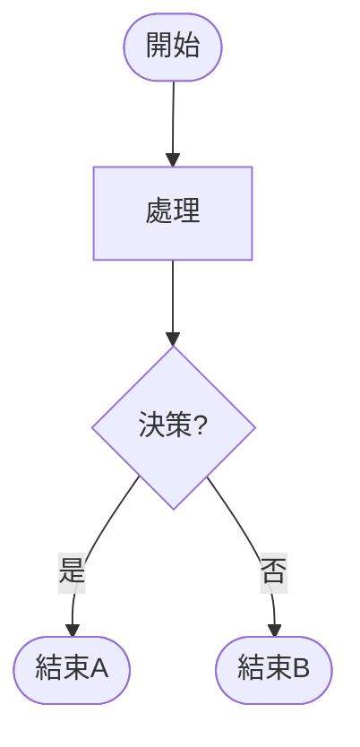
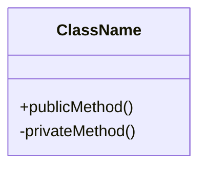
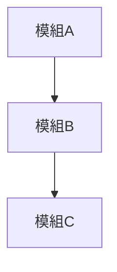

# 系統流程與架構文件 (System Flow & Architecture)

**版本**: 1.0.0
**最後更新**: 2025-10-30
**語言**: 繁體中文 + Mermaid 圖表

---

## 📋 目錄概覽

本目錄包含 **IT Ticket System** 的核心流程圖和架構設計文件,使用 Mermaid 語法繪製,可在 Markdown 編輯器、GitHub、或 Mermaid Live Editor 中查看。

---

## 📁 文件清單

### 1. [系統架構圖](./1-system-architecture.md)
**檔案**: `1-system-architecture.md`
**類型**: 📐 Architecture Diagram
**閱讀順序**: ⭐ 第一個閱讀

#### 內容概述
- 🏗️ **系統分層架構** (4 層)
  - 使用者介面層 (Web Browser)
  - Flask 應用層 (Analysis.py)
  - AI/ML 處理層 (GPT, SmartScoring)
  - 資料儲存層 (SQLite, FAISS, Excel)

- 🔗 **模組關係**
  - 上傳模組 ↔ GPT Utils ↔ 語意快取
  - 聚類模組 ↔ SmartScoring ↔ Embedding 模型
  - RAG 模組 ↔ AutoGen ↔ 多 Agent 系統
  - 知識庫模組 ↔ FAISS Index ↔ SQLite

- 🎯 **數據流向**
  - HTTP 請求路徑
  - AI 處理管線
  - 快取機制
  - Fallback 策略 (Power Automate → Ollama)

#### 適合讀者
- 新加入的開發者 (必讀)
- 架構設計師
- 技術主管

#### 關鍵洞察
```
系統採用 "雲端優先 + 本地備援" 策略:
1. 優先呼叫 Power Automate AI Builder (雲端)
2. 失敗則 Fallback 到 Ollama (本地)
3. 使用 FAISS 向量搜尋加速查詢
4. 語意快取減少 AI 呼叫成本
```

---

### 2. [檔案上傳與分析流程](./2-upload-flow.md)
**檔案**: `2-upload-flow.md`
**類型**: 🔄 Flowchart
**閱讀順序**: 第二個閱讀

#### 內容概述
- 📤 **上傳流程** (10+ 步驟)
  1. 檔案驗證 (格式、大小)
  2. Excel 解析 (pandas)
  3. 欄位提取 (優先順序合併)
  4. 語意快取檢查 (避免重複 AI 呼叫)
  5. AI 分析 (Power Automate / Ollama)
  6. 快取儲存 (embedding + response)

- 🎯 **風險評分流程**
  - 高風險關鍵字偵測 (火災、電氣、安全)
  - 升級處理偵測 (多人影響、緊急程度)
  - 可執行性評估
  - 推薦解決方案

- 💾 **輸出與儲存**
  - Excel 結果檔案 (excel_result_Unclustered/)
  - JSON 資料 (json_data/)
  - 進度記錄 (即時更新)

#### 流程圖重點
```mermaid
上傳 → 驗證 → 解析 → 快取? → AI 分析 → 風險評分 → 儲存
         ↓               ↓        ↓           ↓
       失敗返回         命中    Power Auto   高/低風險
                                  ↓
                              Ollama (備援)
```

#### 關鍵決策點
1. **快取命中率**: 相似度 > 0.92 則使用快取
2. **AI 選擇**: Power Automate 可用性決定使用雲端或本地
3. **風險閾值**: 高風險分數 > 0.7 標記為高風險

#### 效能指標
- 快取命中: ~40-60% (隨使用量增加)
- AI 回應時間: Power Automate ~5-10s, Ollama ~3-8s
- 單筆資料處理: ~10-15s (含 AI)

---

### 3. [聚類分析流程](./3-clustering-flow.md)
**檔案**: `3-clustering-flow.md`
**類型**: 🔄 Flowchart
**閱讀順序**: 第三個閱讀

#### 內容概述
- 🗂️ **聚類方法**
  - **KMeans** (基於距離的分群)
    - 自適應 K 值選擇
    - 標準差門檻: > 3.0
    - 最小樣本數: 4 筆
  - **HDBSCAN** (基於密度的分群)
    - 自動偵測群組數量
    - 適合異常值偵測

- 🤖 **AI 分類流程**
  1. 依 configurationItem 分組
  2. 載入分類記憶 (data/sentences/)
  3. AI 分類器決定 category
  4. 更新記憶檔案 (新分類自動學習)
  5. 群組命名 (AI 生成描述性名稱)

- 📊 **報表生成**
  - Excel 格式化 (顏色編碼、表格樣式)
  - Summary 工作表 (統計資訊)
  - 同步到 SharePoint/OneDrive (可選)

#### 流程決策樹
```
掃描檔案 → 遍歷資料 → 載入記憶 → AI 分類
                           ↓
                    新分類? → 學習記憶
                           ↓
                    聚類分析 (KMeans/HDBSCAN)
                           ↓
                    群組命名 (AI)
                           ↓
                    Excel 輸出 + 同步
```

#### 分類記憶機制
- **檔案位置**: `data/sentences/{config_item}_categories.json`
- **格式**: `["類別1", "類別2", ...]`
- **學習**: 每次新分類自動加入記憶
- **好處**: 隨使用越來越準確

#### 聚類演算法選擇
```python
if 資料標準差 > 3.0 and 樣本數 >= 4:
    使用 KMeans
else:
    使用 HDBSCAN (更適合小樣本或異常值多的情況)
```

---

### 4. [RAG 對話流程](./4-rag-chat-flow.md)
**檔案**: `4-rag-chat-flow.md`
**類型**: 🔄 Complex Flowchart
**閱讀順序**: 第四個閱讀 (最複雜)

#### 內容概述
- 💬 **RAG (Retrieval-Augmented Generation) 架構**
  - 查詢分類 (RAG 問題 vs 一般對話)
  - 問題改寫 (添加日期、明確化意圖)
  - 工具建議 (SQL / Semantic / Hybrid)
  - AutoGen 多 Agent 協調

- 🤖 **Multi-Agent 系統** (5 個 Agent)
  1. **Query Classifier** - 路由決策
  2. **SQL Agent** - 自然語言 → SQL 查詢
  3. **Semantic Agent** - FAISS 向量搜尋
  4. **Hybrid Agent** - 混合查詢 (SQL + Semantic)
  5. **Follow-up Agent** - 上下文追問

- 🔍 **三種查詢模式**

  **SQL Mode** (結構化查詢):
  ```
  使用者: "過去一週有多少張高風險單?"
  → SQL Agent: SELECT COUNT(*) FROM tickets WHERE risk='high' AND date > ...
  → 結果: "共 15 張高風險單"
  ```

  **Semantic Mode** (語意搜尋):
  ```
  使用者: "網路斷線問題怎麼解決?"
  → Semantic Agent: FAISS 向量搜尋 → Top-K 相似案例
  → LLM 綜合: "根據歷史案例,建議先檢查..."
  ```

  **Hybrid Mode** (混合查詢):
  ```
  使用者: "本月 Windows 更新失敗的案例有哪些解決方案?"
  → Step 1: SQL 篩選本月 Windows 相關案例
  → Step 2: Semantic 搜尋更新失敗的解決方案
  → 結果: 綜合分析報告
  ```

#### AutoGen 協調流程
```mermaid
使用者查詢 → Query Classifier (分析意圖)
                     ↓
         ┌───────────┼───────────┐
         ↓           ↓           ↓
    SQL Agent  Semantic Agent  Hybrid Agent
         ↓           ↓           ↓
    執行 SQL     FAISS 搜尋    多步驟管線
         ↓           ↓           ↓
         └───────────┼───────────┘
                     ↓
            LLM 生成最終回答
                     ↓
            Follow-up Agent (追問處理)
```

#### 知識庫結構
- **SQLite** (`resultDB.db`): 結構化資料 (ID, text, category, location, date)
- **FAISS** (`kb_index.faiss`): 向量索引 (384 維 embedding)
- **Metadata** (`kb_metadata.json`): ID 映射與元資料

#### RAG 優化策略
1. **Cross-Encoder Re-ranking** - 二次排序提升精準度
2. **Dynamic Top-K** - 根據相似度動態調整結果數量 (3-20)
3. **Recursive Summarization** - 大量結果遞迴摘要
4. **Context Window Management** - 智能管理 LLM 上下文長度

#### 對話上下文管理
- **儲存位置**: `chat_history/{session_id}.json`
- **保留筆數**: 最近 10 輪對話
- **用途**: Follow-up Agent 理解追問意圖

---

### 5. [UML 類別圖](./5-class-diagram.md)
**檔案**: `5-class-diagram.md`
**類型**: 📊 UML Class Diagram
**閱讀順序**: 第五個閱讀 (了解程式碼結構)

#### 內容概述
- 🏛️ **核心類別與模組**
  - **FlaskApp** - Web 應用主程式
  - **GPTUtils** - AI 呼叫與快取管理
  - **SmartScoring** - 風險評分與推薦
  - **KBBuilder** - 知識庫建構與同步
  - **RAGSystem** - 多 Agent RAG 系統

- 🔗 **類別關係**
  - 繼承 (Inheritance)
  - 組合 (Composition)
  - 依賴 (Dependency)
  - 關聯 (Association)

- 📦 **主要屬性與方法**
  - 公開方法 (+)
  - 私有方法 (-)
  - 類別變數
  - 實例變數

#### 類別分層
```
Flask Layer:
  └─ FlaskApp (路由與請求處理)

Service Layer:
  ├─ GPTUtils (AI 服務)
  ├─ SmartScoring (評分服務)
  └─ KBBuilder (知識庫服務)

Agent Layer:
  ├─ QueryClassifier
  ├─ SQLAgent
  ├─ SemanticAgent
  ├─ HybridAgent
  └─ FollowupAgent

Data Layer:
  ├─ SQLite (結構化儲存)
  ├─ FAISS (向量索引)
  └─ JSON (快取與設定)
```

#### 關鍵設計模式
1. **Singleton** - 模型載入 (避免重複載入)
2. **Factory** - Agent 創建
3. **Strategy** - AI 提供者選擇 (Power Automate / Ollama)
4. **Observer** - 進度更新通知
5. **Cache Aside** - 語意快取

---

## 🎯 閱讀路徑建議

### 新手路徑 (第一次閱讀)
```
1. 系統架構圖 (理解整體結構)
   ↓
2. 檔案上傳流程 (理解核心功能)
   ↓
3. 聚類分析流程 (理解數據處理)
   ↓
4. RAG 對話流程 (理解 AI 查詢)
   ↓
5. UML 類別圖 (理解程式碼組織)
```

### 開發者路徑 (實作功能)
```
根據需求選擇對應文件:
- 修改上傳邏輯 → 2-upload-flow.md
- 優化聚類 → 3-clustering-flow.md
- 擴展 RAG → 4-rag-chat-flow.md
- 重構代碼 → 5-class-diagram.md + 1-system-architecture.md
```

### 維護者路徑 (Debug / 問題排查)
```
1. 根據錯誤位置找到對應流程圖
2. 追蹤數據流向
3. 檢查決策點的條件
4. 查看 fallback 機制
5. 參考類別圖確認依賴關係
```

---

## 🔧 如何使用這些文件

### 在 Markdown 編輯器中查看
推薦工具:
- **VSCode** + Mermaid Preview 插件
- **Obsidian** (原生支援)
- **Typora** (即時渲染)
- **Mermaid Live Editor** (線上工具: https://mermaid.live)

### 在 GitHub 上查看
GitHub 原生支援 Mermaid 渲染,直接開啟 `.md` 檔案即可。

### 導出為圖片
```bash
# 使用 mermaid-cli
npx -p @mermaid-js/mermaid-cli mmdc -i 1-system-architecture.md -o output.png

# 或在 Mermaid Live Editor 中導出 PNG/SVG
```

### 嵌入到文檔或簡報
1. 複製 mermaid 代碼區塊
2. 貼到支援 mermaid 的平台
3. 或導出為圖片後插入

---

## 📐 Mermaid 語法快速參考

### 流程圖 (Flowchart)


### 類別圖 (Class Diagram)


### 架構圖 (Graph)


**完整語法**: https://mermaid.js.org/intro/

---

## 🔄 文件更新流程

### 何時需要更新
- ✅ 新增功能或模組
- ✅ 修改關鍵流程邏輯
- ✅ 改變架構設計
- ✅ 發現文件與實際不符

### 如何更新
1. **修改對應的 `.md` 文件**
2. **更新 mermaid 圖表代碼**
3. **驗證渲染效果**
4. **更新本 README** (如果影響概覽)
5. **Git 提交** (commit message 註明變更)

### 版本管理
遵循 Git 版本控制,每次更新包含:
- 修改日期
- 變更原因
- 影響範圍

---

## 📚 相關文檔連結

### 專案核心文檔
- **主要說明**: [`/CLAUDE.md`](../../CLAUDE.md) - 專案總覽與使用指南
- **專案結構**: [`/README.md`](../../README.md) - 專案簡介
- **改進計畫**: [`/docs/improve/README.md`](../improve/README.md) - 程式碼改進路線圖

### Agent 相關文檔
- **Agent 架構**: `/agents/README.md`
- **SQL Agent**: `/agents/sql_agent.py`
- **Semantic Agent**: `/agents/semantic_agent.py`
- **Hybrid Agent**: `/agents/hybridquery_agent.py`

### 執行記錄
- **進度追蹤**: `/docs/schedule/`
- **改進報告**: `/docs/schedule/report/`

---

## 💡 常見問題 (FAQ)

### Q1: 為什麼使用 Mermaid 而不是 draw.io 或 Visio?
**A**: Mermaid 的優勢:
- ✅ 文字格式,易於版本控制
- ✅ GitHub 原生支援
- ✅ 可程式化生成
- ✅ 與 Markdown 無縫整合
- ✅ 免費開源

### Q2: 圖表渲染不出來怎麼辦?
**A**: 檢查清單:
1. Markdown 編輯器是否支援 Mermaid?
2. 代碼區塊是否正確使用 ` ```mermaid` ?
3. 語法是否有錯誤? (檢查括號、箭頭)
4. 嘗試在 [Mermaid Live Editor](https://mermaid.live) 中驗證

### Q3: 流程圖與實際代碼不一致怎麼辦?
**A**: 優先順序:
1. **代碼為準** - 實際運行邏輯才是真相
2. **更新文檔** - 發現不一致立即更新
3. **提交 Issue** - 記錄發現的問題

### Q4: 如何貢獻新的流程圖?
**A**: 步驟:
1. Fork 專案或建立新分支
2. 建立新的 `.md` 文件
3. 使用 Mermaid 語法繪製圖表
4. 更新本 README 加入新文件說明
5. 提交 Pull Request

---

## 🎓 學習資源

### Mermaid 學習
- **官方文檔**: https://mermaid.js.org/
- **線上編輯器**: https://mermaid.live
- **範例集**: https://mermaid.js.org/syntax/examples.html
- **VSCode 插件**: Mermaid Preview

### 系統設計學習
- **Martin Fowler - Architecture Patterns**: https://martinfowler.com/architecture/
- **C4 Model**: https://c4model.com/
- **UML 規範**: https://www.uml.org/

---

## 📝 更新日誌

### 2025-10-30 - v1.0.0 (Initial Release)
- ✅ 建立完整的 README 文件
- ✅ 詳細說明 5 個核心流程圖
- ✅ 添加閱讀路徑建議
- ✅ 提供 Mermaid 語法參考
- ✅ 建立 FAQ 和學習資源

### 未來計劃
- 🔄 添加互動式 HTML 版本
- 🔄 建立動畫演示
- 🔄 整合 API 文檔
- 🔄 添加效能指標圖表

---

## 📞 維護與支援

### 文檔維護者
**團隊**: 開發團隊
**審查頻率**: 每次重大功能更新後
**聯絡方式**: 見專案主文檔

### 回饋與建議
如果您發現:
- 🐛 文檔錯誤或不一致
- 💡 改進建議
- 📊 缺少的流程圖
- ❓ 需要澄清的內容

請透過以下方式回饋:
1. 提交 GitHub Issue
2. 直接修改並提交 PR
3. 聯絡專案維護者

---

**感謝您閱讀本文檔!希望這些流程圖能幫助您快速理解系統架構。** 🎉

---

**文檔版本**: 1.0.0
**建立日期**: 2025-10-30
**最後更新**: 2025-10-30
**維護者**: Development Team
