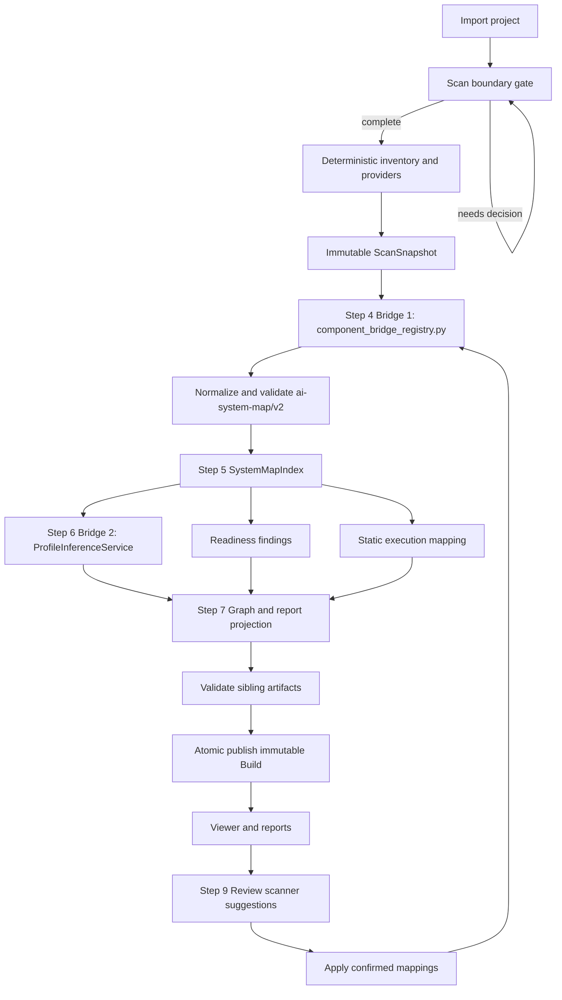

**對齊註記（2026-07-07）**：自 2026-07-07 起，UA 整合決策以 `docs/design/epic1-phase2.md` 與 `ref-opensource/systograph-understand-anything-integration-boundary.md` 為準；本 draft 未逐句同步。

> **初始想法（draft note）**
>
> Phase 1 一開始的想法，是把掃進來的 repo 分成各種 RAG 類型再對照模板；後來發現這樣
> 不可行——同一個 repo 可能同時有 graph RAG、hybrid retrieval、agent loop 等特徵，硬
> 分類反而會誤導。Phase 2 改成用固定的 **10 個 plane / 52 個 reference component**
> 當共同底圖：不管進來的是傳統 RAG、Graph RAG、advanced RAG，還是 2026 常見的
> agentic RAG，都盡量 overlay 到對應 plane 裡的 component，用 evidence 說明「掃到了
> 什麼、還不確定什麼」，而不是先判「這是哪一種 RAG」。
>
> 這裡要講清楚 scope：目前**不是**要做完整的 AI agent system 分類器——雖然 plane 裡有
> `agent_loop`、`planner` 等節點，看起來很像，但 Phase 2 的目標主要是讓 release-readiness
> 不只看得懂 graph RAG / advanced RAG 這類傳統 RAG，也能辨識 **agentic RAG** 的控制流、
> tool routing、multi-step retrieval 等能力訊號；完整 agent platform 判斷留到之後。
>
> 掃描流程仍是 **deterministic facts first**：AST / regex / config parser 先抽結構性
> facts。Step 3 的 scan TOML / providers 只產 raw `facts[]` 與 `evidence[]`；
> Step 4 用 Python `component_bridge_registry.py` 把 `rule_id + evidence` 分流成
> repo component、`unmapped_components[]` 或 non-baseline candidate input；Step 6
> 才由 Python `ProfileInferenceService` 把 validated repo facts 對位到 10 planes / 52
> reference nodes，產生五態 assessment、profiles 與 Mapping Completeness。TOML
> 主要管 label、說明、legend、座標與「掃不到時要顯示什麼文字」這類 metadata；
> **可執行的判定、component bridge、五態 assessment、coverage gate 留在 Python**，
> 避免 catalog 變成黑箱 DSL。Risk hint 同樣走 TOML 定義文案與 pattern 邊界，由
> `RiskHintService` 產出 evidence-backed findings。
>
> 掃完後 backend 會把 canonical map、capability assessment、readiness、risk hints，
> 以及 static execution（call graph / dataflow hints / execution paths）投影成 frontend
> 需要的 payload。Frontend **只渲染 backend projection**，用不同視角（topology、
> capability overlay、data / control / governance lens 等）看同一套 build 的架構與
> 資料流，自己不算 status 或 completeness。
>
> 下面這份文件是把 `phase2/` plans、contract 與 code baseline 整合後的設計基準，用來
> 重新產生 implementation plans；細節、ownership 與 cutover gate 以後續章節為準。

# Epic 1 Phase 2 Design：Evidence-backed AI System Release Readiness

Status: proposed design baseline for plan regeneration; pending user review

Implementation status: planned target; this document does not claim that the target is implemented

Owner: Timmy

Audience: backend、frontend、QA、reviewer、plan author

Last reviewed against Phase2 plan folder: 2026-07-06

## 1. 文件目的

本文件是重新產生 Epic 1 Phase 2 implementation plans 的設計基準。它整合：

- `docs/work/Timmy/schedule/plan/unfinish/phase2/` 目前全部 25 份文件；
- `docs/MODEL-CONTRACT.md` 與 `docs/API-GUIDE.md` 的 2026-07-06 superseding contract；
- 現行 source code、schemas 與 tests 所能證明的 runtime 狀態；
- 已確認的 Capability Map、五態 assessment、Apply、build lineage 與 local JSON persistence 決策。

目前的 `00`～`15` 是最新 Phase2 plans，也是本文件的主要設計輸入，不是要被丟棄的舊計畫。
這些新 plans 仍同時描述「現行舊 runtime → 相容遷移 → Phase2 target」三種狀態；本文件的
責任是保留其中已確認的 decisions、ownership、dependencies 與 gates，並清楚區分哪些 code
現在已存在、哪些仍是 target。後續重建 plans 時應以這份整合後的 design 重新核對 task 與
測試切分，而不是只複製原文或把尚未實作的 target 寫成已完成。

## 2. Source of Truth 與衝突處理

發生衝突時依下列順序裁決：

1. 現行 code、schemas、tests 與實際產生的 artifacts。
2. `docs/spec/` 經 formulation / discovery / clarify 更新後的有效規格。
3. `docs/MODEL-CONTRACT.md`、`docs/API-GUIDE.md` 的明確 superseding sections。
4. `phase2/capability-map-assessment-decision-summary.md` 與 Phase2 plan index。
5. Phase2 個別 plan 中日期較新、明確標示 confirmed / superseding 的內容。
6. 舊 Phase2 design、raw data、handoff samples 與 HTML 視覺文件，只作歷史或展示參考。

若 code 與 target design 不同，必須寫成「current → migration → target」，不得選一邊假裝另一邊
不存在。若兩份 target 文件互相衝突，應在重新產生 plan 前先修正 design，不得讓兩個 plans
各自實作不同 contract。

本文件採用的 superseding 決策包括：

- generic `ai-system-map/v2` 取代 v1-only target；
- 五態取代舊三態；
- activation 與 assessment status 分離；
- `generated_from_build_id` 取代 active `generated_from_run_id`；
- fixed ten-plane / 52-node reference map + repo overlay 取代 RAG variant map；
- Capability Map / profile / readiness findings 成為 active assessment surface；
- runtime trace 不屬於 Phase2 static critical path。

## 3. 產品定位

Systograph 是 AI Agent / RAG 系統的 release-readiness gate。它在 demo、
交付、部署或 CI/CD 前，以唯讀方式掃描既有 AI system repo 或 workflow artifacts，輸出可回溯
證據的 system map、capability assessment 與 readiness report。

Phase2 不是：

- chatbot、RAG builder、Agent workflow builder；
- 通用 codebase knowledge graph；
- 完整 runtime observability、APM 或 RAG evaluation 平台；
- 企業級資安掃描器；
- 讓 LLM 直接讀完整 repo 後黑箱猜架構的工具。

## 4. Goals

1. 將 scanner 從 legacy v1 contract 漸進遷移為 generic `ai-system-map/v2`。
2. 保留 v1 artifact 的可讀性與可驗證 migration path，再切換 active v2 output。
3. 以 deterministic facts 與 evidence 建立 canonical map，不以 LLM 產生 canonical truth。
4. 輸出 generic capability overlays、readiness findings 與 static execution artifacts。
5. 讓 frontend 只渲染 backend projection，不自行推論 status、activation 或 completeness。
6. 分離 `scan_id` 與 `build_id`，支援不重掃 repo 的 Apply / rebuild。
7. 以 repository protocols + atomic local JSON 保存 Phase2 state，保留未來 database adapter 邊界。
8. 以 contract、fixture、real-world import、跨平台與安全測試作為 cutover gate。

## 5. Non-Goals

- Phase2 不導入 PostgreSQL、SQLite、ORM、migration framework 或 pgvector。
- 不建立多使用者、authentication、tenant、remote sync 或任意 build branching。
- 不把 Query Trace 結果寫回 canonical/profile artifacts。
- 不把 manual mapping decision 直接寫進 `ai_system_map.json` 當 durable truth。
- 不要求每個 capability 都有 direct external repository；可使用 bounded fixtures，但須標記
  coverage gap，且不計入 direct-import success rate。
- 不建立 DeepResearch Validation Simulator 產品功能。
- 不啟動 target app、不安裝 target dependencies、不修改被掃描 repo。

## 6. Current Implementation Baseline

截至本文件盤點時，repo 可確認的 current runtime 是：

- canonical writer 與 checked-in schema 仍以 `ai-system-map/v1` 為主；
- `POST /api/scans` 已產生 process-local `scan_id`，但尚無 durable `ScanSnapshot` / `build_id` lineage；
- project、latest build 與 viewer state 仍由 `InMemorySessionStore` 保存，backend restart 後消失；
- manual mapping 與 mapping proposal 已有 Pydantic models、services、repository protocols 與 routes；
- scan boundary、secret masking/validation、snapshot safety、detail scan、Query Trace 與基本 viewer
  已有 current implementation；
- v2 adapter、capability reference catalog、profile inference、readiness report、SystemMapIndex、
  GraphProjectionService、local JSON state、Apply service 與 static execution services 仍是 planned modules；
- frontend handoff samples 是 target mock，不是 current OpenAPI/runtime proof。

所有重建後的 plans 都必須先用 characterization tests 保護上述 current behavior，再做 migration。

## 7. Target Architecture



### 7.1 Dependency direction

```text
Web / CLI adapters
  -> application/core services
    -> domain models + repository protocols
      -> providers / filesystem / local JSON adapters
```

- Core 不依賴 FastAPI、Typer、React 或 ORM rows。
- Web/CLI 不重作 scanner、assessment、projection 或 Apply 邏輯。
- Storage adapter 不重定義 domain identity 或 API semantics。

### 7.2 Step 3～7 bridge ownership

Phase2 pipeline 有兩段不同橋接，不可混成一個「比對」：

| Step | Owner | 輸入 | 輸出 | 不做什麼 |
|---|---|---|---|---|
| Step 3 Scan | scanner providers / scan TOML | file inventory、config、dependency、code patterns | `ProjectScanResult.facts[]` / `evidence[]` | 不寫 `plane_id`、不產 component verdict |
| Step 4 Bridge 1 | Python `component_bridge_registry.py` + `ComponentDetectionService` | `rule_id + evidence`、confirmed mappings replay | repo component、`unmapped_components[]`、candidate input、risk hints | 不對 10 planes / 52 nodes，不產 proposal |
| Step 5 Index | `SystemMapIndex` | validated `ai_system_map.json` | read-only lookup | 不 validate、不 infer、不 project |
| Step 6 Bridge 2 | `ProfileInferenceService` | validated map、Index、confirmed candidate inputs、reference metadata | reference node 五態、profiles、Mapping Completeness、readiness inputs | 不 mutate canonical map、不呼叫 proposal |
| Step 7 Projection | `GraphProjectionService` | Step 6 results + map + metadata | fixed reference map + repo overlay / GraphViewModel | 不重算五態、不猜 anchor |

`capability_reference_map.toml` 與 `profile_registry.toml` 是 Step 6/7 metadata，
不是 Step 4 matching table。Step 4 matching 必須維持在 Python typed registry；
TOML scan rules 只負責產生 raw facts。

## 8. Pipeline Stages

### 8.1 Import 與 Scan Boundary

`POST /api/projects/import` 建立 stable `project_id`。`POST /api/scans` 在正式 provider scan 前
執行 boundary preflight：

- 無 proposals 時自動繼續；
- 有 proposals 時，必須一次提交全部 same-run `target_path + fingerprint` decisions；
- unresolved、missing 或 stale decision 時不執行 provider scan、不建立 snapshot/build、
  不寫 artifacts、也不更新 latest viewer；
- boundary decision 只適用當次 scan，不是長期偏好。

### 8.2 Deterministic Scan

Scanner 使用 AST、regex、config parsers、dependency manifests、workflow JSON parsers 與明確
rule catalogs 產生 bounded `ScanFact` / `Evidence`。所有 evidence location 使用 project-relative
path、symbol、line range、config key 或 JSON pointer。

原始碼不得整包交給 LLM。Optional semantic assist 只能讀取 bounded、masked fact packet，且
不能建立 component、edge、evidence 或單獨改變 assessment status。

Step 3 scan TOML 的 ownership 到 raw facts 為止。`code_pattern_rules.toml`、
`dependency_manifest_rules.toml`、`docker_image_rules.toml` 與 config patterns 不得保存
`plane_id`、`reference_node_id`、profile id、canonical component type 或 manual decision
action。

### 8.3 Canonical Materialization

`ai_system_map.json` 是唯一 canonical artifact，內容限於：

- project/build scope；
- components、edges、evidence；
- endpoints、risk hints、unmapped components；
- 可驗證的 canonical metadata。

Profile、readiness、viewer ids、layout、filters、static execution path、runtime trace 與
`primary_map_type` 都不是 canonical truth，不得反向 write back。

Canonical materialization 的第一個關鍵步驟是 Step 4 Bridge 1：Python
`component_bridge_registry.py` 以 `rule_id + evidence strength` 判斷 scan fact 是否可
materialize 成 repo component、是否保留為 `unmapped_components[]`（`needs_review`），或
是否只是 non-baseline capability candidate input。Step 4 不呼叫
`MappingProposalService`，也不直接對 10 planes / 52 reference nodes；proposal 只在 Step 9
由 Viewer/API 觸發。

### 8.4 Derived Assessment

Canonical map 驗證後才可產生：

- `profile_signals.json`；
- `readiness_report.json`；
- `evidence_table.json`；
- `call_graph.json`；
- `dataflow_hints.json`；
- `execution_paths.json`；
- `GraphViewModel`、Markdown 與 Mermaid projections。

每個 sibling JSON 有獨立 schema、writer 與 validation gate，不包成單一 aggregate JSON。

Derived assessment 的核心是 Step 6 Bridge 2：`ProfileInferenceService` 讀 validated
map、`SystemMapIndex`、confirmed candidate inputs 與 reference/profile metadata，產生
每個 reference node 的五態、activation、related refs、profiles 與 Mapping Completeness。
這些結果寫入 sidecars，不 mutate `ai_system_map.json`。

### 8.5 Projection 與 Viewer

`SystemMapIndex` 是 normalized v2 facts 的 read-only shared lookup；它不擁有 migration、
assessment、layout 或 persistence。`GraphProjectionService` 擁有 fixed reference map + repo overlay
的 backend projection。Frontend 不可從 topology、label、dependency 或缺列自行推論狀態。

Viewer aggregate 是 ephemeral API projection，不是第二份 persisted source of truth。Profile sidecar
缺失或損壞時，一般 viewer 使用 degraded load + stable warning；strict validation 才 fail closed。

## 9. Identity、Snapshot 與 Build Lineage

| Identity | 語意 | 改變時機 |
|---|---|---|
| `project_id` | 本機 project registry identity | 新 project identity |
| `scan_id` | 一次唯讀 repo/provider scan | explicit rescan |
| `snapshot_id` | 該 scan 的 immutable analyzed snapshot | 新 scan/snapshot |
| `build_id` | 從 snapshot materialize 的完整 artifact set | initial、Apply、detail enrichment |
| `environment_id` | assessment 所屬環境 scope | config/environment 改變 |
| `mapping_id` | durable review decision | 建立 decision；更新保留 ID |

**白話：`scan_id` 和 `snapshot_id` 怎麼分？**

- **`scan_id`**：這次「掃描流程」的編號。API 一開始就可能給（例如 boundary 還在等使用者決定時），代表「這是一趟 scan 請求」。
- **`snapshot_id`**：掃描**真的完成**、證據已固定下來之後，才存在的「資料快照」編號。只有 immutable 的 analyzed snapshot 才配這個 ID。

規則很簡單：

1. **一次完成的 scan = 一個 `scan_id` + 一個 `snapshot_id`**（一對一）。不會同一趟 completed scan 生出兩份不同的 snapshot。
2. **Boundary 還沒做完**：可以暫時有 `scan_id`（流程還在跑），但**不能**建立或寫入 `snapshot_id`——因為還沒有值得凍結的 scan 結果。
3. **Repo 要重新讀**：不是換 snapshot，而是**新的 scan + 新的 snapshot**（新的 `scan_id` / `snapshot_id`）。

為什麼要分兩個 ID？若混成一個，「流程還在等 boundary」和「資料已經定格」會搶同一個 lineage，Apply、build history 和追溯都會亂掉。一對一就是刻意把 **流程身份** 和 **資料身份** 分開。

（Contract 用語：`scan_id` = scan workflow / API identity；`snapshot_id` = immutable data identity after provider collection completes。）

**白話：`build_id` 和 `environment_id` 怎麼分？**

- **`build_id`**：從同一份 snapshot **「算出一整套報告」** 的版本編號。
  輸出包含 `ai_system_map.json`、profile、readiness、static execution、graph 投影等 **同一批 sibling artifacts**。
  **一次 build = 一個完整、不可變的 artifact set**；Apply 成功會出新 `build_id`（例如 B2），**不會覆寫** B1 的檔案。

- **`environment_id`**：這批 assessment **是在哪個「評估環境／假設」下算的**。
  用來標 scope，避免把不同環境的 readiness、profile 狀態混在一起比。
  Phase2 靜態掃描預設常是 `environment:default-static`（本機唯讀 scan，不是 production runtime）。

和 snapshot 的關係：

```text
snapshot（證據已凍結）
  ├─ build B1  initial_scan
  ├─ build B2  apply_confirmations（同一 snapshot，新 build_id）
  └─ build B3  detail_scan（可選，仍同一 snapshot）
```

規則：

1. **同一 `snapshot_id` 可以有多個 `build_id`**（初次 scan、Apply、detail enrichment 各算一版）。這和 scan/snapshot 一對一不同——build 是「報告版本」，不是「掃描次數」。
2. **同一 build 內**，所有 sidecar JSON 必須帶 **相同的** `build_id`、`snapshot_id`、`environment_id`；不能 map 是 B2、profile 還留 B1。
3. **換 `environment_id`**（評估假設／設定變了）→ 應視為新的 assessment scope；不要拿舊 build 的 readiness 直接和新環境混比。
4. **換 repo 證據** → 新 scan + 新 snapshot，再從那個 snapshot 建 build；不是只換 `build_id`。

和 `scan_id` 對照記：

| ID | 白話 |
|----|------|
| `scan_id` | 這趟掃描流程 |
| `snapshot_id` | 掃完後凍結的 raw 證據包（一 scan 一 snapshot） |
| `build_id` | 從 snapshot 生出的一版完整報告（一 snapshot 可多 build） |
| `environment_id` | 這版報告的評估環境／scope 標籤 |

（Contract 用語：`build_id` = materialized artifact set identity；`environment_id` = assessment environment scope，與 `build_id`/`snapshot_id` 一起標定 sibling artifacts 的 assessment scope。）

Active contract 使用：

```text
scan_id
build_id
based_on_build_id
generated_from_build_id
applied_mapping_ids
```

`run_id`、`previous_run_id`、`based_on_run_id` 只可出現在明確 legacy migration 說明。

### 9.1 Build invariants

- `initial_scan`：沒有 parent，也沒有 applied mappings。
- `apply_confirmations`：必須有 latest parent 與非空、唯一、同 project confirmed mappings。
- `detail_scan`：建立 child build，不就地覆寫 parent。
- Phase2 history 是 linear；對 stale base apply 回 `409 base_build_not_latest`。
- 相同 base + sorted mapping ids + mapping digests 的 retry 必須 idempotent。
- 只有所有 core artifacts 通過 validation 並 atomic publish 後，才能切換 `latest_build_id`。

### 9.2 Apply semantics（套用確認 → 建新版本）

**白話：Apply 在做什麼？**

使用者確認了 mapping（例如「reranker 算 non-baseline capability」）之後按 **套用並建立新版本**。
Backend **不會再讀一次 repo 檔案**，而是用 **當初那次 scan 凍結的 snapshot**，帶上新的 mapping 決策，**整條 build 管線重算一遍**，產出 **新的 B2**。

具體規則：

1. **不重掃 repo** — 不跑 filesystem / provider collection；證據還是 snapshot 裡那份。
2. **不改 B1 的 JSON** — 不在舊的 `ai_system_map.json` 或 sidecar 上打 patch；B1 整包保留作歷史。
3. **全部重算** — 從 component detection 起，normalize 後的 map、RAG 健檢、profile、activation、Mapping Completeness、readiness、static 三件套、graph 投影等 **sibling artifacts 全部用同一套規則重算**，寫進 **新的 output 目錄（B2）**。
4. **同一趟 scan、新的 build** — `scan_id` / `snapshot_id` 不變，只多一個 `build_id`（B2）。
5. **失敗就當沒發生** — B2 若 validation 或 publish 失敗，**latest 仍指向 B1**；不會留下半套 B2 讓 viewer 誤載。

一句話：**Apply = 同一包證據 + 新決策 → 完整重算 → 新版本報告；舊版報告不動。**

（Contract：`ScanSnapshot.scan_result` 為輸入；從 component detection replay 開始；B1 immutable。）

## 10. Capability Reference Map 與 Assessment

### 10.1 Fixed reference map + repo overlay

Reference map 固定十個 planes：

1. `input_intent`
2. `control`
3. `ingestion_indexing`
4. `retrieval`
5. `extension_subsystems`
6. `evidence`
7. `generation`
8. `memory_state`
9. `governance_observability`
10. `deployment_topology`

固定底圖包含 52 個 reference nodes；完整 ids 與 counts 以 `docs/MODEL-CONTRACT.md` 和
Plan `01A` 為準。Governance / observability 現在是 canonical plane；cross-plane governance
lens 仍可作 backend-derived view，但不得複製 canonical facts。Reference node 是穩定產品
座標；repo component 是目前 build 的 evidence-backed fact。兩者必須使用不同 semantic
kinds 與 visual semantics。

舊 8-plane / 35-node 是 superseded planning/prototype draft，不是已發布 production
catalog，因此不新增 runtime dual-read。若保留舊 fixture 作 regression 對照，只能用
explicit id mapping 轉換；不得用 display label 或 alias 自動猜測新版位置。

### 10.1.1 先搞懂：四組欄位各管什麼、出現在哪

Phase2 容易搞混，是因為名字都像「狀態」，但 **答的問題不同**。下面先對照 **JSON / UI 出現位置**，
細節規則仍看 10.2～10.5。

| 欄位群 | 白話：在回答什麼 | 主要出現在哪 | UI 上大概長怎樣 |
|--------|------------------|--------------|-----------------|
| **Assessment 五態** | 「這個能力／元件，證據夠不夠下結論？」 | `ai_system_map` 的 component/edge；`profile_signals.profiles[]`；readiness 的 dimension/finding；graph 節點；static 三件套 | 節點/badge 顏色、legend、profile 卡片狀態 |
| **Activation** | 「就算掃到了，現在是開著、關著、還看條件？」 | reference capability / profile 的 **另一欄**（與五態並存） | Graph Studio 第二套 legend；與五態分開顯示 |
| **Evidence kinds** | 「這筆證據是直接看到、間接推、還是明確說不要？」 | profile / reference assessment 的 `direct_*` / `indirect_*` / `explicit_negative_*` evidence 列表；Evidence Inspector | 點開 detail 看證據分類，解釋為何是 detected 或 partial |
| **Mapping Completeness** | 「固定 10-plane / 52-node 參考地圖上，這 repo 填了多少格？」（**不是**信心分數） | `profile_signals`（或同 build 的 assessment header）；Graph Studio 摘要數字 | 一個 0～1 或 x/y 的 **覆蓋率**，標題必須叫 Mapping Completeness |

記憶口訣：

- **五態** → 「判斷結果」（掃描器對這項能力怎麼判）
- **Activation** → 「開關狀態」（和判斷結果正交，可 detected 但 disabled）
- **Evidence kinds** → 「判斷依據的種類」（backend 算五態時用的材料分類）
- **Mapping Completeness** → 「10-plane / 52-node 參考圖填格率」（整張圖一個衍生數字）

Frontend **只 render backend 給的值**；不可從 graph 自己推五態、activation 或 Completeness。

### 10.2 Assessment status

所有 capability/reference assessments 使用五態：

```text
detected | partial | undetermined | not_detected | conflicted
```

**白話＋用在哪：**

| 五態 | 白話 | 典型出現處 |
|------|------|------------|
| `detected` | 有直接證據，且通過該能力的門檻 → 「可以說有」 | map 上 component；profile「RAG Grounding」；readiness dimension「retriever detected」 |
| `partial` | 只有間接線索，或只掃到一部分 → 「有跡象但不完整」 | 只有 import/README 暗示、缺 end-to-end wiring 的 profile |
| `undetermined` | 有相關訊號但不足以定案 → 「還不能說有或沒有」 | reranker 有 call 但不知是否在 active path；edge `undetermined` |
| `not_detected` | 在「該查的範圍都查過」後仍沒支持證據 → 「在這 scope 下可說沒有」 | profile「agentic control」coverage gate 過了仍無 agent 訊號 |
| `conflicted` | 同欄位有互相矛盾的證據 → 「兩邊都要保留給人看」 | 同時有 enable 與 disable flag 的 config（field-specific） |

規則（contract）：

- `detected` 必須有 direct evidence 並通過 capability-specific gate。
- indirect-only evidence 固定是 `partial`，數量再多也不可升級。
- `undetermined` 表示 evidence/coverage/wiring 尚不足。
- `not_detected` 必須先通過 bounded coverage gate；單純 absence 不是 not detected。
- `conflicted` 必須保留同 scope、同欄位的雙方 evidence；不得清空其他已確認欄位。

### 10.3 Activation

Activation 與 assessment 分開：

```text
enabled | disabled | conditional | unknown | conflicted | not_applicable
```

**白話＋用在哪：**

| Activation | 白話 | 和五態的關係 | 典型出現處 |
|------------|------|--------------|------------|
| `enabled` | 證據顯示這能力在路徑上是開啟、有在用 | 常配 `detected` / `partial` | Graph Studio reference node 第二標籤 |
| `disabled` | 掃到了實作，但明確關閉或 bypass | **可** `detected + disabled`（有 code 但關掉） | feature flag、註解掉的路徑 |
| `conditional` | 只有特定條件才啟用 | **可** `partial + conditional` | env-gated、optional 分支 |
| `unknown` | 靜態掃描看不出開關狀態 | 不代替五態 | 缺 config 的 runtime toggle |
| `conflicted` | 同 scope 對 activation 有矛盾證據 | 與 assessment conflict 分欄位 | 兩份 config 說不同話 |
| `not_applicable` | 這個 reference 節點本來就沒有「開關」語意 | 只用於 catalog 宣告過的節點 | 少數 reference metadata |

`detected + disabled` 與 `partial + conditional` 都是合法組合。只有 catalog metadata 宣告該
reference node 本質上沒有 activation 語意時，才可使用 `not_applicable`。

**不要和 readiness finding 的 `status` 混用**——readiness finding 描述交付前缺口，不是 activation。

### 10.4 Evidence kinds

```text
direct | indirect | explicit_negative
```

**白話＋用在哪：**

| Kind | 白話 | 影響五態 | 典型出現處 |
|------|------|----------|------------|
| `direct` | 程式／設定裡直接看到（例如明確的 retriever call） | 才可能 `detected` | `direct_evidence_ids`；Evidence Inspector「直接證據」 |
| `indirect` | 推測、命名、依賴、文件暗示 | 再多也只能 `partial` | `indirect_evidence_ids` |
| `explicit_negative` | 明確寫「不用／禁止／skip」 | 可支持 `not_detected` 等 | `explicit_negative_evidence_ids` |

Explicit negative 必須是明確 disabled、bypassed、forbidden、deny/skip 或 incompatible evidence；
**沒搜尋到、檔案被排除或 parser 不支援都不是 explicit negative**（那些通常導向 `undetermined`）。

Evidence kinds 多半在 **點開 profile / reference node detail** 時才完整顯示；graph 節點上主要顯示 **五態** 摘要。

### 10.5 Mapping Completeness

```text
detected       = 1.0
not_detected   = 1.0（coverage gate 已通過）
partial        = 0.5
undetermined   = 0.0
conflicted     = 0.0
```

**白話＋用在哪：**

- **是什麼**：固定 **10-plane / 52-node reference catalog** 共 52 個節點，這 repo 的 assessment 填了多少「有結論的格」（detected/not_detected 算 1 分，partial 半分，其餘 0）。
- **出現在哪**：同 build 的 assessment 摘要（常與 `profile_signals` 或 graph payload 一起）；**Graph Studio 上一個覆蓋率數字**。
- **不是什麼**：不是 LLM 信心、不是 readiness 總分、不是「系統品質分」；UI **禁止** 標成 confidence / accuracy / quality score。
- **分母**：永遠是 catalog 全部 fixed reference nodes；某節點 `not_applicable`（activation）**不** 把分母變小。

分母永遠是 catalog 的全部 fixed reference nodes；activation / not_applicable 不改變分母。此指標
只能稱為 Mapping Completeness，不得稱為 confidence、accuracy、readiness score 或 quality。

### 10.6 Python / TOML ownership

Python 擁有 executable semantics：Step 4 component bridge matching、Step 6 reference-node
assessment matching、五態、activation、evidence classification、coverage gate、conflict、
weights、cross-field validation、proposal/manual decision lifecycle。Step 6/7 metadata TOML
只保存 ids、labels、descriptions、order、legend wording、activation applicability、
default uncertainty 與 recommended next checks；這類 metadata TOML 禁止 regex、threshold、
condition、weight、provider config、prompt 或 lifecycle action。

Step 3 scan TOML 是另一層：它可以包含 raw detector pattern / package / image 規則，但
只能產生 `ScanFact` / `Evidence`，不得寫 `plane_id`、`reference_node_id`、profile trigger、
canonical component verdict 或 manual/proposal action。

## 11. Legacy RAG Compatibility Boundary

現行 runtime 的每次 map build 仍可能載入 `rag-core-v1`，normalization 也曾固定輸出
`system_type="rag"`。Phase2 的修正方向不是再新增一層 RAG 判定，而是把舊 v1 surface
收斂為 compatibility input，然後用 generic `ai-system-map/v2`、Capability Map、
profile 與 readiness findings 表達實際系統狀態。

`rag-core-v1` 只保留三個用途：

1. 讀取舊 v1 artifacts。
2. 支援 v1-to-v2 adapter 的相容 migration。
3. 讓舊 manual decisions / fixtures 有明確解讀邊界。

它不再定義 active product assessment、frontend summary 或 repo type。
Retrieval、grounding、source traceability、reranking、Graph RAG、Agentic RAG 等能力，都應
回到 Capability Map planes/components、`profile_signals.json` 與
`readiness_report.json.findings[]` 表達。

## 12. Manual Mapping 與 Proposal Boundary

**白話：這段在講「使用者要不要幫 scanner 補一刀」的邊界。**

Scanner 掃完 **先給完整報告**。少數「scanner 自己不敢定案」的項目，才進 **review queue** 請使用者看；
使用者確認後走 **Apply** 建新 build，不是當場改 JSON 檔。

### 12.1 使用者會看到什麼

| 規則 | 白話 |
|------|------|
| 不阻塞第一次結果 | 不用等 review 完才看 map / readiness / graph；報告先出來。 |
| UI 文案 | 對使用者說 **「檢查 scanner 建議」**（Review scanner suggestions），不要寫成「請你手動分類才能看報告」。程式內部仍可叫 manual mapping。 |
| Queue 放什麼 | 只放 **重要且模糊** 的項目（例如 reranker 像有，但不知算不算 active path），不是每個 warning 都丟進來。 |

### 12.2 Proposal 與 Manual mapping：誰是選項、誰是結果？

常見誤解是反過來：**Proposal 不是決策結果；Manual mapping 才是存檔後的決策。**

| | **Proposal**（`MappingProposal`） | **Manual mapping**（`ManualMapping`） |
|---|-----------------------------------|----------------------------------------|
| **是什麼** | Scanner 給的 **「這項請你 review」建議包** | 使用者選完後 **寫入 store 的決策紀錄** |
| **時機** | 看到 ambiguous evidence 時建立 | 使用者 accept / edit / reject / skip **之後** |
| **內容** | evidence 摘要、`candidates[]`（可選方案）、`available_actions` | `decision`（confirmed / rejected / …）、`mapping_type`、連回 `proposal_id` |
| **狀態** | 常從 `needs_review` → `accepted` / `skipped` / … | **`confirmed`** 的才會在 Apply / rescan 時影響 build |
| **白話** | **問題 + 選項**（待決工單） | **你選了什麼**（正式存檔） |

- **決策選項** 主要在 Proposal 的 **`candidates[]`**，以及 UI 的 accept / edit / reject / skip。
- **決策結果（持久化）** 是 **Manual mapping**（例如 `mappings/{mapping_id}.json`）。
- 對使用者說「檢查 scanner 建議」= Proposal；程式內 **manual mapping** = 人介入後的 mapping 決策，不是「手動發明選項」。

三步流程：

```text
1. 建立 Proposal
   POST /api/mapping-proposals
   → 「reranker 這段 evidence 你看一下」+ candidates（例如 non_baseline_capability_candidate / skip）

2. 使用者決策
   POST /api/mapping-proposals/{id}/decision
   → Proposal 狀態更新
   → accept / edit 時：寫入一筆 ManualMapping

3. 套用決策（改報告，不是改 Proposal）
   Apply（或 rescan 時讀已存的 confirmed mappings）
   → 同 snapshot 重算 → 新 build_id（例如 capability candidate 出現在 profile / graph）
```

一句話：**Proposal = 問題 + 選項；Manual mapping = 你選了什麼（存檔）；Apply = 用存檔去重算報告。**

Pipeline 分界：Step 4 只建立 `unmapped_components[]` / review candidate context，不同步
建立 `MappingProposal`，也不呼叫 LLM provider。Proposal 只在 Step 9 由 Viewer/API 以
`unmapped_id + masked evidence packet` 觸發；confirmed decision 由 Apply replay Step 4～7
反映到新 build。

Handoff sample：`step-09-review-apply/frontend-mapping-proposal-sample.json`（Proposal response）、
`frontend-manual-mapping-create-capability-candidate-sample.json`（decision request body）。

### 12.3 Proposal（建議）能做什么、不能做什么

| | 白話 |
|---|------|
| **可以** | 用規則或 **有邊界的 LLM** 幫忙整理「這筆 evidence 可能代表什麼、你可以選哪幾個動作」。 |
| **不可以** | Proposal **不能** 直接決定 profile 是 detected 還是 undetermined——那是 build 管線重算的事，不是 proposal 說了算。 |

### 12.4 使用者按「確認」時送什么

- **前端只送**：你選了哪個動作（confirm / reject / skip）、對應哪個 unmapped、candidate 名稱等 **可編輯內容**。
- **後端自己填**：project、build、來源 evidence、digest、時間、proposal 連結、audit 紀錄——避免 client 偽造或跨專案混用。

Proposal / mapping 必須綁 **當時那次 build**（source build scope）。
不能拿 B1 的 evidence id 去配 B2 的 proposal，Apply 時 server 要擋掉 stale / 跨 build 的決策。

### 12.5 確認之後產物長怎樣

- **Confirmed non-baseline**（例如「reranker 算 extra capability，不是 baseline RAG 必備」）→ 產生 **capability candidate**，出現在 profile / graph overlay。
- **不會** 回到 Epic1 那套「加一個 legacy extension 節點進 canonical map」的產品面；Phase2 用 candidate + overlay，不擴 extension product surface。

### 12.6 和 Apply 的銜接（一句話）

Review 只 **存決策**；真正改報告是下次 **Apply**（或 rescan 時套用已存 mapping）→ 同 snapshot 重算 → **新 build_id**。
不在 viewer 裡直接 write back `ai_system_map.json`。

（Contract 要点：first scan non-blocking；proposal 不決定 profile status；server-owned audit metadata；source build scope；non-baseline → capability candidate。）

## 13. Artifact Contract

### 13.1 Required static outputs

```text
ai_system_map.json
profile_signals.json
readiness_report.json
evidence_table.json
call_graph.json
dataflow_hints.json
execution_paths.json
ai_system_map.md
system_map.mmd
execution_map.mmd
```

每個 sibling artifact 必須帶相同的 `build_id`、`snapshot_id`、`environment_id` 與
`generated_from_build_id` 語意，並且只能引用同 build 的 ids。

### 13.2 Publication policy

- core JSON 先寫入同 filesystem 的 temporary build directory；
- 完成 schema、cross-reference、安全與 secret validation 後再 atomic promote；
- JSON 任一失敗時整個 build 不 publish；
- Markdown/Mermaid 若採 degraded publish，必須有明確 policy 與 warning，不能留下無標記半成品；
- artifact path 是 storage reference，不是 domain identity；未來 database adapter 不得迫使 core
  service 操作 ORM row 或 filesystem `Path`。

## 14. Static Execution 與 Runtime Boundary

Phase2 P0 必須產生 static inferred：

- architecture-oriented call graph；
- shallow dataflow hints；
- ordered execution paths；
- execution Mermaid；
- flattened evidence table。

它們回答「query 可能如何流經系統」，必須標示 `runtime_verified=false` 與 limitations。

Plan 12 只凍結 static/runtime 語意邊界，不是 implementation plan。Dynamic runtime trace 回答
「這次 query 實際走過哪些元件」，只能來自 explicit target envelope 或可信 telemetry，採
bounded、masked、opt-in、transient overlay。`dynamic/01` 是 post-Phase2，不得成為 static
readiness 或 Plan 14 的前置條件。

## 15. Persistence Boundary

Phase2 使用 storage-neutral repository protocols 與 atomic local JSON adapter，保存：

- project registry；
- immutable scan snapshots；
- build manifests / lineage / latest pointer；
- confirmed mappings 與 proposal decisions；
- safe artifact metadata。

安全要求：

- persistence 前執行 secret masking、independent secret validation、relative-path normalization；
- API/artifact 不輸出 unmanaged absolute path、raw source、full secret、raw prompt/query/output；
- ID 拒絕 `/`、`\\`、`..`、NUL 與不合法 prefix；
- local JSON 採 same-directory temp file、flush/fsync、`os.replace()`；
- corrupted JSON、duplicate IDs、cross-project lookup、interrupted writes 必須 fail closed；
- database adapter 後續實作同 repository contract，不改 service/API/domain contract。

## 16. API 與 Compatibility Boundary

Project-scoped primary flow：

```text
POST /api/projects/import
POST /api/scans
GET  /api/projects/{project_id}/map-builds
GET  /api/projects/{project_id}/map-builds/latest
GET  /api/map-builds/{build_id}
POST /api/map-builds/{base_build_id}/apply
```

`POST /api/map/build` 與 process-wide `GET /api/map` 是 compatibility/demo paths，不得被描述成
完整 project-scoped persistence flow。API responses、Pydantic models、JSON Schema、frontend types
與 samples 必須由同一 contract 驗證，不能各自漂移。

## 17. Security、Privacy 與 Cross-platform

- Scanner 預設 read-only；所有 filesystem/provider 行為必須可用 counting doubles 證明。
- 嚴禁在 logs、reports、snapshots、tests、PR comments 或 artifacts 輸出完整 secret。
- 所有對外路徑使用 project-relative POSIX representation；Windows/macOS path 行為需測試。
- Network exposure findings 必須表達不確定性；static config evidence 不等於 endpoint 可達。
- Query Trace 維持 explicit opt-in、loopback/local policy、bounded timeout/response 與 egress guard。
- LLM provider failure 不得阻塞 deterministic base scan；只可降級 proposal/semantic explanation。

## 18. Error 與 Failure Semantics

| Failure | Required behavior |
|---|---|
| Boundary 未完成 | `requires_boundary_decision`；零 persisted scan/build/artifact mutation |
| Parser 部分失敗 | 保留 bounded warnings/issues；不得捏造 missing facts |
| Canonical validation 失敗 | 不產生 downstream artifact，不切 latest |
| Derived artifact 失敗 | core JSON set 不 publish；保留前一個 latest build |
| Profile sidecar load 失敗 | normal viewer degraded + stable warning；strict mode fail closed |
| Apply base stale | `409 base_build_not_latest` |
| Mapping cross-project/unconfirmed/duplicate | `422`，不建立 build |
| Local JSON corrupted/interrupted | fail closed，不覆寫可用 state |
| Optional LLM unavailable | deterministic result仍可完成；proposal/assist 顯示 bounded error |

錯誤 response 與 logs 不包含 raw exception、secret 或 absolute path；錯誤碼必須穩定、可測試。

## 19. Testing Strategy

### 19.1 TDD / BDD order

每個 behavior change 都採：characterization → failing contract/unit test → minimal implementation →
integration/BDD acceptance → regression。不得先大規模 rewrite 再補測試。

### 19.2 Required test layers

- Pydantic + Draft 2020-12 JSON Schema contract tests；
- cross-artifact build/snapshot/environment 與 id reference validation；
- provider/service unit tests，包含 bounds、warnings、unknown refs；
- repository contract tests，讓 in-memory/local JSON/future DB adapters 共用；
- integration tests覆蓋 scan → build → viewer → review → Apply；
- B1 → Apply → B2 → restart recovery → explicit S2 rescan E2E；
- secret/path/snapshot safety與 API error regression；
- Windows/macOS path與 deterministic serialization tests；
- frontend parser/rendering tests，證明 UI 不重算 backend assessment；
- fixed-SHA external repos + checked-in bounded fixtures；
- `git status --short` 證明 scanner 未修改 target repo。

### 19.3 Cutover gates

1. v1 characterization 全數通過。
2. v1→v2 adapter 保留 semantic evidence，compatibility report 無 unresolved blockers。
3. active v2 producer/consumers、sidecars、frontend types 與 samples 同步。
4. dynamic/00 static execution artifacts 完成。
5. Plan 14 real-world、fixture、安全、跨平台、Apply/restart validation 通過。
6. 完成上述 gates 後，才能執行 legacy v1/extension retirement。

## 20. Delivery Slices 與 Plan Ownership

下表保留完整 Phase2 folder 的設計意圖；重新產生 plans 時可重新切分 task，但不可遺失 ownership
或 gate：

| Existing plan | Design responsibility | Critical dependency |
|---|---|---|
| 00A | generic v2、v1 adapter、dual-read、compatibility gate | 起點 |
| 01 | manual mapping 與 non-baseline capability candidate | 00A |
| 01B | Step 4 Python component bridge registry；scan facts → component / unmapped / candidate input | 00A、01 |
| 01A | ten-plane / 52-node reference catalog metadata | 00A、01、01B |
| 02 | Step 6 Bridge 2；stackable capability assessment/profile inference | 01A、01B |
| 03 | profile/readiness/artifact lifecycle owner | 02 |
| 03A | scan/build identity、Apply、local JSON persistence | 01～03 |
| 04 | profile inference 與 mapping proposal 分離 | 03A |
| 05 | minimal read-only SystemMapIndex | 04 |
| 06 | backend graph/reference-map projection | 05 |
| 07 | shared lookup contract | 06 |
| 08 | migrate selected consumers | 07 |
| 09 | remove replaced legacy lookups | 08 |
| 10 | Python executable rule / TOML metadata boundary | 可與 05+ 協調 |
| 11 | package-bundled metadata catalog | 10；在 final validation 前 |
| 12 | static vs runtime contract boundary only | 不 gate static MVP |
| dynamic/00 | static call graph/dataflow/execution artifacts | 03/05 穩定後；14 前 |
| 13 | active v2 cutover；停止 active extension writes | 00A gate + consumers ready |
| 14 | final fixture/real-world/security/cross-platform validation | 00A～13 + dynamic/00 |
| 15 | complete legacy compatibility retirement | 00A、13、14 gates |
| dynamic/01 | runtime component trace overlay | post-Phase2 |

推薦主線：

```text
00A -> 01 -> 01B -> 01A -> 02 -> 03 -> 03A -> 04 -> 05 -> 06 -> 07 -> 08 -> 09
                              \-> 10 -> 11
03/05 stable -> dynamic/00
all required work -> 13 -> 14 -> 15
12 = boundary only
dynamic/01 = post-Phase2
```

## 21. Phase2 Completion Criteria

Phase2 只有同時符合以下條件才完成：

- active producer 已切到 validated `ai-system-map/v2`；
- legacy v1 只能走明確 migration/read path，退役符合 expand-and-contract gate；
- canonical、profile、readiness、static execution 與 viewer 使用同 build/snapshot/environment；
- 五態、activation、evidence kinds、conflicts、coverage gate 與 Mapping Completeness 在 backend、
  schema、API、CLI、report、frontend 一致；
- active assessment surface 只使用 Capability Map / profile / readiness findings；
  non-RAG AI app 不會被套用舊 RAG slot 缺失；
- Apply 不重掃 repo，建立 immutable child build，失敗不切 latest；
- backend restart 可從 local JSON 恢復 project、snapshot、build、latest 與 confirmed mappings；
- 所有 core JSON schemas、cross refs、安全、跨平台、fixture 與 real-world validation 通過；
- scanner 對 target repo 維持 read-only；
- dynamic/01 runtime implementation 未被誤納入 Phase2 completion gate。
