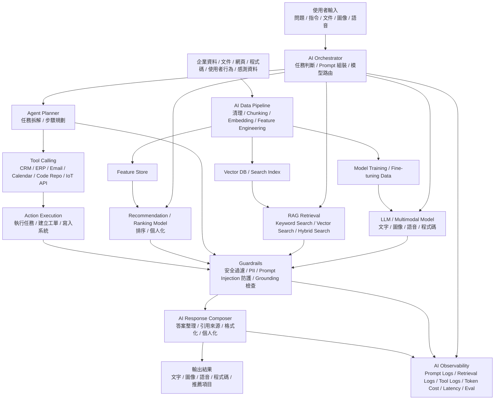

# Epic 1 — RAG System Map Builder

## 1. Epic Summary

Epic 1 的目標是建立 KAI-Mind 的第一個核心能力：

> 讀取一套 AI Agent / RAG 系統的 repo、設定檔與執行中服務，建立一份可供後續診斷使用的 AI System Map。

System Map Builder 不是單純畫圖工具。  
它的真正目的，是把一套看似分散的 AI 系統整理成結構化資料，讓後續的 readiness check 可以知道：

- 系統有哪些元件
- 元件之間如何連接
- 哪些服務正在執行
- 哪些服務可能暴露
- 哪些地方有外部 endpoint
- 哪些地方有 Agent tools
- 哪些地方與 RAG knowledge base 有關
- 後續哪些檢查模組需要接手

對 CI/CD 來說，System Map 是 gate 的事實層。  
如果 pipeline 要判斷一套 AI Agent 系統能不能 release，就必須先知道要檢查哪些 runtime、endpoint、tool、資料來源、外部 provider 與 exposure surface。

---

## 2. Why Start from System Map Builder?

第一個 Epic 應該先做 System Map Builder，原因很簡單：

> 如果 KAI-Mind 不知道系統裡有什麼，就不可能正確判斷系統是否 ready。

後續每個功能都依賴 System Map：

| 後續模組 | 為什麼需要 System Map |
|---|---|
| Runtime Readiness Check | 需要知道有哪些 runtime、container、endpoint 要檢查 |
| Privacy & Exposure Check | 需要知道服務綁在哪些 IP / port、是否有 external endpoint |
| Agent Tool Risk Check | 需要知道系統裡有哪些 tools、權限是什麼 |
| RAG / Knowledge Readiness Check | 需要知道 vector DB、collection、metadata、retrieval pipeline 在哪裡 |
| Release Report / CI Gate | 需要把所有檢查結果回填到同一張系統地圖上 |

如果沒有 System Map，KAI-Mind 會變成一堆零散 scanner。  
有了 System Map，KAI-Mind 才能變成真正可放進 CI/CD 的 AI 系統診斷與 release gate 工具。

---

## 3. Epic 1 Goal

Epic 1 完成後，使用者可以輸入一個既有的 RAG 專案資料夾，KAI-Mind 會先載入一份預設的 RAG reference architecture，依照架構圖中的 component slot 逐項掃描 repo、設定檔、Docker services、endpoint、資料來源、embedding、vector store、retriever、LLM、citation、guardrails 與 observability 訊號，產生一份標準化、可追溯 evidence 的 RAG System Map。使用者可以透過互動式 GUI 看到 indexing flow、query flow、外部依賴、缺失元件與風險提示，點選節點或連線查看來源證據與掃描狀態，並用這份標準化資料作為後續 Runtime Readiness、Privacy & Exposure、RAG Knowledge Trust 與 CI/CD Gate 的共同基礎。

Epic 1 要完成的不是完整 readiness check，而是：

> 先暫定 input type 為 RAG，建立一個以 RAG 通用架構為模板的 scanner，把 repo 轉換成標準化 RAG System Map，讓後續 GUI 與 CI/CD gate 都能基於同一份結構化資料做判斷。

也就是：

```text
Input: RAG Project Folder
        ↓
Select System Type: RAG
        ↓
Load RAG Reference Architecture
        ↓
Scan Repo by Component Slots
        ↓
Extract Evidence Facts
        ↓
Normalized RAG System Map
        ↓
Interactive RAG Visualization GUI
```

---

## 3.1 Future Classification Layer

Epic 1 先暫定 input type 為 RAG，避免第一版同時支援太多 AI 應用類型而失焦。但長期架構需要預留一個 classification layer。

未來 KAI-Mind 的流程應該是：

```text
Input Project Folder
        ↓
Evidence Extraction
        ↓
Architecture Classification Layer
        ↓
Select Reference Architecture Template
        ↓
Run Template-specific Component Scanners
        ↓
Normalize System Map
        ↓
Run Type-specific Checks / GUI / CI Gate
```

Classification layer 的責任不是讓 AI 自由猜整個 repo，而是根據 deterministic evidence 判斷這套 AI 系統比較接近哪一種架構類型，然後選擇對應的 reference architecture template 與 scanner rules。

可能的 architecture types：

| Architecture Type | Reference Template | 掃描重點 |
|---|---|---|
| `rag` | RAG Reference Architecture | data source、parser、chunking、embedding、vector store、retriever、LLM、citation |
| `llm_chat` | LLM Chat Reference Architecture | prompt、LLM、conversation memory、guardrails、response composer |
| `agent_workflow` | Agent Reference Architecture | planner、tool calling、action execution、approval、memory、tool logs |
| `coding_agent` | Coding Agent Reference Architecture | repo index、code context、patch generation、test runner、PR review |
| `multimodal` | Multimodal Reference Architecture | input media、multimodal model、safety filter、media output |
| `recommendation` | Recommendation Reference Architecture | user events、feature store、ranking model、feedback loop |
| `edge_ai` | Edge AI Reference Architecture | sensor input、edge model、local inference、event detection、cloud sync |

第一版可以把 classification 固定為：

```json
{
  "system_type": "rag",
  "classification_mode": "user_selected_or_default",
  "selected_template": "rag-core-v1"
}
```

等 RAG scanner 與 GUI 穩定後，再把 classification layer 做成真正的多類型入口。這樣 Epic 1 的 schema 與 scanner architecture 不會被 RAG 寫死，未來可以用同一套流程支援不同 AI 系統架構。

---

## 3.2 RAG Reference Architecture

Epic 1 先不嘗試支援所有 AI 應用類型，而是先預設輸入是一套 RAG 系統。KAI-Mind 會根據 RAG reference architecture 的 component slot 去掃描 repo，而不是把整個 repo feed 給 AI 自由推論架構。

通用 AI 核心架構可以作為長期擴充方向：



Epic 1 的實作範圍先聚焦在其中的 RAG 子架構：

```text
Indexing / Ingestion Flow:

Data Sources
  -> Document Loader / Parser
  -> Chunking
  -> Embedding Model
  -> Vector DB / Search Index

Query / Answer Flow:

User Query
  -> App API / AI Orchestrator
  -> Query Processing
  -> Retriever
  -> Retrieved Chunks
  -> Prompt Builder
  -> LLM
  -> Citation / Response Composer
  -> Response

Cross-cutting Components:

External Providers
Guardrails
Observability / Logs
Secrets / Config
Network Exposure
```

這份 reference architecture 不是要 KAI-Mind 強行假設每個 RAG 專案都有所有元件，而是提供掃描模板。每個 component slot 都會被標準化為 `detected`、`missing`、`not_configured` 或 `not_applicable`，並附上 evidence。


## 4. Scope of Epic 1

### 4.1 In Scope

Epic 1 應該包含：

| 類別 | 內容 |
|---|---|
| Project folder scan | 掃描 repo / project folder |
| Config discovery | 找出 `.env`、config、Docker、agent、RAG 相關設定 |
| Runtime endpoint discovery | 偵測可能的 Ollama、Qdrant、App API endpoint |
| Docker compose parsing | 讀取 `docker-compose.yml` 中的 services、ports、volumes、env |
| Classification placeholder | 第一版固定為 `system_type = rag`，但 schema 保留未來 classification layer 欄位 |
| RAG component slot scanning | 依照 RAG reference architecture 逐項掃描 data source、parser、chunking、embedding、vector store、retriever、LLM、citation 等 component slot |
| AI component detection | 辨識 LLM runtime、vector DB、app API、data source、retriever、embedding model、citation layer |
| External endpoint detection | 找出可能的外部 API endpoint |
| Network exposure hints | 記錄 localhost、0.0.0.0、LAN IP 等 exposure hints |
| System type normalization | 將掃描結果標準化為 `ai_system_map.json` |
| System map output | 輸出結構化 JSON / Markdown summary |
| Interactive RAG System Map GUI | 提供可操作的可視化介面，讓使用者可以探索 RAG indexing flow 與 query flow |

---

### 4.2 Out of Scope

Epic 1 不應該做太多後續檢查，否則範圍會失控。

| 不納入 Epic 1 | 原因 |
|---|---|
| 完整 runtime health check | 留給 Epic 2 |
| 完整 port security 判斷 | 留給 Epic 3 |
| API key secret 掃描深度分析 | 留給 Epic 3 |
| Agent tool policy 判斷 | 留給 Epic 4 |
| RAG citation groundedness 評估 | 留給 Epic 5 |
| READY / RISKY / NOT_READY 最終判斷 | 留給 Epic 6 |
| 完整 readiness dashboard | Epic 1 只做 System Map viewer，不做完整 report dashboard |
| 複雜圖編輯器 | Epic 1 的 GUI 只需要探索與檢視，不需要手動建模或編輯 map |

---

## 5. RAG System Map Data Model

Epic 1 的核心產物是一份標準化 RAG System Map。

資料模型不使用 `confidence`。Epic 1 是架構掃描，不是讓 AI 猜測整個 repo 的意圖；掃到 evidence 就記錄 evidence，沒掃到就標示 slot 狀態。

最小版本可以長這樣：

```json
{
  "schema_version": "ai-system-map/v1",
  "system_type": "rag",
  "classification": {
    "mode": "user_selected_or_default",
    "selected_template": "rag-core-v1",
    "future_layer": "architecture_classification"
  },
  "project": {
    "name": "example-ai-agent",
    "root_path": "/path/to/project"
  },
  "reference_architecture": {
    "id": "rag-core-v1",
    "flows": ["indexing", "query_answer"],
    "component_slots": [
      "data_sources",
      "document_loader",
      "chunking",
      "embedding_model",
      "vector_store",
      "app_api_or_orchestrator",
      "query_processing",
      "retriever",
      "prompt_builder",
      "llm",
      "citation_or_response_composer",
      "guardrails",
      "observability"
    ]
  },
  "components_by_slot": [
    {
      "slot": "vector_store",
      "required_for_rag": true,
      "status": "detected",
      "instances": [
        {
          "id": "qdrant_vector_db",
          "kind": "vector_db",
          "name": "Qdrant",
          "evidence": [
            {
              "kind": "docker_service",
              "file": "docker-compose.yml",
              "path": "services.qdrant.image",
              "value": "qdrant/qdrant"
            },
            {
              "kind": "published_port",
              "file": "docker-compose.yml",
              "path": "services.qdrant.ports",
              "value": "6333:6333"
            }
          ]
        }
      ]
    },
    {
      "slot": "llm",
      "required_for_rag": true,
      "status": "detected",
      "instances": [
        {
          "id": "ollama_runtime",
          "kind": "llm_runtime",
          "name": "Ollama",
          "evidence": [
            {
              "kind": "env_key",
              "file": ".env",
              "path": "OLLAMA_HOST",
              "value": "http://localhost:11434"
            }
          ]
        }
      ]
    },
    {
      "slot": "citation_or_response_composer",
      "required_for_rag": false,
      "status": "missing",
      "instances": []
    }
  ],
  "flows": [
    {
      "id": "query_answer",
      "edges": [
        {
          "from_slot": "app_api_or_orchestrator",
          "to_slot": "retriever",
          "relationship": "calls_retriever"
        },
        {
          "from_slot": "retriever",
          "to_slot": "vector_store",
          "relationship": "queries_vector_store"
        },
        {
          "from_slot": "prompt_builder",
          "to_slot": "llm",
          "relationship": "builds_prompt_for"
        }
      ]
    }
  ],
  "risk_hints": [
    {
      "type": "network_exposure",
      "target": "qdrant_vector_db",
      "evidence_ref": "docker-compose.yml:services.qdrant.ports",
      "severity_hint": "high"
    }
  ],
  "recommended_next_checks": [
    "runtime_readiness",
    "privacy_exposure",
    "rag_knowledge_trust"
  ]
}
```

---

## 6. Components to Detect

Epic 1 應依照 RAG reference architecture 優先偵測這些 component slot：

| RAG Slot | Examples / Signals | Required | Priority |
|---|---|---|
| Data Sources | PDF, Markdown, HTML, Excel, document folders, S3-like paths | Usually yes | P0 |
| Document Loader / Parser | LangChain loaders, LlamaIndex readers, PyMuPDF, unstructured | Usually yes | P0 |
| Chunking | text splitter, chunk size, overlap, splitter config | Usually yes | P0 |
| Embedding Model | OpenAI embeddings, Azure OpenAI embeddings, Ollama embeddings, sentence-transformers | Usually yes | P0 |
| Vector Store / Search Index | Qdrant, Chroma, FAISS, Weaviate, Azure AI Search, Elasticsearch | Usually yes | P0 |
| App API / Orchestrator | FastAPI, Flask, Open WebUI, custom backend, chain orchestration | Usually yes | P0 |
| Query Processing | query rewrite, query expansion, hybrid search setup | Optional | P1 |
| Retriever | retriever object, vectorstore retriever, similarity search, hybrid search | Usually yes | P0 |
| Prompt Builder | prompt template, system prompt, context injection | Usually yes | P1 |
| LLM | Ollama, OpenAI, Anthropic, Azure OpenAI, local model runtime | Usually yes | P0 |
| Citation / Response Composer | source metadata, citation formatter, response composer | Optional but important | P1 |
| Guardrails | PII filter, prompt injection check, safety filter, grounding check | Optional | P1 |
| Observability / Logs | prompt logs, retrieval logs, token usage, latency, eval traces | Optional | P1 |
| External Providers | OpenAI, Anthropic, Azure OpenAI, cloud vector DB, remote APIs | Optional risk signal | P0 |
| Network Exposure | published ports, `0.0.0.0`, LAN bind, public endpoint | Optional risk signal | P0 |

---

## 7. Files to Scan

Epic 1 可以從以下檔案開始掃描：

| File / Pattern | 用途 |
|---|---|
| `.env` | 找 endpoint、provider、API key name、runtime setting |
| `.env.example` | 推測系統需要哪些設定 |
| `docker-compose.yml` | 找 services、ports、volumes、env |
| `Dockerfile` | 判斷 app runtime 與啟動方式 |
| `requirements.txt` | 判斷 Python dependencies |
| `pyproject.toml` | 判斷 Python dependencies 與 project metadata |
| `package.json` | 判斷前端或 Node.js agent service |
| `config.yaml` / `config.yml` | 找模型、retriever、endpoint、tool config |
| `*.json` config | 找 agent / RAG 設定 |
| `README.md` | 補充辨識專案用途與啟動方式 |

---

## 8. Minimal Detection Rules

第一版不要追求完美。  
先做可解釋、可維護的 rule-based detection，並把每個掃描結果歸入 RAG component slot。

| RAG Slot / Signal | 最小規則 |
|---|---|
| Data Sources | 出現 `data/`、`docs/`、`.pdf`、`.md`、`.csv`、`.xlsx`、`source_documents` |
| Document Loader / Parser | 出現 `PyPDFLoader`、`DirectoryLoader`、`SimpleDirectoryReader`、`unstructured`、`pymupdf` |
| Chunking | 出現 `chunk_size`、`chunk_overlap`、`TextSplitter`、`RecursiveCharacterTextSplitter` |
| Embedding Model | 出現 `embedding`、`OpenAIEmbeddings`、`AzureOpenAIEmbeddings`、`sentence-transformers`、`nomic-embed` |
| Vector Store / Search Index | 出現 `qdrant`、`chroma`、`faiss`、`weaviate`、`Azure AI Search`、`vectorstore`、`collection` |
| App API / Orchestrator | 出現 `fastapi`、`uvicorn`、`flask`、`streamlit`、`open-webui`、`chain.invoke` |
| Retriever | 出現 `retriever`、`similarity_search`、`as_retriever`、`hybrid_search`、`top_k` |
| Prompt Builder | 出現 `PromptTemplate`、`ChatPromptTemplate`、`system_prompt`、`context` |
| LLM | 出現 `ollama`、`11434`、`OLLAMA_HOST`、`OPENAI_API_KEY`、`ANTHROPIC_API_KEY`、`AZURE_OPENAI_ENDPOINT` |
| Citation / Response Composer | 出現 `source`、`metadata`、`citation`、`references`、`source_documents` |
| Guardrails | 出現 `guardrail`、`moderation`、`PII`、`prompt_injection`、`grounding` |
| Observability / Logs | 出現 `langsmith`、`tracing`、`prompt_log`、`retrieval_log`、`token_usage`、`latency` |
| External Provider | 出現 `api.openai.com`、`anthropic.com`、`AZURE_OPENAI_ENDPOINT`、remote vector DB URL |
| Network Exposure | 出現 Docker port publish、`0.0.0.0`、LAN IP、non-localhost bind |

每個 slot 的狀態只能是：

- `detected`: 有明確 evidence。
- `missing`: RAG reference architecture 中常見或必要，但 repo 內沒有掃到。
- `not_configured`: 有設定入口，但沒有實際值或被註解。
- `not_applicable`: 這類 RAG 專案不需要該 slot，且有明確理由。

不要用 `confidence` 表示猜測程度。Epic 1 要輸出 facts、slot status、evidence 與 recommended next checks。

---

## 9. Epic 1 Output

Epic 1 至少要輸出三種成果：machine-readable RAG map、人類可讀 summary，以及真正可互動的 RAG System Map GUI。

### 9.1 JSON Output

給後續 checker 使用：

```text
ai_system_map.json
```

內容包含：

- project metadata
- system type classification placeholder
- reference architecture ID
- RAG component slots
- slot status
- detected component instances
- indexing flow
- query / answer flow
- endpoints
- config evidence
- risk hints
- recommended next checks

---

### 9.2 Markdown Summary

給人閱讀：

```text
ai_system_map.md
```

內容包含：

- 系統總覽
- RAG component slot coverage
- 偵測到的元件與 missing slots
- indexing flow
- query / answer flow
- 可能的外部 endpoint
- 可能的 network exposure
- 後續建議檢查項目

---

### 9.3 Interactive RAG System Map GUI

給使用者探索系統結構：

```text
Local RAG System Map Viewer
```

最小功能包含：

- 載入 `ai_system_map.json`
- 以 node / edge graph 顯示 RAG 系統
- 顯示 indexing flow 與 query / answer flow
- 使用不同視覺樣式區分 data source、parser、chunking、embedding、vector store、retriever、LLM、citation、external endpoint、network exposure
- 點選 node 顯示 detail panel
- 點選 edge 顯示 connection reason
- 顯示 evidence、source、slot status
- 支援 filter：RAG slot、detected / missing、external endpoint、network exposure、risk hint
- 支援基本 zoom、pan、drag
- 支援 Epic 1 MVP interactive query trace / replay：使用者送出測試問題後，KAI-Mind 會呼叫 detected RAG endpoint 並收集 basic trace，讓使用者在圖上看到 query 實際經過的 RAG steps，並支援 pause、step forward、step backward、replay
- secret-like value 必須遮罩

Epic 1 的 GUI 不是完整 dashboard，也不是圖編輯器。  
它的目標是讓使用者真的可以互動探索 RAG System Map，而不是只看到靜態文字或截圖。

---

## 10. Example Human-readable Output

```markdown
# RAG System Map

## RAG Component Slot Coverage

| Slot | Status | Instance | Evidence |
|---|---|---|---|
| Data Sources | detected | `docs/` | folder exists |
| Chunking | detected | RecursiveCharacterTextSplitter | `src/ingest.py` |
| Embedding Model | detected | OpenAIEmbeddings | `.env:OPENAI_API_KEY` |
| Vector Store | detected | Qdrant | `docker-compose.yml:services.qdrant.image` |
| Retriever | detected | vectorstore retriever | `src/rag.py:as_retriever` |
| Citation / Response Composer | missing | - | no citation/source formatter found |

## Query Flow

| From | To | Reason |
|---|---|---|
| App API | Retriever | query passes into retrieval layer |
| Retriever | Vector Store | retriever queries vector index |
| Prompt Builder | LLM | retrieved context is injected into prompt |

## Risk Hints

| Type | Target | Evidence | Severity Hint |
|---|---|---|---|
| Network Exposure | Qdrant | 0.0.0.0:6333 | High |
| External Endpoint | OpenAI | OPENAI_API_KEY exists | Medium |
```

---

## 11. Suggested Sub-issues for Epic 1

### Parent Issue

```text
Epic 1: RAG System Map Builder
```

### Sub-issues

| Issue | Title | Priority | Purpose |
|---|---|---|---|
| 1.1 | Define RAG reference architecture template | P0 | 定義 RAG component slots、indexing flow、query flow |
| 1.2 | Define `ai_system_map.json` schema | P0 | 定義後續 GUI 與 checker 共用的標準化資料格式 |
| 1.3 | Add classification layer placeholder | P0 | 第一版固定 `system_type = rag`，但保留未來多架構 template 選擇 |
| 1.4 | Implement project folder scanner | P0 | 掃描 repo / project folder 內的設定檔 |
| 1.5 | Parse docker-compose services | P0 | 讀取 services、ports、volumes、env |
| 1.6 | Detect RAG component slots | P0 | 偵測 data source、parser、chunking、embedding、vector store、retriever、LLM、citation |
| 1.7 | Detect external endpoints and network exposure | P0 | 找出 local / external endpoint 與 exposure hints |
| 1.8 | Generate RAG system map JSON report | P0 | 輸出給 GUI 與後續 checker 使用的 JSON |
| 1.9 | Generate human-readable Markdown report | P1 | 輸出給使用者閱讀的 Markdown summary |
| 1.10 | Add slot status and evidence refs | P0 | 用 `detected` / `missing` / `not_configured` / `not_applicable` 取代 confidence |
| 1.11 | Build interactive RAG System Map GUI | P0 | 載入 map JSON，提供可互動的 RAG node / edge 視覺化 |
| 1.12 | Add GUI evidence panel and filters | P0 | 支援點選 node / edge、查看 evidence、篩選 slot status 與風險訊號 |
| 1.13 | Add basic CLI command | P1 | 支援 `kai-mind map ./project` 與 `kai-mind viewer <map_json>` |
| 1.14 | Prepare sample RAG projects for testing | P1 | 建立測試用 local RAG 專案樣本 |

---

## 12. Parent Issue Draft

```markdown
# Epic 1: RAG System Map Builder

## Objective

建立 KAI-Mind 的第一個核心模組：RAG System Map Builder。

此模組先暫定 input type 為 RAG，負責根據預設的 RAG reference architecture 逐項掃描 repo、設定檔與執行中服務資訊，產生一份標準化的 `ai_system_map.json`。後續 Runtime Readiness、Privacy & Exposure、RAG Knowledge Trust 與 Release Gate 模組都應基於同一份 RAG System Map 進行檢查。

Epic 1 完成後，使用者不應該只拿到 JSON 或 Markdown。  
使用者應該可以打開一個互動式 GUI，實際看到 RAG indexing flow、query flow、missing slots、外部依賴與 risk hints，並能點選元件、查看 evidence、篩選 endpoint / exposure / slot status 等訊號。

## Why

KAI-Mind 的後續檢查都需要先知道 RAG 系統中有哪些元件、服務、endpoint、資料來源與可能的風險位置。

如果沒有標準化 RAG System Map，後續 checker 會變成零散掃描，無法形成完整診斷。

## Scope

### In Scope

- 掃描 project folder
- 讀取 `.env`、config、Docker 相關檔案
- 解析 `docker-compose.yml`
- 載入 RAG reference architecture template
- 第一版 classification 固定為 `system_type = rag`，但 schema 預留未來多架構分類
- 逐項偵測 data source、parser、chunking、embedding、vector store、retriever、LLM、citation 等 RAG component slots
- 偵測 Ollama、Qdrant、FastAPI、Open WebUI 等實際 component instances
- 偵測 local endpoint 與 external endpoint
- 建立 `ai_system_map.json`
- 建立 human-readable Markdown summary
- 建立互動式 RAG System Map GUI
- GUI 可以載入 map JSON 並顯示 node / edge graph
- GUI 可以查看 selected node / edge 的 evidence 與 slot status
- GUI 可以依 RAG slot、slot status、external endpoint、network exposure、risk hint 篩選
- 為每個偵測結果保留 evidence refs

### Out of Scope

- 不做完整 runtime health check
- 不做完整 security scan
- 不做 Agent tool policy 判斷
- 不做 RAG answer groundedness 評估
- 不做 READY / RISKY / NOT_READY 最終判斷
- 不實作完整多架構 classifier，Epic 1 先聚焦 RAG，但保留 classification layer 設計
- 不做完整 readiness dashboard
- 不做手動 graph 編輯器

## Deliverables

- RAG reference architecture template
- `ai_system_map.json`
- `ai_system_map.md`
- interactive RAG System Map GUI
- `kai-mind map <project_path>` CLI prototype
- `kai-mind viewer <map_json>` viewer prototype
- 最小可測試 sample project
- RAG System Map schema 文件

## Acceptance Criteria

- 可以輸入一個 project folder
- 可以根據 RAG reference architecture 檢查 component slots
- 可以找出至少以下 RAG slots 或 component instances：
  - data source
  - chunking
  - embedding model
  - vector store，例如 Qdrant
  - retriever
  - LLM，例如 Ollama / OpenAI / Anthropic / Azure OpenAI
  - App API / Orchestrator，例如 FastAPI / Flask / Open WebUI
  - `.env`
  - `docker-compose.yml`
- 可以輸出 JSON 格式的 RAG System Map
- 可以輸出 Markdown 格式的人類可讀 summary
- 可以開啟互動式 GUI 查看 RAG System Map
- GUI 可以點選 node / edge 並顯示 evidence
- GUI 可以用 filter 隱藏或顯示 missing slots、external endpoints、network exposure、risk hints
- 每個 detected component 都必須包含：
  - slot
  - status
  - name
  - evidence
- 不得直接顯示完整 API key 或 secret value
- 若沒有掃到 evidence，必須標示 `missing`、`not_configured` 或 `not_applicable`，不能假裝知道

## Expected Command

```bash
kai-mind map ./example-project
kai-mind viewer outputs/ai_system_map.json
```

## Expected Output

```text
outputs/
├─ ai_system_map.json
├─ ai_system_map.md
└─ interactive RAG System Map GUI
```
```

---

## 13. Epic 1 Success Criteria

Epic 1 完成時，應該可以回答這些問題：

| 問題 | 是否應可回答 |
|---|---|
| 這個 RAG 專案有哪些 reference architecture slots？ | 是 |
| 哪些 RAG slots 被偵測到？ | 是 |
| 哪些 RAG slots missing / not_configured / not_applicable？ | 是 |
| 這個專案有沒有使用 Ollama / OpenAI / Anthropic / Azure OpenAI？ | 是 |
| 這個專案有沒有使用 Qdrant / Chroma / FAISS / Weaviate / Search Index？ | 是 |
| App API 可能在哪裡啟動？ | 是 |
| Data source、chunking、embedding、retriever 是否存在？ | 是 |
| 哪些設定檔包含 endpoint？ | 是 |
| 哪些服務可能是 Docker 啟動？ | 是 |
| 哪些服務可能暴露 port？ | 初步提示即可 |
| 是否存在外部 AI provider 設定？ | 初步提示即可 |
| RAG collection 是否 ready？ | 否，留給 Epic 5 |
| Qdrant 是否安全？ | 否，留給 Epic 3 |
| Runtime 是否真的健康？ | 否，留給 Epic 2 |
| 系統是否可以 release？ | 否，留給 Epic 6 |
| 使用者是否可以用 GUI 互動探索 RAG 系統地圖？ | 是 |
| 使用者是否可以點選節點或連線查看 evidence？ | 是 |
| 使用者是否可以篩選 missing slots、external endpoint、network exposure？ | 是 |
| 使用者是否可以輸入測試問題並 replay 一次 RAG query trace？ | 是，Epic 1 MVP 必須呼叫 detected RAG endpoint 並收集 basic trace |

---

## 14. Recommended Development Order for Epic 1

| Order | Task | Reason |
|---|---|---|
| 1 | Define RAG reference architecture template | 先定義要掃哪些 RAG component slots |
| 2 | Define RAG System Map schema | 先定義標準化資料格式，避免後面 scanner 各寫各的 |
| 3 | Add classification placeholder | 先固定 RAG，但讓 schema 未來可以支援不同架構類型 |
| 4 | Build folder scanner | 先能讀 project folder |
| 5 | Parse config files | `.env`、yaml、json 是 endpoint 與 provider 的主要來源 |
| 6 | Parse docker-compose | 很多 local AI stack 會靠 Docker 啟動 |
| 7 | Detect RAG component slots | 先支援 data source、chunking、embedding、vector store、retriever、LLM |
| 8 | Add evidence refs and slot status | 避免工具輸出不可驗證的結論，不使用 confidence |
| 9 | Generate JSON report | 給 GUI 與後續 checker 使用 |
| 10 | Generate Markdown report | 給使用者閱讀 |
| 11 | Build interactive RAG map viewer | 讓 Epic 1 完成後真的有可視化 GUI |
| 12 | Add evidence panel and filters | 讓 GUI 不只是圖，而是可追溯診斷工具 |
| 13 | Add CLI command | 讓工程流程可以開始串起來 |
| 14 | Prepare sample RAG projects | 確保每次修改後都能測試 |

---

## 15. Implementation Plan Overview

Epic 1 目前預計的實作步驟如下：

```text
1. 使用者輸入一個 RAG 專案資料夾

2. KAI-Mind 先掃 file tree
   先知道 repo 大概有哪些資料夾、檔案、config、Docker、package files。

3. 固定 system_type = rag
   第一版先不做所有 AI 架構分類，先假設 input 是 RAG。

4. 載入 RAG reference architecture
   例如：
   data source
   parser / loader
   chunking
   embedding
   vector store
   retriever
   prompt builder
   LLM
   citation / response composer
   guardrails
   observability

5. Deterministic scanner 先抓明確 facts
   例如：
   docker-compose 有 qdrant
   .env 有 OPENAI_API_KEY
   requirements 有 langchain
   程式碼有 as_retriever
   config 有 chunk_size

6. 根據 RAG 架構選 candidate files
   不是每個檔案都丟給 AI，而是挑可能相關的檔案：
   ingest.py
   retriever.py
   rag.py
   api.py
   prompts.py
   config.yaml
   docker-compose.yml

7. 對 candidate files 做受限 AI extraction
   AI 只能根據該檔案抽 evidence。
   沒看到就不能猜。

8. 後端 merge / validate
   合併所有掃描結果，去重，確認 evidence path 存在。

9. 產生標準化資料
   輸出：
   ai_system_map.json
   ai_system_map.md

10. GUI 可視化
   用 ai_system_map.json 畫出互動式 RAG 架構圖。

11. 使用者可以點擊 component / edge
   點擊後顯示 detail panel 或 modal：
   slot
   status
   evidence
   source file
   risk hints
   related connections
   next checks

12. Query trace / replay MVP 支援
   使用者輸入測試問題後，KAI-Mind 必須呼叫 detected RAG endpoint 並收集 basic trace，讓使用者可以看到 query 實際跑過哪些 RAG steps。
   例如：
   user query -> retriever -> vector store -> retrieved chunks -> prompt builder -> LLM -> response

13. 後續 CI/CD gate 使用同一份 map
   未來 Runtime Readiness、Privacy & Exposure、RAG Trust 都基於這份 ai_system_map.json。
```

一句話：

```text
RAG repo
  -> 掃 file tree
  -> 載入 RAG 標準架構
  -> 找證據
  -> 必要時用 AI 輔助抽取
  -> 產生標準化 RAG map
  -> 做互動式 GUI
  -> 未來接 CI/CD gate
```

---

## 16. 參考專案：GitDiagram

GitDiagram 可以作為 KAI-Mind 在使用者體驗與架構圖生成流程上的參考。

專案連結：

```text
https://github.com/ahmedkhaleel2004/gitdiagram
```

GitDiagram 的高層流程：

```text
GitHub repo URL
  -> 取得 repo file tree 與 README
  -> LLM 產生架構解釋
  -> LLM 將架構解釋轉成 generic graph
  -> 驗證 graph paths 與 edges
  -> 編譯成 Mermaid
  -> 顯示可互動且可點擊 source path 的 diagram
```

### KAI-Mind 可以參考什麼

KAI-Mind 可以參考 GitDiagram 的以下設計：

- repo 輸入流程與生成進度 UI
- 分析前先過濾 noisy repo files
- 結構化 `nodes` / `edges` graph validation
- 驗證 source paths 是否真的存在
- 將 graph data 編譯成可視化 diagram
- Mermaid validation 與 retry feedback
- 可以點回 source files 的 clickable nodes
- 支援 zoom / pan 的 diagram viewer
- diagram export，例如 Mermaid code 或 PNG
- 顯示 generation stages 與 failure reasons

這些都可以作為 KAI-Mind 建立 interactive RAG System Map GUI 的參考。

### KAI-Mind 不應該直接照搬什麼

GitDiagram 是為 any repo type 設計的。它的目標是產生高層次架構摘要，而不是 evidence-based AI readiness gate。

KAI-Mind 不應該直接照搬這些部分：

- 把 LLM-only architecture understanding 當成 source of truth
- 只使用 generic graph schema 作為最終 product contract
- 允許沒有 scanner evidence 的 graph nodes 或 edges
- 把好看的 diagram 當成 readiness evidence
- 只優化人類理解，而忽略 CI/CD compatibility

### 核心差異

GitDiagram 是：

```text
any repo
  -> LLM architecture summary
  -> generic graph
  -> Mermaid diagram
```

KAI-Mind Epic 1 應該是：

```text
RAG repo
  -> RAG reference architecture
  -> deterministic component-slot scanning
  -> evidence-based ai_system_map.json
  -> interactive RAG System Map GUI
  -> future CI/CD gate foundation
```

KAI-Mind 的目標體驗可以接近 GitDiagram，但 data layer 必須更嚴謹。  
LLM 可以協助 summary、label、explanation 或 visual presentation，但不應該創造沒有 scanner evidence 支持的 RAG components。

---

## 17. Strict Notes

Epic 1 最容易犯的錯是範圍失控。

不要一開始就做：

- 完整 dashboard
- 完整資安掃描
- 完整 RAG evaluator
- 完整 CI/CD gate
- 完整 Agent policy engine
- 手動 graph 編輯器
- 所有 AI app 類型的自動分類

第一階段只要做到：

> 能把 RAG 專案依照 reference architecture 整理成可信、可追溯、可被後續模組使用，並且可被使用者用 GUI 互動探索的 RAG System Map。

這就已經足夠成為 KAI-Mind 的基礎。

---

## 18. Final MVP Definition for Epic 1

Epic 1 的 MVP 定義如下：

> 使用者輸入一個 RAG 專案資料夾後，KAI-Mind 可以依照預設 RAG reference architecture 掃描 repo、config 與 Docker 設定，逐項偵測 data source、chunking、embedding、vector store、retriever、LLM、citation、external endpoint 與 network exposure，輸出一份 JSON 版與 Markdown 版 RAG System Map，並提供一個真的可互動的 GUI 介面讓使用者探索這張 map。這個 GUI 不是靜態圖片；架構圖上的每個 component node 與重要 connection edge 都應該可以點擊。使用者點擊某個 component 後，畫面應顯示 detail panel 或 modal，列出該 component 的 slot、status、偵測到的實例、來源檔案、evidence、相關連線、risk hints，以及後續建議檢查項目。

互動式 GUI 還應該支援 interactive query trace / replay。使用者可以在 GUI 裡輸入一個測試問題，KAI-Mind 將這個問題送到被掃描出的 RAG app / API endpoint，並在處理過程中收集一次 query trace。GUI 需要把這次 trace 映射回 RAG System Map，讓使用者看到這個問題實際經過哪些步驟，例如 user query、query processing、retriever、vector store、retrieved chunks、prompt builder、LLM、citation / response composer、final response。當 trace 跑到某個步驟時，對應的架構區塊與連線應該高亮，並可顯示該步驟的輸入、輸出、耗時、來源 evidence 或錯誤訊息。使用者應該可以 pause、step forward、step backward、replay 這次 query trace。

這個功能和單純的 static architecture visualization 不同；Epic 1 MVP 必須使用 detected RAG endpoint 收集 basic trace，並把 trace events 映射回 `ai_system_map.json` 的 slots / nodes / edges。Proxy wrapper、trace hook 與完整 runtime trace capture 屬於 advanced scope，可作為 Epic 1 進階交付或後續 Runtime Readiness / Observability work 的銜接項目。

最小可接受結果：

```text
Input:
  ./user-ai-project

Command:
  kai-mind map ./user-ai-project

Output:
  outputs/ai_system_map.json
  outputs/ai_system_map.md
  interactive RAG System Map GUI
```

核心價值：

> 先讓 KAI-Mind 用標準 RAG 架構模板看懂一套 RAG 系統，並讓使用者可以透過互動式 GUI 看懂這套系統；後面才有資格判斷它是否 ready。

---

## 19. 預計運行 Flow 與 AI 參與位置

Epic 1 的運行 flow 應該分成兩條路徑：

1. 靜態掃描與可視化：不需要真的呼叫被掃描的 RAG 系統。
2. Query trace / replay：使用者送出測試問題後，觀察一次實際 RAG query 的處理路徑。

### 19.1 靜態掃描與可視化 Flow

```text
使用者選擇 RAG project folder
        ↓
KAI-Mind 讀取 repo / config / Docker / package files
        ↓
固定 system_type = rag
        ↓
載入 RAG reference architecture template
        ↓
Deterministic scanner 逐項掃描 RAG component slots
        ↓
產生 evidence facts
        ↓
正規化為 ai_system_map.json
        ↓
產生 ai_system_map.md
        ↓
GUI 載入 ai_system_map.json
        ↓
顯示互動式 RAG System Map
        ↓
使用者點擊 node / edge 查看 detail panel
```

### 19.2 Query Trace / Replay Flow

```text
使用者在 GUI 輸入測試問題
        ↓
KAI-Mind 找到 RAG app / API endpoint
        ↓
KAI-Mind 呼叫 detected RAG endpoint 送出 query 並收集 basic trace
        ↓
收集 query trace events
        ↓
將 trace events 對應回 ai_system_map.json 的 slots / nodes / edges
        ↓
GUI 顯示 query 實際走過的 RAG steps
        ↓
播放 / 暫停 / 前一步 / 下一步 / replay
        ↓
目前步驟對應的 component 與 edge 高亮
        ↓
detail panel 顯示該步驟的 input、output、latency、error、retrieved chunks 或 evidence
```

### 19.3 AI 會參與哪個部分

KAI-Mind 的核心資料層不應該依賴 LLM 自由猜測。AI 可以參與解釋與呈現，但不能成為 scanner evidence 的 source of truth。

| 階段 | 是否可用 AI | 說明 |
|---|---|---|
| 掃描 repo / config / Docker | 不應依賴 AI | 這一層應該是 deterministic scanner，負責產生可驗證 evidence。 |
| 判斷 RAG component slot 是否 detected / missing | 不應依賴 AI 作為唯一依據 | 應根據 rule-based evidence，例如 dependency、config key、Docker service、code pattern。 |
| 建立 `ai_system_map.json` | 不應依賴 AI | JSON 是後續 GUI 與 CI/CD 的 contract，必須穩定、可重跑、可測試。 |
| Graph layout / label 優化 | 可以用 AI 輔助 | AI 可以幫忙產生更好懂的 label、group name、summary，但不能新增沒有 evidence 的 component。 |
| Markdown summary | 可以用 AI 輔助 | AI 可以把 evidence-based map 轉成人類可讀說明。 |
| GUI detail explanation | 可以用 AI 輔助 | AI 可以協助解釋某個 component 的角色與風險，但必須引用 scanner evidence。 |
| Query trace replay | AI 不是主要來源 | replay 應該來自 runtime trace、proxy wrapper、trace hook 或 sample logs。 |
| 後續建議檢查項目 | 可以規則優先、AI 輔助文字化 | 例如看到 external provider 或 exposed port 時，規則決定 next check，AI 只負責說明原因。 |

### 19.4 AI 使用原則

- Scanner evidence 優先。
- LLM 不可以創造沒有 evidence 的 RAG component。
- LLM 產生的 summary / labels / explanations 必須能追溯回 `ai_system_map.json`。
- CI/CD gate 不能只依賴 LLM 判斷。
- 如果 AI 輔助產生的說明和 scanner evidence 衝突，應以 scanner evidence 為準。
