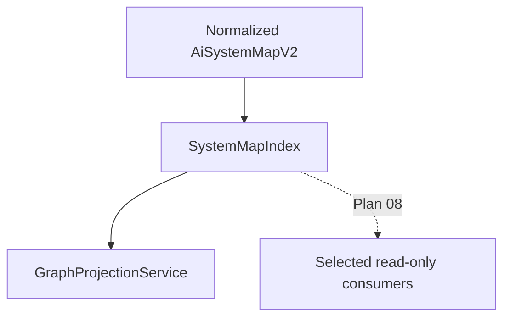

# 新增 Read-only SystemMapIndex 計畫

> **狀態：已完成（2026-07-12）。** Backend implementation與驗證全部通過。

> **2026-07-11 live-state sync：** Plan 00A 的 `CanonicalMapLoader`、Plan 02 的
> `ProfileInferenceService`、readiness sidecar 與 build lineage 已完成；目前缺的是
> `SystemMapIndex` 與 normalized-v2 graph projection seam。本計畫只建立最小 canonical
> fact index。執行順序固定為 `05 -> 06 first vertical slice -> 07 -> 06 completion ->
> 08 -> 09`；本 index 不讀 TOML、不計分、不推論 capability。

## 2026-07-07 UA 整合對齊

UA 整合不改變本計畫範圍。`SystemMapIndex` 仍只索引 validated canonical map 與必要的
read-only ids；`ua-analysis-result` 是 `ScanSnapshot` internal sidecar，不進 canonical
index、不作 public lookup contract，也不讓 index 解析 UA 原生 graph vocabulary。

> **執行者注意：** 逐 task 實作本計畫。步驟使用 checkbox（`- [ ]`）語法以便追蹤。

**來源：** `architecture-review-20260627T143554.html`

**目標：** 新增小型 read-only `SystemMapIndex`，穩定 lookup 已驗證的 normalized v2
components、edges、evidence、endpoints、risk hints、unmapped components 與 candidate
facts。

**為何現在要做：** `GraphProjectionService`、detail scan read-only resolution 與 mapping
proposal packet assembly 都需要解析相同 canonical ids。若每個 module 各自重建 lookup
tables，evidence ordering、unknown-reference behavior 與 projection anchors 會 drift。
既有 profile inference 已可運作，本計畫不得把它改造成 index 的前置消費者。

**目前架構觀察：** Viewer projection 目前在 `ViewerSessionService.project_to_graph()` 內建立 local lookup maps，例如 `node_ids_by_source` 與 `node_ids_by_slot`。Validation 與 target/reference checks 也分散在其他 services。以現況尚可運作，但 profile attachment anchors 會成為同一套 indexing rules 的第二個 consumer。

**原始報告內容保留：**

- **Candidate：** 新增 read-only `SystemMapIndex`
- **Problem：** Target lookup 與 reference validation 在多個 modules 重複；profile related refs 與 anchor selection 容易 drift。
- **Solution：** 先為新的 graph projection 建立小型 read-only canonical index；等
  focused tests 與第一個 consumer 穩定後，再由 Plan 07–09 擴充、遷移與清理舊 lookup。

## 執行摘要

### 目標

建立最小、immutable 的 `SystemMapIndex`，先讓 Plan 06 的 normalized-v2 graph
projection 共用 canonical fact lookup；readiness/profile sidecar lookup 不屬於本 index。

### Step 5 Pipeline Boundary

`SystemMapIndex` 位在 `CanonicalMapLoader` 完成 v1/v2 validation/adapter 之後；它不是
Step 6 assessment 的必要前置：

```text
CanonicalMapLoader.load(...)
  -> validated normalized AiSystemMapV2
       -> SystemMapIndex.from_map(...)
            canonical component/edge/evidence/endpoint/risk/unmapped/candidate lookup
       -> ProfileInferenceService（既有 Step 6 owner，獨立讀 normalized map）
       -> GraphProjectionService（Plan 06 第一個 index consumer）
```

Index 不執行橋接 1 或橋接 2：不讀 scan TOML、不決定 `rule_id` 對應 component、
不輸出 `plane_id` / `reference_node_id`、不計算五態、activation、grounding 或 Mapping
Completeness。Profile/readiness/grounding 皆是 derived sidecar data，必須留在各自 owner。

### 背景

目前 viewer、detail scan 與 mapping proposal route 各自重建 lookup；validation 則維護
自己的 invariant sets。Index 只取代 read-only fact lookup，不取代 validator sets 或
projection-specific graph id/filter maps。

### 目前 code 狀態

repo 尚無 shared index；`CanonicalMapLoader`、normalized `AiSystemMapV2`、52-node profile
assessment 與 readiness artifacts 已落地。Viewer/publisher/detail/proposal active flow 仍以
v1 map 或 local lookup 為主。

### 相關檔案

- `src/kai_mind/core/models/ai_system_map_v2.py`
- `src/kai_mind/core/services/system_map_index.py`（新增）
- `tests/unit/core/test_system_map_index.py`（新增）

### 實作步驟

先以 found/missing/no-mutation tests定義 singular contract，只讓 Plan 06 新 projection
vertical slice 使用；Plan 07 依第二個真實 consumer 需求擴充，Plan 08–09 才遷移/清理
低風險既有 consumers。

### 驗收標準

Index 可穩定解析 canonical ids 與 evidence location values，不讀 evidence files、不
mutate、不 validate、不投影 graph、不持久化，也不包含 profile/readiness decision logic。

### 風險與注意事項

不要把 index 做成 god object。Graph node fallback、validation invariants、scanner-time facts、manual replay 與 runtime trace 都留在原 owning service。

## 範圍

本計畫先新增 read-only index 供 Plan 06 graph projection 使用，不做大規模搬遷。舊
lookup code 僅在有 characterization/equivalence tests 保護、且能明確降低 duplication
時，才由 Plan 08–09 逐步改用 index。

## 預期架構



## 優先檢視的檔案

- `src/kai_mind/core/models/ai_system_map_v2.py`
- `src/kai_mind/core/services/canonical_map_loader.py`
- `src/kai_mind/core/services/system_map_v2_validation_service.py`
- `src/kai_mind/core/services/viewer_session_service.py`
- `src/kai_mind/core/services/map_build_pipeline.py`
- `tests/unit/core/test_system_map_v2_validation.py`
- `tests/unit/core/test_viewer_session_service.py`

## 實作 Tasks

- [x] 為從 normalized `AiSystemMapV2` 建立的 read-only index 撰寫 focused tests；
  v1 input 必須先通過 00A adapter。
- [x] 最小 public contract 只提供 `component_by_id`、`edge_by_id`、`evidence_by_id`、
  `endpoint_by_id`、`risk_by_id`、`unmapped_by_id` 與 `candidate_fact_by_id`。
- [x] lookup key 只來自 `AiSystemMapV2` 實際欄位；legacy slot/extension aliases 必須先由
  adapter 轉成 canonical component/candidate metadata，index 不自行解析 v1 vocabulary。
- [x] Projection anchor selection 留在 `GraphProjectionService`；index 只回傳 anchor
  selection 所需的 canonical component/evidence/candidate facts，不選 primary anchor。
- [x] 確保 index construction 不 mutate map、不 normalize data、不 validate schema、也不 infer 新 facts。
- [x] 定義清楚的 missing-reference behavior：本計畫的 singular lookup helpers 一律回傳
  `None`；index 不因 unknown id raise，也不建立 placeholder。
- [x] 若 current schema validation 已防止 duplicate / unknown ids，則為此新增 tests；除非 caller 需要，否則不重複 validator 職責。
- [x] 新增 dependency/source guardrail，禁止 index import viewer、profile、readiness、
  renderer、routes、repositories、filesystem providers 或 validation services。
- [x] 先在 Plan 06 新的 `GraphProjectionService` 使用 index；本計畫不 refactor 舊 viewer、
  profile inference、validator、detail scan 或 proposal route。

## 驗收標準

- [x] `SystemMapIndex.from_map(system_map)` 或等效方法，能建立 normalized v2 map 上可重用的 read-only view。
- [x] Lookup 涵蓋 `AiSystemMapV2` 七組 canonical collections，found/missing behavior
  deterministic，且保留 input ordering。
- [x] Index 不得 write back 到 `AiSystemMapV2`、`GraphViewModel`、`profile_signals.json` 或 filesystem artifacts。
- [x] Tests涵蓋 found、missing、duplicate validator boundary與 no-mutation；plural ordering
  留給 Plan 07 public methods測試，不讀取 private index state。
- [x] 既有 viewer projection behavior 保持不變，除非有意以 regression tests 遷移。
- [x] Index 不決定 anchor、`primary_map_type`、profile status、grounding、readiness verdict 或 LLM interpretation。

## 驗證

- [x] `.venv/bin/pytest tests/unit/core/test_system_map_v2_validation.py tests/unit/core/test_viewer_session_service.py -q`
- [x] 新增 focused `tests/unit/core/test_system_map_index.py`。
- [x] `.venv/bin/ruff check src/kai_mind/core/services/system_map_index.py tests/unit/core/test_system_map_index.py`
- [x] `.venv/bin/mypy src/kai_mind/core/services/system_map_index.py tests/unit/core/test_system_map_index.py`
- [x] `rg -n "SystemMapIndex" src tests` 以確認 usage 有限且 intentional。
- [x] `git diff --check -- docs/work/Timmy/schedule/plan/unfinish/phase2/static-trace-plan/s1-track-a-index-projection/05-add-read-only-system-map-index.md`

## 相依關係

- 00A loader/adapter、Step 6 profile/readiness 與 lifecycle 已完成，不是本計畫待辦。
- 本計畫直接支援 `06-deepen-graph-projection-module.md` 的 first vertical slice。
- 後續由 `07-expand-system-map-index-to-shared-lookup-contract.md` 依實際 caller 擴展；
  `06` remaining projection、consumer migration 與 cleanup 分別接續完成。

## 不在範圍內

- 不要將此做成 repository、cache、database adapter 或 persistence layer。
- 不要將 normalized v2 canonical validation 移出 `SystemMapV2ValidationService`。
- 不要用此 index 建立新的 canonical facts。
- 第一個 patch 不要求所有 legacy lookup code 都完成遷移。

## P0 Execution Mapping 補充（2026-07-03）

`SystemMapIndex` 可作 P0 execution artifacts 的 read-only canonical ref lookup substrate：

- Index 能查 `component_id`、`edge_id`、`evidence_id`、`endpoint_id`；現有
  `SystemMapV2ValidationService` 仍是 ref validation owner，index 不重複 validation。
- 若 dynamic `00` 需要 execution path id lookup，應建立獨立 read-only projection，不把 execution
  paths 寫回 `AiSystemMapV2`。
- Index 不決定 call graph reachability、dataflow status 或 execution ordering；那些屬於 dynamic
  `00` 的 services。
- Unknown refs 由 index 回 `None`；caller/validator 才能依其 boundary 轉成 structured
  warning / validation error，且不得 silently 建立 placeholder node。
