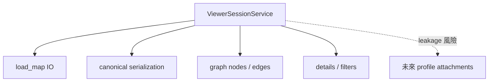
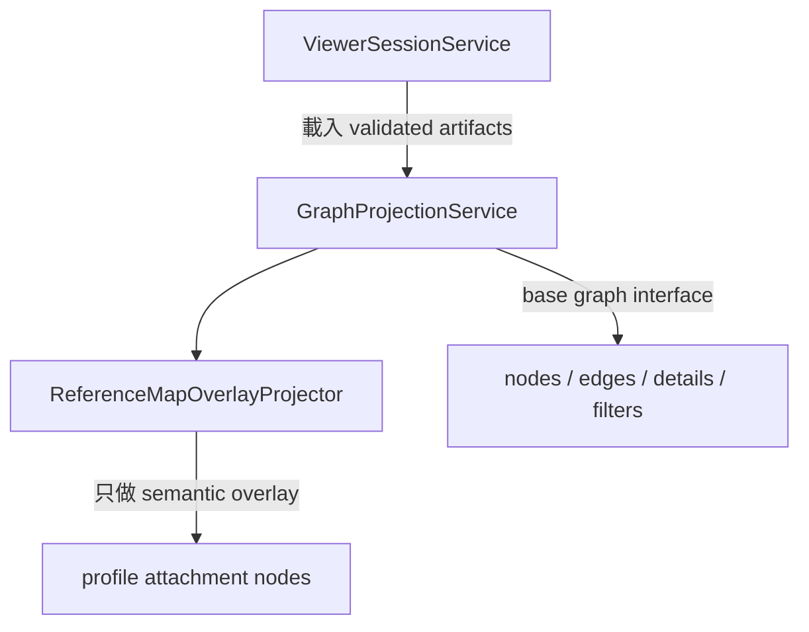
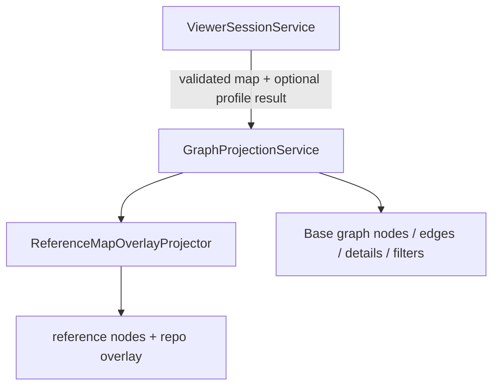

# 深化 Graph Projection Module 計畫

> **狀態：backend scope 已完成（2026-07-12）。** Frontend integration依最新分工延後，
> 不屬本次交付。

> **執行者注意：** 逐 task 實作本計畫。步驟使用 checkbox（`- [ ]`）語法以便追蹤進度。

**來源：** `architecture-review-20260627T143554.html`

**目標：** 把 canonical map projection 從 `ViewerSessionService` 拆出去，先由
backend 同一投影模型產生 JSON graph、Markdown 與 Mermaid，再讓 frontend render
該 contract；不得讓 UI 成為唯一可見輸出。

## 2026-07-12 Backend-only scope correction

- 本次 Plan 05–09 由 backend owner 執行；不得修改 `frontend/` 程式碼、測試、依賴或
  layout。2026-07-11 草案中的 frontend implementation 已撤回。
- Plan 06 本次完成條件收斂為 backend `GraphViewModel`、build-scoped API envelope、
  Mermaid、Markdown、CLI/API compatibility 與 valid/missing/invalid profile sidecar
  regression 全部通過。
- Frontend 日後只需消費這份 additive backend contract；Zod/TypeScript parser、node
  renderer、legend、filters、detail panel 與 browser visual QA 另由 frontend owner承接，
  不阻擋本次 backend plan 完成。

## 2026-07-11 Live-state correction

- `CanonicalMapLoader`、normalized `AiSystemMapV2`、10-plane/52-node catalog、
  `ProfileInferenceResult`、Mapping Completeness、readiness sidecar 與 degraded manifest
  load 已完成；不得重做這些 prerequisites。
- Runtime 仍有三套 topology owner：`ViewerSessionService` 投影 v1 API graph、
  `StaticExecutionArtifactService` 直接投影 normalized-v2 `system_map.mmd`、
  `MarkdownSummaryService` 投影 v1 `ai_system_map.md`。本計畫必須收斂成一套 graph
  projection，不能再新增第四套 truth。
- 本計畫分兩個 checkpoint：`06A` 先以 Plan 05 minimal index 完成 normalized-v2 base
  graph vertical slice；Plan 07 依第二個 consumer 需求擴充 index；`06B` 再完成
  reference/profile overlay 與共用 backend renderers。
- Persisted `ai_system_map.json` 與 `ViewerLoadResult.ai_system_map` 在 Plan 13 前仍保留
  v1 compatibility payload；graph、profile/readiness 與 renderers 改讀 normalized v2。

## Contract source of truth

| 主題 | Source |
|---|---|
| `GraphViewModel` / `ViewerLoadResult` | `docs/MODEL-CONTRACT.md` |
| Viewer 讀取端點 | `docs/API-GUIDE.md` `GET /api/map-builds/{build_id}` |
| 五態 / activation | `../../capability-map-assessment-decision-summary.md` + `docs/MODEL-CONTRACT.md` |
| Current runtime models | `src/systograph/core/models/viewer.py` + `frontend/src/types.ts` |
| Current build wiring | `map_build_pipeline.py` + `build_artifact_publisher.py` + `build_manifest_service.py` |

`GraphViewModel` 是 `ViewerLoadResult` 內的 ephemeral projection，不是 persisted sibling JSON。

## 2026-07-06 Confirmed Reference Map and Overlay Contract

完整決策見
[`../../capability-map-assessment-decision-summary.md`](../../capability-map-assessment-decision-summary.md)。
本計畫是 backend projection 與最小 viewer consumption contract 的唯一 owner；Plan 02
只提供 assessment result，Plan 03 只提供 validated artifacts/lifecycle。

`GraphProjectionService` 必須同時投影：

1. 固定 10-plane / 52-node reference map：`input_intent`、`control`、
   `ingestion_indexing`、`retrieval`、`extension_subsystems`、`evidence`、`generation`、
   `memory_state`、`governance_observability`、`deployment_topology`。
2. Per-repo overlay：目前 build/snapshot/environment scope 的 repo components、edges、
   assessments、activation 與 evidence refs。

Governance / observability 是 canonical plane；cross-plane governance lens 可保留為
backend-derived view，但不得複製 canonical facts。`extension_subsystems` 是 reference
grouping，不建立或恢復 legacy `ExtensionComponent` product surface。

Projection semantic kinds 明確分成 `reference_capability`、`repo_component`、
`unmapped_component`、`capability_candidate` 與 `profile_attachment`。Reference node 固定
存在不代表 repo 已實作；repo component 可對位多個 reference node，無可靠 mapping 時保留
unmapped。`profile_attachment` 是 15 個 profile findings 的獨立 semantic overlay，不得冒充
52-node reference identity。Frontend 不得從 label/topology 重新推論 mapping。

Identity boundary：`reference_node_id` 是固定 catalog coordinate，`component_id` 是 repo
scan identity，兩者不得因字串或 label 相同而視為同一 id。Step 6 / Step 7 只能使用 backend
明確產生的 `related_component_ids` 與 projection relationship table 建立 overlay；一個 repo
component 可對位多個 reference nodes，無 explicit relation 時不得猜測或補畫。

Viewer legend/minimal contract 必須顯示五態 status、六態 activation、direct/indirect/
explicit-negative evidence、reference/repo node 差異、static/runtime 差異、assessment scope，
以及 Mapping Completeness numerator/denominator/status counts 與非 confidence 說明。

Mapping Completeness 由 Step 6-1 `ProfileInferenceService` 計算；Step 7 只 surface / project（不重算）。Weights：detected=1、not_detected=1（coverage
gate 通過）、partial=.5、undetermined/conflicted=0；denominator 是全部固定 reference
nodes，activation/not_applicable 不排除任何 node。Frontend
只 render，不重算。

## 2026-07-07 UA 整合對齊

Reserved nullable UA semantic sidecar 不改變本計畫的 public projection contract；Phase2 active
path 不產生、不消費它。Step 7 只消費 Step 6 已驗證
的 assessment / profile result；`ua-analysis-result` 不新增 `GraphViewModel`、Viewer API 或
frontend 欄位。若 UA semantic candidate 無法對回既有 evidence id，應在 Step 6 candidate
flow 被丟棄或標成 unresolved，而不是由 projection 端猜測。

### Step 7 Projection Boundary（只畫，不重新判斷）

本計畫位在 Step 6 `ProfileInferenceService` 之後。Graph projection 的輸入是
validated normalized `AiSystemMapV2`、Step 6 assessment/profile result 與 reference
catalog metadata；輸出只是一份 `GraphViewModel`。Mermaid/Markdown renderers再消費同一
projection，不能各自重建 topology。

```text
Step 6 ProfileInferenceService
  -> reference node 五態 / activation / related refs / completeness
  -> Step 7 GraphProjectionService
       emit reference_capability nodes（52 格，按 10 planes 排版）
       emit repo_component / unmapped / profile_attachment overlay
       emit lens memberships / evidence links / detail refs
```

`GraphProjectionService` 不重新執行 `rule_id` matching、不呼叫
`component_bridge_registry.py`、不決定 `detected` / `partial` / `undetermined`、也不從
layout 反推 capability。若 Step 6 無 reliable mapping，Step 7 只能顯示 unmapped /
undetermined 或 degraded reason，不可猜測 anchor。

## 執行摘要

### 目標

拆出可單測的 backend graph projection，完成 `system_map.mmd`、`ai_system_map.md`、
API graph projection 與 degraded sidecar behavior；frontend integration 依 2026-07-12
scope correction 延後。

### 背景

目前 `ViewerSessionService` 同時做 I/O、validation、serialization 與 graph projection；frontend 又只認得一般 node，無法區分 topology 與 capability overlay。

### 目前 code 狀態

- backend `GraphNodeModel` 仍只有 v1 `type/slot/status` 等欄位，沒有 semantic kind、
  assessment/activation/scope、profile/reference ids 或 anchors。
- `ViewerSessionService.load_map()/build()/project_to_graph()` 都接 `RagSystemMap`，direct
  viewer route 尚未經 `CanonicalMapLoader`。
- `MapBuildPipeline` 已同時持有 legacy v1 map、normalized v2 map 與 profile/readiness；
  但 `BuildArtifactPublisher` 只把 v1 map交給 Markdown/viewer，manifest reload 也用 v1
  map重建 graph。
- `StaticExecutionArtifactService` 直接從 normalized v2 產生 `system_map.mmd` 與
  `execution_map.mmd`；`MarkdownSummaryService` 另從 v1 產生 `ai_system_map.md`。
- frontend `types.ts`、`SystemGraph.tsx`、`SystemNode.tsx` 與 `DetailPanel.tsx` 只接 base
  graph contract，尚無 reference/profile overlay、scope、completeness 或 degraded warnings。

### 相關檔案

- `src/systograph/core/services/viewer_session_service.py`
- `src/systograph/core/services/graph_projection_service.py`（新增）
- `src/systograph/core/services/reference_map_overlay_projector.py`（新增）
- `src/systograph/core/services/graph_mermaid_renderer.py`（新增）
- `src/systograph/core/services/graph_markdown_renderer.py`（新增）
- `src/systograph/core/models/viewer.py`
- `src/systograph/core/services/map_build_pipeline.py`
- `src/systograph/core/services/build_artifact_publisher.py`
- `src/systograph/core/services/build_manifest_service.py`
- `src/systograph/core/services/static_execution_artifact_service.py`
- `src/systograph/core/services/markdown_summary_service.py`
- Frontend files are handoff consumers only and are not modified in this plan run.

### 實作步驟

先 characterization 現有 v1 viewer behavior，再完成 06A normalized-v2 base graph與
v1 compatibility wiring。Plan 07 擴充 lookup 後，06B 加入 fixed reference/profile
overlay與共用 Mermaid/Markdown renderers；frontend parser/renderer/filter/details 延後。

### 驗收標準

CLI/API 可從同一 normalized v2 projection 產生可追溯的 component/edge/evidence map、
`system_map.mmd` 與 `ai_system_map.md`；backend contract 完整承載 semantic metadata，供
後續 frontend 直接 render、不需自行推論。

### 風險與注意事項

Profile attachment 是 static semantic overlay，不是本次 query 的 runtime path。若 anchor 不可靠應不畫 node，而不是猜測位置；12 的 trace boundary不得成為本計畫前置。

具體要做三件事：

1. **職責拆分**
   - `ViewerSessionService`：只負責 load / validate / serialize / session orchestration。
   - `GraphProjectionService`：只負責把 normalized `AiSystemMapV2`（與 optional
     `ProfileInferenceResult`）投影成 `GraphViewModel`。
   - `ReferenceMapOverlayProjector`：投影 fixed reference nodes，再疊加 evidence-backed repo
     components/assessments/profile findings；不產生 topology mapping edge。
   - `GraphMermaidRenderer` / `GraphMarkdownRenderer`：只消費同一份 `GraphViewModel`，
     不重新讀 canonical map 或重建 topology ids。

2. **interface 不要越長越胖**
   - viewer session 不應同時懂 file I/O、canonical map、base graph、profile overlay、anchor 選擇等所有細節。
   - 對外只保留窄 interface，例如 `project(system_map, profile_result=None) -> GraphViewModel`。

3. **不改 canonical artifacts**
   - profile attachment 只出現在 viewer payload / `GraphViewModel`，不 write back 到 `ai_system_map.json` 或 `profile_signals.json` 的 schema 本體。

**Reference node 與 repo overlay 代表什麼：**

- Reference node 代表固定 capability coordinate，不代表 repo 已實作。
- Repo overlay 代表目前 assessment scope 的 static facts/mapping；它不代表 runtime query
  真的走過該 component。
- Runtime observation 留給 `12-add-runtime-component-trace-contract.md` 的 deferred boundary。

**為何現在要做：**

`ViewerSessionService` 現在已經同時做：

| 現有職責 | 例子 |
|----------|------|
| artifact I/O | 讀 `ai_system_map.json` |
| validation | validate map schema |
| serialization | 組 viewer load payload |
| base graph projection | slot nodes、edges、unmapped、extensions |
| UI 輔助資料 | details、filters |

Phase2 還要再加：

| 新增需求 | 為什麼會讓現有 module 過重 |
|----------|------------------------------|
| profile projection | 把 `ProfileFinding` 轉成 graph node |
| anchor selection | 決定 profile node 掛在哪個 baseline node 旁 |
| detail provenance | 在 details 帶 evidence / related refs |
| filter membership | 例如 `filter:profile_attachments` |

若全部繼續堆在 `ViewerSessionService`，會造成：

- 一個 class 同時懂 session、map、profile、graph layout 語意，難測、難改。
- static graph 與 runtime trace 混在一起，UI 可能誤把「推斷存在 reranker」畫成「這次 query 真的經過 reranker」。

因此現在先把 **static graph projection** 獨立出來；**runtime observability** 由 plan `12` 另做，兩者 contract 分開。

**目前架構觀察：**

現況：

```text
ViewerSessionService.project_to_graph(RagSystemMap v1)
  -> GraphViewModel
       -> nodes / edges / details / filters
```

- 現行 v1 base graph已能從 legacy grounding slots、flows、unmapped、legacy extensions
  建 node；00A 已能 normalize 成 v2 generic components/edges，但 viewer 尚未接上。
- 但 `GraphNodeModel` 還沒有 profile attachment 專用欄位，例如：
  - `semantic_kind`（consumer 用來辨識這是 profile attachment node）
  - `profile_id`
  - `primary_anchor_node_id` / `anchor_node_ids`（這個 profile 掛在哪個 baseline node 旁）

缺口：

- backend 還不能穩定 emit「這是一個 profile attachment，不是普通 topology node」。
- profile findings 即使已在 `profile_signals.json`，也還不能一致地投影到 graph contract。

目標狀態：

```text
ViewerSessionService
  -> load + validate artifacts
  -> GraphProjectionService.project(map, profile_result, reference_map)
       -> fixed reference nodes（10 planes / 52 nodes）
       -> repo component / edge overlay
       -> five-state + activation + evidence projection
  -> GraphViewModel 回傳 frontend
```

**原始報告內容保留：**

- **Candidate：** 深化 graph projection module
- **Recommendation strength：** 強烈建議
- **Category：** in-process
- **Files：** `src/systograph/core/services/viewer_session_service.py`, `src/systograph/core/models/viewer.py`, `tests/unit/core/test_viewer_session_service.py`
- **Problem：** 目前這個 module 已經同時承擔 file load、validation、serialization、graph projection、details 與 filters；再加入 profile attachment projection 會讓 interface 太寬。
- **Solution：** 保留 `ViewerSessionService` 做 artifact/session orchestration，另把 graph projection 深化成一個藏在 `project(system_map, profile_result=None)` interface 後面的 module。

Original before diagram:



Original after diagram:



## 範圍

本計畫處理 backend generic projection、Mermaid/Markdown renderers與
`GraphViewModel` capability attachment contract。Frontend integration 依 2026-07-12
scope correction 延後。
Runtime query trace UI 仍屬 plan 12 deferred boundary，不是本計畫前置條件。

## 預期架構



## 優先檢視的檔案

- `src/systograph/core/services/viewer_session_service.py`
- `src/systograph/core/models/viewer.py`
- `src/systograph/core/models/profile_signal.py`
- `src/systograph/core/services/build_artifact_publisher.py`
- `src/systograph/core/services/build_manifest_service.py`
- `src/systograph/core/services/static_execution_artifact_service.py`
- `tests/unit/core/test_viewer_session_service.py`

本次不得修改 `frontend/src/`。Backend 必須以 versioned/additive JSON contract與測試
提供完整 handoff surface，讓 frontend owner 後續承接 parser、renderer 與 layout。

## 實作 Tasks

### 06A：Normalized-v2 base graph vertical slice（Plan 05 後）

- [x] 在任何 production extraction 前，補現有 `ViewerSessionService.load_map()`、
  `build()`、`project_to_graph()` 的 v1 characterization：nodes/edges/details/filters、
  ordering、empty/bad input、no mutation 與 public JSON shape；先確認 unchanged code PASS。
- [x] 再寫 normalized-v2 `GraphProjectionService` failing tests；interface 固定為
  `project(system_map, *, profile_result=None, artifact_ref=None) -> GraphViewModel`，
  `system_map` 只接受 `AiSystemMapV2`，並透過 Plan 05 `SystemMapIndex` 解析 canonical facts。
- [x] 先完成 base graph：`repo_component`、`unmapped_component`、canonical topology edges、
  evidence/risk details、positive filters與 deterministic ordering。`artifact_ref` 只允許
  build-relative ref，不得輸出 absolute local path。
- [x] `ViewerSessionService` 改成 load/JSON parse/`CanonicalMapLoader`/serialize/session owner；
  v1 input 先 adapt 成 v2 graph，但 `ViewerLoadResult.ai_system_map` 與既有 error reasons 保持
  compatibility。
- [x] `BuildArtifactPublisher` 同時接 legacy persisted map、normalized v2 與 profile/readiness，
  只呼叫一次 projection；`BuildManifestService.load()` 使用已載入的 normalized/profile
  重建相同 graph。Missing/invalid profile sidecar 仍 loaded base graph並回 warning。
- [x] 06A focused/web/CLI tests通過後才進 Plan 07；不得在 06A 偷加 grouping/location helper
  到 index，也不得先改 frontend visual hierarchy。

### 06B：Reference/profile overlay 與共用 backend renderers（Plan 07 後）

- [x] 擴充 frozen viewer models：semantic kind、reference/component/profile identity、plane、
  status、activation、typed evidence ids、conflicts、coverage gate、scope、anchor refs、
  related refs與 optional Mapping Completeness。`ViewerLoadResult` 保留 legacy core contract；
  warnings、`profile_inference_result` 與 `readiness_report` 繼續由 build-scoped envelope
  承載，不重複塞進 viewer payload。`GraphViewModel` 新增欄位維持 additive compatibility。
- [x] `ReferenceMapOverlayProjector` 依 catalog order emit固定 10 planes / 52
  `reference_capability` nodes，再以 Step 6 明確 related ids emit evidence-backed
  repo/unmapped/candidate overlays；無 mapping 不猜 component或 anchor。
- [x] 將 15 個 `ProfileFinding` emit成 `profile_attachment` nodes；label/description/status/
  depth/uncertainty/next checks使用 backend fields，anchor只從 related ids deterministic
  resolve。無 reliable anchor時保留 detail finding但不畫誤導性 topology node。
- [x] Mapping Completeness直接使用 `ProfileInferenceResult.mapping_completeness`；projection與
  renderers不得重算。`not_detected` surface coverage gate，`conflicted`
  surface field-specific refs。
- [x] Reference/repo/profile mapping只放專用 relation/membership/details；不得寫入
  `GraphViewModel.edges[]` 偽裝成 runtime traversal。`filter:profile_attachments` 使用正 filter
  semantics且預設 inactive。
- [x] `GraphMermaidRenderer` 與 `GraphMarkdownRenderer` 只消費同一 `GraphViewModel`；
  `system_map.mmd` / `ai_system_map.md` 使用 API graph相同 ids。完成 regression 後，
  `StaticExecutionArtifactService` 只保留 call/dataflow/execution/evidence與
  `execution_map.mmd`，v1 `MarkdownSummaryService` 不再是 active publisher owner。
- [x] 執行 backend focused/full regression，並以 valid/missing/invalid sidecar三種 live
  build-scoped API payload做 HTTP regression；確認 base graph fail-soft、warnings 留在
  build envelope，且輸出不含 absolute local path、raw source或完整 secret。

## 驗收標準

- [x] 對 map-only payloads，`ViewerSessionService` 維持既有 loaded/error/public map behavior，
  但 validation/adapter 由 `CanonicalMapLoader` 統一；missing sidecar只產生 warning。
- [x] `system_map.mmd` 與 Markdown/API graph 使用同一組 node/edge ids，不各自重建 topology。
- [x] non-grounded LLM app、tool agent、RAG system、grounded agent 與 workflow
  fixtures 都能產生非空且語意正確的 Mermaid。
- [x] Base graph projection behavior 仍由既有 viewer tests 涵蓋。
- [x] `GraphProjectionService` 可在無 file I/O 的情況下 unit test。
- [x] Build-time、manifest reload、direct viewer CLI/API 對等 input 產生相同 graph contract。
- [x] Reference nodes 與 repo overlay 都由 backend emit，具 explicit semantic fields 與 stable ids。
- [x] Fixed reference nodes 與 repo overlay nodes 使用不同 semantic kinds；reference node
  不因存在於底圖而自動成為 detected/enabled。
- [x] 五態、activation、field conflicts、coverage gate 與 Mapping Completeness 皆由 Step 6-1
  計算、Step 7 projection **surface**；backend 不產生第二套推論。
- [x] 不向 topology `GraphViewModel.edges[]` 新增會誤導成 runtime path 的 mapping edges。
- [x] `filter:profile_attachments` 可用，但預設不 active。
- [x] Backend contract tests 以 `semantic_kind="profile_attachment"` 作為 consumer renderer selection marker。
- [x] `profile_attachment` 不取代 `reference_capability` identity，且無可靠 anchor時不產生
  synthetic topology edge/node placement。
- [x] Graph/artifact refs不暴露 absolute local path、raw source或完整 secret values。
- [x] Runtime query trace highlighting 不在此實作；本計畫記載 trace focus 依賴獨立的 runtime trace contract。
- [x] JSON + Mermaid + Markdown、CLI/API compatibility與 sidecar degraded regression 是本次
  06A/06B backend gate；frontend implementation 依 2026-07-12 scope correction 延後。

## 驗證

- [x] `.venv/bin/pytest tests/unit/core/test_viewer_session_service.py -q`
- [x] 為 `GraphProjectionService` 與 `ReferenceMapOverlayProjector` 新增 focused tests。
- [x] `.venv/bin/pytest tests/contracts/test_ai_system_map_schema.py tests/contracts/test_ai_system_map_v2_schema.py -q` 以確認 canonical schema 未被 mutate。
- [x] `.venv/bin/pytest tests/integration/test_map_build_service.py tests/web/test_viewer_routes.py tests/web/test_map_build_apply_routes.py tests/cli/test_viewer_command.py -q`
- [x] `.venv/bin/ruff check src tests && .venv/bin/mypy src tests`
  （**2026-07-13 重驗**：先前勾選曾與實際 E501 / format drift 不符；已折行中文註解並
  `ruff format` 後，`uv run ruff check src tests` + `uv run ruff format --check src tests`
  通過。細節見
  `docs/work/Timmy/schedule/report/2026-07-12/2026-07-12-backend-validation-manual-qa-REP.md`
  Correction 節。）
- [x] `rg -n "profile_attachment|semantic_kind|primary_anchor_node_id|filter:profile_attachments" src tests docs/work/Timmy/design`
- [x] `git diff --check -- docs/work/Timmy/schedule/plan/unfinish/phase2/static-trace-plan/s1-track-a-index-projection/06-deepen-graph-projection-module.md`

## 相依關係

- Profile sidecar lifecycle、Step 6 inference/reference catalog/completeness已完成，是本計畫
  可直接消費的 live prerequisites。
- 06A依賴 Plan 05 minimal index；Plan 07 依 06A 第二 consumer需求擴充；06B再依 Plan 07
  完成 grouping/location/anchor lookup與 backend renderers。
- Plan 08/09 必須等 06B graph/API contract與 regression穩定後才遷移/清理 consumers。

## 不在範圍內

- 本次不修改 frontend parser、components、styles、dependencies或 browser visual behavior。
- 不新增 profile-level confirm actions 或 mutation APIs。
- 不將 graph projection output write back 到 `ai_system_map.json`。
- 不將 repo overlay mapping 當成 runtime topology truth。

## P0 Execution Mapping 補充（2026-07-03）

Graph projection 需清楚分成兩張圖：

- `system_map.mmd`：component-level system architecture / readiness map。
- `execution_map.mmd`：static inferred query path / call-dataflow sequence，由現有
  `StaticExecutionArtifactService` 擁有；未來 dynamic `00` 不得改寫 canonical topology graph。

本計畫可以提供共用 renderer primitives 與 viewer projection conventions，但不得把 execution
path edges 混入 canonical topology graph。若 UI 顯示 execution path，需使用明確的 static
execution filter / layer，並標示 runtime 未驗證。
