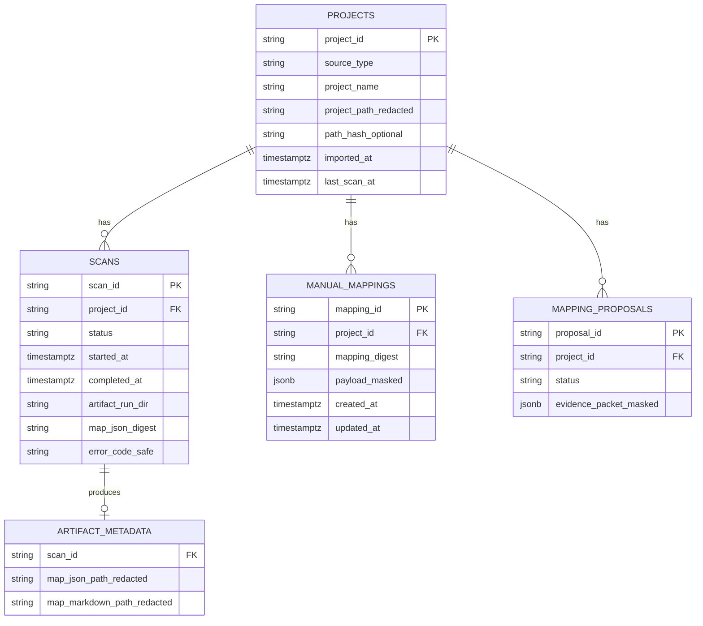
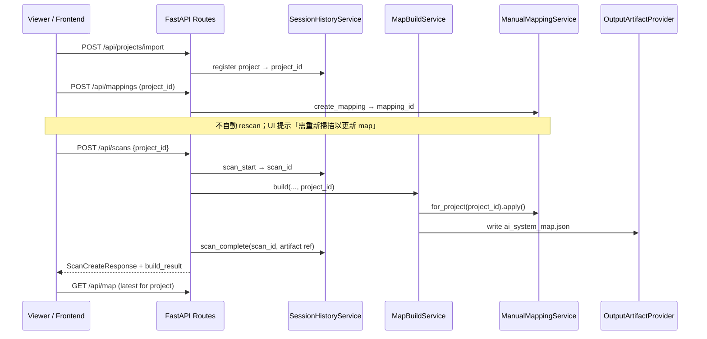

# Durable Project Registry、Manual Mapping 持久化與 Rescan UX 整合計畫

> **For agentic workers:** REQUIRED SUB-SKILL: Use `superpowers:subagent-driven-development` (recommended) or `superpowers:executing-plans` to implement this plan task-by-task. Steps use checkbox (`- [ ]`) syntax for tracking.
>
> **編號說明：** 使用者建議的 `28-*` 已被 `28-introduce-openapi-generated-frontend-sdk.md` 占用；本計畫以 **Task 41** 作為跨 Task 26/27 的整合與 UX 主線，說明 **何時做什麼** 與 **資料如何以 `project_id` 串接**。

**Goal:** 讓使用者能在重啟後仍找回同一專案、保留已確認的 manual mapping，並以明確的 rescan 流程取得更新後的 `ai_system_map.json` — 全程以 `project_id` 為穩定 hub，不把 mapping 狀態塞進 canonical JSON。

**Architecture:** `project_id` 是 registry hub；`scan_id` 是每次掃描執行紀錄；`mapping_id` 是使用者決策紀錄。Core 行為不變：`ManualMappingService.apply()` 在 map build 時 overlay component detection；持久化由 Task 26 domain port + Task 27 PostgreSQL adapter 承接。Frontend rescan 走既有 `POST /api/scans`，不自動在 mapping save 後觸發 build。

**Tech Stack:** Python protocols, Pydantic v2, FastAPI, pytest；後期 SQLAlchemy 2.x + PostgreSQL + Alembic（Task 27）；React/TypeScript viewer（Hardy frontend issues）。

**Dependencies:** `26-implement-persistent-session-store-and-scan-history.md` → `27-introduce-database-backed-storage-layer.md`；本計畫不取代 26/27，而是定義整合邊界、rescan UX 與驗收標準。

---

## Q1 快速回答：`project_id` 是否為 durable mapping 與 project reuse 的連接點？

**是。** 在目前程式碼與目標架構中，`project_id` 就是 hub / foreign key 錨點：

| 實體 | 主鍵 | 關聯 | 目前狀態 |
|------|------|------|----------|
| Project | `project_id`（如 `project:<uuid>`） | — | `InMemorySessionStore.import_project()` 每次 import 產生新 UUID；重啟後遺失 |
| Scan | `scan_id`（如 `scan:<uuid>`） | `project_id` FK | `scan_routes.create_scan()` 每次 POST 產生新 `scan_id`；尚未持久化 history |
| ManualMapping | `mapping_id`（如 `mapping:<uuid>`） | `project_id` FK | `InMemoryManualMappingRepository` 以 `mapping.project_id` 篩選；重啟後遺失 |
| MappingProposal | `proposal_id` | `project_id` FK | 同 in-memory；accept/edit 後寫入 `ManualMapping` |

**Map build 整合點（已存在）：** `MapBuildService._detect_components()` 在 `project_id is not None` 時呼叫 `manual_mapping_service.for_project(project_id).apply(result)`，因此 **同一 `project_id` 上的 confirmed mappings 會在每次 rescan/build 時重新套用**。

**尚未完成的部分：** project registry、scan history、manual mapping 的 **跨重啟持久化**；re-import 同一路徑時 **dedup / reuse 既有 `project_id`**；Frontend 明確 rescan UX。

**Canonical 邊界：** `ai_system_map.json` 仍是每次 scan 的 snapshot artifact；manual mapping **不**寫入 JSON schema，只影響下一次 build 的 detection overlay。

---

## 問題陳述（使用者痛點）

1. **重啟即失憶：** `InMemorySessionStore` 與 `InMemoryManualMappingRepository` 都在 process memory；後端重啟後 `project_id`、已確認 mapping、scan 結果全部消失（`docs/API-GUIDE.md` 已明確警告）。
2. **重複 import 無法 reuse：** `session_store.import_project()` 每次都 `uuid4()` 新 `project_id`，即使 `project_path` 相同也無法沿用舊 mapping。
3. **Mapping 與 map 不同步的認知落差：** 使用者 accept proposal / 建立 manual mapping 後，以為 viewer 會自動更新；實際需 **帶同一 `project_id` 再跑一次 scan/build** 才會反映到 `ai_system_map.json` 與 `/api/map`。
4. **缺少 project 列表與 history：** 無 `GET /api/projects`、無 scan 列表；UI 無法「選回上次專案」或「對同一專案 rescan」。
5. **Rescan 語意未產品化：** boundary decision rescan 與 post-mapping rescan 在 API 層都是 `POST /api/scans`，但缺少端到端 trace script 與 frontend 狀態機說明。

---

## 目標資料模型（邏輯 ER）



### 關係語意

- **`project_id`：** 穩定專案身份；manual mapping、proposal、scan history 全部 scope 在此之下。
- **`scan_id`：** 單次掃描執行；產出 artifact reference / digest，**不**把 DB row 當 canonical map。
- **`mapping_id`：** 單筆使用者決策；生命週期長於單次 scan；rescan 時由 `apply()` 依 `evidence_ids` / `source_unmapped_id` 與 **本次** detection 結果比對（`_has_live_evidence`）。
- **Re-import 策略（可選 Phase B）：** 以 canonical `project_path`（或 upload workspace id）計算 `path_hash`；若命中既有 active project 則回傳同一 `project_id`（HTTP 200 + `reused: true`），否則新建。

### 程式碼現況（已驗證）

```38:75:src/kai_mind/core/services/manual_mapping_service.py
class ManualMappingRepository(Protocol):
    ...
    def list_for_project(self, project_id: str) -> list[ManualMapping]:
        ...

class InMemoryManualMappingRepository:
    ...
    def list_for_project(self, project_id: str) -> list[ManualMapping]:
        return sorted(
            [mapping for mapping in self._items.values()
             if mapping.project_id == project_id],
            ...
        )
```

```246:262:src/kai_mind/core/services/map_build_service.py
    def _detect_components(..., project_id: str | None, ...) -> ComponentDetectionResult:
        result = self._component_detection_service.detect(...)
        if project_id is not None and self._manual_mapping_service is not None:
            return self._manual_mapping_service.for_project(project_id).apply(result)
        return result
```

```38:51:src/kai_mind/web/session_store.py
    def import_project(...):
        record = ProjectRecord(
            project_id=f"project:{uuid4()}",
            ...
        )
        self._projects[record.project_id] = record
        return record
```

---

## 架構流程（Rescan + Mapping）



---

## 分階段路線圖（WHEN to do WHAT）

| 階段 | 時機 | 負責 Plan | 交付物 | 使用者可感知改善 |
|------|------|-----------|--------|------------------|
| **A. Quick wins（現在 / MVP）** | 不依賴 DB；可與 bugfix gate 並行 | **本計畫 Task A** | `trace_mapping_rescan_flow.sh`、文件補 rescan 契約、可選 local `project_id` registry JSON | CLI 可重現 import → mapping → rescan；開發者手動 `--project-id` reuse |
| **B. Task 26** | Gate 3（#162–#175）完成後；#150、#174 已修 | `26-implement-persistent-session-store-and-scan-history.md` | Domain models、`ProjectHistoryRepository` / `ScanHistoryRepository`、`SessionHistoryService`、`GET /api/projects*`、bounded in-memory | 重啟前 bounded memory 內可 list projects/scans；API contract 凍結 |
| **C. Task 27** | Task 26 contract freeze 後 | `27-introduce-database-backed-storage-layer.md` | PostgreSQL tables、`PostgresManualMappingRepository`、app restart 後資料仍在 | 真正 durable project + mapping + scan metadata |
| **D. Frontend UX** | Task 26 API 可用後（DB 可選） | Hardy #176–#181 + 本計畫 Task D | Project picker、post-mapping「Rescan to apply」CTA、scan history 側欄 | 使用者不需記 `project_id`、不誤以為 mapping 已改 map |
| **E. Path dedup（可選）** | Task 27 穩定後 | 本計畫 Task E | Import idempotency by `path_hash` | 同一路徑 re-import 沿用舊 mapping |

**與 `00-implementation-order.md` 對齊：** 執行序 13 = Task 26，14 = Task 27；本計畫 **不插入 bugfix queue 之前**，但 Phase A quick wins 可提早做。

---

## API 變更摘要

### Task 26 新增（本計畫消費，不重定義）

| Method | Path | 用途 |
|--------|------|------|
| GET | `/api/projects` | 列出已登記專案（redacted path、last_scan_at） |
| GET | `/api/projects/{project_id}` | 單一專案 metadata |
| GET | `/api/projects/{project_id}/scans` | 該專案 scan history |
| GET | `/api/scans/{scan_id}` | 單次 scan 狀態與 artifact reference |

### 既有 API（行為保持，語意釐清）

| Method | Path | 變更 |
|--------|------|------|
| POST | `/api/projects/import` | Task 26 改走 `SessionHistoryService`；Phase E 可選 `reused` flag |
| POST | `/api/scans` | 正式 rescan 入口；**必須**帶既有 `project_id`；完成後更新 latest map |
| GET/POST/PATCH | `/api/mappings*` | 不變；persistence 由 repository adapter 替換 |
| GET | `/api/map` | 需能解析「當前 session 的 project context」或 query `?project_id=`（若 Task 26 尚未支援，Frontend 用 scan response 的 build_result） |

### 明確不做

- **不在** `POST /api/mappings` 或 proposal decision 後 **自動** 呼叫 `MapBuildService.build()`。
- **不新增** 把 manual mapping 寫入 `RagSystemMap` / `ai_system_map.json` 的欄位。
- **不把** mapping proposal LLM payload 或 raw source 存入 DB。

---

## DB Schema 草圖（Task 27 migration 0001）

> 僅 metadata + masked JSONB；canonical map 仍在 filesystem artifact。

```sql
-- projects: registry hub
CREATE TABLE projects (
    project_id          TEXT PRIMARY KEY,
    source_type         TEXT NOT NULL,
    project_name        TEXT NOT NULL,
    project_path_hash   TEXT,              -- optional dedup; not raw path
    path_redacted       TEXT NOT NULL,     -- masked display only
    imported_at         TIMESTAMPTZ NOT NULL DEFAULT now(),
    last_scan_at        TIMESTAMPTZ,
    metadata            JSONB NOT NULL DEFAULT '{}'::jsonb
);

CREATE INDEX idx_projects_path_hash ON projects (project_path_hash)
    WHERE project_path_hash IS NOT NULL;

-- scans: one execution per POST /api/scans
CREATE TABLE scans (
    scan_id             TEXT PRIMARY KEY,
    project_id          TEXT NOT NULL REFERENCES projects(project_id) ON DELETE CASCADE,
    status              TEXT NOT NULL,
    started_at          TIMESTAMPTZ NOT NULL,
    completed_at        TIMESTAMPTZ,
    output_run_dir      TEXT,
    map_json_digest     TEXT,
    error_code          TEXT,
    metadata            JSONB NOT NULL DEFAULT '{}'::jsonb
);

CREATE INDEX idx_scans_project_id_started ON scans (project_id, started_at DESC);

-- manual_mappings: durable user decisions
CREATE TABLE manual_mappings (
    mapping_id          TEXT PRIMARY KEY,
    project_id          TEXT NOT NULL REFERENCES projects(project_id) ON DELETE CASCADE,
    mapping_digest      TEXT NOT NULL,
    decision            TEXT NOT NULL,
    mapping_type        TEXT NOT NULL,
    payload             JSONB NOT NULL,    -- ManualMapping fields; secret-validated before insert
    created_at          TIMESTAMPTZ NOT NULL,
    updated_at          TIMESTAMPTZ NOT NULL
);

CREATE INDEX idx_manual_mappings_project ON manual_mappings (project_id, created_at);

-- mapping_proposals: optional same migration; same project_id FK
CREATE TABLE mapping_proposals (
    proposal_id         TEXT PRIMARY KEY,
    project_id          TEXT NOT NULL REFERENCES projects(project_id) ON DELETE CASCADE,
    status              TEXT NOT NULL,
    payload             JSONB NOT NULL,
    created_at          TIMESTAMPTZ NOT NULL,
    updated_at          TIMESTAMPTZ NOT NULL
);
```

**Repository 對應：** `ManualMappingRepository` → `manual_mappings`；`ProjectHistoryRepository` → `projects`；`ScanHistoryRepository` → `scans`。

---

## 實作 Tasks

### Task A: Quick wins — trace script 與 rescan 契約（可立即開始）

**Files:**
- Create: `scripts/trace_mapping_rescan_flow.sh`
- Modify: `scripts/trace_all.sh`（選配：加入新 script）
- Modify: `docs/API-GUIDE.md`（一節「Mapping 後 Rescan」）

- [ ] **Step 1:** Script 流程：`import` → `POST /api/scans`（初次）→ `POST /api/mappings` → `POST /api/scans`（第二次，reuse `--project-id`）→ `GET /api/mappings` → `GET /api/map`
- [ ] **Step 2:** 第二次 scan 前後比對 `build_result` / unmapped 數量（或 digest）變化
- [ ] **Step 3:** 支援 `--project-id` 跳過 re-import，文件化 reuse 方式
- [ ] **Step 4:** 可選：開發用 `outputs/.kai_mind_project_registry.json`（僅 local dev flag；**不**進 production default）

```bash
scripts/trace_mapping_rescan_flow.sh --project-path tests/fixtures/rag_projects/basic_qdrant_ollama_rag
```

### Task B: 對齊 Task 26 — 不 duplicate domain 工作

**Files:** 見 `26-implement-persistent-session-store-and-scan-history.md`

- [ ] **Step 1:** 確認 `ManualMappingRepository` 與 `ProjectHistoryRepository` 在 DI 中為 **同一 app 生命週期 singleton**
- [ ] **Step 2:** `create_scan` 改為 `SessionHistoryService.start_scan` / `complete_scan`，持久化 `scan_id` ↔ `project_id`
- [ ] **Step 3:** `import_project` 改為 `SessionHistoryService.register_project`
- [ ] **Step 4:** 新增 history routes；`mapping_routes` 仍只依賴 `ManualMappingService`

### Task C: 對齊 Task 27 — PostgreSQL manual mapping adapter

**Files:** 見 `27-introduce-database-backed-storage-layer.md`

- [ ] **Step 1:** 實作 `PostgresManualMappingRepository` 通過既有 contract tests
- [ ] **Step 2:** App restart integration test：import → mapping → restart app → list mappings → rescan → map 反映 overlay
- [ ] **Step 3:** 確認 transaction 邊界在 service 外層；route 不碰 ORM

### Task D: Frontend rescan UX（Hardy；backend contract 就緒後）

**Files（frontend，參考）：**
- `frontend/src/store/viewerStore.ts`
- `frontend/src/services/viewerApi.ts`
- `frontend/API_CONTRACT.md`

- [ ] **Step 1:** Store 保存 `project_id`、`scan_id`、mapping 列表
- [ ] **Step 2:** Mapping 成功後顯示非阻塞提示：「變更將在下次 Rescan 生效」+ CTA 觸發 `POST /api/scans`
- [ ] **Step 3:** Rescan loading / error / boundary decision 狀態與初次 scan 共用
- [ ] **Step 4:** Project picker 消費 `GET /api/projects`（Task 26 完成後）

### Task E（可選）: Import path dedup

**Files:**
- Modify: `src/kai_mind/core/services/session_history_service.py`
- Modify: `src/kai_mind/web/routes/project_routes.py`
- Test: `tests/web/test_project_import_dedup.py`

- [ ] **Step 1:** 計算 canonical path hash（normalize + redaction policy 一致）
- [ ] **Step 2:** `POST /api/projects/import` 命中時回傳既有 `project_id` + `reused: true`
- [ ] **Step 3:** 文件說明：dedup 是 best-effort；symlink / path 別名可能產生不同 hash

---

## 明確禁止（What NOT to do）

1. **不要把** `ManualMapping` / `MappingProposal` **序列化進** `ai_system_map.json` 或 `ai-system-map/v1` schema。
2. **不要在** mapping create/update 或 proposal decision handler **隱式觸發** map build（避免 race、boundary gate 被 bypass、意外 artifact 寫入）。
3. **不要用** DB JSONB 保存 raw repo 內容、完整 secret、或未 mask 的 absolute path。
4. **不要** 在 Task 26 完成前引入 ORM 到 `core/` 或 `web/routes`。
5. **不要** 假設 re-import 自動 merge mapping — 除非 Task E dedup 明確實作並測試。

---

## 驗收標準

- [ ] 同一 `project_id` 上建立的 confirmed manual mapping，在 **下一次** `POST /api/scans` 後反映於 `ai_system_map.json`（component/extension overlay）。
- [ ] Task 27 完成後：backend restart 仍可 `GET /api/mappings?project_id=...` 取得相同 mapping 筆數與 `mapping_id`。
- [ ] Task 26 完成後：`GET /api/projects` 可列出至少 import 過的專案；`GET /api/projects/{id}/scans` 含多次 rescan。
- [ ] `trace_mapping_rescan_flow.sh` 在乾淨環境 exit 0，並印出兩次 scan 的 `scan_id` 不同、`project_id` 相同。
- [ ] 文件中明確區分：`POST /api/map/build`（無 project session）vs `import → scans`（有 `project_id` + mapping）。
- [ ] 無 regression：secret masking、scan boundary gate、read-only scanner 保證。

---

## 測試計畫

| 層級 | 案例 | 命令 / 位置 |
|------|------|-------------|
| Unit | `ManualMappingService.apply` 跨 rescan 仍套用 confirmed；evidence 消失則 skip | `tests/unit/core/test_manual_mapping_service.py` |
| Unit | `InMemoryManualMappingRepository.list_for_project` project 隔離 | 同上 |
| Web | import → mapping → scan → 第二次 scan；同一 project_id | `tests/web/test_mapping_rescan_flow.py`（新建） |
| Web | restart 後 mapping 仍在（Task 27） | `tests/web/test_storage_app_wiring.py` |
| Contract | history API 不含 raw path/secret | `tests/web/test_history_routes.py`（Task 26） |
| Script | 端到端 trace | `scripts/trace_mapping_rescan_flow.sh` |
| Frontend | mapping 後 CTA rescan（Task D） | Vitest mock scan API |

```bash
.venv/bin/pytest tests/unit/core/test_manual_mapping_service.py tests/web/test_mapping_rescan_flow.py -v
scripts/trace_mapping_rescan_flow.sh
.venv/bin/pytest
.venv/bin/ruff check .
.venv/bin/mypy
```

---

## 相依性與 GitHub Issues

| 項目 | 連結 / 檔案 |
|------|-------------|
| Persistent session / scan history | [#126](https://github.com/1104030360/Local-AI-Health-Doctor/issues/126) → Task 26 |
| Session store growth bound | [#150](https://github.com/1104030360/Local-AI-Health-Doctor/issues/150) |
| Session store thread safety | [#174](https://github.com/1104030360/Local-AI-Health-Doctor/issues/174) |
| PostgreSQL storage | [#127](https://github.com/1104030360/Local-AI-Health-Doctor/issues/127) → Task 27 |
| Frontend project/scan flow | [#176](https://github.com/1104030360/Local-AI-Health-Doctor/issues/176)–[#181](https://github.com/1104030360/Local-AI-Health-Doctor/issues/181) |
| 實作順序 master | `00-implementation-order.md` 執行序 13–14 |
| Mapping 領域說明 | `docs/work/Timmy/meeting/contract-model/06-mapping-workflow.md` |
| API 契約 | `docs/API-GUIDE.md`、`frontend/API_CONTRACT.md` |

---

## 官方 / 專案參考

- Task 26/27 已列 SQLAlchemy、Alembic、JSONB 官方連結。
- 專案原則：`CLAUDE.md` — scanner read-only、local-first、`ai_system_map.json` 為 canonical artifact。
- Mapping 不進 canonical JSON：`docs/work/Timmy/meeting/contract-model/06-mapping-workflow.md` §2、§7。

---

## 完成 Gate（與其他 plan 一致）

```bash
.venv/bin/pytest
.venv/bin/ruff check .
.venv/bin/mypy
git diff --check
git status --short
```

Expected: all tests passed；ruff/mypy clean；僅 intentional files changed。
