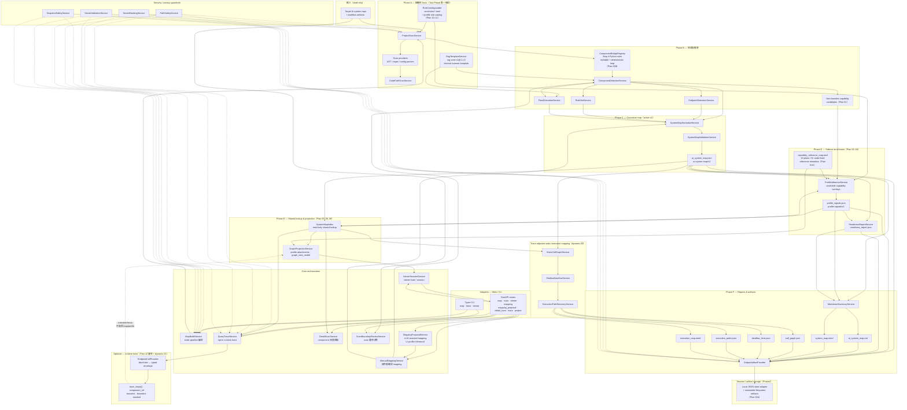

# Phase 2 Plan Index

## Phase2 完成後預計後端架構

> **互動式圖表（建議從這裡看）：** [phase2-backend-architecture.html](./phase2-backend-architecture.html)
> **點擊各 Layer / Phase 標題列可展開**進階架構（檔案路徑、資料流、Plan 對照）。
> 分頁：① 三層總覽 · ② Static 流水線 A→F · ③ Static vs Dynamic · ④ 時序 · ⑤ Plan 表

**狀態（2026-07-06）：** static path `00A`～`15`（含 `01A`、`01B`、`03A`）落地後的 core 形貌；dynamic `00` 為 P0 static inferred execution mapping，dynamic `01` 為 post-Phase2 runtime overlay。
**預設 cutover：** `00A` 相容遷移 → `13` active v2 cutover → `14` validation → `15` 完全退役 legacy compatibility。
**虛線框** = 計畫中、repo 尚未完整實作（`ProfileInferenceService`、`SystemMapIndex`、`GraphProjectionService` 等）。

<details>
<summary>Mermaid 原始圖（進階 / 可嵌入其他文件）</summary>



</details>

### 分層與資料流（對照 repo 慣例）

```text
Adapters (web/ · cli/)  →  Core services  →  Providers / models / rules
         │                        │
         │                        ├─ Static: scan → v2 map → profile → readiness → index → projection
         │                        ├─ Static execution: call graph → dataflow hints → execution paths
         │                        └─ Dynamic: opt-in trace → resolve refs via SystemMapIndex → transient UI
         └─ 不 duplicate scanner logic；core/ 不依賴 web/ 或 cli/
```

| 區塊 | 主要 Plan | Phase2 完成後職責 |
|---|---|---|
| Scan facts + detection | `01`, `01B`, rules | read-only 抽結構性 facts；Step 4 Python bridge registry 負責 facts → component / unmapped / capability signal；`rag-core-v1` 只作 legacy v1 adapter input；non-baseline → capability candidate |
| Capability reference map | `01A` | 10-plane / 52-node fixed metadata catalog；reference node 與 repo component 分離；TOML 不擁有 executable 判定 |
| Canonical v2 | `00A` → `13`; `15` after validation | active `ai-system-map/v2`；15 只在相容驗證後退役 legacy compatibility |
| Profile / assessment sidecar | `02`–`04`, `10`–`11` | registry-driven、可堆疊 capabilities；統一五態與 activation；與 mapping proposal 分離 |
| SystemMapIndex | `05`–`09` | 共用 id/evidence/anchor lookup；收斂分散的 `_find_*` |
| Graph projection | `06` | backend-owned fixed reference map + repo evidence overlay `graph_view_model`；frontend 不推論 |
| Readiness | `03`, `02`, `14` | evidence-backed `readiness_report.json`；readiness findings 由 Capability Map / profile / evidence gaps 推導 |
| Static execution map | dynamic `00` | `call_graph.json`、`dataflow_hints.json`、`execution_paths.json`、`execution_map.mmd`；static inferred only |
| Runtime trace | `12`, dynamic `01` | **不**由 static profile 推 runtime path；opt-in、不 mutate artifacts |
| Apply / build history | `03A` | `scan_id` 與 `build_id` 分離；snapshot reuse；Apply 建立新版本；local JSON persistence |
| Validation gate | `14` | 四象限 fixture + real-world static + execution artifact regression + Apply/restart recovery |

### 刻意不在 Phase2 後端

Phase3+（`25` 起）：project upload、durable DB adapter、OpenAPI SDK 等 **platform foundation**
— 不納入上圖，避免與 static readiness MVP 混淆。

---

Phase 2 分為 **靜態掃描 / release-readiness** 與 **動態 runtime trace** 兩條線。
檔案編號自 `00A` 起保留原序，避免 issue、commit 與歷史討論失去對應。

## Folder 結構

| Folder | 內容 | 說明 |
|---|---|---|
| [`static-trace-plan/`](./static-trace-plan/) | `00A`～`15`（含 `01A`、`01B`、`03A`） | 靜態掃描、legacy compatibility migration、Step 4 component bridge registry、capability reference map、profile inference、system map v2、graph projection、final validation、compatibility retirement |
| [`dynamic-trace-plan/`](./dynamic-trace-plan/) | `00` 起 | `00` 為 static inferred call graph / execution path；`01` 起為 runtime trace 實作 |

## 邊界

```text
Static (00–15)
  = read-only scan → ai_system_map / profile_signals / readiness_report / reports
  = 回答「系統看起來有哪些元件、能力、風險」

Static execution (dynamic-trace-plan/00)
  = static call graph → shallow dataflow hints → execution_paths / execution_map
  = 回答「query 大致可能如何流經系統」，但不是 runtime proof

Dynamic runtime (dynamic-trace-plan/01+)
  = opt-in runtime observation → trace_steps / component_ref
  = 回答「這次 query 實際走過哪些元件」
```

- Plan `12`（`static-trace-plan/12-add-runtime-component-trace-contract.md`）只凍結
  **語意邊界**，不是實作 checklist；不阻擋 static MVP。
- 既有 **Query Trace MVP**（finished Plan `22`）是 black-box endpoint 呼叫，**不是**
  internal component call graph；dynamic `01` 才開始往 typed runtime steps 推進。
- dynamic `00` 是 static inferred execution mapping，可在 00A/03/05 穩定後開始，
  並應在 `14` final validation 前完成。
- dynamic `01` runtime trace 在 active static path `00`～`15` 完成前不要啟動。

## 路徑選擇（2026-07-03）

| 情境 | 建議路徑 |
|---|---|
| 預設 / 使用者已確認 | `00A` → `13` → `14` → `15`；15 屬 active scope，但只能在 14 通過後執行 |
| 發現仍有 v1 consumer 或 migration gap | 停在 `13` compatibility path，修 00A adapter 或 consumer migration |

詳見 [`static-trace-plan/README.md`](./static-trace-plan/README.md) 與
[`docs/work/Timmy/schedule/plan/unfinish/README.md`](../README.md)。

## 相關文件

- 實作方向摘要：`docs/work/Timmy/design/phase2-00-14-implementation-direction-2026-07-02.md`
- Model contract：`docs/MODEL-CONTRACT.md`
- Capability Map 決策：[capability-map-assessment-decision-summary.md](./capability-map-assessment-decision-summary.md)
- Frontend Graph Studio contract：`docs/work/Meeting-Sync/meeting_sync_2026_07_05/frontend-graph-studio.md`
- Frontend runtime trace 方向（先不要動工）：`docs/work/Meeting-Sync/meeting_sync_2026_07_05/frontend-runtime-trace.md`
