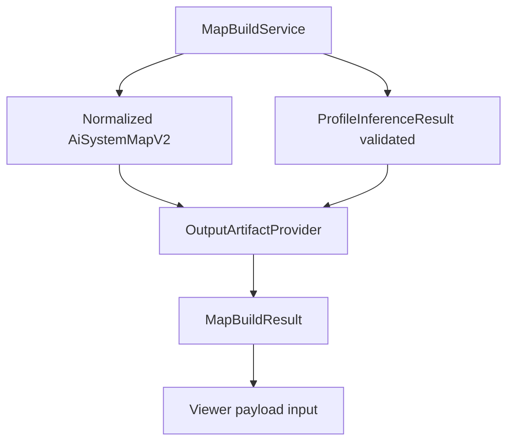

# Consolidate Profile Sidecar Lifecycle Plan

> **執行者注意：** Implement this plan task-by-task. Steps use checkbox (`- [ ]`) syntax for tracking.

**Source:** `architecture-review-20260627T143554.html`

**Goal:** 收斂 Phase2 artifact lifecycle，讓 canonical map、capability sidecar、
readiness JSON、Markdown、Mermaid 與 viewer payload 都從同一份 validated build
result 產生，而不是散落在 routes、CLI 或 viewer load 裡。

**Why now:** 架構審查的最高優先建議是先處理 profile sidecar lifecycle，再處理 graph projection。若 sidecar path、validation 與 result assembly 分散，後續 `ProfileInferenceService`、viewer load、CLI output、tests 都會各自重建 artifact 語意，造成 drift。

**Current architecture observation:** `OutputArtifactProvider` 目前只管理 `ai_system_map.json`、`ai_system_map.md`、`map-error.md`。`MapBuildService.build()` 目前寫 map JSON 與 markdown，然後直接呼叫 `ViewerSessionService.build()` 產生 viewer payload。

**Phase2 dependency note:** `profile_signals.json` materializes `capability_candidate_components` from confirmed non-baseline manual decisions produced by `01-rework-manual-mapping-capability-candidates.md`. The sidecar is not the durable source of truth for those decisions; it is the validated output artifact for the current map build.

**Original report content preserved:**

- **Candidate:** 收斂 profile sidecar lifecycle
- **Problem:** Phase2 會新增 `profile_signals.json`，但目前 artifact naming 與 result assembly 都還是 map-only。
- **Solution:** 擴充 artifact module 與 build result interface，讓 map JSON、markdown、profile sidecar 與 viewer payload 都從同一份 validated result 組出來。
- **Current:** `MapBuildService` 寫出 `ai_system_map.json` 與 markdown；未來 sidecar path 容易散落到 routes / CLI / viewer。
- **After:** `OutputArtifactProvider` 擁有 run artifact paths，包含 map JSON、markdown、profile sidecar JSON。

## 2026-07-05 Confirmed Lifecycle Ownership

本計畫是 Phase2 artifact lifecycle 的唯一 owner。完整 assessment contract 見
[`../../capability-map-assessment-decision-summary.md`](../../capability-map-assessment-decision-summary.md)。

- Plan 02 只產生 validated assessment result，不新增 writer、path、CLI output 或 viewer
  projection。
- 本計畫唯一擁有 `profile_signals.json`、`readiness_report.json`、reference-map metadata
  projection 與 Mapping Completeness 的 writers、same-build publish、collision handling、
  `MapBuildResult` paths 及 atomic failure behavior。
- 每份 assessment artifact 必須帶同一 `build_id`、`scan_id`、environment scope；
  sibling artifacts 不得混用不同 scope。
- Sidecar 保存五態 status、六態 activation、direct/indirect/explicit-negative evidence、
  field-specific conflict 與 not-detected coverage gate。
- Mapping Completeness 權重固定為 detected=1、not_detected=1（gate 通過）、partial=.5、
  undetermined/conflicted=0；denominator 是全部固定 reference nodes，activation 與
  not applicable 都不排除 node。它不得命名為 confidence、
  mapping quality 或 readiness score。
- Plan 06 消費本計畫已驗證 artifacts 並負責 projection/minimal viewer contract；本計畫不
  擁有 graph construction、legend 或 frontend renderer。

## 2026-07-06 Pipeline Alignment

Plan 03 寫入的是 **Step 6 derived assessment artifacts**。Step 4 canonical map 只包含
repo truth（components、edges、evidence、unmapped、risk hints 等）；confirmed
non-baseline candidate 也不能回寫成 canonical component。Build 管線應維持：

```text
Step 4 validated ai_system_map.json
  -> Step 5 SystemMapIndex
  -> Step 6 ProfileInferenceService result
       profile_signals.json
       readiness_report.json
       evidence_table.json（same-build publish；flattened rows writer owned by dynamic/00）
  -> Step 7 GraphViewModel / Markdown / Mermaid
```

因此本計畫要驗證 sidecar 與 canonical map 使用同一 `build_id`、`scan_id`、
`environment_id`，但不得把 Step 6 的 reference-node assessment、profile status 或
capability candidates 寫回 `ai_system_map.json`。

## 2026-07-07 UA 整合對齊

Artifact lifecycle 需額外承認一個 reserved nullable 非 public slot：`ua-analysis-result`
位於 `ScanSnapshot` internal sidecar。Phase2 active path 不產生、不消費：Step 6 不讀它，Apply 只從
`ScanSnapshot.scan_result` 的 deterministic structural facts 重跑 Step 4～7；internal sidecar
只隨同一 `scan_id` snapshot 保存，不重新分析或升格為 assessment input。它不屬於本計畫的
public sibling artifact set，不由 `OutputArtifactProvider` 作為使用者可見輸出發布，也不新增
`ViewerLoadResult` / frontend contract 欄位。

## 執行摘要

### 目標

讓 map、profile sidecar、readiness report、Markdown、Mermaid、API 與 viewer payload
共用同一份 validated build result 與同一組 artifact paths。

### 背景

若 routes、CLI、viewer 各自推導 sidecar path 或重跑 inference，會產生內容 drift、partial artifact 與難以重現的 UI 狀態。

### 目前 code 狀態

`OutputArtifactProvider` 只管理 map JSON/MD/error；`MapBuildResult` 與 frontend API mode 都不知道 `profile_signals.json` 的 path、result 與 warning state。

### 相關檔案

- `src/kai_mind/core/providers/output_artifact_provider.py`
- `src/kai_mind/core/models/map_build.py`
- `src/kai_mind/core/services/map_build_service.py`
- `src/kai_mind/core/models/readiness_report.py`（新增）
- `src/kai_mind/core/services/readiness_report_service.py`（新增）
- `src/kai_mind/core/services/viewer_session_service.py`
- `src/kai_mind/web/schemas.py`

### 實作步驟

先鎖定 output run collision 與 failure behavior，再增加 sidecar writer/result fields，讓 viewer
load 只讀 sibling sidecar，最後同步 API optional fields 與 warnings；frontend consumption 由
Plan 06 擁有。

### 驗收標準

成功 build 的核心 artifacts 位於同一 run directory；失敗 build 不留下彼此版本
不一致的 partial outputs；viewer 對 missing/invalid sidecar 降級但仍載入 base graph。

核心 artifacts（Phase2 P0 atomic publish sibling set；對齊 `docs/MODEL-CONTRACT.md`）：

```text
ai_system_map.json          # canonical map
profile_signals.json        # Step 6 assessment sidecar
readiness_report.json       # readiness findings
call_graph.json             # static execution；writer owned by dynamic/00
dataflow_hints.json
execution_paths.json
evidence_table.json         # flattened evidence rows；writer owned by dynamic/00
ai_system_map.md
system_map.mmd
execution_map.mmd
```

7 core JSON = 上列除 3 個 render 外的全部 JSON sibling。Render 與 JSON 分開 schema /
writer / validation gate；不得 nest 成 aggregate JSON。

Internal snapshot sidecar（非 public artifact、不由 `OutputArtifactProvider` 發布）：

```text
ua-analysis-result
```

檔名維持現有產品相容性；需求草案中的 `canonical-map.json` 與
`capability-profiles.json` 是概念名稱，不另產生重複 truth。

### 風險與注意事項

不得在 viewer load 時偷偷重跑 inference；不得把 filesystem absolute path 當成對外 API contract；strict validation 與一般 viewer load 必須維持不同失敗語意。

## Scope

本計畫只處理 artifact lifecycle、build-result/API contract 與 degraded-state payload。
Profile inference rule 本身、frontend parsing/renderer、graph
attachment renderer 與 query trace UI 不在本計畫內。

## Intended Architecture



## Files To Inspect First

- `src/kai_mind/core/providers/output_artifact_provider.py`
- `src/kai_mind/core/models/scan.py`
- `src/kai_mind/core/models/map_build.py`
- `src/kai_mind/core/services/map_build_service.py`
- `src/kai_mind/cli/map_command.py`
- `src/kai_mind/web/schemas.py`
- `tests/unit/core/test_output_artifact_provider.py`
- `tests/integration/test_map_build_service.py`

## Implementation Tasks

- [ ] Add failing tests that prove `OutputRun` exposes a deterministic `profile_signals_path` alongside map JSON, markdown, and map-error paths.
- [ ] Extend `ARTIFACT_FILENAMES` / collision handling so existing `profile_signals.json` also forces a timestamped output run directory.
- [ ] Add an `OutputArtifactProvider.write_profile_signals(...)` path that writes validated profile result JSON with stable formatting and UTF-8 encoding.
- [ ] Add deterministic writers for `readiness_report.json` and `system_map.mmd`;
  both consume the same normalized v2 map/profile/readiness result and never rescan.
- [ ] Define typed `readiness-report/v1` with grounding applicability/dimensions,
  capability summaries, evidence-backed findings, recommended next checks, limitations,
  source schema version, and optional derived `primary_map_type`.
- [ ] 所有 sibling artifacts 寫入一致的 `build_id`、`scan_id`、environment scope；
  publish 前 cross-artifact validation 必須拒絕 scope mismatch。
- [ ] `profile_signals.json` 保存五態 assessment、activation state、typed evidence refs、
  field-specific conflicts 與 not-detected coverage gate result。
- [ ] Readiness/projection metadata 寫入 Mapping Completeness numerator、固定 reference
  node 總數 denominator、per-status counts 與 fixed weights；activation/not_applicable
  不得改變 denominator。
- [ ] Readiness report 不輸出單一不透明總分；每個 finding 都有 evidence ids 或明確
  `undetermined/not_detected` reason。
- [ ] Extend `MapBuildResult` with `profile_signals_path` and, when needed, a profile result field that is safe for API / viewer payload consumption.
- [ ] Wire `MapBuildService.build()` so profile sidecar write happens once per successful map build after canonical map validation and profile validation.
- [ ] Ensure failed precondition builds do not emit partial `profile_signals.json`.
- [ ] Update CLI success output to include `profile_signals.json` path only when the profile sidecar was actually produced.
- [ ] Update web schemas / response serialization so API consumers can discover the sidecar path without reading local filesystem internals.
- [ ] API payload 暴露 optional validated assessment result/warnings；frontend parsing 與
  renderer work 交由 Plan 06。
- [ ] Add API-mode regression coverage for valid, missing, and invalid sidecar states; all three must keep the canonical base graph usable when the map itself is valid.
- [ ] Add regression tests for artifact collision, missing sidecar on failed builds, and build-result path consistency.

## Acceptance Criteria

- [ ] A successful Phase2 build atomically writes all **10 public sibling artifacts** into the
  same run directory with identical `scan_id`, `build_id`, and `environment_id`:
  `ai_system_map.json`, `profile_signals.json`, `readiness_report.json`,
  `call_graph.json`, `dataflow_hints.json`, `execution_paths.json`,
  `evidence_table.json`, `ai_system_map.md`, `system_map.mmd`, `execution_map.mmd`.
  Plan 03 owns lifecycle orchestration; dynamic `00` owns static execution writers.
- [ ] Failed builds do not leave partial sibling JSON that contradicts sibling scope or
  evidence refs.
- [ ] Viewer/API load may degrade when optional execution artifacts or profile sidecar
  are missing/invalid, but a valid canonical map must still load with stable warnings.
- [ ] `readiness_report.json` carries evidence-backed findings derived from Capability Map /
  profile assessment / evidence gaps.
  `source_traceability` remains a readiness finding category.
- [ ] `profile_signals.json` is produced from the same validated inputs used by the returned `MapBuildResult`; routes and viewer projection do not recompute file paths independently.
- [ ] `profile_signals.json`、readiness 與 Mapping Completeness 使用同一
  build/snapshot/environment scope，且不接受跨 build evidence refs。
- [ ] Mapping Completeness 公式與 fixed weights 可由 artifact contents 重算；不是 confidence
  或單一 release verdict。
- [ ] If any profile result validation fails, build fails closed or returns an explicit error shape; it must not emit a partial sidecar.
- [ ] Existing map-only tests keep passing, with profile sidecar behavior gated or represented in expected contracts.
- [ ] No canonical `ai_system_map.json` schema field is added by this task.
- [ ] v1 input 經 00A adapter 後與 native v2 build 使用同一套 writer interfaces。
- [ ] `primary_map_type` 若輸出，只存在 readiness report/summary，且可由 map facts 重算。

## Verification

- [ ] `.venv/bin/pytest tests/unit/core/test_output_artifact_provider.py -q`
- [ ] `.venv/bin/pytest tests/integration/test_map_build_service.py -q`
- [ ] `.venv/bin/pytest tests/web -q` for API contract fallout if web schemas change.
- [ ] `git diff --check docs/work/Timmy/schedule/plan/unfinish/phase2/static-trace-plan/03-consolidate-profile-sidecar-lifecycle.md`

## Dependencies

- Requires Plan 00A normalized v2 view; this plan does not define another v2 model/schema.
- Blocks graph projection work that depends on a stable profile sidecar / profile result input.
- Complements `02-implement-stackable-profile-inference.md`; this file narrows the artifact lifecycle portion instead of replacing the larger Phase2 plan.
- Requires `01-rework-manual-mapping-capability-candidates.md` for the durable non-baseline decision source feeding `capability_candidate_components`.
- Plan `03A-implement-apply-build-lineage-and-local-json-persistence.md` consumes this
  same-build artifact lifecycle and adds `scan_id` / `build_id` lineage, snapshot reuse,
  Apply orchestration and local JSON persistence. Plan 03 must not add a competing run/history
  model.

## Out Of Scope

- Do not redesign `src/kai_mind/core/models/system_map.py` or 00A's
  `AiSystemMapV2`; consume the approved normalized contract.
- Do not introduce external profile providers.
- Do not move manual mapping persistence into `profile_signals.json`.
- Do not change runtime query trace persistence behavior.

## P0 Execution Mapping 補充（2026-07-03）

Artifact lifecycle 需要擴充到 P0 execution mapping outputs，但仍維持單一 validated build
result：

```text
ai_system_map.json
call_graph.json
dataflow_hints.json
execution_paths.json
evidence_table.json
profile_signals.json
readiness_report.json
ai_system_map.md
system_map.mmd
execution_map.mmd
```

- `canonical-map.json` / `capability-profiles.json` 等補充計劃名稱只作概念對照；本 repo
  使用 snake_case artifact names，避免 duplicate truth。
- Execution artifacts 必須與 map/profile/readiness 使用同一 build directory 與同一
  `generated_from_build_id`。`generated_from_run_id` 只可作 compatibility reader alias。
- 每個 JSON artifact 都是獨立 sibling file，擁有自己的 deterministic path、writer、
  schema / model validation 與 failure behavior；不得把 call graph、dataflow、
  execution paths、profile、readiness 或 evidence table 全塞進 `ai_system_map.json`。
- `evidence_table.json` 是獨立 artifact，必須由 writer 產生實體 JSON 檔案。它可重用
  `ai_system_map.json.evidence[]` 的 ids，但必須輸出 flattened evidence rows，方便
  Phase2 後映射成獨立 database table。
- 失敗 build 不得留下 partial call graph、dataflow 或 execution path artifacts。
- Viewer load 可缺少 execution artifacts並 degraded warning，但 base map valid 時仍要載入。
