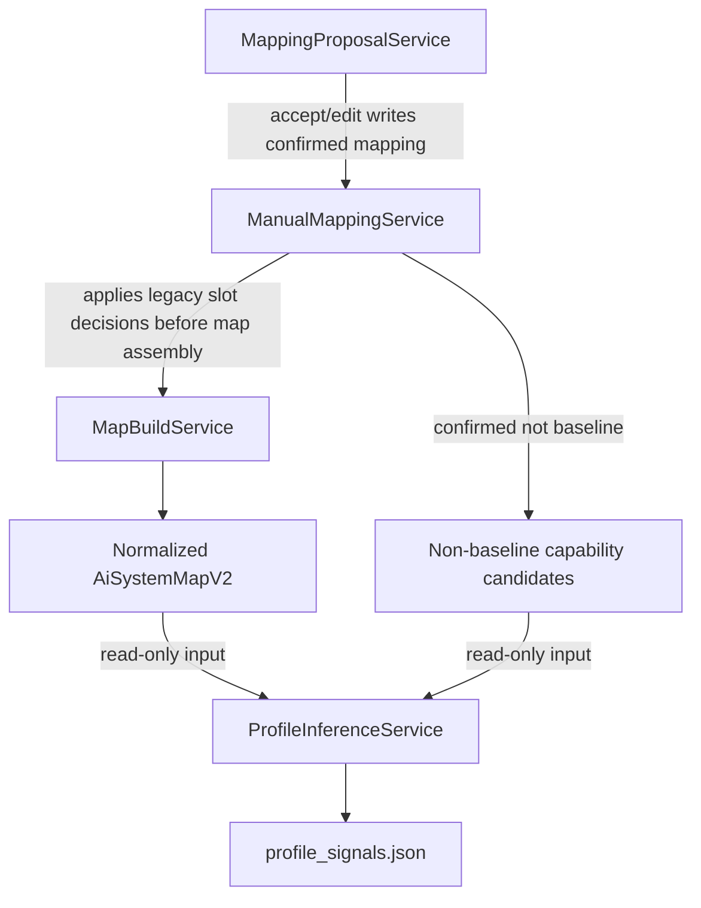

# 分離 Profile Inference 與 Mapping Proposal 計畫

> **2026-07-05 decision sync：** Proposal 只產生 candidate/review lifecycle；Plan 02 的
> Python evaluator 才能輸出 `detected / partial / undetermined / not_detected /
> conflicted`。Confirmed mapping 不是 `detected` 的捷徑；必須重新 build 並以 evidence
> 評估。Activation state 與 capability status 分開，proposal 不得直接設定任一欄位。

> **執行者注意：** 逐 task 實作本計畫。步驟使用 checkbox（`- [ ]`）語法以便追蹤。

**來源：** `architecture-review-20260627T143554.html`

**目標：** 讓 capability inference 保持 fact-first、read-only、sidecar-oriented。
它不得成為另一套 mapping confirmation lifecycle，也不得讓 optional LLM semantic
analysis 寫回 canonical facts。

**為何現在要做：** Phase2 profile findings 可能引用 unmapped components、non-baseline capability candidate components、legacy extensions、risks 與 evidence。若沒有明確的分離規則，未來程式可能誤把 `MappingProposalService` 或 manual mapping actions 重用於 profile detection，因而混淆 candidate evidence、legacy v1 slot confirmation、confirmed non-baseline candidates 與 profile findings。

## Contract source of truth

| 主題 | Source |
|---|---|
| Mapping / proposal HTTP（Step 9） | `docs/API-GUIDE.md` §5–6 |
| Profile 為 read-only sidecar | `docs/MODEL-CONTRACT.md` `ProfileInferenceResult` |
| `GraphViewModel` / `ViewerLoadResult` | `docs/MODEL-CONTRACT.md` |
| Apply 後重算 profile | `03A` + `POST /api/map-builds/{base_build_id}/apply` |

**Pipeline 對齊：** `01B` 的 Step 4 component bridge 只負責產出 component /
unmapped / candidate input；本計畫確保 Step 9 `MappingProposalService` 不被塞回 Step 4，
也確保 Step 6 `ProfileInferenceService` 不回呼 proposal lifecycle。

## 2026-07-07 UA 整合對齊

分離邊界擴充為三方：`ProfileInferenceService` ≠ `MappingProposalService` ≠
`AssessmentOrchestrator`（Plan 17，**deferred**；Phase2 不實作，Step 6 無 AI 編排）。
即使未來重啟，`AssessmentOrchestrator` 也只是 Step 6 thin candidate flow，負責
UA semantic sidecar adapter、AI candidate agents 與 candidate validation；它不寫
`ai_system_map.json`、不定五態、不呼叫 `MappingProposalService`，也不建立 pending
proposal。Validated candidates 只能作為 `ProfileInferenceService` 的 read-only input，
且 Plan 17 deferred 期間恆為空集合。

**目前架構觀察：** `MappingProposalService` 是 pending proposal lifecycle surface，
`ManualMappingService` 擁有 confirmed decisions。新的 flow 用 mapping 回答 ambiguous
evidence 對應哪個 generic component/grounding dimension，或是否為 non-baseline
capability candidate。Capability inference 只 consume 00A normalized v2 facts 與
read-only candidates；不得觸發 proposal generation 或 profile-level confirm actions。

**原始報告內容保留：**

- **Candidate：** 讓 profile inference 與 mapping proposal 分離
- **Problem：** Mapping proposal 是 confirmation lifecycle module；profile inference 是 deterministic sidecar module。
- **Solution：** 新增 `ProfileInferenceService` 作為 normalized `AiSystemMapV2` 的純 consumer；它不得呼叫 manual mapping，也不得暴露 mutation actions。

## 執行摘要

### 目標

以依賴方向與 contract tests 保證 profile inference 是純讀取 enrichment，不會變成第二套 proposal/confirmation workflow。

### 背景

同一筆 ambiguous evidence 會先經 proposal/manual decision，再成為 profile input；若 inference 反向呼叫 proposal repository，狀態與 ownership 會循環依賴。

### 目前 code 狀態

現有 proposal/manual mapping lifecycle 已存在，但 profile service 尚未建立，因此現在是鎖定 module boundary 成本最低的時間點。

### 相關檔案

- `src/kai_mind/core/services/mapping_proposal_service.py`
- `src/kai_mind/core/services/manual_mapping_service.py`
- `src/kai_mind/core/services/map_build_service.py`
- `src/kai_mind/core/services/profile_inference_service.py`（新增）
- `tests/unit/core/test_profile_inference_boundaries.py`（新增）

### 實作步驟

先寫 dependency/negative tests，再讓 inference 只接受 validated facts 與 read-only candidates，最後確認 API/frontend 沒有 profile accept/edit/reject action。

### 驗收標準

Profile inference 可獨立 unit test，無 repository、route 或 mutation dependency；所有 related ids 都只是 navigation/provenance references。

### 風險與注意事項

「confirmed non-baseline」不等於「detected 某 profile」。若規則證據不足，結果必須維持 `undetermined`。

## 產品語意澄清：使用者確認什麼、Profile 是什麼

本節固定 Phase2 對外語意，避免把 **mapping confirmation**、**capability candidate**
與 **profile finding** 混成「使用者要確認是哪一種 profile / 哪一種 RAG」。

### 使用者不需要、也不應該確認 profile

| 使用者確認（Mapping Proposal / Manual Mapping） | 系統自動推論（Profile Inference） |
|---|---|
| 這段 ambiguous evidence 是不是 **legacy v1 slot / generic component** | 這個 repo **有哪些 capability** |
| 或是不是 **non-baseline capability candidate** | 例如 `reranking`、`agentic-control` 等 |
| 或 **needs more information / skip** | 輸出到 `profile_signals.json`（read-only sidecar） |

**Profile 沒有 accept / edit / quick-confirm / mutation action。** 若使用者不同意某列
profile finding，正確路徑是補充或修正 **manual mapping**、改善 scanner evidence，或等
Plan `02` 規則與 fixture 更新；不是新增「確認 profile」流程。

### Profile 是能力 overlay，不是舊版「哪一種 RAG」分類器

Phase2 的 **profile** 代表 **registry-driven、可疊加（stackable）的 capability
overlay**，不是互斥的 RAG variant label。

| 舊語意（已淘汰為產品主流程） | Phase2 語意 |
|---|---|
| 「這個 repo 是 GraphRAG 型 / Agentic RAG 型」（單選） | 「同時有哪些能力？」（checklist） |
| 一個 repo 貼一種 RAG 類型 | 多個 profile 可同時 `detected` |
| `extension` / RAG variant 作為主要分類 | `non_baseline_capability_candidate` + profile sidecar |

範例：同一 repo 可同時 `rag-grounding=detected`、`hybrid-retrieval=detected`、
`reranking=undetermined`；**不得**再要求使用者先選「你屬於哪一種 RAG」。

詳細 registry 與 detection rules 見 Plan
`02-implement-stackable-profile-inference.md`；legacy `rag-core-v1` 只作 v1 compatibility /
adapter input。Plan
`01-rework-manual-mapping-capability-candidates.md` 只處理 legacy mapping /
capability candidate decision，不是 repo 類型分類器。

### 三層分工（implementation 與 UX 都應遵守）

```text
Layer 1  Mapping confirmation                          Plan 01（使用者 durable decision）
Layer 2  Assessment candidate flow                     Plan 17（deferred；Phase2 恆為空集合）
Layer 3  Profile inference                             Plan 02 + 本計畫 boundary guard
Layer 4  Readiness/report projection                    Plan 03 / 06
```

資料流：

```text
ambiguous evidence
  -> MappingProposalService（待確認選項）
  -> ManualMappingService（使用者 confirmed decision）
  -> MapBuildService（validated map + capability candidates）
  -> ProfileInferenceService（只讀；不得回呼 mapping/proposal）
  -> profile_signals.json
```

### 「確認 non-baseline」≠「profile detected」

使用者確認 `non_baseline_capability_candidate` 只表示：

> 「這不是 legacy v1 slot；我同意把它當作非 baseline
> 能力候選輸入。」

**不代表** 某個 profile（如 `reranking`）已 `detected`。Profile status 仍由
`ProfileInferenceService` 依 high-specificity evidence 與 Plan 02 threshold 判定；
證據不足時必須是 `undetermined`，不能因為使用者已確認 candidate 就自動升級為
`detected`。

### Frontend / API contract 摘要

- Mapping UI：保留 proposal accept / edit / reject（Plan 01）。
- Profile UI：**只讀** findings、evidence refs、recommended next checks；可導覽到
  related unmapped / capability candidate / risk hint，但 **related ids 不是 confirmation
  state**。
- 禁止新增「Confirm reranking profile」這類把 profile 變成第二套 confirmation lifecycle
  的互動。

## 範圍

本計畫定義 profile inference 的 module boundary、dependency direction、test guardrails 與 API behavior。它不負責設計所有 profile detection rules；那些 rules 由 Phase2 profile inference 主計畫逐步補齊。

## 預期架構



## 優先檢視的檔案

- `src/kai_mind/core/services/mapping_proposal_service.py`
- `src/kai_mind/core/services/manual_mapping_service.py`
- `src/kai_mind/core/services/map_build_service.py`
- `src/kai_mind/core/models/mapping.py`
- `tests/unit/core/test_mapping_proposal_service.py`
- `tests/unit/core/test_manual_mapping_service.py`
- `tests/web/test_mapping_proposal_routes.py`

## 實作 Tasks

- [ ] 新增或更新 tests，證明 `ProfileInferenceService` 僅接受 00A normalized
  `AiSystemMapV2` / map-derived facts，且不依賴 mapping proposal repositories；v1
  僅能由 adapter 進入。
- [ ] Phase2 不啟用 deep-mode semantic analyzer；`ProfileInferenceService` 僅使用
  deterministic Python assessment。若未來另案重啟 Plan 17，semantic analyzer 的 input
  才能是 bounded deterministic fact packets，output 只能是 interpretation/next checks；
  不得呼叫 mapping mutation、不得 emit canonical component/edge/evidence。
- [ ] 在 tests 或 review checklist 新增 dependency-direction guard：profile inference 不得 import `MappingProposalService`、用於 pending decisions 的 proposal models，或 FastAPI mapping proposal routes。
- [ ] 確保 confirmed grounding/component mappings 僅透過已包含 mapped component
  result 的 normalized v2 map，間接影響 profile inference。
- [ ] 確保 confirmed non-baseline decisions 以 read-only non-baseline capability candidate inputs 傳給 profile inference，而非 user-facing 的 `extension` confirmations。
- [ ] 保持 profile findings 為 read-only：不得有 profile-level accept、edit、quick-confirm、mutation route 或 write-back action。
- [ ] 將 related refs 文件化為僅供導覽：profile findings 可連結至既有 detail、mapping 或 proposal surfaces，但 inference 過程不得 invoke 那些 surfaces。
- [ ] 新增 contract examples，說明 `related_unmapped_component_ids`、`related_capability_candidate_component_ids`、`related_risk_hint_ids` 是 references，不是 confirmation state。
- [ ] 為 weak evidence 新增 negative tests：僅 dependency、僅 naming、raw unmapped candidate、缺乏 high-specificity rule support 的 capability candidate，或單獨 risk hint，都不得產生 `detected`；與 profile 相關時應為 `undetermined`，無關時應為 `not_detected`。

## 驗收標準

- [ ] `ProfileInferenceService` 可當作 validated map 的 pure deterministic consumer 進行測試。
- [ ] 沒有任何 profile inference 程式呼叫 manual mapping repositories、mapping proposal repositories 或 mutation routes。
- [ ] 新的 Phase2 UI/API flow 不要求使用者在 profile inference 能考慮 non-baseline candidates 之前，先建立 `extension` records。
- [ ] 既有 proposal accept/edit behavior 仍為 project-scoped，且僅在下次 map build 時 apply。
- [ ] Profile findings 不得 mutate `ai_system_map.json`、manual mappings、proposals 或 trace artifacts。
- [ ] 文件清楚區分 confirmed mappings、pending proposals、canonical map facts 與 non-canonical profile findings。
- [ ] 文件清楚區分 deterministic facts、optional semantic observations 與 user-confirmed mappings。

## 驗證

- [ ] `.venv/bin/pytest tests/unit/core/test_mapping_proposal_service.py tests/unit/core/test_manual_mapping_service.py -q`
- [ ] `.venv/bin/pytest tests/web/test_mapping_proposal_routes.py -q`
- [ ] 當 service 存在時，新增 focused profile inference tests。
- [ ] `rg -n "MappingProposalService|ManualMappingService" src/kai_mind/core/services/profile* tests/unit/core/test_profile*` 並確認任何 hit 僅為 intentional test documentation，而非 runtime dependency。

## 相依關係

- 可在 graph projection 工作之前開始。
- 需與 `01B-extract-step4-component-bridge-registry.md` 對齊，因為 profile/proposal
  分離要從 Step 4 deterministic bridge 的輸出邊界開始。
- 應與 `03-consolidate-profile-sidecar-lifecycle.md` 對齊，使 profile sidecar 在 validation 之後 emit，且不帶 proposal-side effects。

## 不在範圍內

- 不移除 `MappingProposalService`。
- 不讓 mapping proposals 自動建立 profile findings。
- 不使用 `extension` 作為 non-baseline components 的必要新產品分類；既有 extension handling 僅保留為 legacy compatibility。
- 不在 backend 或 frontend contract 新增 profile-level confirmation 或 mutation actions。Frontend 必須只顯示 read-only findings；Meeting-Sync 文件只作補充紀錄。
- 不將 profile findings 持久化到 canonical `ai_system_map.json`。

## P0 Execution Mapping 補充（2026-07-03）

本計畫的 boundary 也適用於 execution mapping：

- `StaticCallGraphService`、`ShallowDataflowService`、`ExecutionPathRecoveryService` 不得呼叫
  `MappingProposalService` 或建立 pending proposal。
- Mapping proposal 可以導覽到 evidence / execution path detail，但不得有「accept call edge」
  或「confirm execution path」mutation。
- Deferred guardrail：Phase2 不啟用 optional semantic analyzer。未來若隨 Plan 17 另案重啟，
  只能解釋 static fact packets，不能新增 call edge、dataflow hint、canonical component 或
  profile status。
- 使用者若不同意 execution path，正確修法是改善 scanner rules、manual mapping 或 fixtures，
  不是新增第二套 execution confirmation lifecycle。
