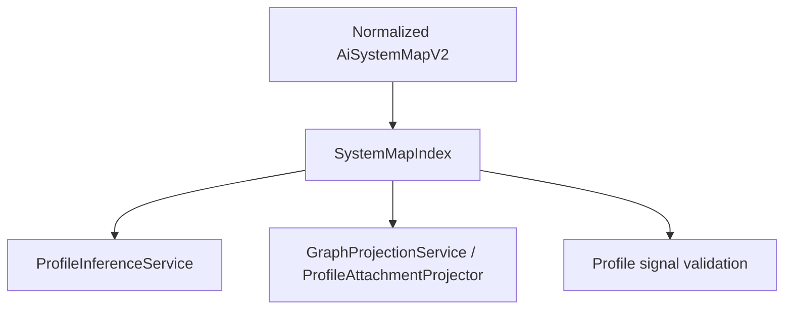

# 新增 Read-only SystemMapIndex 計畫

> **2026-07-05 dependency sync：** Plan 05 保持最小 canonical fact index；Plan 06 先用它
> 完成 projection vertical slice，再由 Plan 07 擴充 shared lookup。固定 reference map
> metadata 由 Plan 01A 擁有，status evaluation 由 Plan 02 擁有；本 index 不讀 TOML、
> 不計分、不推論 capability。

## 2026-07-07 UA 整合對齊

UA 整合不改變本計畫範圍。`SystemMapIndex` 仍只索引 validated canonical map 與必要的
read-only ids；`ua-analysis-result` 是 `ScanSnapshot` internal sidecar，不進 canonical
index、不作 public lookup contract，也不讓 index 解析 UA 原生 graph vocabulary。

> **執行者注意：** 逐 task 實作本計畫。步驟使用 checkbox（`- [ ]`）語法以便追蹤。

**來源：** `architecture-review-20260627T143554.html`

**目標：** 新增小型 read-only `SystemMapIndex`，穩定 lookup 00A normalized v2
components、edges、evidence、grounding dimensions、anchors 與 capability refs。

**為何現在要做：** Phase2 profile inference 與 graph attachment projection 都需要 resolve evidence ids、component ids、slots、non-baseline capability candidate ids、legacy extension ids、risk hint ids 與 primary anchors。若每個 module 各自重建 lookup tables，profile related refs 與 anchor selection 就會 drift。

**目前架構觀察：** Viewer projection 目前在 `ViewerSessionService.project_to_graph()` 內建立 local lookup maps，例如 `node_ids_by_source` 與 `node_ids_by_slot`。Validation 與 target/reference checks 也分散在其他 services。以現況尚可運作，但 profile attachment anchors 會成為同一套 indexing rules 的第二個 consumer。

**原始報告內容保留：**

- **Candidate：** 新增 read-only `SystemMapIndex`
- **Problem：** Target lookup 與 reference validation 在多個 modules 重複；profile related refs 與 anchor selection 容易 drift。
- **Solution：** 先為新的 profile modules 建立一個小型 read-only index；等 tests 穩定後，再逐步遷移舊 lookup code。

## 執行摘要

### 目標

建立最小、immutable 的 `SystemMapIndex`，讓 readiness、profile validation、
Markdown/Mermaid projection 與 viewer attachment anchors 共用 canonical fact lookup。

### Step 5 Pipeline Boundary

`SystemMapIndex` 位在 Step 4 canonical map validation 之後、Step 6 assessment 之前：

```text
Step 4 ai_system_map.json（validated repo truth）
  -> Step 5 SystemMapIndex.from_map(...)
       component/evidence/edge/unmapped/risk lookup only
  -> Step 6 ProfileInferenceService
       repo facts ↔ 10 planes / 52 reference nodes
```

Index 不執行橋接 1 或橋接 2：不讀 scan TOML、不決定 `rule_id` 對應 component、
不輸出 `plane_id` / `reference_node_id`、不計算五態、activation 或 Mapping Completeness。
它只讓 Step 6/7 的 owner 可以用同一套 read-only lookup，避免各自重建 ids。

### 背景

目前 viewer、detail scan 與 validation 各自重建 lookup；新增 profile related refs 後，重複邏輯會更容易產生 unknown-id 與 anchor drift。

### 目前 code 狀態

repo 尚無 shared index；viewer 有 local node/evidence maps，detail scan 有多組 `_find_*` helper，validation 則擁有自己的 invariant sets。

### 相關檔案

- `src/kai_mind/core/models/system_map.py`
- `src/kai_mind/core/services/system_map_index.py`（新增）
- `src/kai_mind/core/services/viewer_session_service.py`
- `src/kai_mind/core/services/detail_scan_service.py`
- `tests/unit/core/test_system_map_index.py`（新增）

### 實作步驟

先以 found/missing/order/no-mutation tests 定義 contract，只讓新 profile modules 使用，再由 07–09 決定是否遷移低風險既有 consumers。

### 驗收標準

Index 可穩定解析 canonical ids 與 evidence files，不 mutate、不 validate、不投影 graph、不持久化，也不包含 profile decision logic。

### 風險與注意事項

不要把 index 做成 god object。Graph node fallback、validation invariants、scanner-time facts、manual replay 與 runtime trace 都留在原 owning service。

## 範圍

本計畫先新增 read-only index 供 Phase2 profile modules 使用，不做大規模搬遷。舊 lookup code 僅在有測試保護、且能明確降低 duplication 時，才逐步改用 index。

## 預期架構



## 優先檢視的檔案

- `src/kai_mind/core/models/system_map.py`
- `src/kai_mind/core/services/system_map_validation_service.py`
- `src/kai_mind/core/services/viewer_session_service.py`
- `src/kai_mind/core/models/viewer.py`
- `tests/unit/core/test_system_map_validation.py`
- `tests/unit/core/test_viewer_session_service.py`

## 實作 Tasks

- [ ] 為從 normalized `AiSystemMapV2` 建立的 read-only index 撰寫 focused tests；
  v1 input 必須先通過 00A adapter。
- [ ] 支援 generic component id/type/layer、edge、evidence、grounding dimension、
  capability candidate 與 workflow node JSON-pointer lookup。
- [ ] 支援依 evidence id、component/source id、slot id、non-baseline capability candidate id、legacy extension id、unmapped component id、risk hint id，以及 flow/edge id（當這些 ids 存在於 current schema 或 profile sidecar 時）進行 lookup。
- [ ] 支援 profile attachment projection 所需的 deterministic node-anchor selection inputs：direct evidence component source、slot membership、capability candidate source、legacy extension source、unmapped source 與 risk hint references。
- [ ] 確保 index construction 不 mutate map、不 normalize data、不 validate schema、也不 infer 新 facts。
- [ ] 定義清楚的 missing-reference behavior：lookup helpers 回傳 `None` / empty lists，或僅在 caller 明確宣告 invariant violations 時 raise。
- [ ] 若 current schema validation 已防止 duplicate / unknown ids，則為此新增 tests；除非 caller 需要，否則不重複 validator 職責。
- [ ] 先在新的 profile modules 使用 index。在 profile tests 證明 index shape 之前，不要 refactor 舊的 viewer 或 validator lookup paths。

## 驗收標準

- [ ] `SystemMapIndex.from_map(system_map)` 或等效方法，能建立 normalized v2 map 上可重用的 read-only view。
- [ ] Profile inference 與 profile attachment projection 可共用同一套 lookup behavior，處理 related refs 與 anchor selection，包含 `related_capability_candidate_component_ids`。
- [ ] Index 不得 write back 到 `AiSystemMapV2`、`GraphViewModel`、`profile_signals.json` 或 filesystem artifacts。
- [ ] Tests 涵蓋 found、missing 與 multi-reference lookup paths。
- [ ] 既有 viewer projection behavior 保持不變，除非有意以 regression tests 遷移。
- [ ] Index 不決定 `primary_map_type`、profile status、readiness verdict 或 LLM interpretation。

## 驗證

- [ ] `.venv/bin/pytest tests/unit/core/test_system_map_validation.py tests/unit/core/test_viewer_session_service.py -q`
- [ ] 新增 focused `tests/unit/core/test_system_map_index.py`。
- [ ] `rg -n "SystemMapIndex" src tests` 以確認 usage 有限且 intentional。
- [ ] `git diff --check docs/work/Timmy/schedule/plan/unfinish/phase2/static-trace-plan/05-add-read-only-system-map-index.md`

## 相依關係

- 透過提供 profile inference 的 read-only lookup primitives，支援 `04-separate-profile-inference-from-mapping-proposal.md`。
- 透過提供 profile attachment projection 的 deterministic anchor inputs，支援 `06-deepen-graph-projection-module.md`。
- 不應阻擋 `03-consolidate-profile-sidecar-lifecycle.md` 的 artifact lifecycle 工作。
- 後續由 `07-expand-system-map-index-to-shared-lookup-contract.md` 擴展為 shared lookup contract；consumer migration 與 cleanup 分別見 `08`、`09`。

## 不在範圍內

- 不要將此做成 repository、cache、database adapter 或 persistence layer。
- 不要將 canonical validation 移出 `SystemMapValidationService`。
- 不要用此 index 建立新的 canonical facts。
- 第一個 patch 不要求所有 legacy lookup code 都完成遷移。

## P0 Execution Mapping 補充（2026-07-03）

`SystemMapIndex` 是 P0 execution artifacts 的 read-only lookup substrate：

- Index 需能查 `component_id`、`edge_id`、`evidence_id`、`endpoint_id`，並提供給
  `call_graph.json` / `execution_paths.json` 做 ref validation。
- 若 dynamic `00` 需要 execution path id lookup，應建立獨立 read-only projection，不把 execution
  paths 寫回 `AiSystemMapV2`。
- Index 不決定 call graph reachability、dataflow status 或 execution ordering；那些屬於 dynamic
  `00` 的 services。
- Unknown refs 必須回 structured warning / validation error，不 silently 建立 placeholder node。
