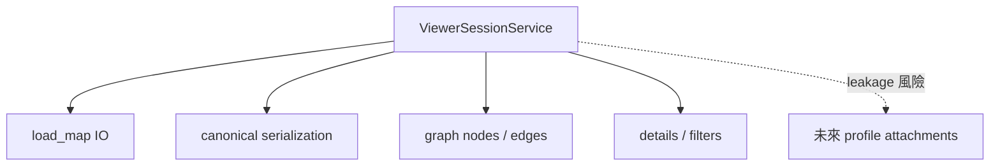
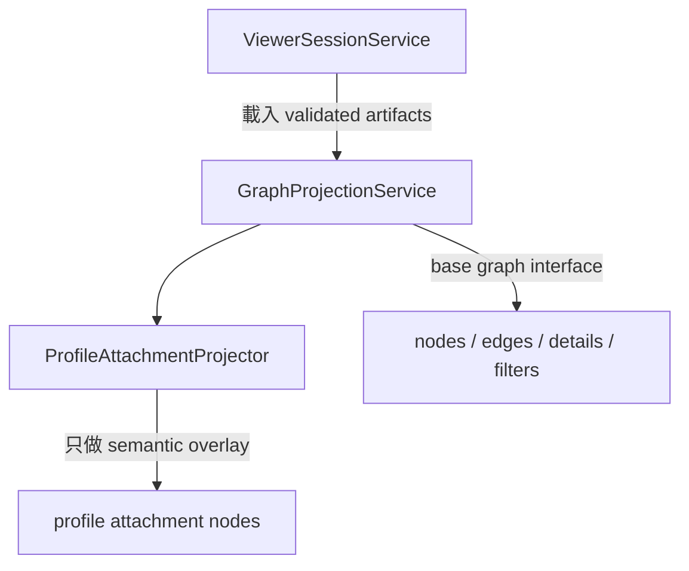
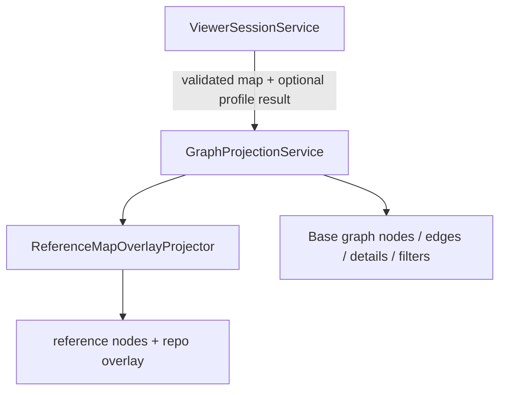

# 深化 Graph Projection Module 計畫

> **執行者注意：** 逐 task 實作本計畫。步驟使用 checkbox（`- [ ]`）語法以便追蹤進度。

**來源：** `architecture-review-20260627T143554.html`

**目標：** 把 canonical map projection 從 `ViewerSessionService` 拆出去，先由
backend 同一投影模型產生 JSON graph、Markdown 與 Mermaid，再讓 frontend render
該 contract；不得讓 UI 成為唯一可見輸出。

## Contract source of truth

| 主題 | Source |
|---|---|
| `GraphViewModel` / `ViewerLoadResult` | `docs/MODEL-CONTRACT.md` |
| Viewer 讀取端點 | `docs/API-GUIDE.md` `GET /api/map-builds/{build_id}` |
| 五態 / activation | `../../capability-map-assessment-decision-summary.md` + `docs/MODEL-CONTRACT.md` |

`GraphViewModel` 是 `ViewerLoadResult` 內的 ephemeral projection，不是 persisted sibling JSON。

## 2026-07-06 Confirmed Reference Map and Overlay Contract

完整決策見
[`../../capability-map-assessment-decision-summary.md`](../../capability-map-assessment-decision-summary.md)。
本計畫是 backend projection 與最小 viewer consumption contract 的唯一 owner；Plan 02
只提供 assessment result，Plan 03 只提供 validated artifacts/lifecycle。

`GraphProjectionService` 必須同時投影：

1. 固定 10-plane / 52-node reference map：`input_intent`、`control`、
   `ingestion_indexing`、`retrieval`、`extension_subsystems`、`evidence`、`generation`、
   `memory_state`、`governance_observability`、`deployment_topology`。
2. Per-repo overlay：目前 build/snapshot/environment scope 的 repo components、edges、
   assessments、activation 與 evidence refs。

Governance / observability 是 canonical plane；cross-plane governance lens 可保留為
backend-derived view，但不得複製 canonical facts。`extension_subsystems` 是 reference
grouping，不建立或恢復 legacy `ExtensionComponent` product surface。

Projection semantic kinds 至少區分 `reference_capability` 與 `repo_component`。Reference
node 固定存在不代表 repo 已實作；repo component 可對位多個 reference node，無可靠 mapping
時保留 unmapped。Frontend 不得從 label/topology 重新推論 mapping。

Viewer legend/minimal contract 必須顯示五態 status、六態 activation、direct/indirect/
explicit-negative evidence、reference/repo node 差異、static/runtime 差異、assessment scope，
以及 Mapping Completeness numerator/denominator/status counts 與非 confidence 說明。

Mapping Completeness 由 Step 6-1 `ProfileInferenceService` 計算；Step 7 只 surface / project（不重算）。Weights：detected=1、not_detected=1（coverage
gate 通過）、partial=.5、undetermined/conflicted=0；denominator 是全部固定 reference
nodes，activation/not_applicable 不排除任何 node。Frontend
只 render，不重算。

## 2026-07-07 UA 整合對齊

Reserved nullable UA semantic sidecar 不改變本計畫的 public projection contract；Phase2 active
path 不產生、不消費它。Step 7 只消費 Step 6 已驗證
的 assessment / profile result；`ua-analysis-result` 不新增 `GraphViewModel`、Viewer API 或
frontend 欄位。若 UA semantic candidate 無法對回既有 evidence id，應在 Step 6 candidate
flow 被丟棄或標成 unresolved，而不是由 projection 端猜測。

### Step 7 Projection Boundary（只畫，不重新判斷）

本計畫位在 Step 6 `ProfileInferenceService` 之後。Graph projection 的輸入是
validated `ai_system_map.json`、Step 6 assessment/profile result 與 reference catalog
metadata；輸出是 GraphViewModel、Mermaid 與 Markdown view。

```text
Step 6 ProfileInferenceService
  -> reference node 五態 / activation / related refs / completeness
  -> Step 7 GraphProjectionService
       emit reference_capability nodes（52 格，按 10 planes 排版）
       emit repo_component / unmapped / profile_attachment overlay
       emit lens memberships / evidence links / detail refs
```

`GraphProjectionService` 不重新執行 `rule_id` matching、不呼叫
`component_bridge_registry.py`、不決定 `detected` / `partial` / `undetermined`、也不從
layout 反推 capability。若 Step 6 無 reliable mapping，Step 7 只能顯示 unmapped /
undetermined 或 degraded reason，不可猜測 anchor。

## 執行摘要

### 目標

拆出可單測的 backend graph projection，先完成 `system_map.mmd`、
`ai_system_map.md` 與 API
graph projection，再完成最小 frontend static renderer/degraded-state integration。

### 背景

目前 `ViewerSessionService` 同時做 I/O、validation、serialization 與 graph projection；frontend 又只認得一般 node，無法區分 topology 與 capability overlay。

### 目前 code 狀態

backend `GraphNodeModel` 沒有 `semantic_kind/profile_id/anchors`；frontend `types.ts`、`SystemGraph.tsx`、`SystemNode.tsx` 與 `DetailPanel.tsx` 都尚未接上 profile attachment contract。

### 相關檔案

- `src/kai_mind/core/services/viewer_session_service.py`
- `src/kai_mind/core/services/graph_projection_service.py`（新增）
- `src/kai_mind/core/models/viewer.py`
- `frontend/src/types.ts`
- `frontend/src/components/SystemGraph.tsx`
- `frontend/src/components/SystemNode.tsx`
- `frontend/src/components/DetailPanel.tsx`
- `frontend/src/store/viewerStore.ts`

### 實作步驟

先 characterization backend projection，再拆 service、generic view projector、Mermaid
renderer 與 capability attachment projector；完成 CLI artifact tests 後，才同步 frontend
parser/renderer/filter/details。

### 驗收標準

CLI/API 可從同一 normalized v2 projection 產生可追溯的 component/edge/evidence map、
`system_map.mmd` 與 `ai_system_map.md`；frontend 只 render backend output，不自行推論。

### 風險與注意事項

Profile attachment 是 static semantic overlay，不是本次 query 的 runtime path。若 anchor 不可靠應不畫 node，而不是猜測位置；12 的 trace boundary不得成為本計畫前置。

具體要做三件事：

1. **職責拆分**
   - `ViewerSessionService`：只負責 load / validate / serialize / session orchestration。
   - `GraphProjectionService`：負責把 normalized `AiSystemMapV2`（與 optional `ProfileInferenceResult`）投影成 `GraphViewModel`/Mermaid/Markdown views。
   - `ReferenceMapOverlayProjector`：投影 fixed reference nodes，再疊加 evidence-backed repo
     components/assessments；legacy profile attachment 只作 migration input。

2. **interface 不要越長越胖**
   - viewer session 不應同時懂 file I/O、canonical map、base graph、profile overlay、anchor 選擇等所有細節。
   - 對外只保留窄 interface，例如 `project(system_map, profile_result=None) -> GraphViewModel`。

3. **不改 canonical artifacts**
   - profile attachment 只出現在 viewer payload / `GraphViewModel`，不 write back 到 `ai_system_map.json` 或 `profile_signals.json` 的 schema 本體。

**Reference node 與 repo overlay 代表什麼：**

- Reference node 代表固定 capability coordinate，不代表 repo 已實作。
- Repo overlay 代表目前 assessment scope 的 static facts/mapping；它不代表 runtime query
  真的走過該 component。
- Runtime observation 留給 `12-add-runtime-component-trace-contract.md` 的 deferred boundary。

**為何現在要做：**

`ViewerSessionService` 現在已經同時做：

| 現有職責 | 例子 |
|----------|------|
| artifact I/O | 讀 `ai_system_map.json` |
| validation | validate map schema |
| serialization | 組 viewer load payload |
| base graph projection | slot nodes、edges、unmapped、extensions |
| UI 輔助資料 | details、filters |

Phase2 還要再加：

| 新增需求 | 為什麼會讓現有 module 過重 |
|----------|------------------------------|
| profile projection | 把 `ProfileFinding` 轉成 graph node |
| anchor selection | 決定 profile node 掛在哪個 baseline node 旁 |
| detail provenance | 在 details 帶 evidence / related refs |
| filter membership | 例如 `filter:profile_attachments` |

若全部繼續堆在 `ViewerSessionService`，會造成：

- 一個 class 同時懂 session、map、profile、graph layout 語意，難測、難改。
- static graph 與 runtime trace 混在一起，UI 可能誤把「推斷存在 reranker」畫成「這次 query 真的經過 reranker」。

因此現在先把 **static graph projection** 獨立出來；**runtime observability** 由 plan `12` 另做，兩者 contract 分開。

**目前架構觀察：**

現況：

```text
ViewerSessionService.project_to_graph(normalized AiSystemMapV2)
  -> GraphViewModel
       -> nodes / edges / details / filters
```

- 現行 v1 base graph 已能從 legacy grounding slots、flows、unmapped、legacy
  extensions 建 node；00A 後必須先 normalize 成 v2 generic components/edges。
- 但 `GraphNodeModel` 還沒有 profile attachment 專用欄位，例如：
  - `semantic_kind`（consumer 用來辨識這是 profile attachment node）
  - `profile_id`
  - `primary_anchor_node_id` / `anchor_node_ids`（這個 profile 掛在哪個 baseline node 旁）

缺口：

- backend 還不能穩定 emit「這是一個 profile attachment，不是普通 topology node」。
- profile findings 即使已在 `profile_signals.json`，也還不能一致地投影到 graph contract。

目標狀態：

```text
ViewerSessionService
  -> load + validate artifacts
  -> GraphProjectionService.project(map, profile_result, reference_map)
       -> fixed reference nodes（10 planes / 52 nodes）
       -> repo component / edge overlay
       -> five-state + activation + evidence projection
  -> GraphViewModel 回傳 frontend
```

**原始報告內容保留：**

- **Candidate：** 深化 graph projection module
- **Recommendation strength：** 強烈建議
- **Category：** in-process
- **Files：** `src/kai_mind/core/services/viewer_session_service.py`, `src/kai_mind/core/models/viewer.py`, `tests/unit/core/test_viewer_session_service.py`
- **Problem：** 目前這個 module 已經同時承擔 file load、validation、serialization、graph projection、details 與 filters；再加入 profile attachment projection 會讓 interface 太寬。
- **Solution：** 保留 `ViewerSessionService` 做 artifact/session orchestration，另把 graph projection 深化成一個藏在 `project(system_map, profile_result=None)` interface 後面的 module。

Original before diagram:



Original after diagram:



## 範圍

本計畫處理 backend generic projection、Mermaid/Markdown renderers、
`GraphViewModel` capability attachment contract，以及最小 frontend integration。
Runtime query trace UI 仍屬 plan 12 deferred boundary，不是本計畫前置條件。

## 預期架構



## 優先檢視的檔案

- `src/kai_mind/core/services/viewer_session_service.py`
- `src/kai_mind/core/models/viewer.py`
- `src/kai_mind/core/models/profile_signal.py` once introduced by Phase2 profile work
- `tests/unit/core/test_viewer_session_service.py`

Frontend contract parsing、renderer 與 layout 必須直接修改本 repo 的
`frontend/src/`；Meeting-Sync 文件只作補充設計紀錄。

## 實作 Tasks

- [ ] 在 extract 任何程式之前，先為現有 `ViewerSessionService.build()` 與 `project_to_graph()` behavior 新增 characterization tests。
- [ ] 引入 `GraphProjectionService`，interface 保持 narrow，例如 `project(system_map, profile_result=None, map_json_path=None) -> GraphViewModel`。
- [ ] `GraphProjectionService` 的 target input 是 normalized `AiSystemMapV2`；v1 由 00A adapter 轉換。
- [ ] 新增 versioned fixed reference-map model，10 plane ids / 52 node ids / ordering 必須
  穩定；governance lens 只作 derived view，`extension_subsystems` 不使用 legacy extension
  semantics。
- [ ] `GraphNodeModel.semantic_kind` 明確區分 `reference_capability` 與 `repo_component`；
  overlay mapping 保存 reference/repo ids 與 evidence refs，不複製 canonical facts。
- [ ] Projection 同時輸出五態 status、六態 activation、typed evidence、field-specific
  conflicts、not-detected coverage gate 與 build/snapshot/environment scope。
- [ ] Backend **surface** Step 6-1 已計算的 Mapping Completeness（numerator/denominator/status
  counts / fixed weights disclosure）；**不得**在 Step 7 重算 completeness；frontend 不重算。
- [ ] 新增 `MermaidRenderer`，從同一 projection 產生 `system_map.mmd`，顯示
  generic components/edges、capability relationships 與 agent/workflow control edges；每個節點可
  回查 source id/evidence，但不嵌入 raw source。
- [ ] 新增 Markdown readiness renderer，輸出 `ai_system_map.md`，摘要 capability overlays、
  findings 與 next checks。
- [ ] 讓 `ViewerSessionService` 仍負責 load/validate/session orchestration 與 JSON serialization，不負責 graph construction details。
- [ ] 將 `ReferenceMapOverlayProjector` 放在 graph projection implementation 後方，而非
  public web route dependency。
- [ ] 擴充 `GraphNodeModel`，加入 reference/repo semantic kind、reference id、repo component
  id、assessment/activation/scope 與最小 provenance ids。
- [ ] 每個 reference node 都可顯示五態與 activation；只有具有 evidence-backed repo mapping
  的 component 才 emit repo overlay。無 reliable mapping 時不得猜 anchor/component。
- [ ] 使用 backend 提供的 `GraphNodeModel.label` 作為 compact canvas label；不要求 frontend 將 `profile_id` 對應成 display text。
- [ ] 不要為 reference/repo mapping 建立看似 runtime topology 的 synthetic edge；mapping
  relationship 使用專用 overlay refs。
- [ ] 將 `filter:profile_attachments` membership 加入 graph filters，使用既有 positive filter semantics。
- [ ] 將 evidence counts、related refs counts、anchors、完整 profile names 與 descriptions 保留在 details/provenance payloads，不要放在 canvas node。
- [ ] `partial`、`undetermined`、`not_detected`、`conflicted` 都可在 fixed reference map
  顯示狀態；`not_detected` 必須顯示 coverage gate，`conflicted` 顯示 field-specific refs。
- [ ] 不要使用 legacy `extensions` 作為 profile attachments 的 renderer-facing product concept。若 legacy extension ids 存在，僅在 details 中作 compatibility refs 暴露，不作為 primary node type。
- [ ] 更新 `frontend/src/types.ts` 的 Zod/TypeScript schema，辨識 `semantic_kind="profile_attachment"`、`profile_id` 與 anchors。
- [ ] 在 `SystemNode` 增加專用但克制的 attachment renderer；label 使用 backend 提供值，不在 frontend 重建 profile metadata。
- [ ] Reference map layout 固定；repo overlay placement 不得改變 plane/node identity，且不得被
  誤認為 runtime traversal。
- [ ] `DetailPanel` 顯示 status、depth、evidence/related-ref counts、uncertainty 與 next checks；不得顯示 raw source 或推測性 runtime path。
- [ ] 增加 `filter:profile_attachments` 的 frontend toggle，預設關閉且不改動其他 active filters。
- [ ] 最小 frontend contract 增加 reference/repo legend、status/activation/evidence legend、
  scope display、governance lens 與 Mapping Completeness formula disclosure。
- [ ] 執行 `pnpm build`、`pnpm lint`，並以 valid/missing/invalid sidecar 三種 API payload 做 browser regression。

## 驗收標準

- [ ] 對 map-only payloads，`ViewerSessionService` 仍與先前完全一樣 load 並 validate `ai_system_map.json`。
- [ ] `system_map.mmd` 與 Markdown/API graph 使用同一組 node/edge ids，不各自重建 topology。
- [ ] non-grounded LLM app、tool agent、RAG system、grounded agent 與 workflow
  fixtures 都能產生非空且語意正確的 Mermaid。
- [ ] Base graph projection behavior 仍由既有 viewer tests 涵蓋。
- [ ] `GraphProjectionService` 可在無 file I/O 的情況下 unit test。
- [ ] Reference nodes 與 repo overlay 都由 backend emit，具 explicit semantic fields 與 stable ids。
- [ ] Fixed reference nodes 與 repo overlay nodes 使用不同 semantic kinds；reference node
  不因存在於底圖而自動成為 detected/enabled。
- [ ] 五態、activation、field conflicts、coverage gate 與 Mapping Completeness 皆由 Step 6-1
  計算、Step 7 projection **surface**；frontend 不推論或重算。
- [ ] 不向 topology `GraphViewModel.edges[]` 新增會誤導成 runtime path 的 mapping edges。
- [ ] `filter:profile_attachments` 可用，但預設不 active。
- [ ] Backend contract tests 以 `semantic_kind="profile_attachment"` 作為 consumer renderer selection marker。
- [ ] Runtime query trace highlighting 不在此實作；本計畫記載 trace focus 依賴獨立的 runtime trace contract。
- [ ] 前端 enhancement 不得阻擋 JSON + Mermaid + Markdown 的 Phase2 MVP 驗收。

## 驗證

- [ ] `.venv/bin/pytest tests/unit/core/test_viewer_session_service.py -q`
- [ ] 為 `GraphProjectionService` 與 `ProfileAttachmentProjector` 新增 focused tests。
- [ ] `.venv/bin/pytest tests/contracts/test_ai_system_map_schema.py -q` 以確認 canonical schema 未被 mutate。
- [ ] `rg -n "profile_attachment|semantic_kind|primary_anchor_node_id|filter:profile_attachments" src tests docs/work/Timmy/design`
- [ ] `git diff --check docs/work/Timmy/schedule/plan/unfinish/phase2/static-trace-plan/06-deepen-graph-projection-module.md`

## 相依關係

- 應在 `03-consolidate-profile-sidecar-lifecycle.md` 之後，使 projection 能收到 stable profile result。
- 應使用或至少對齊 `05-add-read-only-system-map-index.md` 與 `07-expand-system-map-index-to-shared-lookup-contract.md`，以取得 deterministic anchor lookup。
- 必須保留 `02-implement-stackable-profile-inference.md` 中的 read-only / non-canonical 決策。

## 不在範圍內

- 不新增 profile-level confirm actions 或 mutation APIs。
- 不將 graph projection output write back 到 `ai_system_map.json`。
- 不將 repo overlay mapping 當成 runtime topology truth。

## P0 Execution Mapping 補充（2026-07-03）

Graph projection 需清楚分成兩張圖：

- `system_map.mmd`：component-level system architecture / readiness map。
- `execution_map.mmd`：static inferred query path / call-dataflow sequence，由 dynamic `00`
  的 execution renderer 產生。

本計畫可以提供共用 renderer primitives 與 viewer projection conventions，但不得把 execution
path edges 混入 canonical topology graph。若 UI 顯示 execution path，需使用明確的 static
execution filter / layer，並標示 runtime 未驗證。
