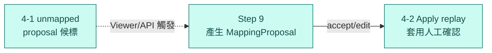

# Phase2 Pipeline 總覽（Step 1～9）

Status: design reference（Phase2 target · 2026-07-07 UA 整合決策已套用 · 同日修訂：Step 6 取消 AI 編排，回歸純 Python 評估）

Audience: backend、scanner expansion、reviewer

Last aligned: 2026-08-10 · Phase 12 UA active path + call-priority edge cutover；
16G retirement gate 為 NO-GO，L3 transitional path 仍保留

## 文件目的

Phase2 static pipeline 的 **簡圖 + 資料邊界**。供 UA sidecar 整合、對照 Step 3→4 橋接邏輯使用。

**Active 產品面：** 固定 **能力底圖（10 planes / 52 格）** + **系統地圖 repo 事實** + **能力評估** + **疊圖**；frontend 只 render backend projection。

**2026-07-07 已拍板（詳見 integration boundary 文件 §0；#2 / #3 / #5 同日修訂——Step 6 AI 編排 deferred，以本文件為準）：**

| # | 決策 | 定案 |
|---|------|------|
| 1 | Step 3 掃描器 | **UA active + parity gate**：Understand-Anything sidecar 與 Python AST provider 已接入；Systograph providers 過渡期仍掃描、參與 parity 並合併，Plan 14/18 通過後才可逐項退役 |
| 2 | Step 6 評估 | **純 Python**：`ProfileInferenceService` 直接讀系統地圖 + TOML metadata 定五態；不引入 AI candidate（AI 評估路徑 **deferred**） |
| 3 | Orchestrator | **不建立** `AssessmentOrchestrator`；Step 1～9 全程無 AI orchestration（決策 deferred，重啟時另案評估） |
| 4 | Apply | 不重跑 UA；只重放 snapshot 的 `scan_result`，重跑 Step 4～7；semantic sidecar slot 保持 nullable 且不消費 |
| 5 | semantic sidecar | reserved nullable snapshot internal slot，不列 public artifact；**Phase2 active path 不產生、不消費**（原規劃供 Step 6 AI，現 deferred） |

---

## 固定名詞

| 名詞 | 一句話 | 主要產物 / 步驟 |
|------|--------|-----------------|
| **掃描結果** | Step 3 整包輸出 | `ProjectScanResult` |
| **掃描事實** | mapping 前的 repo 訊號 | `facts[]`（join key: `rule_id`） |
| **證據** | 可回溯 path / line | `evidence[]` |
| **系統地圖** | 這次 build 的 repo 真相 ★ | Step 4 → `ai_system_map.json` (v2) |
| **能力底圖** | 固定 52 格座標（與 repo 無關） | `capability_reference_map.toml` |
| **能力評估** | 底圖每格五態 + profile | Step 6 → `profile_signals.json` |
| **疊圖** | 底圖 + repo 節點並列顯示 | Step 7 → `GraphViewModel` |
| **對不上项** | 掃到但無法可靠對位 | `unmapped_components[]` |
| **人工確認** | Step 9 使用者決策 | Apply 重跑 Step 4～7 |

---

## 三層模型（不要混層）

```text
┌─────────────────────────────────────────┐
│ 能力底圖（52 格，固定）                    │  Step 6～7 · metadata only TOML
└─────────────────────────────────────────┘
              ↑ 能力評估 + 疊圖（Python）
┌─────────────────────────────────────────┐
│ 系統地圖（每 build 的 repo 真相）★         │  Step 4 · 掃描與底圖的接縫契約
└─────────────────────────────────────────┘
              ↑ 橋接 1（Step 4 Python）
┌─────────────────────────────────────────┐
│ 掃描事實 + 證據                          │  Step 3 · UA sidecar（primary）
└─────────────────────────────────────────┘                + 過渡期 Systograph TOML parity
```

**兩段橋接（核心邏輯）：**

```text
橋接 1  Step 4   rule_id + 證據強度  →  系統地圖（元件 / 對不上项 / 候選能力輸入）
橋接 2  Step 6   系統地圖 + 證據      →  能力評估（底圖 52 格五態）
Step 7           系統地圖 + 能力評估  →  疊圖（底圖格 + repo 節點並列，不 merge）
```

Step 3 掃描層（UA structural adapter 與過渡期 TOML）**不** 直接寫 `plane_id` / 底圖格 id；底圖設定檔 **不** 含 scan regex。

---

## 總覽：Step 1 → Step 9

```text
Step 1  Import          登記 repo
Step 2  Boundary        metadata-only candidate enumeration
                        → TOML / Git ignore default outcome
                        → exact_file / bounded recursive_directory preflight
                        → one-run decisions + hard safety revalidation
                        → openat/no-follow + fstat + same-handle content hash
                        → final FileInventory + audit / digests
        ▼
Step 3  Scan            approved inventory → current providers + Python AST
                        → UA deterministic sidecar + adapter → parity report
                        → merged facts / evidence → immutable snapshot
        │
        ▼
Step 4  Materialize     元件／端點／風險 + L1/L2/L3 call-priority edges
                        → 系統地圖 ★                       [橋接 1 · Python]
Step 5  Index           記憶體 lookup（不寫檔）
Step 6  Assessment      ProfileInference 定五態（純 Python）
                        + readiness + 靜態路徑               [橋接 2]
Step 7  Publish         疊圖 + 全部 sibling artifacts
Step 8  Viewer          預設載入指定 project 的 latest build；歷史檢視指定 build_id
Step 9  Review（可選）   對不上项 → 人工確認 → Apply
```

```text
Rescan   新 preflight → Step 2→3→4→5→6→7→8  新 snapshot，不沿用舊 decisions
Apply    不 preflight／不讀 repo；4→5→6→7→8  同 snapshot，只改解讀方式
```

Step 8 的 Phase2 primary API 使用 `project_id` / `build_id`：一般開啟專案時呼叫
`GET /api/projects/{project_id}/map-builds/latest`；查看歷史版本時呼叫
`GET /api/map-builds/{build_id}`。Process-wide `GET /api/map` 只保留為單專案 demo / legacy
compatibility path，不作為 Phase2 build history 的正式讀取入口。

---

## Step 1～8 可視化（含內部子步驟 + TOML 擴充點）

> Step 6 **邏輯在此步算完**；JSON **在 Step 7 原子寫檔**。Step 5 **不寫檔**。

### 圖例

| 標記 / 配色 | class | 意義 |
|-------------|-------|------|
| 🔵 **UA structural sidecar**（藍底） | `ua` | Understand-Anything deterministic structural subset（import map、batches、structure）；Step 3 primary 掃描來源 |
| 📦 **TOML 掃描規則**（黃底） | `toml` | 加 `rule_id` + 匹配條件 → 產掃描事實（過渡期仍 active + parity；Plan 14/18 通過後才逐項退役；Step 2 `scan_inventory_rules.toml` 保留） |
| 🏷️ **TOML metadata**（橘底） | `tomlMeta` | 只放 label / 文案 / 座標；**不含** threshold / regex（例如 `risk_hint_rules.toml`、`profile_registry.toml`、`capability_reference_map.toml`） |
| ⚙️ **TOML runtime config**（靛紫底） | `runtimeConfig` | 控制外部 provider、model、endpoint、timeout、generation 與 prompt template；目前為 `llm_proposal.toml`（Step 9 active-optional assist） |
| 🐍 **Python**（紫底） | `py` | 橋接 / 五態 / 投影 / proposal heuristics；**不要**把 executable 規則塞進 TOML |
| ★ **底圖對位**（淺黃底） | `match` | 系統地圖 repo 元件 ↔ 10 planes / 52 格 reference node（Step 6 邏輯、Step 7 畫圖） |
| 🔖 **Proposal 流程**（青綠底） | `proposal` | **Phase2 active** review：`4-1` unmapped 候標、`4-2` Apply replay、Step 9 `ManualMapping` / pending `MappingProposal` |
| ★ **Canonical 產物**（綠底粗框） | `canon` | `ai_system_map.json` — 唯一 repo 真相 |
| 📄 **Derived artifact**（淺綠底） | `artifact` | `snapshot.json`、sidecar JSON、`GraphViewModel` 等衍生檔 |
| 🌐 **API 聚合**（藍底） | `api` | build-scoped `ViewerLoadResult` / `GraphViewModel`；以 project latest 或指定 `build_id` 載入。`GET /api/map` 僅回 legacy `ViewerPayload` |
| 💾 **記憶體 only**（灰底虛線） | `mem` | `SystemMapIndex` — 不寫檔、不產新 facts |
| ⛔ **AI deferred**（灰底紅框虛線） | `ai` | Phase2 **不執行**：UA `file-analyzer`、semantic sidecar、Plan 17。**圖上唯一紅框虛線 = deferred** |
| ⬜ **備註 / 邊界**（灰底） | `noToml` | 此步無 TOML 擴充，或標示「不做」的邊界說明 |
| （預設白底） | — | 一般 pipeline 子步驟（組裝、validate、Viewer 載入等） |

### Mermaid 總圖

```mermaid
%%{init: {"themeVariables": {"primaryTextColor": "#1e293b", "secondaryTextColor": "#334155", "tertiaryTextColor": "#475569", "lineColor": "#64748b"}}}%%
flowchart TB
  classDef artifact fill:#ecfdf5,stroke:#10b981,stroke-width:1px,color:#065f46
  classDef mem fill:#f1f5f9,stroke:#94a3b8,stroke-dasharray:4 4,color:#334155
  classDef canon fill:#d1fae5,stroke:#059669,stroke-width:2px,color:#14532d
  classDef api fill:#eff6ff,stroke:#3b82f6,stroke-width:1px,color:#1e3a8a
  classDef toml fill:#fef3c7,stroke:#d97706,stroke-width:2px,color:#78350f
  classDef tomlMeta fill:#ffedd5,stroke:#ea580c,stroke-width:1px,color:#9a3412
  classDef runtimeConfig fill:#e0e7ff,stroke:#4338ca,stroke-width:1px,color:#312e81
  classDef py fill:#ede9fe,stroke:#7c3aed,stroke-width:1px,color:#4c1d95
  classDef match fill:#fef9c3,stroke:#ca8a04,stroke-width:2px,color:#713f12
  classDef proposal fill:#ccfbf1,stroke:#0f766e,stroke-width:2px,color:#134e4a
  classDef ai fill:#f1f5f9,stroke:#dc2626,stroke-width:2px,stroke-dasharray:6 4,color:#64748b
  classDef ua fill:#dbeafe,stroke:#2563eb,stroke-width:2px,color:#1e3a8a
  classDef noToml fill:#f8fafc,stroke:#cbd5e1,stroke-width:1px,color:#475569

  subgraph S1["Step 1 · Import"]
    direction TB
    S1a["1-1 驗證 source / path"]
    S1b["1-2 建立 project_id"]
    S1c["1-3 寫 registry project.json"]
    S1note["— 無 scan TOML"]:::noToml
    S1a --> S1b --> S1c
  end

  subgraph S2["Step 2 · Boundary"]
    direction TB
    S2a["2-1 CandidateSet<br/>Git / recursive + catalog + pre-content safety"]
    S2b["2-2 metadata-only preflight<br/>required / soft excluded / exact path / directory manifest"]
    S2c{"2-3 one-run decisions<br/>exact > deepest directory > ancestor > default"}
    S2d["pending / stale / invalid<br/>無 scan_id · snapshot · build"]
    S2e["2-4 openat/no-follow + fstat + content hash<br/>final FileInventory + per-file audit / digests"]
    S2toml["📦 scan_inventory_rules.toml<br/>已實作 · schema/digest/audit"]:::toml
    S2a --> S2b --> S2c
    S2c -->|pending / invalid| S2d
    S2c -->|complete| S2e
    S2toml -.-> S2a
  end

  subgraph S3["Step 3 · Scan · UA-primary"]
    direction TB
    S3ua["3-1 UnderstandAnythingAnalysisService<br/>🐍 subprocess 編排"]:::py
    S3ua1["extract-import-map.mjs"]:::ua
    S3ua2["compute-batches.mjs"]:::ua
    S3ua3["extract-structure.mjs（per batch）"]:::ua
    S3ua4["file-analyzer bounded LLM<br/>deferred（不執行）"]:::ai
    S3ua5["typed UA structural result<br/>semantic = null"]:::artifact
    S3adapt["3-2 Structural Adapter<br/>→ facts / evidence / issues"]:::py
    S3ast["3-3 Python AST construction provider<br/>G1/G2/G3 typed facts"]:::py
    S3parity["3-4 current providers + parity：Config / Docker /<br/>Dependency / CodePattern 等仍 active<br/>（Plan 14/18 通過後才逐項退役）"]:::toml
    S3f["3-4 合併 · 去重 · masking"]
    S3g["3-5 ProjectScanResult / safe re-hash / snapshot<br/>semantic sidecar slot（nullable deferred）"]
    S3note["structural 不寫 plane_id / 底圖格 id<br/>semantic 不進 canonical facts"]:::noToml
    S3ua --> S3ua1 --> S3ua2 --> S3ua3 --> S3ua4 --> S3ua5 --> S3adapt --> S3f
    S3ast --> S3f
    S3parity --> S3f
    S3f --> S3g
  end

  subgraph S4["Step 4 · Materialize · 橋接1 + 少量 TOML 文案"]
    direction TB
    S4a0["4-1 輸入: 每筆掃描事實 + 證據"]
    S4a_reg["component_bridge_registry.py<br/>canonical type → 52格 vocabulary 已對齊"]:::py
    S4a_dec{"4-1 訊號夠明確?"}
    S4a_comp["→ component<br/>寫入系統地圖"]:::py
    S4a_cand["→ 候選能力輸入<br/>Step 6 sidecar 用"]:::py
    S4a_unmap["→ unmapped needs_review<br/>🔖 proposal 候標（尚未產 proposal）"]:::proposal
    S4b["4-2 套用人工確認 optional<br/>（Step 9 Apply 後 replay 從此進）"]:::proposal
    S4c["4-3 endpoints"]
    S4d["4-4 risk_hints<br/>risk_hint_rules.toml"]:::tomlMeta
    S4e1["4-5a typed structural facts<br/>→ ComponentResidenceIndex<br/>→ edge_relationship_rules.toml"]:::py
    S4e2["4-5b UaEdgeDerivationService<br/>L1 observed direct / L2 undetermined indirect"]:::py
    S4e3["4-5c transitional L3<br/>FlowDerivationService + feature flag<br/>16G NO-GO：目前保留"]:::py
    S4e4["4-5d CallPriorityEdgeMerge<br/>L1 > L2 > L3；敗者 evidence 不合併"]:::py
    S4f["4-6 組裝草稿"]
    S4g["4-7 遮路徑 · 去 snippet"]
    S4h["4-8 validate"]
    S4meta2["recommended_next_check_rules.toml"]:::tomlMeta
    S4note["4-1 不呼叫 MappingProposalService / LLM"]:::noToml
    S4a0 --> S4a_dec
    S4a_reg -.-> S4a_dec
    S4a_dec --> S4a_comp & S4a_cand & S4a_unmap
    S4a_comp & S4a_cand & S4a_unmap --> S4b
    S4b --> S4c --> S4d --> S4e1 --> S4e2 --> S4e4 --> S4f --> S4g --> S4h
    S4e3 --> S4e4
    S4meta2 -.-> S4d
  end

  subgraph S5["Step 5 · SystemMapIndex"]
    direction TB
    S5a["5-1 Index.from_map"]:::mem
    S5b["5-2 記憶體 lookup"]:::mem
    S5note["— 無 TOML · 不寫檔"]:::noToml
    S5a --> S5b
  end

  subgraph S6["Step 6 · Assessment · ★ 底圖對位邏輯（橋接2）"]
    direction TB
    S6in["輸入: 系統地圖 + Index"]
    S6toml1["capability_reference_map.toml<br/>10 planes / 52 格座標"]:::tomlMeta
    S6toml2["profile_registry.toml Plan11<br/>15 profile label / axis"]:::tomlMeta
    S6a["6-1 ProfileInference<br/>★ repo component ↔ reference node<br/>52格五態 + 15 profiles（唯一定案 owner）"]:::match
    S6b["6-2 ReadinessReport"]:::py
    S6c["6-3 call_graph"]
    S6d["6-4 dataflow_hints"]
    S6e["6-5 execution_paths"]
    S6f["6-6 evidence_table"]
    S6note["新增能力：改 Python + fixture，不寫進 scan TOML<br/>無 AI 編排（AI 評估路徑 deferred）"]:::noToml
    S6in --> S6a
    S6toml1 & S6toml2 --> S6a
    S6in --> S6b & S6c & S6d & S6e & S6f
  end

  subgraph S7["Step 7 · Publish · ★ 底圖對位畫圖"]
    direction TB
    S7a["7-1 GraphProjectionService"]:::py
    S7b["7-2 ★ emit reference 52 格<br/>按 plane 分區排版"]:::match
    S7c["7-3 ★ emit repo overlay + profile_attachment<br/>semantic_kind 區分 reference / repo"]:::match
    S7d["7-4 Mermaid / Markdown"]
    S7e["7-5 原子寫 sibling JSON"]
    S7f["7-6 MapBuildResult"]
    S7note["— 無新 TOML"]:::noToml
    S7a --> S7b --> S7c --> S7d --> S7e --> S7f
  end

  subgraph S8["Step 8 · Viewer"]
    direction TB
    S8a["8-1 resolve build target<br/>預設 project latest；歷史檢視指定 build_id"]
    S8b["8-2 GET /api/projects/{project_id}/map-builds/latest<br/>或 GET /api/map-builds/{build_id}"]
    S8c["8-3 load / validate<br/>ViewerLoadResult + GraphViewModel"]
    S8d["8-4 React 渲染<br/>點 unmapped → 觸發 review"]
    S8note["— 無 TOML"]:::noToml
    S8compat["GET /api/map<br/>demo / legacy compatibility only"]:::noToml
    S8a --> S8b --> S8c --> S8d
    S8compat -.-> S8d
  end

  subgraph S9["Step 9 · Review 可選 · MappingProposal"]
    direction TB
    S9a["9-1 POST create proposal<br/>source: unmapped_id + evidence packet"]
    S9b["9-2 MappingProposalService<br/>🐍 deterministic heuristics"]:::py
    S9c["9-3 optional LLM provider<br/>llm_proposal.toml"]:::runtimeConfig
    S9d["9-4 pending MappingProposal<br/>accept / edit / reject / skip"]:::proposal
    S9e["9-5 ManualMappingService<br/>confirmed decision 持久化"]:::proposal
    S9f["9-6 Apply → 跳 Step 3（UA 不重跑）<br/>重放 snapshot scan_result · 重跑 4-2～7"]
    S9note["≠ profile inference · 不寫 canonical map"]:::noToml
    S9a --> S9b --> S9d
    S9c -.-> S9b
    S9d --> S9e --> S9f
  end

  S1 --> S2
  S2 -->|"final FileInventory → current providers（UA deferred）"| S3
  S3out["snapshot.json<br/>含 ua-analysis-result sidecar"]:::artifact
  S3g --> S3out -->|"Core 接手 materialize"| S4
  S4out["ai_system_map.json<br/>含 unmapped_components"]:::canon
  S4h --> S4out --> S5 --> S6 --> S7 --> S8
  S7out["GraphViewModel + sidecars"]:::artifact
  S7e --> S7out
  S8out["Build-scoped ViewerLoadResult"]:::api
  S8d --> S8out
  S4a_unmap -.->|"proposal 候標"| S9a
  S8d -.->|"使用者 review"| S9a
  S9f -.->|"Apply replay"| S4b
```



### 各步擴充點速查（UA-primary 後）

| Step | 擴充方式 | 檔案 / 模組 | 擴什麼 | 不該放什麼 |
|------|----------|------|--------|------------|
| **1** | ❌ | — | — | scan 匹配規則 |
| **2** | ✅ executable catalog（Plan 19） | `scan_inventory_rules.toml` | ordered include / exclude、policy digest | component 對位、filesystem safety |
| **2** | 🐍 Plan 20 | `InventoryCandidateService` / `InventoryPreflightService` / `InventorySelectionService` | metadata-only preflight、directory manifest、one-run overlay、final allowlist | UA request、Manual Mapping、永久偏好 |
| **3** | 🔵 **主力** | UA sidecar（`systograph-analyze.mjs` + `UnderstandAnythingAnalysisService`） | import map、structure、call hints、semantic nodes/edges | `plane_id`、五態、`confidence` |
| **3** | 🐍 | `UaStructuralAdapter` | UA 輸出 → facts / evidence / issues | 語意升格為 canonical |
| **3** | ⚠️ 過渡期 | `code_pattern` / `dependency_manifest` / `docker_image` / config TOML | parity 對比 only；Plan 14 通過後退役 | 新增主掃描規則（改擴充 UA adapter） |
| **4** | 🏷️ 文案 | `risk_hint_rules.toml` | type、severity、rationale | 何時 emit risk（在 Python） |
| **4** | 🏷️ 文案 | `recommended_next_check_rules.toml` | uncertainty 文案 | 判斷邏輯 |
| **4** | 🐍 | `component_bridge_registry.py` | 新 `rule_id`（含 UA rule ids）→ component/unmapped | 第三份 scan TOML |
| **5** | ❌ | — | — | — |
| **6** | 🏷️ 座標 | `capability_reference_map.toml` | 52 格 label、plane、順序 | threshold、五態規則 |
| **6** | 🏷️ 文案 | `profile_registry.toml` | 15 profile 顯示名、axis | trigger、condition |
| **6** | 🐍 | ProfileInference 等 | 五態、profile 判定、completeness | 塞進 TOML、AI candidate 路徑（deferred） |
| **7** | ❌ | — | 投影 / 寫 JSON | 新 scan 規則 |
| **8** | ❌ | — | — | hard-code profile 文案 |
| **9** | ⚙️ runtime config | `llm_proposal.toml` | provider / model / endpoint / timeout / generation / prompt template | deterministic proposal 邏輯、secret value |
| **9** | 🐍 | `MappingProposalService` | 由 unmapped 產 pending proposal | 寫入 canonical map |

**repo 現況（`src/systograph/core/rules/`）：** `scan_inventory_rules.toml` 已是 Step 2 executable inventory selection policy catalog；Plan 20已接上`POST /api/projects/{project_id}/scan-preflights`、exact file／bounded directory selection、post-decision safety與final inventory audit。Snapshot保存policy、candidate、safety、decision、final與run digests。`capability_reference_map.toml`、`profile_registry.toml`只承載Step 6 metadata。UA enrichment/request/parity仍由Plan 16後續負責，Plan 19/20沒有UA runtime。

**Phase4 原 scanner 擴充計畫（31～36）定位變更：** 原「Step 3 TOML 擴充」路線由 UA sidecar 取代；Plan 31 fixtures 轉為 UA parity 驗證 corpus，Plan 34 AST 與 UA `extract-structure` 職責需擇一（避免兩套 AST visitor），`contextual_security_rules.toml`（Plan 35）依賴的 AST observations 改接 UA structural 輸出。

### 4-1 與 Mapping Proposal（在哪產生？）

```text
4-1（Step 4）只做分流，不產 MappingProposal：
  component           → 直接寫入系統地圖
  候選能力輸入         → 留給 Step 6 sidecar（非 canonical）
  unmapped            → needs_review，成為 proposal 候標

Step 9（可選，使用者觸發）才產 proposal：
  MappingEvidencePacket（unmapped_id + masked evidence）
    → MappingProposalService
         · deterministic heuristics（reranker / vector store / router…）
         · optional LLM（llm_proposal.toml）
    → pending MappingProposal（accept / edit / reject / skip）
    → ManualMappingService 持久化 confirmed decision
    → Apply：跳 Step 3，重跑 4-2～7（同 snapshot，新 build_id）
```

**邊界（Plan 04）：** `ProfileInferenceService` **不**呼叫 `MappingProposalService`；proposal 回答「這段 evidence 對應哪個 component / 候選能力」，**不是**「確認哪個 profile」。

### Mapping Proposal 沿用現有流程（Plan 對照）

Phase2 **不重寫** proposal 子系統，而是在已上線的 Task 20 基礎上擴充語意與 Apply 路徑。下列表格對照 pipeline 步驟與 `static-trace-plan` 計畫（路徑：`../phase2/static-trace-plan/`）。

| Pipeline 步驟 | 沿用什麼（repo 現況 / 計畫） | 主要 Plan |
|--------------|------------------------------|-----------|
| **4-1 分流** | `ComponentDetectionService` + `component_bridge_registry.py` 只產 `unmapped_components[]`（`needs_review`）作候標 | `01B` |
| **Step 9 產 proposal** | `POST /api/mapping-proposals` → `MappingEvidencePacketBuilder` → `MappingProposalService.create_proposal`（deterministic + optional `llm_proposal.toml`） | `finish/20`、`01`、`10` |
| **Step 9 決策** | accept / edit / reject / skip → `ManualMappingService` 持久化 confirmed mapping | `01`、`03A` |
| **4-2 Apply replay** | `POST /api/map-builds/{base_build_id}/apply`：同 `scan_id`、新 `build_id`；從 `ScanSnapshot` replay component detection，**不重跑** Step 3 | `03A` |
| **與 profile 分離** | `ProfileInferenceService` 只讀 validated map；**不得** import / 回呼 proposal 或 manual mapping | `04` |

**已實作基線（Task 20，`finish/20-implement-ai-mapping-proposal-flow.md`）：**

- `MappingProposalService`、`/api/mapping-proposals`、`NvidiaNimProposalProvider`（explicit opt-in）已在 code。
- Proposal 為 **pending-only**；accept/edit 才寫入 `ManualMappingService`，**不**直接改 `ai_system_map.json`。

**Phase2 演進（Plan 01，非推翻）：**

```text
現況（migration 中）                    目標（Phase2 active）
NEW_EXTENSION candidate          →    non_baseline_capability_candidate
reranker/router → extension      →    多半 unmapped / 候選能力輸入，等 Step 9 確認
confirmed 後「下次 scan 套用」     →    Apply command 同 snapshot replay（Plan 03A 覆蓋 Task 20 舊句）
```

**端到端資料流（文字版，對照總圖虛線邊）：**

```text
Step 4  4-1 unmapped（needs_review）     ← 只標記，不產 MappingProposal
          │
          ├─ Viewer 點 unmapped / API
          ▼
Step 9  MappingEvidencePacket（masked bounded context）
          → MappingProposalService（Python heuristics + optional LLM）
          → pending MappingProposal
          → ManualMappingService（durable confirmed decision）
          ▼
Apply   跳 Step 3 · 重跑 4-2～7（同 snapshot · 新 build_id）
```

**易混淆：Scan Boundary Proposal ≠ Mapping Proposal**

| 名稱 | 出現步驟 | 用途 |
|------|----------|------|
| **Scan boundary proposal** | Step 2 `ScanBoundaryReview`（blocked 時） | 掃描邊界 / inventory 決策；與 component mapping **無關** |
| **MappingProposal** | Step 9 | `unmapped_id` + evidence → component / capability candidate 候選方案 |

**維護時記住：** 新增 scan `rule_id` 若可能 ambiguous，先在 **橋接 1（4-1）** 決定 unmapped vs component；proposal 邏輯只加在 `MappingProposalService` / Step 9，**不要**塞進 Step 4 registry 或 scan TOML。

> 小圖配色：`proposal` 青綠底 = 🔖 Proposal 流程（含 `4-2` Apply replay）；`ai` 灰底紅框虛線 = ⛔ deferred only；`noToml` 灰底 = ⬜ 備註 / 邊界。



> 小圖配色：`match` 淺黃 = ★ 底圖對位（Step 6）；`canon` 淺綠 = ★ Canonical（Step 4 系統地圖）。


（上圖 `S4`/`S6`/`S7` 使用總圖相同 `classDef`：`canon`、`match`。）

### 系統地圖 ↔ plane / 52格底圖 對位（在哪一步？）

先分清兩種「component」：

| 名稱 | 是什麼 | 哪一步出現 |
|------|--------|------------|
| **系統地圖 component** | repo 掃到的真實元件（loader、retriever…） | Step 4 |
| **底圖 reference node** | 固定 52 格能力座標，掛在 **10 個 plane** 下 | Step 6 評估 + Step 7 畫圖 |

```text
Step 3～4   產系統地圖 component / unmapped     ❌ 不對 plane / 52格
Step 5      Index lookup only                   ❌ 不比對
Step 6 ★    橋接2：邏輯對位                      ✅ repo ↔ reference node 五態
Step 7 ★    GraphProjection：畫疊圖               ✅ plane 分區 + reference + repo overlay
Step 8      Viewer 只 render 投影結果            — 不再比對
```

**Step 6（算）：** `ProfileInferenceService` 讀系統地圖 + `capability_reference_map.toml`，決定每個 reference node 的五態、哪些 repo component / unmapped 支撐哪格、15 profiles 與 Mapping Completeness。Python 擁有對位規則；TOML 只提供 plane / 格 metadata。

**Step 7（畫）：** `GraphProjectionService` 依 Step 6 結果 emit `reference_capability`（52 格，按 plane 排版）與 `repo_component` overlay；有可靠 mapping 才疊加，不畫 synthetic runtime edge。

**Step 4 易誤會：** `4-1 元件辨識` 只做 `rule_id` → 系統地圖 component / unmapped，**不**寫 `plane_id`、**不**指定底圖格 id。

### 橋接 2 專門模組：系統地圖 ↔ plane / component 對位

Step 6 的「repo 元件 ↔ 10 planes / 52 格 reference node」**不是** Step 4 順手做完，也**不是** Step 5 Index 或 Step 7 投影順便推斷；Phase2 規定由 **單一 Python 橋接模組** 擁有對位邏輯（橋接 2），TOML 只提供底圖座標 metadata。

**模組分工（誰做對位、誰不做）：**

| 模組 / 步驟 | 角色 | 是否比對 plane / 52格 |
|-------------|------|----------------------|
| `component_bridge_registry.py`（Step 4 橋接 1） | `rule_id` → 系統地圖 **repo component** / unmapped / 候選能力輸入 | ❌ 不比對 plane |
| `SystemMapIndex`（Step 5） | 記憶體 lookup：component id、evidence id、edge 查詢 | ❌ 不比對、不寫檔 |
| **`ProfileInferenceService`（Step 6 橋接 2 ★）** | **專門**讀系統地圖 + reference catalog → 每格五態、repo↔node refs、15 profiles | ✅ **唯一對位定案 owner** |
| `GraphProjectionService` / `ReferenceMapOverlayProjector`（Step 7） | 依 Step 6 結果 **畫** reference 格 + repo overlay | ❌ 不重算五態 |
| `capability_reference_map.toml`（Plan 01A） | plane id、52 node id、label、display order | ❌ metadata only |

**橋接 2 輸入 / 輸出契約：**

```text
輸入（唯讀）
  · ai_system_map.json（Step 4 定稿的 repo 真相）
  · SystemMapIndex（Step 5 lookup，可選加速）
  · profile_signals 前置：confirmed non_baseline capability candidates（Step 9 Apply 後才穩定）
  · capability_reference_map.toml（10 planes / 52 nodes metadata）
  · profile_registry.toml（15 profile 顯示 metadata，Plan 11）

ProfileInferenceService.infer(...)     ← 橋接 2 定案入口（Python）
  · 對每個 reference node_id 產五態（detected / partial / undetermined / not_detected / conflicted）
  · detected 需 direct evidence（MODEL-CONTRACT）
  · 記錄哪些 repo component / unmapped / capability candidate **支撐**哪個 plane 下的哪格
  · 產 stackable profile checklist（可同時多個 detected）
  · 重算 Mapping Completeness（derived metric，非 readiness 總分）

輸出
  · profile_signals.json（sidecar；不 mutate ai_system_map.json）
  · 供 Step 7 GraphProjection 與 readiness / static execution 消費

（AI candidate 評估路徑 deferred：`infer(...)` 介面保留 optional candidate 輸入接縫、
  預設為空；未來重啟不需改動 deterministic 定案邏輯）
```

**對位規則放哪裡（Python vs TOML）：**

```text
capability_reference_map.toml        →  「第幾 plane、第幾格、叫什麼名字」（座標）
ProfileInferenceService（Python）    →  「這個 repo 的 retriever 證據是否支撐 retrieval plane 的某格」（判定）
Step 3 掃描層（UA adapter / 過渡 TOML）→  只產 facts；禁止寫 plane_id / reference_node_id
```

**與 Step 9 proposal 的邊界：**

- 橋接 2 **不**呼叫 `MappingProposalService`；使用者確認 mapping 後，Apply replay Step 4，**再**用新系統地圖重跑橋接 2。
- 「確認 non_baseline capability candidate」≠ 某 profile 已 `detected`；profile 五態仍只由橋接 2 依 evidence threshold 判定（Plan 02 / 04）。

**實作計畫索引：**

| 主題 | Plan |
|------|------|
| 52 格 / 10 plane catalog（TOML metadata） | `01A-define-ai-system-capability-map-reference-catalog.md` |
| 五態、profile、coverage gate（Python 規則） | `02-implement-stackable-profile-inference.md` |
| sidecar 寫檔 lifecycle | `03-consolidate-profile-sidecar-lifecycle.md` |
| 疊圖投影（只畫、不算） | `06-deepen-graph-projection-module.md` |
| Index 只做 lookup | `05-add-read-only-system-map-index.md` |

**新增 scan 規則時的橋接 2 checklist（接在橋接 1 之後）：**

1. 此 `rule_id` 若 materialize 成 repo component，預期關聯哪些 **reference node id**（可多格）？
2. 證據不足時應是 **undetermined** 還是留在 **unmapped**（Step 4）等 Step 9？
3. fixture / Plan 14 驗證五態與 plane 分區投影，**不要**在 scan TOML 寫 `plane_id`。

（對位流程小圖見上文「系統地圖 ↔ plane / 52格底圖 對位」小節。）

---

## Step 3：掃描 → 掃描結果（UA-primary）

```text
檔案清單（Step 2 邊界已套用 + enrichment）
  → UnderstandAnythingAnalysisService（Python subprocess 編排）
       extract-import-map → compute-batches
       → extract-structure（per batch）
       → file-analyzer / ua-analysis-result deferred（不執行）
  → UaStructuralAdapter：structural → facts / evidence / issues
  → semantic → reserved nullable internal sidecar（Phase2 不產生、不消費，非 canonical）
  →（過渡期）Systograph TOML providers 並跑 parity 對比
  → 合併、去重、遮罩敏感資訊
  → 掃描結果
       facts[]      掃描事實（rule_id, kind, file, path）
       evidence[]   證據
       issues[] / warnings[] / skipped_files[]
```

| 掃描來源 | 角色 | 產出範例 |
|--------|------|----------|
| UA `extract-import-map` | **primary** | import facts / edges |
| UA `extract-structure` | **primary** | functions / classes / endpoints / call hints |
| UA `file-analyzer`（bounded LLM） | deferred（Phase2 不執行） | 未來 Plan 17/semantic candidate 才重新評估 |
| CodePattern / DependencyManifest / DockerCompose / ConfigParse TOML | ⚠️ 過渡期 parity | Plan 14 通過後退役 |

**Step 3 不做：** 元件辨識、底圖對位、五態判定；semantic 不得升格為 canonical facts。

**UA 失敗策略（fail-closed）：** sidecar schema 不合法、Node runtime 缺失或必要 batch 失敗時，停止進入 Step 4，不得假裝掃描完整。

---

## Step 4：掃描結果 → 系統地圖（橋接 1 ★）

```text
輸入：掃描結果 +（可選）Step 9 已確認的人工確認

4-1  元件辨識          掃描事實 → 元件 | 對不上项 | 候選能力輸入
4-2  套用人工確認      有 project_id 且先前確認過才跑
4-3  端點辨識          endpoints[]
4-4  風險提示          risk_hints[]     [risk_hint_rules.toml 文案]
4-5  連線推導          edges[] / flows[]（靜態推斷）
4-6  組裝              系統地圖草稿
4-7  選項              遮路徑、去 snippet
4-8  驗證              schema + invariant → 定稿或 build error

輸出：ai_system_map.json (v2, system_type=ai_system)
      components / edges / evidence / endpoints /
      risk_hints / unmapped_components
      ★ 唯一 repo 真相；Step 6 起不再讀掃描 TOML
```

**不在此步：** 系統地圖 component **尚未**比對進 10 planes / 52 格底圖；底圖對位在 Step 6（邏輯）與 Step 7（畫圖）。

**4-1 與 proposal：** 此步只產 `unmapped_components[]`（`needs_review`）作 **proposal 候標**；**不**同步建立 `MappingProposal`（在 Step 9 由 API 觸發）。`4-2` 在 Step 9 Apply 後 replay 套用已確認的 `ManualMapping`。

### 4-1 元件辨識（決策）

```text
每筆掃描事實（需有證據）
        │
   訊號夠明確？
   ┌────┴────┬────────────┐
   ▼         ▼            ▼
 元件      候選能力輸入     對不上项
components  Step 6 sidecar  unmapped（needs_review）
                              ↓
                         proposal 候標（Step 9 才產 MappingProposal）
```

**橋接 1 形式：** Python registry（`rule_id` → 元件 / 對不上项 / non-baseline signal），**不是第三份 TOML**。實作計畫見
`../phase2/static-trace-plan/01B-extract-step4-component-bridge-registry.md`。

**Proposal 分離：** `ComponentDetectionService` / bridge registry **不得**呼叫 `MappingProposalService` 或 LLM provider（Plan 01B / 04）。Reranker 等 ambiguous 訊號進 `unmapped` 後，由 Viewer 觸發 Step 9 產生 pending proposal。

範例：

```text
ua_import_qdrant_client / ua_symbol_vector_store  → 元件（canonical_type 偏 vector_store / retriever）
ua_symbol_reranker_* / semantic-only 訊號          → 多半 對不上项 或 候選能力輸入（不硬升格為元件）

（過渡期 TOML rule id 如 code_pattern_vector_store_qdrant 僅供 parity 對比）
```

---

## Step 6～7：系統地圖 → 底圖 + 疊圖

```text
Step 6 ★ 底圖對位邏輯（橋接 2）
        輸入：validated 系統地圖 + SystemMapIndex + 候選能力輸入
              + capability_reference_map.toml（10 planes / 52 格 metadata）

        ProfileInferenceService（Python · 唯一定案 owner）→ profile_signals.json
              · repo component / unmapped ↔ reference node 對位與五態
              · 15 profiles + Mapping Completeness
        ReadinessReport          → readiness_report.json
        Static execution         → call_graph / dataflow_hints / execution_paths
                                   （owner：`../phase2/dynamic-trace-plan/00`，
                                     static inferred；須在 Plan 14 前完成）

        （無 AI 編排；AI candidate 評估路徑 deferred，UA semantic sidecar 不產生不消費）

Step 7 ★ 底圖對位畫圖（投影）
        GraphProjectionService
        ├─ reference_capability：52 格按 plane 分區（永遠 emit，含 not_detected / undetermined）
        ├─ repo_component / unmapped / profile_attachment（有 evidence 才 emit）
        └─ 不畫 synthetic mapping edge（避免誤讀成 runtime path）
```

---

## 對不上底圖時怎麼做（Phase2 已定）

| 情況 | 系統地圖 | 能力評估（底圖格） | 疊圖 |
|------|----------|-------------------|------|
| **A 明確對得上** | 元件 | 相關格 detected / partial | 底圖格 + repo 節點並列 |
| **B 疑似某格** | 對不上项 或 候選能力輸入 | 疑似格 **undetermined** + related refs | review 節點 + 底圖格 undetermined；**不猜 anchor** |
| **C 底圖沒這概念** | 元件 或 對不上项 | 不硬評估專屬格；readiness 可記載 | 只畫 repo 層；**不擴充第 53 格** |

**語意分開：**

```text
not_detected  = 底圖某格，scan coverage 夠，仍無證據
undetermined  = 有相關訊號，但不足以判定
对不上项      = repo 有東西，無法可靠對到底圖語意
```

Step 9：`MappingProposal` → 人工確認 → `Apply` 重跑 Step 4～7（跳 Step 3）。

---

## 分工總表（Phase2 · UA-primary 後）

| 層 | 掃描 / 邏輯來源 | 綁底圖？ |
|----|-------------|----------|
| Step 2 | `scan_inventory_rules.toml` + metadata-only preflight + Python enumeration/safety + one-run selection；UA deferred 至 Plan 16 | ❌ |
| Step 3 | **目前：** Systograph providers；**target：** UA sidecar + `UaStructuralAdapter`（Plan 16後續，Plan 20未建立runtime） | ❌ 只產掃描事實 |
| Step 4 | Python 橋接 1（專門 registry module，可用 list + deterministic loop）+ `risk_hint` / `recommended_next_check` 文案 | ❌ |
| Step 6 | `capability_reference_map.toml`（52 格 **metadata only**） | ✅ 座標，非比對規則 |
| Step 6 | Python 橋接 2（`ProfileInferenceService` 能力評估規則） | ✅ 對位與五態定案 |
| Step 9 | `llm_proposal.toml`（optional provider） | ❌ |

---

## 新增一條掃描訊號時（維護 checklist · UA-primary 後）

1. **UA adapter 層**：確認 UA structural 輸出（import / symbol / endpoint / call hint）是否已涵蓋；
   需要新訊號時擴充 `UaStructuralAdapter` 的 `rule_id` 對應，fixture 確認有掃描事實 + 證據
   （過渡期若仍靠 TOML providers，同步標記該規則屬 parity-only）
2. **橋接 1（Step 4）**：此 `rule_id` → 元件 / 對不上项 / 候選能力輸入（不寫 canonical map）
3. **橋接 2（Step 6）**：若相關，預期哪些底圖格 id + 五態（fixture / Plan 14）；
   semantic 類訊號目前不參與評估（AI 評估路徑 deferred），不進 canonical facts
4. **不要**在任何掃描層（UA adapter 或 TOML）寫 plane 或底圖格 id

---

## Identity 速查

| ID | 何時變 |
|----|--------|
| `scan_id` | 每次 Rescan；代表一次 immutable read-only repo scan snapshot；目前不含UA runtime |
| `build_id` | 每次 Step 4 成功 materialize（含 Apply；Apply 不重跑 UA） |
| `mapping_id` | Step 9 人工確認 |

---

## 相關文件

- Pipeline 本文件：`00-phase2-pipeline-ascii-map.md`（Step 1～9 總覽；proposal / 橋接 2 文字契約）
- **UA 整合邊界（2026-07-07 決策）**：`ref-opensource/systograph-understand-anything-integration-boundary.md`（其 Step 6 `AssessmentOrchestrator` / semantic candidate 段落已被本文件同日修訂取代——Step 6 AI 編排 deferred）
- Static trace 主線索引：`../phase2/static-trace-plan/README.md`（執行順序 / stage gate 以該 README 為準）
- Step 6 static execution artifacts（`call_graph` / `dataflow_hints` / `execution_paths`）owner：`../phase2/dynamic-trace-plan/00-implement-static-call-graph-and-execution-path-mvp.md`
- Step 2 `scan_inventory_rules.toml` owner：`../phase2/static-trace-plan/19-add-scan-inventory-rules-toml.md`
- Mapping Proposal 沿用與 Apply：`../phase2/static-trace-plan/01-rework-manual-mapping-capability-candidates.md`、`03A-implement-apply-build-lineage-and-local-json-persistence.md`
- Step 4 橋接 1 registry：`../phase2/static-trace-plan/01B-extract-step4-component-bridge-registry.md`
- 橋接 2 / plane 對位：`../phase2/static-trace-plan/01A-define-ai-system-capability-map-reference-catalog.md`、`02-implement-stackable-profile-inference.md`、`06-deepen-graph-projection-module.md`
- Task 20 已實作基線：`../finish/20-implement-ai-mapping-proposal-flow.md`
- 五態與 overlay 語意：`../phase2/capability-map-assessment-decision-summary.md`
- Python/TOML 邊界：`../phase2/static-trace-plan/10-define-profile-rule-catalog-boundary.md`
- Proposal 與 profile 分離：`../phase2/static-trace-plan/04-separate-profile-inference-from-mapping-proposal.md`
- Contract：`docs/MODEL-CONTRACT.md`
- Rescan vs Apply：`docs/work/Meeting-Sync/meeting_sync_2026_07_07/rescan-vs-apply.md`
