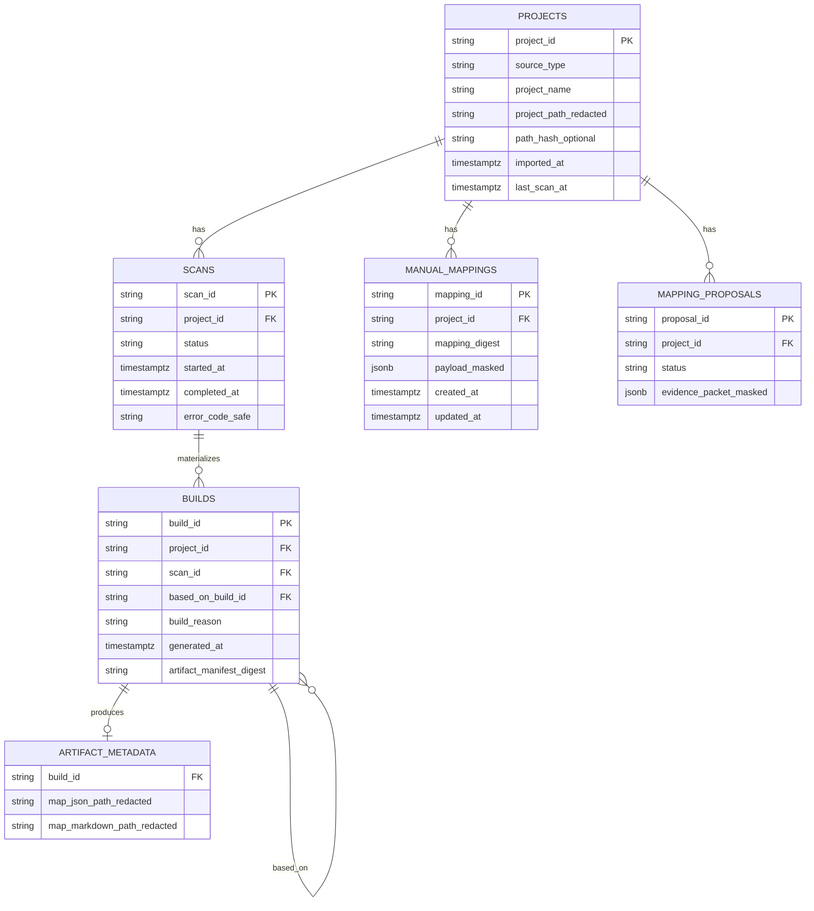
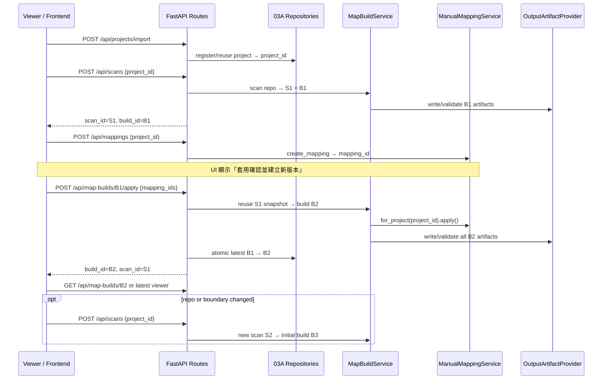

# Durable Project / Build History、Apply Confirmations 與 Rescan UX 整合計畫

> **For agentic workers:** REQUIRED SUB-SKILL: Use `superpowers:subagent-driven-development` (recommended) or `superpowers:executing-plans` to implement this plan task-by-task. Steps use checkbox (`- [ ]`) syntax for tracking.
>
> **編號說明：** 使用者建議的 `28-*` 已被 `../phase3-platform-foundation/28-introduce-openapi-generated-frontend-sdk.md` 占用；本計畫以 **Task 41** 作為跨 Task 26/27 的整合與 UX 主線，說明 **何時做什麼** 與 **資料如何以 `project_id` 串接**。

**Goal:** 在 Phase2 Plan 03A 已提供 local JSON persistence、scan/build lineage與 Apply
command之後，讓使用者能在 project/build history中找回同一專案、檢查 scanner建議、套用
confirmed decisions建立新 build，並只在 repo內容或 scan boundary改變時明確 rescan。

**Architecture:** `project_id`是 registry hub；`scan_id`識別 immutable repo scan snapshot；
`build_id`識別從 snapshot materialize的一組 artifacts；`mapping_id`是 durable user decision。
Phase2 Plan 03A擁有 repository ports、atomic local JSON adapter與
`POST /api/map-builds/{base_build_id}/apply`。Task 26延伸 history/retention，Task 27只增加
PostgreSQL adapter。本計畫擁有產品 UX，不重作 persistence或 build pipeline。

**Tech Stack:** Python protocols, Pydantic v2, FastAPI, pytest；後期 SQLAlchemy 2.x + PostgreSQL + Alembic（Task 27）；React/TypeScript viewer（Hardy frontend issues）。

**Dependencies:** `../phase2/static-trace-plan/03A-implement-apply-build-lineage-and-local-json-persistence.md`
→ `../phase3-platform-foundation/26-implement-persistent-session-store-and-scan-history.md`
→ `../phase3-platform-foundation/27-introduce-database-backed-storage-layer.md`。本計畫不取代
03A/26/27，而是定義 project/build history、Apply與 explicit Rescan UX。

---

## 2026-07-05 Superseding Correction

本節取代本文較舊的「mapping只能等下一次 rescan生效」與「Phase5先建立 local project
registry JSON」敘述：

- **Apply**：使用者確認 scanner suggestion後，呼叫
  `POST /api/map-builds/{base_build_id}/apply`，重用同一 `scan_id` snapshot，建立新
  `build_id`。不重新掃描 repo。
- **Rescan**：只有 repo內容、import source或 scan boundary改變時才呼叫
  `POST /api/scans`，建立新 `scan_id`與 initial build。
- **Persistence**：Plan 03A已擁有 atomic local JSON repositories、project/scan/build/mapping
  lineage與 latest-build switch。Task 41不得新增 `outputs/.kai_mind_project_registry.json`
  或另一套 local persistence。
- **Phase3**：Task 26增加 history/retention/query orchestration；Task 27以 PostgreSQL adapter
  替換同一組 repositories。
- **UI naming**：主要 action使用 `Review scanner suggestions` / `檢查 scanner 建議`與
  「套用 N項確認並建立新版本」；`Manual Mapping`只保留 internal lifecycle名稱。

## Q1 快速回答：哪些 identities 串起 durable decision 與 project reuse？

`project_id`是 hub，但不能再用它取代 scan/build identity：

| 實體 | 主鍵 | 關聯 | 目前狀態 |
|------|------|------|----------|
| Project | `project_id`（如 `project:<uuid>`） | — | `InMemorySessionStore.import_project()` 每次 import 產生新 UUID；重啟後遺失 |
| Scan | `scan_id`（如 `scan:<uuid>`） | `project_id` FK | `scan_routes.create_scan()` 每次 POST 產生新 `scan_id`；尚未持久化 history |
| Build | `build_id`（如 `build:<uuid>`） | `project_id` + `scan_id` + optional `based_on_build_id` | Plan 03A：initial/apply/detail enrichment各自建立 immutable build |
| ManualMapping | `mapping_id`（如 `mapping:<uuid>`） | `project_id` FK | `InMemoryManualMappingRepository` 以 `mapping.project_id` 篩選；重啟後遺失 |
| MappingProposal | `proposal_id` | `project_id` FK | 同 in-memory；accept/edit 後寫入 `ManualMapping` |

**Map build整合點：** `MapBuildService._detect_components()`在 `project_id is not None`時
呼叫 `manual_mapping_service.for_project(project_id).apply(result)`。Plan 03A將此整合成共用
build pipeline：Apply與 Rescan都可套用 confirmed mappings，但 Apply重用 snapshot、Rescan
才重新讀 repo。

**本計畫尚未完成的部分：** project/build picker、Review→Apply CTA、Apply與 Rescan差異化
copy、history比較、re-import dedup UX與 PostgreSQL mode下的跨重啟產品驗收。

**Canonical邊界：** `ai_system_map.json`屬某個 immutable `build_id`；manual mapping不寫入
canonical schema。它在 Apply建立的下一個 build重新 materialize derived result，舊 build
保持不變。

---

## 問題陳述（使用者痛點）

1. **持久化能力與產品入口分離：** Plan 03A local JSON可跨重啟保存資料，但使用者仍需要
   project/build history、latest version與 safe recovery UX。
2. **重複 import 無法 reuse：** `session_store.import_project()` 每次都 `uuid4()` 新 `project_id`，即使 `project_path` 相同也無法沿用舊 mapping。
3. **Apply與 Rescan認知落差：** 使用者確認 suggestion後應明確按 Apply建立新 build；不應
   被要求重掃未變更 repo，也不能讓 UI直接 mutate目前 graph。
4. **缺少 project 列表與 history：** 無 `GET /api/projects`、無 scan 列表；UI 無法「選回上次專案」或「對同一專案 rescan」。
5. **Rescan語意未產品化：** Apply、explicit Rescan與 re-import需不同 CTA、loading、error、
   lineage與 success copy。

---

## 目標資料模型（邏輯 ER）



### 關係語意

- **`project_id`：** 穩定專案身份；manual mapping、proposal、scan history 全部 scope 在此之下。
- **`scan_id`：** 一次 read-only repo scan snapshot；Apply不得建立新 scan id。
- **`build_id`：** 從 snapshot建立的一組完整 artifacts；initial、Apply、detail enrichment均
  建立新 build，並以 `based_on_build_id`保留 lineage。
- **`mapping_id`：** 單筆 durable user decision；Apply時由共用 build pipeline依
  `evidence_ids` / `source_unmapped_id`與 snapshot detection結果比對。
- **Re-import 策略（可選 Phase B）：** 以 canonical `project_path`（或 upload workspace id）計算 `path_hash`；若命中既有 active project 則回傳同一 `project_id`（HTTP 200 + `reused: true`），否則新建。

### 程式碼現況（已驗證）

```38:75:src/kai_mind/core/services/manual_mapping_service.py
class ManualMappingRepository(Protocol):
    ...
    def list_for_project(self, project_id: str) -> list[ManualMapping]:
        ...

class InMemoryManualMappingRepository:
    ...
    def list_for_project(self, project_id: str) -> list[ManualMapping]:
        return sorted(
            [mapping for mapping in self._items.values()
             if mapping.project_id == project_id],
            ...
        )
```

```246:262:src/kai_mind/core/services/map_build_service.py
    def _detect_components(..., project_id: str | None, ...) -> ComponentDetectionResult:
        result = self._component_detection_service.detect(...)
        if project_id is not None and self._manual_mapping_service is not None:
            return self._manual_mapping_service.for_project(project_id).apply(result)
        return result
```

```38:51:src/kai_mind/web/session_store.py
    def import_project(...):
        record = ProjectRecord(
            project_id=f"project:{uuid4()}",
            ...
        )
        self._projects[record.project_id] = record
        return record
```

---

## 架構流程（Rescan + Mapping）



---

## 分階段路線圖（WHEN to do WHAT）

| 階段 | 時機 | 負責 Plan | 交付物 | 使用者可感知改善 |
|------|------|-----------|--------|------------------|
| **A. Phase2 03A foundation** | Phase2 static path | `../phase2/static-trace-plan/03A-implement-apply-build-lineage-and-local-json-persistence.md` | project/scan/build/mapping repositories、atomic local JSON、Apply API、B1→B2 lineage | 重啟後可恢復 latest build；確認 suggestion不需重掃 repo |
| **B. Task 26** | 03A contract穩定後 | `../phase3-platform-foundation/26-implement-persistent-session-store-and-scan-history.md` | history/retention service、list/get routes、bounded cache | 可列出 projects/scans/builds並檢視版本 |
| **C. Task 27** | Task 26 contract freeze後 | `../phase3-platform-foundation/27-introduce-database-backed-storage-layer.md` | 同 repository contract的 PostgreSQL adapter與 migration | production adapter可跨重啟保存 lineage |
| **D. Frontend UX** | 03A Apply與 Task 26 history API可用後 | 本計畫 Task D | Project/build picker、Review→Apply CTA、explicit Rescan、history比較 | 使用者不需記 ids，且不混淆 Apply與 Rescan |
| **E. Path dedup（可選）** | Task 27 穩定後 | 本計畫 Task E | Import idempotency by `path_hash` | 同一路徑 re-import 沿用舊 mapping |

目前排序與 scope以 [`../phase2/README.md`](../phase2/README.md)、Task 26與 Task 27為準。

---

## API 變更摘要

### Task 26 新增（本計畫消費，不重定義）

| Method | Path | 用途 |
|--------|------|------|
| GET | `/api/projects` | 列出已登記專案（redacted path、last_scan_at） |
| GET | `/api/projects/{project_id}` | 單一專案 metadata |
| GET | `/api/projects/{project_id}/scans` | 該專案 scan history |
| GET | `/api/scans/{scan_id}` | 單次 scan 狀態與 artifact reference |
| GET | `/api/projects/{project_id}/builds` | 該專案 immutable build history |
| GET | `/api/map-builds/{build_id}` | 單一 build lineage、safe artifact refs與 status |

### Phase2 Plan 03A 新增（本計畫消費，不重定義）

| Method | Path | 用途 |
|--------|------|------|
| POST | `/api/map-builds/{base_build_id}/apply` | 重用同一 scan snapshot，套用 confirmed mapping ids並建立新 build |

### 既有 API（行為保持，語意釐清）

| Method | Path | 變更 |
|--------|------|------|
| POST | `/api/projects/import` | Task 26 改走 `SessionHistoryService`；Phase E 可選 `reused` flag |
| POST | `/api/scans` | explicit rescan入口；只有 repo/import/boundary改變時使用，建立新 `scan_id` |
| GET/POST/PATCH | `/api/mappings*` | 不變；persistence 由 repository adapter 替換 |
| GET | `/api/map` | 需能解析「當前 session 的 project context」或 query `?project_id=`（若 Task 26 尚未支援，Frontend 用 scan response 的 build_result） |

### 明確不做

- **不在** mapping/proposal decision後隱式 build；由使用者明確按 Apply建立新版本。
- **不新增** 把 manual mapping寫入 active `AiSystemMapV2` / `ai_system_map.json`；legacy
  `RagSystemMap`只可存在於 compatibility reader/migration tests。
- **不把** mapping proposal LLM payload 或 raw source 存入 DB。
- **不以 Rescan取代 Apply**，也不以 Apply重新讀 target repo。

---

## DB Schema 草圖（Task 27 migration 0001）

> 僅 metadata + masked JSONB；canonical map 仍在 filesystem artifact。

```sql
-- projects: registry hub
CREATE TABLE projects (
    project_id          TEXT PRIMARY KEY,
    source_type         TEXT NOT NULL,
    project_name        TEXT NOT NULL,
    project_path_hash   TEXT,              -- optional dedup; not raw path
    path_redacted       TEXT NOT NULL,     -- masked display only
    imported_at         TIMESTAMPTZ NOT NULL DEFAULT now(),
    last_scan_at        TIMESTAMPTZ,
    metadata            JSONB NOT NULL DEFAULT '{}'::jsonb
);

CREATE INDEX idx_projects_path_hash ON projects (project_path_hash)
    WHERE project_path_hash IS NOT NULL;

-- scans: one execution per POST /api/scans
CREATE TABLE scans (
    scan_id             TEXT PRIMARY KEY,
    project_id          TEXT NOT NULL REFERENCES projects(project_id) ON DELETE CASCADE,
    status              TEXT NOT NULL,
    started_at          TIMESTAMPTZ NOT NULL,
    completed_at        TIMESTAMPTZ,
    error_code          TEXT,
    metadata            JSONB NOT NULL DEFAULT '{}'::jsonb
);

CREATE INDEX idx_scans_project_id_started ON scans (project_id, started_at DESC);

-- builds: immutable artifact lineage from one scan snapshot
CREATE TABLE builds (
    build_id            TEXT PRIMARY KEY,
    project_id          TEXT NOT NULL REFERENCES projects(project_id) ON DELETE CASCADE,
    scan_id             TEXT NOT NULL REFERENCES scans(scan_id) ON DELETE CASCADE,
    based_on_build_id   TEXT REFERENCES builds(build_id),
    build_reason        TEXT NOT NULL,
    generated_at        TIMESTAMPTZ NOT NULL,
    artifact_manifest  JSONB NOT NULL,
    is_latest           BOOLEAN NOT NULL DEFAULT FALSE
);

CREATE INDEX idx_builds_project_generated ON builds (project_id, generated_at DESC);
CREATE UNIQUE INDEX idx_builds_one_latest_per_project ON builds (project_id)
    WHERE is_latest = TRUE;

-- manual_mappings: durable user decisions
CREATE TABLE manual_mappings (
    mapping_id          TEXT PRIMARY KEY,
    project_id          TEXT NOT NULL REFERENCES projects(project_id) ON DELETE CASCADE,
    mapping_digest      TEXT NOT NULL,
    decision            TEXT NOT NULL,
    mapping_type        TEXT NOT NULL,
    payload             JSONB NOT NULL,    -- ManualMapping fields; secret-validated before insert
    created_at          TIMESTAMPTZ NOT NULL,
    updated_at          TIMESTAMPTZ NOT NULL
);

CREATE INDEX idx_manual_mappings_project ON manual_mappings (project_id, created_at);

-- mapping_proposals: optional same migration; same project_id FK
CREATE TABLE mapping_proposals (
    proposal_id         TEXT PRIMARY KEY,
    project_id          TEXT NOT NULL REFERENCES projects(project_id) ON DELETE CASCADE,
    status              TEXT NOT NULL,
    payload             JSONB NOT NULL,
    created_at          TIMESTAMPTZ NOT NULL,
    updated_at          TIMESTAMPTZ NOT NULL
);
```

**Repository對應：** 實際 schema與 migration由 Plan 03A/26/27 repository contract決定：
`ManualMappingRepository` → `manual_mappings`；project/scan/build repositories →
`projects` / `scans` / `builds`。本節是 UX查詢需求草圖，不是另一份 migration source of
truth。

---

## 實作 Tasks

### Task A: Align Apply and explicit Rescan trace contracts

**Files:**
- Create: `scripts/trace_mapping_apply_rescan_flow.sh`
- Modify: `scripts/trace_all.sh`（選配：加入新 script）
- Modify: `docs/API-GUIDE.md`（一節「Review → Apply vs Rescan」）

- [ ] **Step 1:** Script流程：`import` → initial scan S1/B1 → create/confirm mapping →
  `POST /api/map-builds/B1/apply` → B2 → optional explicit rescan S2/B3。
- [ ] **Step 2:** Assert Apply前後 `scan_id`相同、`build_id`不同、B1 immutable、latest=B2。
- [ ] **Step 3:** Assert explicit Rescan建立新 `scan_id`，且 UI/API copy不稱它為 Apply。
- [ ] **Step 4:** 使用 Plan 03A repositories；不得新增 local project registry或 shadow JSON。

```bash
scripts/trace_mapping_apply_rescan_flow.sh --project-path tests/fixtures/rag_projects/basic_qdrant_ollama_rag
```

### Task B: 對齊 Plan 03A / Task 26 — 不 duplicate persistence/domain 工作

**Files:** 見 `../phase3-platform-foundation/26-implement-persistent-session-store-and-scan-history.md`

- [ ] **Step 1:** 確認 Task 26 adapters實作 Plan 03A project/scan/build/mapping repositories，
  不另建 identity或 local JSON格式。
- [ ] **Step 2:** `SessionHistoryService`提供 project/scan/build list/get/retention，不擁有 Apply build logic。
- [ ] **Step 3:** History route回傳 safe lineage與 artifact refs；不讀 raw target source。
- [ ] **Step 4:** `mapping_routes`仍只依賴 `ManualMappingService`；Apply route呼叫共用 build pipeline。

### Task C: 對齊 Task 27 — PostgreSQL manual mapping adapter

**Files:** 見 `../phase3-platform-foundation/27-introduce-database-backed-storage-layer.md`

- [ ] **Step 1:** 實作 `PostgresManualMappingRepository` 通過既有 contract tests
- [ ] **Step 2:** App restart integration test：import → S1/B1 → mapping → Apply B2 → restart app → latest=B2 → list mappings/builds
- [ ] **Step 3:** 確認 transaction 邊界在 service 外層；route 不碰 ORM

### Task D: Frontend Apply / Rescan UX（backend contract 就緒後）

**Files（frontend，參考）：**
- `frontend/src/store/viewerStore.ts`
- `frontend/src/services/viewerApi.ts`
- `frontend/API_CONTRACT.md`

- [ ] **Step 1:** Store保存 `project_id`、`scan_id`、`build_id`、mapping列表與 latest history。
- [ ] **Step 2:** Confirmation後顯示「套用 N項確認並建立新版本」，CTA呼叫 Apply API，
  不呼叫 Rescan。
- [ ] **Step 3:** Apply與 Rescan有分開的 loading/error/success copy；只有 Rescan處理 scan
  boundary decision。
- [ ] **Step 4:** Project/build picker消費 Task 26 history routes；成功 Apply後 refetch latest viewer。

### Task E（可選）: Import path dedup

**Files:**
- Modify: `src/kai_mind/core/services/session_history_service.py`
- Modify: `src/kai_mind/web/routes/project_routes.py`
- Test: `tests/web/test_project_import_dedup.py`

- [ ] **Step 1:** 計算 canonical path hash（normalize + redaction policy 一致）
- [ ] **Step 2:** `POST /api/projects/import` 命中時回傳既有 `project_id` + `reused: true`
- [ ] **Step 3:** 文件說明：dedup 是 best-effort；symlink / path 別名可能產生不同 hash

---

## 明確禁止（What NOT to do）

1. **不要把** `ManualMapping` / `MappingProposal`序列化進 active
   `ai_system_map.json` / `ai-system-map/v2`；也不要再擴充 v1 legacy writer。
2. **不要在** mapping create/update 或 proposal decision handler **隱式觸發** map build（避免 race、boundary gate 被 bypass、意外 artifact 寫入）。
3. **不要用** local JSON或 DB JSONB保存 raw repo內容、完整 secret或未 redacted absolute path。
4. **不要** 在 Task 26 完成前引入 ORM 到 `core/` 或 `web/routes`。
5. **不要** 假設 re-import自動 merge mapping — 除非 Task E dedup明確實作並測試。
6. **不要** 以 `POST /api/scans`實作 confirmation Apply；也不要讓 Apply重新執行 providers。

---

## 驗收標準

- [ ] Confirmation Apply重用 B1的 `scan_id`、建立 B2 `build_id`，B1保持 immutable，
  latest viewer只在 B2完整 validate/publish後切換。
- [ ] Explicit Rescan才建立新 `scan_id`，並建立該 snapshot的 initial build。
- [ ] Task 27完成後：backend restart仍可取得相同 project、mapping、scan/build history與
  latest build。
- [ ] Task 26完成後：project history可列出 scans與 immutable builds，safe lineage不含 raw
  path/secret。
- [ ] `trace_mapping_apply_rescan_flow.sh`在乾淨環境 exit 0，並證明
  `Apply: S1/B1→S1/B2`、`Rescan: S1/B2→S2/B3`。
- [ ] 文件中明確區分：`POST /api/map/build`（無 project session）vs `import → scans`（有 `project_id` + mapping）。
- [ ] 無 regression：secret masking、scan boundary gate、read-only scanner 保證。

---

## 測試計畫

| 層級 | 案例 | 命令 / 位置 |
|------|------|-------------|
| Unit | `ManualMappingService.apply` 跨 rescan 仍套用 confirmed；evidence 消失則 skip | `tests/unit/core/test_manual_mapping_service.py` |
| Unit | `InMemoryManualMappingRepository.list_for_project` project 隔離 | 同上 |
| Web | import → S1/B1 → mapping → Apply S1/B2；B1 immutable | `tests/web/test_mapping_apply_flow.py`（新建） |
| Web | explicit Rescan建立 S2/B3；不與 Apply混用 | `tests/web/test_mapping_rescan_flow.py`（新建） |
| Web | restart 後 mapping/build/latest仍在（Task 27） | `tests/web/test_storage_app_wiring.py` |
| Contract | history API 不含 raw path/secret | `tests/web/test_history_routes.py`（Task 26） |
| Script | Apply + Rescan端到端 trace | `scripts/trace_mapping_apply_rescan_flow.sh` |
| Frontend | confirmation後 CTA Apply；repo改變時 CTA Rescan | frontend contract/browser tests |

```bash
.venv/bin/pytest tests/unit/core/test_manual_mapping_service.py tests/web/test_mapping_apply_flow.py tests/web/test_mapping_rescan_flow.py -v
scripts/trace_mapping_apply_rescan_flow.sh
.venv/bin/pytest
.venv/bin/ruff check .
.venv/bin/mypy
```

---

## 相依性與 GitHub Issues

| 項目 | 連結 / 檔案 |
|------|-------------|
| Persistent session / scan history | [#126](https://github.com/1104030360/Local-AI-Health-Doctor/issues/126) → Task 26 |
| Session store growth bound | [#150](https://github.com/1104030360/Local-AI-Health-Doctor/issues/150) |
| Session store thread safety | [#174](https://github.com/1104030360/Local-AI-Health-Doctor/issues/174) |
| PostgreSQL storage | [#127](https://github.com/1104030360/Local-AI-Health-Doctor/issues/127) → Task 27 |
| Frontend project/scan flow | [#176](https://github.com/1104030360/Local-AI-Health-Doctor/issues/176)–[#181](https://github.com/1104030360/Local-AI-Health-Doctor/issues/181) |
| Phase2 / downstream plan index | [`../phase2/README.md`](../phase2/README.md) |
| Mapping 領域說明 | `docs/work/Timmy/meeting/contract-model/06-mapping-workflow.md` |
| API 契約 | `docs/API-GUIDE.md`、`frontend/API_CONTRACT.md` |

---

## 官方 / 專案參考

- Task 26/27 已列 SQLAlchemy、Alembic、JSONB 官方連結。
- 專案原則：`CLAUDE.md` — scanner read-only、local-first、artifact contracts各自 validated。
- Mapping 不進 canonical JSON：`docs/work/Timmy/meeting/contract-model/06-mapping-workflow.md` §2、§7。

---

## 完成 Gate（與其他 plan 一致）

```bash
.venv/bin/pytest
.venv/bin/ruff check .
.venv/bin/mypy
git diff --check
git status --short
```

Expected: all tests passed；ruff/mypy clean；僅 intentional files changed。
