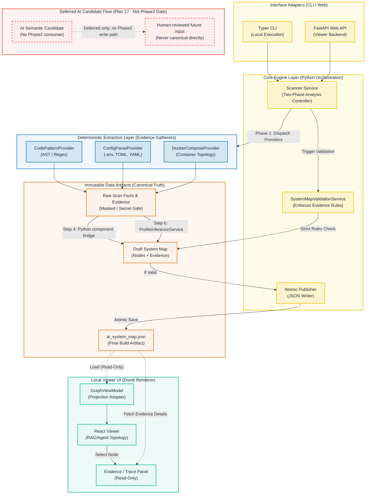

# KAI-Mind (Phase 2) 完整架構與資料流圖 (Architecture & Data Flow)

基於 `epic1-phase2.md` 與 2026-07-07/08 contract 修訂，這份圖只作
Understand-Anything 整合邊界的 reference diagram。權威契約仍以
`docs/design/epic1-phase2.md`、`docs/MODEL-CONTRACT.md` 與 `docs/API-GUIDE.md` 為準。

Phase2 active path 是 deterministic / Python 主導：Step 3 只產 facts/evidence，Step 4
做 canonical component bridge，Step 6 由 `ProfileInferenceService` 定案五態與
Mapping Completeness。AI semantic / `AssessmentOrchestrator` / LLM candidate flow 屬
Plan 17 deferred，不是 Plan 14 / 15 / 18 前置條件。

### 架構圖亮點解說

1. **黃色區域 (Core Engine)**：KAI-Mind 的大腦。這是一個嚴格的軟體工程 Pipeline，由 Python 程式碼負責編排所有流程，沒有任何 Autonomous Agent 參與流程控制。
2. **藍色區域 (Deterministic Providers)**：這才是系統獲取事實的**唯一來源**。所有的 Component 都必須基於此層抓取到的 `evidence` 才能被建立。
3. **紅色虛線區域 (Deferred AI Candidate Flow)**：不是 Phase2 active path。Plan 17 若日後重啟，也只能產生候選輸入；五態、Mapping Completeness、readiness 與 canonical truth 仍由 Python/service contract 定案。
4. **橘色區域 (Immutable Artifacts)**：資料流絕對單向。任何人工或 AI 的修改建議都必須產生一個全新的 Build ID 重新跑完 Pipeline，確保 `ai_system_map.json` 是不可回寫 (Immutable) 的最終真理。
5. **綠色區域 (Frontend Viewer)**：作為單純的投影展示。不同於 UA 的彈性語意圖，這裡的前端會強制將 JSON 轉換為 `GraphViewModel`，專注呈現 Release Readiness 相關的五態評估與網路拓樸。
