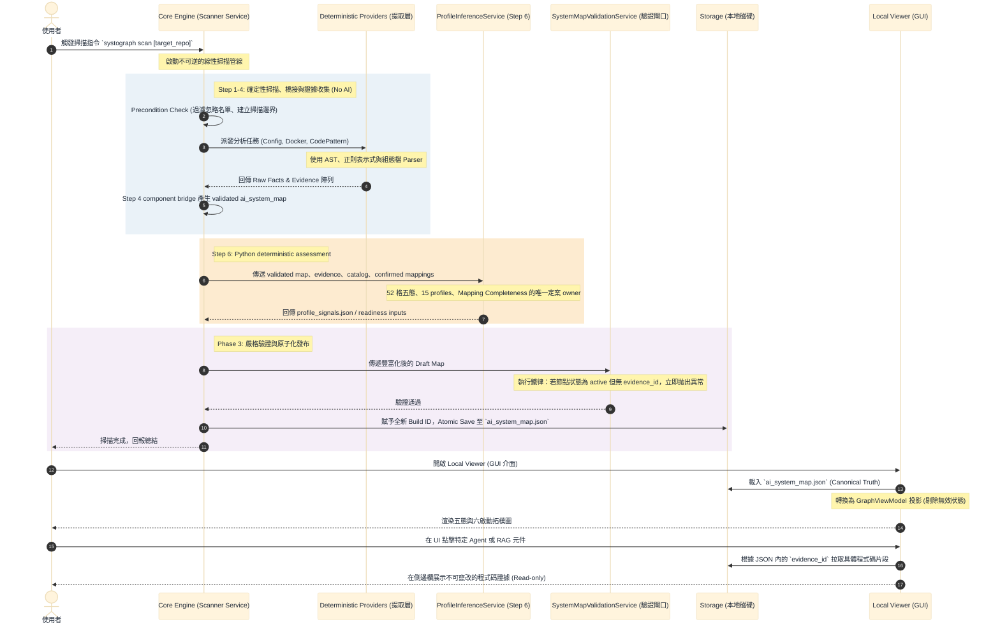

# Systograph (Phase 2) 完整運作流程圖 (Operational Flow)

這張 **循序圖 (Sequence Diagram)** 展示 Systograph Phase2 active path 的標準執行生命週期。與 Understand-Anything 由 AI 主導控制流不同，Systograph 的流程是 **由 Python 核心主導的嚴格線性管線 (Linear Pipeline)**。

此圖特別強調 **Two-Phase Analysis**：先用 deterministic scripts / AST / config parser
產生結構性 facts，再由 Python service 做語意對位與五態判定。Phase2 不建立
`AssessmentOrchestrator`，也不讓 LLM 直接裁決 profile / readiness；AI semantic candidate
flow 屬 Plan 17 deferred。

### 流程圖亮點解說

1. **Python 核心主導 (Core Engine)**：所有流程發起者都是 `Core Engine`。它將任務交給 deterministic Provider、ProfileInferenceService 與 Validator，徹底貫徹「LLM 不具備 Orchestration 權限」的設計。
2. **Facts 先於 Assessment**：流程強迫系統必須先取得 evidence-backed facts，才進入 Step 6 的 Python profile/reference assessment。這避免模型或前端憑空捏造不存在的架構節點。
3. **把關者 (Validator)**：在寫入硬碟前（步驟 10），Validator 扮演最後的防線，這對應了作為 Release Readiness Gate 所必需的安全與相容性檢查。
4. **前端直接讀取真理 (Viewer)**：前端不僅不跑 AI，連狀態都不必推算，完全只依賴 `ai_system_map.json` 中的 `evidence_id` 去展示證據。
