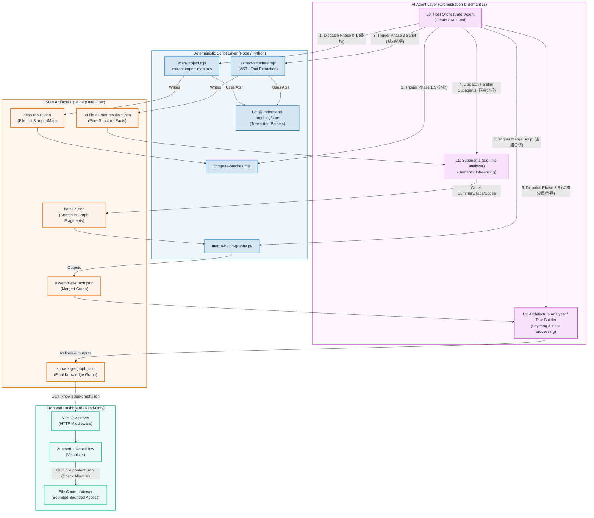

# Understand-Anything 完整架構與資料流圖 (Architecture & Data Flow)

基於您所釐清的 `Understand-Anything` 專案底層流程，我為您繪製了這份完整的系統架構圖。本圖明確劃分了 **「AI 編排層」**、**「確定性腳本層」**、**「JSON 資料流管線」** 與 **「唯讀前端渲染層」** 的職責邊界與互動關係。

### 架構圖亮點解說

1. **粉色區域 (AI Layer)**：代表擁有語意推論與流程控制權的 Agent。最上層的 `L0: Host Orchestrator` 是整個系統的大腦，負責讀取劇本並依序調度腳本或子 Agent。
2. **藍色區域 (Script Layer)**：這是純粹 Deterministic（確定性）的苦力層。它們完全沒有 AI，只負責讀檔、切分 AST、建立 Import Map 與圖譜合併。
3. **橘色區域 (JSON Pipeline)**：完美展示了您提到的產物演進過程：從純結構 (`ua-file-extract-results-*.json`) ➡️ 透過 LLM 加上語意的圖譜碎片 (`batch-*.json`) ➡️ 最終整合成完整的 Knowledge Graph。
4. **綠色區域 (Frontend)**：明確標示了 Dashboard 只是透過 Vite 讀取 JSON 並畫圖的 UI，證明了**前端絕對不會觸發或重跑 Agent**。
