# Understand-Anything 詳細架構與資料流圖

> Base: `understand_anything_architecture.md`
> Scope: `/understand` codebase analysis pipeline and local dashboard read path.
> Source of truth: `understand-anything-plugin/skills/understand/SKILL.md`, `README.md`, dashboard `vite.config.ts`.
> Note: This is a detailed companion diagram. The original graph is unchanged.

## Detailed Architecture

```mermaid
flowchart TD
    subgraph Entry["Entry"]
        User["User"]
        Command["/understand [path] [flags]"]
    end

    subgraph Orchestrator["L0 Host Orchestrator / Skill Runtime"]
        Phase0["Phase 0 Pre-flight<br>resolve PROJECT_ROOT<br>load README/manifest/tree<br>detect entrypoint/language"]
        Phase05["Phase 0.5 Ignore Gate<br>.understandignore generation/review"]
        Decision["Full vs Incremental Decision<br>--full / meta.json / changed files"]
        Phase1["Phase 1 Scan Dispatch"]
        Phase15["Phase 1.5 Batch Planning"]
        Phase2["Phase 2 Parallel File Analysis"]
        Phase3["Phase 3 Assemble Review"]
        Phase45["Phase 4-5 Architecture + Tour"]
        Phase6["Phase 6 Validation<br>inline by default<br>graph-reviewer optional"]
        Phase7["Phase 7 Save + Cleanup"]
        Warnings["PHASE_WARNINGS<br>stderr + reviewer notes"]
    end

    subgraph Agents["LLM Agent Layer"]
        Scanner["project-scanner<br>file inventory<br>languages/frameworks<br>importMap"]
        FileAnalyzer["file-analyzer x <= 5<br>per-batch semantic graph<br>summary/tags/nodes/edges"]
        AssembleReviewer["assemble-reviewer<br>cross-check merged graph<br>importMap + merge report"]
        ArchAnalyzer["architecture-analyzer<br>layers.json<br>language/framework context"]
        TourBuilder["tour-builder<br>tour.json<br>guided learning path"]
        GraphReviewer["graph-reviewer optional<br>--review full LLM review"]
    end

    subgraph Scripts["Deterministic Script / Core Layer"]
        ComputeBatches["compute-batches.mjs<br>semantic batches<br>neighborMap<br>changed-files mode"]
        ExtractStructure["extract-structure.mjs / core parsers<br>Tree-sitter structural facts"]
        Merge["merge-batch-graphs.py<br>normalize ids<br>dedupe<br>drop dangling edges<br>recover imports/tested_by"]
        InlineValidate["ua-inline-validate.cjs<br>node/edge/layer/tour checks"]
        Fingerprints["build-fingerprints.mjs<br>structural baseline"]
        Core["@understand-anything/core<br>types/schema/search<br>Tree-sitter plugin registry"]
    end

    subgraph Artifacts[".understand-anything Artifacts"]
        Config["config.json<br>autoUpdate/outputLanguage"]
        IgnoreFile[".understandignore"]
        ScanResult["intermediate/scan-result.json<br>files + fileCategory<br>importMap"]
        Batches["intermediate/batches.json<br>batchImportData + neighborMap"]
        BatchFiles["intermediate/batch-*.json<br>GraphNode/GraphEdge fragments"]
        Assembled["intermediate/assembled-graph.json<br>merged graph draft"]
        AssembleReview["intermediate/assemble-review.json"]
        Layers["intermediate/layers.json"]
        Tour["intermediate/tour.json"]
        Review["intermediate/review.json<br>issues/warnings/stats"]
        FinalGraph["knowledge-graph.json<br>final graph"]
        Meta["meta.json<br>gitCommitHash<br>lastAnalyzedAt<br>analyzedFiles"]
        Trash[".trash-*<br>tmp cleanup<br>scan-result preserved"]
    end

    subgraph Dashboard["Local Dashboard / Read-Only Viewer"]
        Vite["Vite dev server<br>127.0.0.1:5173<br>token-protected endpoints"]
        TokenGate["TokenGate<br>?token=ACCESS_TOKEN"]
        ValidateGraph["validateGraph()<br>schema coercion/warnings"]
        Store["Zustand store<br>graph/domain/diff state"]
        GraphUI["ReactFlow GraphView<br>layers/search/filters/tour"]
        FileEndpoint["GET /file-content.json"]
        Allowlist["Path safety gate<br>token + graph-derived allowlist<br>no abs/path traversal<br>1MB + no binary"]
        SourcePreview["Source preview"]
    end

    User --> Command --> Phase0 --> Phase05 --> Decision
    Decision -- "full run" --> Phase1
    Decision -- "incremental run" --> Phase15
    Phase1 --> Phase15 --> Phase2 --> Phase3 --> Phase45 --> Phase6 --> Phase7
    Phase1 --> Scanner --> ScanResult
    Phase15 --> ComputeBatches
    ScanResult --> ComputeBatches --> Batches
    Phase2 --> FileAnalyzer
    Batches --> FileAnalyzer
    FileAnalyzer -. "structure context" .-> ExtractStructure --> Core
    FileAnalyzer --> BatchFiles --> Merge --> Assembled
    ScanResult -. "importMap recovery" .-> Merge
    Merge --> Warnings
    Phase3 --> AssembleReviewer
    Assembled --> AssembleReviewer --> AssembleReview --> Warnings
    Phase45 --> ArchAnalyzer
    Phase45 --> TourBuilder
    Assembled --> ArchAnalyzer --> Layers
    Assembled --> TourBuilder
    Layers --> TourBuilder --> Tour
    Phase6 --> InlineValidate
    Assembled --> InlineValidate
    Layers --> InlineValidate
    Tour --> InlineValidate
    InlineValidate --> Review
    Review -- "optional --review" --> GraphReviewer --> Review
    Review -- "valid graph" --> FinalGraph
    Phase7 --> FinalGraph --> Fingerprints --> Meta
    Phase7 --> Trash
    Config --> Phase0
    IgnoreFile --> Scanner
    Phase0 --> Config
    Phase05 --> IgnoreFile
    FinalGraph --> Vite
    Meta --> Vite
    Vite --> TokenGate --> ValidateGraph --> Store --> GraphUI
    GraphUI --> FileEndpoint --> Allowlist --> SourcePreview

    classDef orchestrator fill:#f9e0fb,stroke:#c442c4,stroke-width:2px,color:#1f2937;
    classDef agent fill:#fdebd0,stroke:#d68910,stroke-width:2px,color:#1f2937;
    classDef script fill:#d4e6f1,stroke:#2980b9,stroke-width:2px,color:#1f2937;
    classDef artifact fill:#fdf2e9,stroke:#e67e22,stroke-width:2px,color:#1f2937;
    classDef ui fill:#e8f8f5,stroke:#1abc9c,stroke-width:2px,color:#1f2937;
    classDef entry fill:#f4f4f5,stroke:#71717a,stroke-width:2px,color:#1f2937;
    class Phase0,Phase05,Decision,Phase1,Phase15,Phase2,Phase3,Phase45,Phase6,Phase7,Warnings orchestrator;
    class Scanner,FileAnalyzer,AssembleReviewer,ArchAnalyzer,TourBuilder,GraphReviewer agent;
    class ComputeBatches,ExtractStructure,Merge,InlineValidate,Fingerprints,Core script;
    class Config,IgnoreFile,ScanResult,Batches,BatchFiles,Assembled,AssembleReview,Layers,Tour,Review,FinalGraph,Meta,Trash artifact;
    class Vite,TokenGate,ValidateGraph,Store,GraphUI,FileEndpoint,Allowlist,SourcePreview ui;
    class User,Command entry;

    style Entry fill:#f4f4f5,stroke:#71717a,color:#1f2937,stroke-width:2px;
    style Orchestrator fill:#fdf5ff,stroke:#c442c4,color:#1f2937,stroke-width:2px;
    style Agents fill:#fef8f0,stroke:#d68910,color:#1f2937,stroke-width:2px;
    style Scripts fill:#eef6fb,stroke:#2980b9,color:#1f2937,stroke-width:2px;
    style Artifacts fill:#fef6ef,stroke:#e67e22,color:#1f2937,stroke-width:2px;
    style Dashboard fill:#eefaf7,stroke:#1abc9c,color:#1f2937,stroke-width:2px;
```



## Artifact Lineage

```text
README/manifest/tree
  -> Phase 1 project-scanner
  -> intermediate/scan-result.json
       files + categories + languages + frameworks + importMap
  -> Phase 1.5 compute-batches.mjs
  -> intermediate/batches.json
       per-batch files + batchImportData + neighborMap
  -> Phase 2 file-analyzer agents
  -> intermediate/batch-*.json
       semantic nodes/edges
  -> merge-batch-graphs.py
  -> intermediate/assembled-graph.json
       normalized graph draft
  -> Phase 3-5 reviewers/analyzers
       assemble-review.json + layers.json + tour.json
  -> Phase 6 validation
       review.json
  -> Phase 7 save
       knowledge-graph.json + meta.json + fingerprint baseline
  -> /understand-dashboard
       token-protected read-only rendering
```

## Correctness Gates

- `scan-result.json#importMap` is the deterministic source for cross-batch import recovery.
- `compute-batches.mjs` failure is hard; recoverable batching issues surface as warnings.
- `merge-batch-graphs.py` normalizes IDs, drops dangling edges, dedupes, repairs `tested_by`, and logs corrections.
- Phase 6 validates node, edge, layer, and tour referential integrity before dashboard launch.
- Phase 7 writes `meta.json` only after fingerprint baseline succeeds.
- Dashboard data endpoints require token, bind to localhost, sanitize paths, and only serve file content listed in graph node `filePath`.

## Boundary Notes

- L0 owns orchestration, phase ordering, config bootstrap, ignore handling, cleanup, and final save.
- LLM agents add semantics and review, but deterministic scripts/core own repeatable structure, batching, normalization, validation, and fingerprint gates.
- Intermediate files are scratch artifacts except preserved `scan-result.json`; the final shareable graph is `knowledge-graph.json`.
- Dashboard reads graph artifacts and source previews only; it does not re-run `/understand` or mutate graph artifacts.
