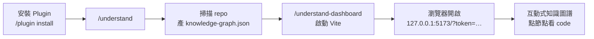
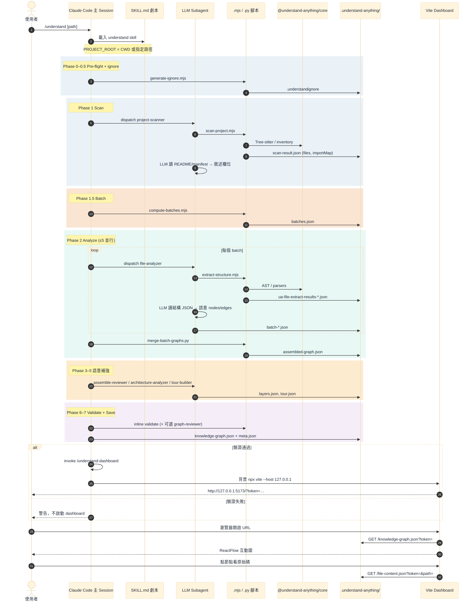
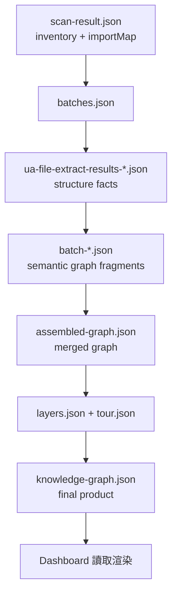
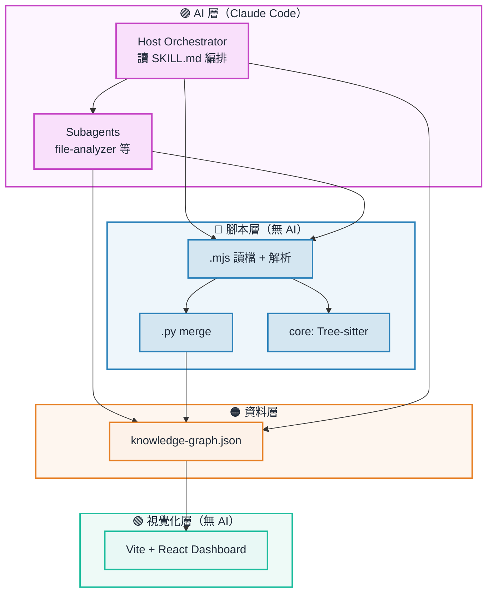

# Understand-Anything 完整運作流程圖 (Operational Flow)

> Source: `ref-opensource/Understand-Anything/understand-anything-plugin/`
> 詳細架構圖見：`understand_anything_architecture_detailed.md`
> **Canonical 可視化總圖見：`understand_anything_pipeline_visual.md`**

---

## 一、使用者視角（最簡流程）

| 步驟 | 誰做 | 產物 |
|------|------|------|
| 安裝 | 使用者 | Claude Code 索引 `skills/` + `agents/` |
| `/understand` | Claude agent 編排 | `.understand-anything/knowledge-graph.json` |
| `/understand-dashboard` | Claude 啟動 Vite | 本機 URL（非 Claude 內嵌） |
| 瀏覽 | 使用者瀏覽器 | 讀 JSON 渲染圖（不重跑 AI） |

---

## 二、技術流程（Phase 0–7 + Dashboard）

---

## 三、資料演進（JSON 管線）

---

## 四、角色分工（一圖看懂）

---

## 五、重點釐清

| 常見誤解 | 實際 |
|----------|------|
| mjs 建立可視化 HTML | ❌ mjs 只產 JSON；UI 是預建 React app |
| 圖嵌入 Claude 介面 | ❌ 獨立 Vite dev server + 系統瀏覽器 |
| 只掃當前 repo | ⚠️ 預設 CWD，可傳 `/understand /path` |
| 腳本在底層叫 AI | ❌ **上層 AI 叫腳本** |
| Dashboard 重跑 scan | ❌ 只讀已存的 JSON |

---

## 六、與 Systograph 對照

見 `systograph_flow.md`：Systograph 由 **Python Core** 線性編排；UA 由 **IDE 內 AI agent** 依 Markdown 劇本編排。
