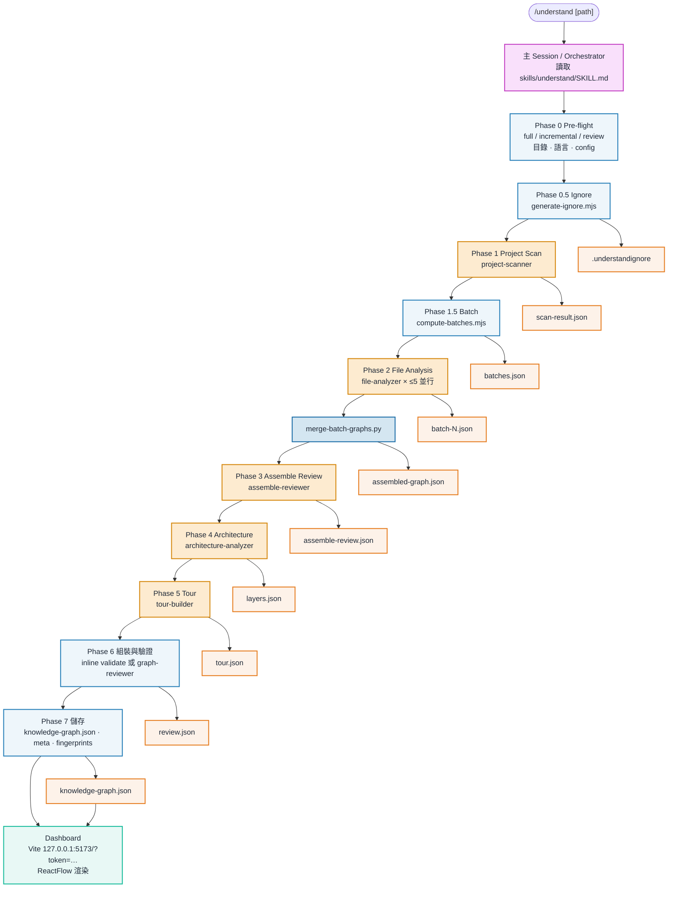
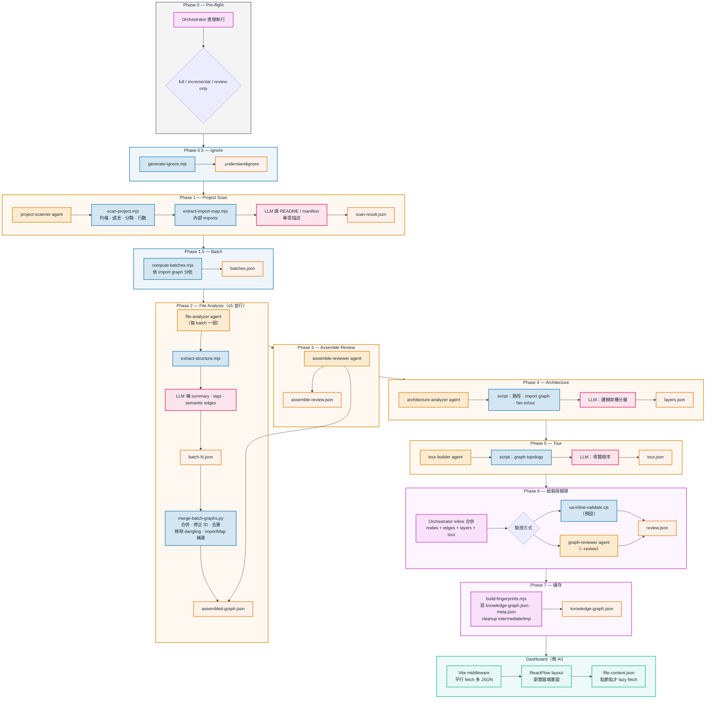
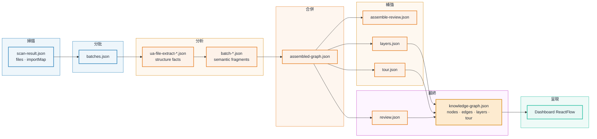
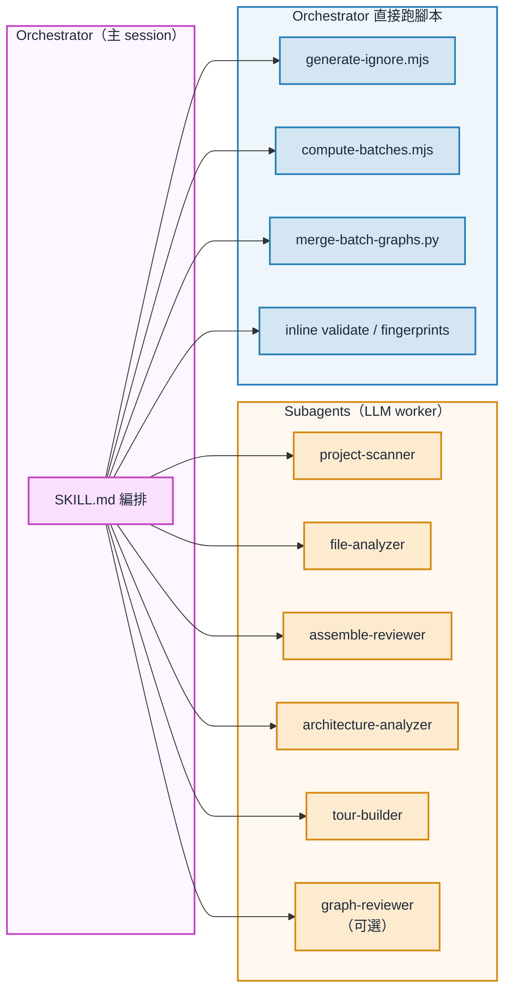

# Understand-Anything `/understand` 可視化流程圖

> Canonical pipeline（已驗證版）
> 來源：`skills/understand/SKILL.md`、`agents/*.md`、`packages/dashboard/`

在 IDE 開啟本檔 Markdown Preview 即可渲染 Mermaid 圖。

---

## 圖 1：主管線總覽（Phase 0 → Dashboard）

---

## 圖 2：Phase 展開（Agent · Script · 產物）

---

## 圖 3：資料流（JSON 演進）

---

## 圖 4：Subagent 與執行者對照

---

## 圖例

| 顏色 | 意義 |
|------|------|
| 粉紫 | Orchestrator / 主 session 編排 |
| 橘黃 | LLM Subagent |
| 藍色 | 確定性腳本（.mjs / .py / .cjs） |
| 橘色 | JSON artifact |
| 綠色 | Dashboard / ReactFlow（無 AI） |

## 關鍵邊界

- **沒有 agent 產視覺圖**；`layers.json` 是邏輯分層 metadata，ReactFlow 在瀏覽器 layout。
- **Python 只在 Phase 2** merge batch；layers/tour 由 Orchestrator Phase 6 inline 組裝。
- **file-analyzer 內部**先 `extract-structure.mjs` 再 LLM；Orchestrator 不跨管線餵結構 JSON。
- **Dashboard** 啟動時平行 fetch 多 JSON；原始碼 `/file-content.json` 才按需拉取。

## 相關檔案

- `understand_anything_flow.md` — 循序圖版
- `understand_anything_architecture_detailed.md` — 元件級架構圖
- `kai_mind_flow.md` — KAI-Mind 對照
