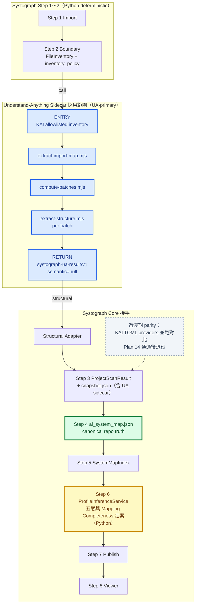
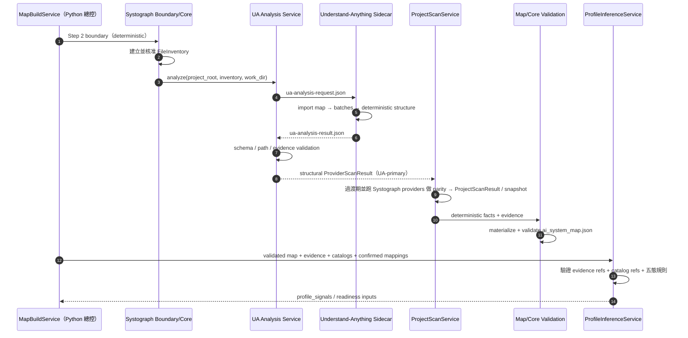

# Systograph x Understand-Anything 呼叫與回傳整合邊界

> 狀態：Accepted（2026-07-07 P0 決策拍板）
>
> 日期：2026-07-07
>
> 範圍：Phase 2 靜態 codebase analysis；AI semantic candidate integration deferred

> **2026-07-07 late superseding amendment：** 本文件原有 Step 6
> `AssessmentOrchestrator` / AI candidate flow 已被 Phase2 ASCII map 與 static plan README
> 取代。Phase2 Step 6 使用純 Python `ProfileInferenceService`；Plan 17 deferred，UA
> snapshot wrapper 可保存 structural result，但 `semantic` 維持 `null`、無 Phase2 consumer。
> 下文保留的 orchestrator 設計只作 deferred appendix，不是 Plan 14 / 18 / 15 前置條件。

## 0. 已拍板決策（2026-07-07）

| # | 決策 | 定案 |
|---|------|------|
| 1 | Step 3 掃描器模式 | **UA-primary + parity gate 過渡**：UA sidecar 為主掃描來源；Systograph scan TOML providers 過渡期並跑做 parity 對比，Plan 14 真實 repo + fixture 驗證通過後退役 |
| 2 | Step 6 評估 | **純 Python**：`ProfileInferenceService` 直接讀 validated map、confirmed non-baseline candidates 與 TOML metadata 定五態 |
| 3 | Orchestrator 形態 | Phase2 **不建立** `AssessmentOrchestrator`；Plan 17 / AI semantic candidate flow deferred |
| 4 | Apply 語意 | **不重跑 UA**：重放同一 `scan_id` 的 deterministic `ScanSnapshot.scan_result`，重跑 Step 4～7 |
| 5 | sidecar 保存 | Phase B/C 可保存 **scan snapshot internal structural wrapper**；`semantic=null`，不列 public artifact；Phase2 無 semantic consumer |

外部佐證（2025–2026）：AST-derived KG 優於 LLM-generated KG（arXiv 2601.08773）、LLM-propose + deterministic-verify pattern（FormalJudge arXiv 2602.11136）、OWASP LLM Top 10 Excessive Agency、OpenAI Agents SDK guardrails。

## 1. 文件目的

本文件回答兩個問題：

1. Systograph 應從 Understand-Anything 哪一段開始呼叫，並在哪一段取回結果？
2. Systograph 現有 Step 1～8 pipeline 應在哪裡呼叫 Understand-Anything，並把回傳結果接回哪裡？

本設計只沿用 Understand-Anything 的 codebase analysis 能力，不把 Systograph 改造成 Claude Code plugin，也不採用 Understand-Anything 的 dashboard 或 `knowledge-graph.json` 作為 Systograph canonical truth。

參考文件：

- `ref-opensource/arch-graph/understand_anything_pipeline_visual.md`
- `docs/work/Timmy/schedule/plan/unfinish/phase4-scanner-expansion/00-phase2-pipeline-ascii-map.md`

---

## 2. 結論先講

已定案採用 **Understand-Anything deterministic import analysis → batching → structural
extraction**，然後立即回傳 Systograph。UA 是 Phase B/C Step 3 的 **primary 掃描來源**；Systograph
既有 scan TOML providers 只在 parity gate 過渡期並跑，Plan 14 驗證通過後退役。
`file-analyzer`、semantic graph merge 與後續 Phase 3～7 不在 Phase2 active path。

```text
Understand-Anything 採用範圍

Systograph 核准的 FileInventory
        │
        ▼
extract-import-map.mjs
        │
        ▼
compute-batches.mjs
        │
        ▼
extract-structure.mjs（per batch）
        │
        ▼
回傳 Systograph

不繼續：
Phase 2 file-analyzer / semantic graph merge
Phase 3 assemble-reviewer
Phase 4 architecture-analyzer
Phase 5 tour-builder
Phase 6 knowledge graph assembly
Phase 7 knowledge-graph.json / dashboard
```

### 最重要的四個位置

| 系統 | 位置 | 決策 |
|---|---|---|
| Understand-Anything | Phase 1 的 `extract-import-map.mjs` 前 | **Sidecar entry point** |
| Understand-Anything | Phase 2 deterministic structural extraction 彙整後、`file-analyzer` 前 | **Sidecar return point** |
| Systograph | Step 2 boundary 完成後、Step 3 provider scan 期間 | **呼叫 Understand-Anything** |
| Systograph | Step 3 接 structural facts；semantic slot 保持 `null` | **Phase2 只消費 structural path** |

這不是兩次掃描。Understand-Anything 的 deterministic structural facts 回到 Step 3，參與
`ProjectScanResult` 與 `snapshot.json`。Phase B/C 可選保存 structural wrapper；reserved
`semantic` 欄位維持 `null`，Phase2 不產生也不消費。

---

## 3. Understand-Anything 側：呼叫點與回傳點

### 3.1 呼叫點：Phase 1 import analysis 前

不要從 `/understand` 指令、Phase 0 或 Phase 0.5 開始，也不要讓 `scan-project.mjs` 成為 Systograph 的 authoritative inventory owner。

Systograph 已在 Step 2 決定可掃描檔案與 boundary policy，因此應新增一個 sidecar entry command，例如：

```text
systograph-analyze.mjs
```

概念介面：

```bash
node systograph-analyze.mjs \
  --project-root <target-repo> \
  --inventory <systograph-work-dir>/ua-analysis-request.json \
  --work-dir <systograph-work-dir>/understand-anything \
  --output <systograph-work-dir>/ua-analysis-result.json
```

`ua-analysis-request.json` 由 Systograph 產生，至少包含：

```json
{
  "schema_version": "systograph-ua-request/v1",
  "project_root": "/absolute/path/used-only-by-local-sidecar",
  "files": [
    {
      "path": "src/app.py",
      "language": "python",
      "size_lines": 120,
      "file_category": "code"
    }
  ]
}
```

### 為什麼不直接用 `scan-project.mjs`

`scan-project.mjs` 會自行使用 Git / walk 列舉檔案並套用 `.understandignore`。若直接採用，它可能與 Systograph Step 2 的 `inventory_policy` 產生兩套掃描邊界。

正確做法是：

```text
Systograph FileInventory 是唯一掃描邊界
        ↓
轉成 Understand-Anything 所需的 files[]
        ↓
後續腳本只能分析這份 allowlisted inventory
```

已定案做法：**不執行** `scan-project.mjs`。其有價值的 enrichment 邏輯（語言偵測、`fileCategory` 分類、行數統計）移植進 Systograph Step 2 inventory 建立流程（`FilesystemProvider` / inventory enrichment），讓 `ua-analysis-request.json` 的 `files[]` 自帶完整 metadata。

### 3.2 Understand-Anything 內部執行範圍

### A. `extract-import-map.mjs`

直接沿用 import resolution 能力。它已接受明確的 input/output JSON 路徑。

輸入：

```json
{
  "projectRoot": "/target/repo",
  "files": [
    {
      "path": "src/app.py",
      "language": "python",
      "sizeLines": 120,
      "fileCategory": "code"
    }
  ]
}
```

輸出重點：

```json
{
  "scriptCompleted": true,
  "stats": {
    "filesScanned": 1,
    "filesWithImports": 1,
    "totalEdges": 2
  },
  "importMap": {
    "src/app.py": ["src/service.py", "src/config.py"]
  }
}
```

### B. `compute-batches.mjs`

沿用 Louvain grouping、batch size control、`neighborMap` 與 incremental batching。

需要修改 I/O：目前它把輸入與輸出寫死為：

```text
<project-root>/.understand-anything/intermediate/scan-result.json
<project-root>/.understand-anything/intermediate/batches.json
```

Systograph scanner 對 target repo 預設 read-only，因此應改成明確的 `--input`、`--output` 或 `--work-dir`，不得在 target repo 建立 `.understand-anything/`。

### C. `extract-structure.mjs`

直接沿用 Tree-sitter 與 non-code parser。它已接受 input/output JSON 路徑，輸出包含：

- functions / classes / exports
- sections / definitions
- services / endpoints / resources / pipeline steps
- call graph hints
- bounded metrics

每個 batch 的輸入只能使用 Systograph 核准 inventory 中的檔案。

### D. Deferred：`file-analyzer` / `merge-batch-graphs.py`

Phase2 active path **不執行** `file-analyzer`，也不建立 semantic batch graph，因此不需要以
`merge-batch-graphs.py` 的 semantic graph 作正式輸入。兩者只保留為 Plan 17 或 post-Phase2
候選研究，不得成為 Step 3、Step 4 或 Step 6 的必要依賴。

### 3.3 回傳點：deterministic structural extraction 後

Understand-Anything 的正式 return point 放在：

```text
extract-import-map.mjs + per-batch extract-structure.mjs
        ↓
systograph-ua-result/v1 structural wrapper
        ↓
Systograph structural adapter
```

到這裡立即停止，不執行 `file-analyzer`、semantic graph merge 或 Phase 3～7。

### 為什麼在這裡回傳

- deterministic import / structure extraction 已提供 Systograph Phase2 需要的 imports、symbols、
  config/resources 與 call-like hints。
- Phase 3～5 是 Understand-Anything 自己的 graph review、architecture layers 與 learning tour。
- Phase 6～7 的 `knowledge-graph.json` 與 dashboard 是 Understand-Anything 的產品 contract，不是 Systograph `ai_system_map.json` contract。

Sidecar 最終回傳（定案 contract）：

```json
{
  "schema_version": "systograph-ua-result/v1",
  "status": "completed",
  "structural": {
    "import_map": {},
    "files": [],
    "call_graph_hints": []
  },
  "semantic": null,
  "warnings": [],
  "stats": {}
}
```

此 JSON 是 snapshot-internal integration wrapper，不是 public artifact。Wrapper 必須收集：

- `extract-import-map.mjs` 輸出
- 每批 `ua-file-extract-results-*.json`
- deterministic warnings / skipped items / stats

`semantic` 固定為 `null`；不得為了湊齊 wrapper 而執行 `file-analyzer`。

---

## 4. Systograph 側：呼叫點與回傳點

### 4.1 呼叫點：Step 2 完成後、Step 3 期間

Systograph 呼叫 Understand-Anything 的位置是：

```text
Step 1 Import
        ↓
Step 2 Boundary（Python，deterministic）
  · 建立 FileInventory
  · 完成 inventory_policy
        ↓
【呼叫 Understand-Anything sidecar】
        ↓
Step 3 deterministic scan aggregation
```

Step 1～3 之間 **沒有** AI orchestration agent；編排由 Python `ProjectScanService` /
`MapBuildService` 負責。Phase2 Step 6 無 AI 編排；原 `AssessmentOrchestrator` 設計已 deferred
（見 4.3 appendix）。

對應現有 code boundary：

```text
ProjectScanService.scan(...)
  1. FilesystemProvider.build_inventory(project_root)
  2. inventory_policy.apply(...)
  3. 呼叫 UnderstandAnythingAnalysisService.analyze(inventory)  ← UA-primary 掃描來源
  4. 過渡期：並跑既有 Config / Docker / Dependency / CodePattern providers
     （僅供 parity 對比；Plan 14 驗證通過後退役，不再是主掃描器）
  5. 合併 facts / evidence / issues
  6. 產 ProjectScanResult
```

不要把 subprocess 細節直接塞進 `CodePatternProvider`。建議新增：

```text
UnderstandAnythingAnalysisService
  ├─ NodeRuntimePreflight
  ├─ UnderstandAnythingSubprocessRunner
  ├─ UnderstandAnythingResultValidator
  └─ UnderstandAnythingResultAdapter
```

原因：Understand-Anything 回傳的不只有 code regex facts，還包含 imports、structure、
config/infra parsers 與 call graph hints。它的責任範圍大於 `CodePatternProvider`。

### 4.2 回傳點一：Step 3 deterministic facts

`ua-analysis-result.json.structural` 先經 adapter 轉成 Systograph 已有 contract：

```text
UA structural result
        ↓
UnderstandAnythingResultAdapter
        ↓
ProviderScanResult
  · facts[]
  · evidence[]
  · issues[]
        ↓
ProjectScanService aggregation
        ↓
ProjectScanResult
        ↓
snapshot.json
```

轉換原則：

| UA 資料 | Systograph 目的地 | 限制 |
|---|---|---|
| `importMap` | import facts + evidence | path 必須在核准 inventory |
| functions/classes/exports | symbol facts + evidence | 必須保留 file + line range |
| services/endpoints/resources | provider facts + evidence | 不直接判定 component slot |
| `callGraph` | static call-like hints | 不得宣稱為 runtime truth |
| warnings/skipped | issues/warnings | 不得靜默丟棄 |

Step 3 回傳只增加可驗證的 static facts，不在此階段寫入：

- `plane_id`
- reference node id
- profile 五態
- `confidence`
- runtime execution truth

### 4.3 Deferred appendix：Step 6 semantic candidates（AssessmentOrchestrator）

Phase2 的 `ua-analysis-result.json.semantic` 固定為 `null`，不放入 canonical
`ProjectScanResult`，也不供 Step 6 使用。

以下內容是 Plan 17 未來若重啟時的候選設計，**不屬於 Phase2 active pipeline**。原設計由
thin **`AssessmentOrchestrator`** 編排：它是獨立 Python service，負責組 context、依
workflow 設定呼叫 AI candidate agents、跑 validator、
最後交給 `ProfileInferenceService` 定案。未來新增 agent 只改 workflow 設定，不改
`MapBuildService`。

```text
AssessmentOrchestrator（thin，Step 6 唯一 AI 編排點）
  │
  ├─ UA semantic nodes / edges（snapshot sidecar）
  │         ↓
  ├─ Semantic Candidate Adapter
  │         ↓
  ├─ 候選 plane/component + reason + evidence_ids
  │   （可擴充：其他 candidate agents，workflow 設定驅動）
  │         ↓
  ├─ Candidate Contract Validator
  │         ↓
  └─ ProfileInferenceService（Python，五態唯一 owner）
            ↓
      profile_signals.json
```

Candidate validator 至少必須拒絕：

- 不存在於 canonical map 的 `evidence_id`
- 不存在於 catalog 的 plane/component/reference node
- 指向被 boundary 排除檔案的 candidate
- 沒有 evidence 支撐的 detected/partial 建議
- AI 自行新增 canonical component
- 把 `confidence` 寫入 `ai_system_map.json`

Understand-Anything semantic nodes/edges 原生不保證帶有 Systograph `evidence_ids`。`Semantic Candidate Adapter` 只能依下列方式建立 evidence reference：

```text
UA semantic node/edge 的 file path + line range
        ↓
查找 Step 3 已建立的 canonical Evidence
        ↓
找到唯一對應 → 引用既有 evidence_id
找不到或對應不唯一 → candidate 標記 unresolved 或直接丟棄
```

Adapter 不得替 AI 結果臨時產生新的可信 evidence，也不得把 node summary 當成 evidence。

Step 6 回傳只協助 `ProfileInferenceService` 判斷，不能直接修改 Step 4 已驗證的 `ai_system_map.json`。

---

## 5. 完整整合流程圖



---

## 6. 循序圖：誰呼叫誰



---

## 7. 腳本採用與修改清單

| Understand-Anything 元件 | 採用方式 | 必要修改 |
|---|---|---|
| `scan-project.mjs` | 不作 authoritative scan | 不執行；其語言偵測 / fileCategory / 行數 enrichment 邏輯移植進 Systograph Step 2 inventory（Systograph boundary 仍是唯一 allowlist owner） |
| `extract-import-map.mjs` | 直接沿用 | 加強 allowlist/path validation wrapper |
| `compute-batches.mjs` | 沿用演算法 | 改成明確 input/output/work-dir |
| `extract-structure.mjs` | 直接沿用 | temp/output 必須在 Systograph work dir |
| `file-analyzer` | **Phase2 不執行** | Plan 17 / post-Phase2 deferred |
| `merge-batch-graphs.py` | **Phase2 active path 不依賴 semantic merge** | Plan 17 / post-Phase2 deferred |
| `assemble-reviewer` | 第一版跳過 | Systograph candidate validator 取代 truth gate |
| `architecture-analyzer` | 跳過 | Systograph Step 6 負責 10 planes / 52 components |
| `tour-builder` | 跳過 | Systograph 不需要 learning tour |
| Phase 6 graph assembly | 跳過 | 不產 Systograph canonical map |
| Phase 7 / dashboard | 跳過 | Systograph Step 7/8 自己 publish/render |

---

## 8. Read-only 與安全邊界

1. Target repo 只能被讀取；不得建立 `.understand-anything/`、temp 或 fingerprint 檔。
2. 所有 intermediate artifacts 寫入 Systograph 自己的 scan/build work directory。
3. `project_root + relative path` 必須再次驗證，禁止 `..`、絕對 path 注入與 symlink escape。
4. subprocess 使用固定 Node executable、固定 script path、argument list、`shell=False` 與 timeout。
5. stdout/stderr 必須限制大小並經 path/secret redaction，不能把完整本機路徑或 secret 寫入 artifact。
6. Phase2 不呼叫 LLM；若 Plan 17 日後重啟，只能接收 bounded、masked evidence，不得把整個 repo 原始碼一次送入模型。
7. Sidecar schema 不合法、Node runtime 缺失或必要 batch 失敗時，必須停止進入 Step 4，不能假裝掃描完整。

---

## 9. 不可混淆的責任

| 問題 | Owner |
|---|---|
| 哪些檔案可以掃？ | Systograph Step 2 Boundary |
| import / function / class / call-like structure 是什麼？ | Understand-Anything deterministic scripts |
| generic semantic relationship 候選是什麼？ | Plan 17 / post-Phase2 deferred；Phase2 不產生 |
| 是否為 Systograph component / unmapped？ | Systograph Step 4 Core |
| Step 6 AI workflow 誰編排？ | Phase2 無 AI workflow；Plan 17 `AssessmentOrchestrator` deferred |
| 對應哪個 plane / 52 component？ | `ProfileInferenceService` 直接依 validated deterministic evidence 定案 |
| 五態正式結果是什麼？ | Systograph `ProfileInferenceService`（唯一 owner） |
| 哪份是 repo canonical truth？ | Systograph `ai_system_map.json` |
| 誰負責畫圖？ | Systograph Step 7 projection + Step 8 Viewer |
| Apply 時 UA 重跑嗎？ | 不重跑；重放 snapshot 內 deterministic `scan_result`，重跑 Step 4～7 |
| Rescan 時 UA 重跑嗎？ | 重跑（新 snapshot、新 UA 結果） |

---

## 10. 最終決策

### Understand-Anything 側

```text
呼叫點：Phase 1 extract-import-map 前
回傳點：deterministic structural extraction 彙整後、file-analyzer 前
```

### Systograph 側

```text
呼叫點：Step 2 boundary 完成後、Step 3 deterministic scan 期間
回傳點 A：Step 3 ProjectScanResult / snapshot.json（UA-primary）
回傳點 B：deferred（Plan 17）
          Phase2 wrapper 的 semantic 欄位維持 null，不進 ProfileInference
```

### Apply / Rescan 與 UA

```text
Rescan  Step 2→3：重跑 UA structural sidecar，產新 snapshot（semantic=null）
Apply   跳 Step 3：重放 snapshot 內 deterministic scan_result
        → 4-1 bridge replay → 4-2 confirmed mappings → 重跑 Step 4～7（同 scan、新 build_id）
```

### 過渡與退役

```text
過渡期  UA sidecar 與 Systograph TOML providers 並跑，輸出做 parity 對比
gate    Plan 14 真實 repo + fixture parity 驗證
退役    通過後 code_pattern / dependency_manifest / docker_image providers
        退出主掃描路徑；risk_hint / recommended_next_check 文案 TOML 保留
```

### 一句話版本

Systograph 先決定「可以看哪些檔案」，Understand-Anything 在 Phase B/C 負責產生 structural
facts；snapshot wrapper 的 `semantic` 維持 `null`。Phase2 只由 `ProfileInferenceService`
根據 validated deterministic evidence 定案 plane/component 五態。AI candidate flow 留待
Plan 17 另案重啟。
