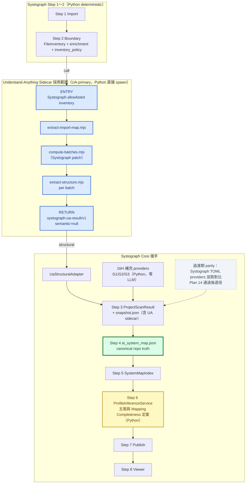
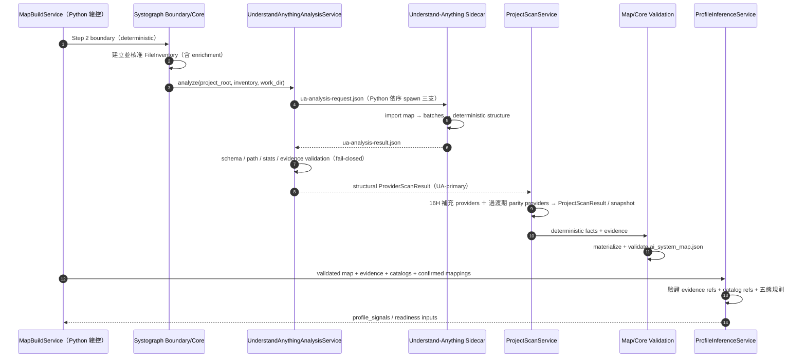

# Systograph x Understand-Anything 呼叫與回傳整合邊界

> 狀態：Accepted（2026-07-07 P0 決策拍板；2026-08-10 依當前 repo 狀態全文重寫，
> 併入 2026-08-04～08-10 之全部裁定，過時指令已刪除——本版即現行契約，無需回溯舊版）
>
> 範圍：Phase 2 靜態 codebase analysis；AI semantic candidate integration deferred（Plan 17）
>
> 基準：repo HEAD `52931d6`；UA submodule pinned `73559a1`（plugin v2.8.2）

## 0. 已拍板決策

| # | 決策 | 定案 | 日期 |
|---|------|------|------|
| 1 | Step 3 掃描器模式 | **UA-primary + parity gate 過渡**：UA sidecar 為主掃描來源；Systograph scan TOML providers 過渡期並跑做 parity 對比，Plan 14 驗證通過後退役（Plan 18） | 2026-07-07 |
| 2 | Step 6 評估 | **純 Python**：`ProfileInferenceService` 直接讀 validated map、confirmed non-baseline candidates 與 TOML metadata 定五態；Phase2 無 AI 編排，`AssessmentOrchestrator` deferred（Plan 17，見 §4.3） | 2026-07-07 |
| 3 | Apply 語意 | **不重跑 UA**：重放同一 `scan_id` 的 deterministic `ScanSnapshot.scan_result`，重跑 Step 4～7 | 2026-07-07 |
| 4 | sidecar 保存 | Phase B/C 可保存 **scan snapshot internal structural wrapper**（`ScanSnapshot.ua_analysis_result`）；`semantic=null`，不列 public artifact，Phase2 不產生也不消費 semantic | 2026-07-07 |
| 5 | 編排形態 | **無 wrapper**：不新增任何 Systograph 自有 `.mjs`；Python（`UnderstandAnythingSubprocessRunner`）直接依序 spawn 三支 UA script（原位執行），膠水責任全在 Python | 2026-08-04 |
| 6 | work-dir | **系統暫存目錄**，每次掃描一個、掃完刪除（除錯 env var 可保留現場）；不落 target repo、不落 `src/systograph/`、不落 `~/.systograph/` | 2026-08-04 |
| 7 | `compute-batches` 改法 | **patch 檔 + 安裝腳本**：`sidecar/patches/compute-batches-workdir.patch`，由 `scripts/setup_ua_sidecar.sh` 於安裝階段 `git apply` 至 submodule 工作樹；不 fork、不 commit 進 submodule、不 bump gitlink | 2026-08-04 |
| 8 | 部署形態 | **Native**：Python（uv）＋本機 Node ≥22 直接跑；Docker deferred 另案 | 2026-08-05 |
| 9 | CLI | `systograph map` 走**同一條 Step 2→3 管線**（非互動 boundary gate + snapshot 落地；blocked 時 fail-closed 指向 Web review）；CLI 不得自行 walk 檔案樹（Plan 16 Task 8） | 2026-08-05 |
| 10 | rule_id 命名 | UA facts 用新 **`ua_*`** 前綴 id；`ua_*` ↔ legacy 對照併入語彙目錄（`code_pattern_rules.toml` 演進版，每列同載 legacy id／kind／symbol／ua id）；provenance 靠前綴天然可分 | 2026-08-05 |
| 11 | UA 覆蓋缺口 G1/G3 | **Python-only 補充 provider**（`ast_construction_provider.py`，Plan 16H）：G1 函式外建構、G3 外部 import 邊，零 LLM；UA 維持 12 語言 primary，不倒轉為 Python-primary；16H 的 G3 部分為 Plan 16 Task 3（adapter）**硬前置**（parity 基線一致性） | 2026-08-04／08-10 |
| 12 | UA 覆蓋缺口 G2 | **確定性程式推論**（取代原「人工確認為主」）：追進工廠函式（深度上限，建議 3 跳起），分支不塌縮、全部標推論（`evidence_kind_hint` → indirect）、節點最多 partial、邊為 `undetermined` ＋專屬 reason（如 `factory_inference`）、不進 profile 接線證據；人工確認降為可選旁路；零 LLM | 2026-08-10 |
| 13 | 證據來源硬化 | `Evidence` 新增可選 `evidence_kind_hint`：生產者可申報「帶行號但屬推論」為 indirect；有 hint 從 hint、無 hint 照形狀判定。**任何推論型 fact 必須申報**；此欄為 16H 第一個 Task（G2 推論的必要前置） | 2026-08-10 |

外部佐證（2025–2026）：AST-derived KG 優於 LLM-generated KG（arXiv 2601.08773）、LLM-propose + deterministic-verify pattern（FormalJudge arXiv 2602.11136）、OWASP LLM Top 10 Excessive Agency、OpenAI Agents SDK guardrails。

## 1. 文件目的

本文件回答兩個問題：

1. Systograph 應從 Understand-Anything 哪一段開始呼叫，並在哪一段取回結果？
2. Systograph 現有 Step 1～8 pipeline 應在哪裡呼叫 Understand-Anything，並把回傳結果接回哪裡？

本設計只沿用 Understand-Anything 的 codebase analysis 能力，不把 Systograph 改造成 Claude Code plugin，也不採用 Understand-Anything 的 dashboard 或 `knowledge-graph.json` 作為 Systograph canonical truth。

參考文件：

- `ref-opensource/arch-graph/understand_anything_pipeline_visual.md`
- `docs/work/Timmy/schedule/plan/unfinish/phase4-scanner-expansion/00-phase2-pipeline-ascii-map.md`
- 實作計畫：`docs/work/Timmy/schedule/plan/unfinish/phase2/static-trace-plan/s2-ua-integration/`
  （16＝sidecar 主計畫、16B＝實測 I/O 參考、16C＝邊推導、16D＝消費者 cutover、
  16E＝覆蓋缺口裁定、16G＝模板邊退役、16H＝G1/G2/G3 補充 provider、
  CLARIFICATIONS-2026-08-10.md＝本次修訂的裁定紀錄）

---

## 2. 結論先講

已定案採用 **Understand-Anything deterministic import analysis → batching → structural
extraction**，然後立即回傳 Systograph。UA 是 Phase B/C Step 3 的 **primary 掃描來源**；Systograph
既有 scan TOML providers 只在 parity gate 過渡期並跑，Plan 14 驗證通過後退役。
`file-analyzer`、semantic graph merge 與後續 Phase 3～7 不在 Phase2 active path。

```text
Understand-Anything 採用範圍

Systograph 核准的 FileInventory（＋enrichment：language / file_category / size_lines）
        │
        ▼
extract-import-map.mjs
        │
        ▼
compute-batches.mjs（已套 Systograph patch：--input/--output/--work-dir）
        │
        ▼
extract-structure.mjs（per batch）
        │
        ▼
回傳 Systograph（三支皆由 Python 直接 spawn；無 wrapper）

並行於 Step 3（非 UA 範圍）：
16H Python 補充 provider（G1 函式外建構／G2 工廠推論／G3 外部 import）

不繼續：
Phase 2 file-analyzer / semantic graph merge
Phase 3 assemble-reviewer
Phase 4 architecture-analyzer
Phase 5 tour-builder
Phase 6 knowledge graph assembly
Phase 7 knowledge-graph.json / dashboard
```

### 最重要的四個位置

| 系統 | 位置 | 決策 |
|---|---|---|
| Understand-Anything | Phase 1 的 `extract-import-map.mjs` 前 | **Sidecar entry point**（Python 直接 spawn） |
| Understand-Anything | Phase 2 deterministic structural extraction 彙整後、`file-analyzer` 前 | **Sidecar return point** |
| Systograph | Step 2 boundary 完成後、Step 3 provider scan 期間 | **呼叫 Understand-Anything** |
| Systograph | Step 3 接 structural facts；semantic slot 保持 `null` | **Phase2 只消費 structural path** |

這不是兩次掃描。Understand-Anything 的 deterministic structural facts 回到 Step 3，參與
`ProjectScanResult` 與 `snapshot.json`。Phase B/C 可選保存 structural wrapper；reserved
`semantic` 欄位維持 `null`，Phase2 不產生也不消費。

---

## 3. Understand-Anything 側：呼叫點與回傳點

### 3.1 呼叫點：Phase 1 import analysis 前

不要從 `/understand` 指令、Phase 0 或 Phase 0.5 開始，也不要讓 `scan-project.mjs` 成為 Systograph 的 authoritative inventory owner。

Systograph 已在 Step 2 決定可掃描檔案與 boundary policy。編排**不經任何 `.mjs` wrapper**（決策 5）：
Python `UnderstandAnythingSubprocessRunner` 以固定 argument list、`shell=False`、timeout，
依序 spawn 三支 script（留在 vendored 樹原位執行——三支的 `pluginRoot` 由 `__dirname` 推導，
複製出樹外會斷 `@understand-anything/core` 與 `graphology` 解析）。膠水責任全在 Python：

1. 決定性合成 `scan-result.json`（`files` ＋ `importMap` 原樣傳遞、不得增刪改）
2. `snake_case` ⇄ `camelCase` 轉換
3. 每步呼叫前 `mkdir -p` work dir（三支 script 都不自建目錄）
4. 逐 batch 呼叫並以 `batchIndex` 收檔（1-based、可能不連續）
5. 絕不執行 `scan-project.mjs`
6. stderr 全量收集、限量、轉入 warnings／issues（不得靜默丟）

`ua-analysis-request.json` 由 Systograph 產生（schema：`schemas/systograph-ua-request.v1.schema.json`），至少包含：

```json
{
  "schema_version": "systograph-ua-request/v1",
  "project_root": "/absolute/path/used-only-by-local-sidecar",
  "inventory_digest": "sha256:...",
  "files": [
    {
      "path": "src/app.py",
      "language": "python",
      "size_lines": 120,
      "file_category": "code",
      "digest": "sha256:..."
    }
  ]
}
```

`files[].language` 是 load-bearing（驅動 import resolver 分派；標錯不報錯、該語言邊靜默消失），
因此 enrichment 是 Step 2 的正式責任，不是可選加值。

### 為什麼不執行 `scan-project.mjs`

`scan-project.mjs` 會自行使用 Git / walk 列舉檔案並套用 `.understandignore`。若直接採用，它會與 Systograph Step 2 的 `inventory_policy` 形成兩套掃描邊界，且其安全姿態（跟隨 symlink、無大小上限、無 TOCTOU 防護）不符 Systograph 的 read-only／safe-open 保證。

已定案做法：**不執行**。其有價值的 enrichment 邏輯（語言偵測、`fileCategory` 分類、行數統計）移植進 Systograph Step 2 inventory 建立流程（`FilesystemProvider`；Plan 16 Task 2），讓 request 的 `files[]` 自帶完整 metadata：

```text
Systograph FileInventory 是唯一掃描邊界
        ↓
轉成 Understand-Anything 所需的 files[]
        ↓
後續腳本只能分析這份 allowlisted inventory
```

### 3.2 Understand-Anything 內部執行範圍

### A. `extract-import-map.mjs`

直接沿用（路徑乾淨：純 positional `<input.json> <output.json>`）。所有解析候選經 `fileSet`
過濾，輸出天然閉合在 inventory 白名單內；外部套件被丟棄（此即 G3 缺口，由 16H 補）。

輸入／輸出重點：

```json
{
  "projectRoot": "/target/repo",
  "files": [{ "path": "src/app.py", "language": "python", "fileCategory": "code" }]
}
```

```json
{
  "scriptCompleted": true,
  "stats": { "filesScanned": 1, "filesWithImports": 1, "totalEdges": 2 },
  "importMap": { "src/app.py": ["src/service.py", "src/config.py"] }
}
```

⚠️ **`scriptCompleted: true` 不等於成功**：tree-sitter init 全滅時仍 exit 0、importMap 全空。
Validator 必須另驗 `stats.totalEdges` 與 stderr（fail-closed，見 §8.7）。

### B. `compute-batches.mjs`

沿用 Louvain grouping、batch size control、`neighborMap`（`--changed-files` 增量模式 Phase2 不使用）。

它把輸入輸出寫死在 `<project-root>/.understand-anything/intermediate/`，違反 target repo
read-only——**以 patch 修正**（決策 7）：加 `--input`／`--output`／`--work-dir`，
**必須保留 `<project-root>` positional**（`extractExports()` 真的讀原始碼跑 tree-sitter，
source root 與中間檔位置是兩種語意）。patch 只以 `.patch` 檔存在 Systograph repo，
安裝時 `git apply`；套用需冪等、失敗即 preflight fail-closed。
`neighborMap` 截斷（`MAX_NEIGHBORS=50`）的 `Warning:` 必須轉成 issue，不得靜默丟。

### C. `extract-structure.mjs`

直接沿用（路徑乾淨；逐 batch 執行）。輸出包含：

- functions / classes / exports（帶 startLine/endLine）
- sections / definitions
- services / endpoints / resources / pipeline steps（services 的 lineRange 為條件展開，可能缺）
- call graph hints（`{caller, callee, lineNumber}`；僅 `fileCategory ∈ {code, script}`；失敗靜默缺席）
- bounded metrics

每個 batch 的輸入只能使用 Systograph 核准 inventory 中的檔案。單檔 analyze 失敗與
callGraph 抽取失敗在 JSON 上皆表現為「key 不存在」——adapter 不得把缺席當成「確定沒有」。

### D. Deferred：`file-analyzer` / `merge-batch-graphs.py`

Phase2 active path **不執行** `file-analyzer`，也不建立 semantic batch graph，因此不需要以
`merge-batch-graphs.py` 的 semantic graph 作正式輸入。兩者只保留為 Plan 17 或 post-Phase2
候選研究，不得成為 Step 3、Step 4 或 Step 6 的必要依賴。

### 3.3 回傳點：deterministic structural extraction 後

Understand-Anything 的正式 return point 放在：

```text
extract-import-map.mjs + per-batch extract-structure.mjs
        ↓
systograph-ua-result/v1 structural wrapper（Python 收攏）
        ↓
UaStructuralAdapter
```

到這裡立即停止，不執行 `file-analyzer`、semantic graph merge 或 Phase 3～7。

### 為什麼在這裡回傳

- deterministic import / structure extraction 已提供 Systograph Phase2 需要的 imports、symbols、
  config/resources 與 call-like hints。
- Phase 3～5 是 Understand-Anything 自己的 graph review、architecture layers 與 learning tour。
- Phase 6～7 的 `knowledge-graph.json` 與 dashboard 是 Understand-Anything 的產品 contract，不是 Systograph `ai_system_map.json` contract。

Sidecar 最終回傳（定案 contract；schema：`schemas/systograph-ua-result.v1.schema.json`）：

```json
{
  "schema_version": "systograph-ua-result/v1",
  "status": "completed",
  "structural": {
    "import_map": {},
    "files": [],
    "call_graph_hints": []
  },
  "semantic": null,
  "warnings": [{ "stage": "...", "message": "..." }],
  "stats": {
    "filesScanned": 0, "filesWithImports": 0, "totalEdges": 0,
    "totalBatches": 0, "algorithm": "louvain", "filesAnalyzed": 0
  },
  "extra": {}
}
```

形狀規則（2026-08-05 裁定）：`stats` 核心欄位定型且 required；`warnings` 結構化
`{stage, message}`（已遮罩、限量）；`extra` 為唯一開放容器——原樣傳遞、不驗證、**不消費**，
契約測試保證其內容不流入 `ScanFact`／`Evidence`／任何判定輸入；`extra` 以外所有層級
unknown fields 拒絕（fail-closed）。

此 JSON 是 snapshot-internal integration wrapper（`ScanSnapshot.ua_analysis_result`），
不是 public artifact。Wrapper 必須收集：

- `extract-import-map.mjs` 輸出
- 每批 `ua-file-extract-results-*.json`
- deterministic warnings / skipped items / stats

`semantic` 固定為 `null`；不得為了湊齊 wrapper 而執行 `file-analyzer`。

---

## 4. Systograph 側：呼叫點與回傳點

### 4.1 呼叫點：Step 2 完成後、Step 3 期間

```text
Step 1 Import
        ↓
Step 2 Boundary（Python，deterministic）
  · 建立 FileInventory ＋ enrichment（language / file_category / size_lines）
  · 完成 inventory_policy
        ↓
【呼叫 Understand-Anything sidecar】＋【16H Python 補充 providers】
        ↓
Step 3 deterministic scan aggregation
```

Step 1～3 之間 **沒有** AI orchestration agent；編排由 Python `ProjectScanService` /
`MapBuildService` 負責。Web 與 CLI 走**同一條** Step 2→3 管線（決策 9）。

對應現有 code boundary：

```text
Step 2 selection → 核准 FileInventory
  ↓
UnderstandAnythingAnalysisService.analyze(inventory)   ← UA-primary 掃描來源
  ├─ NodeRuntimePreflight        Node≥22／core dist／patch 已套；缺→fail-closed
  ├─ UnderstandAnythingSubprocessRunner   直接 spawn 三支（shell=False、timeout）
  ├─ UnderstandAnythingResultValidator    schema／path allowlist／stats／batch completion
  └─ UaStructuralAdapter                  UA structural → ScanFact/Evidence/ParseIssue
  ↓
16H 補充 providers（ast_construction_provider：G1/G2/G3）── 同層產 facts
  ↓
過渡期：並跑既有 Config / Docker / Dependency / CodePattern providers
        （僅供 parity 對比；Plan 14 驗證通過後退役，不再是主掃描器）
  ↓
合併 facts / evidence / issues → ProjectScanResult → snapshot.json
```

**UA 不得做成普通 provider**：`ProjectScanService` 的 provider loop 會吞例外降級續跑
（fail-open），與 UA 的 fail-closed 要求相反。`UnderstandAnythingAnalysisService`
必須包在 provider loop **之上**，失敗直接 raise（§8.7）。

### 4.2 回傳點一：Step 3 deterministic facts

`ua-analysis-result.json.structural` 先經 `UaStructuralAdapter` 轉成 Systograph 已有 contract：

```text
UA structural result
        ↓
UaStructuralAdapter
        ↓
ProviderScanResult（facts[] / evidence[] / issues[]）
        ↓
ProjectScanService aggregation → ProjectScanResult → snapshot.json
```

轉換原則（rule_id 前綴＝決策 10）：

| UA 資料 | rule_id 前綴 | Systograph 目的地 | 限制 |
|---|---|---|---|
| `importMap` | `ua_import_*` | import facts + evidence | path 必須在核准 inventory；無行號→誠實 indirect |
| functions/classes/exports | `ua_symbol_*` | symbol facts + evidence | 必須保留 file + line range（→ direct） |
| services/endpoints/resources | `ua_endpoint_*` | provider facts + evidence | 不直接判定 component slot；無 lineRange 者維持 indirect |
| `callGraph` | `ua_call_hint_*` | static call-like hints | 不得宣稱為 runtime truth |
| warnings/skipped/stderr 截斷 | — | `ParseIssue`（`scan_stage="ua_structural_scan"`）/ warnings | 不得靜默丟棄 |

Adapter 三條硬規則（違反任一整條路白接）：

- **A 四元組對齊**：每個 `ScanFact` 必須配一筆 `(file, path, kind, rule_id)` 完全一致的
  `Evidence`——join 不到時 bridge 回 `NO_MATCH`，fact 被靜默丟棄。
- **B direct 門檻**：UA 自帶行號的欄位必須填 `Evidence.line_start` 才是 `direct`；
  無行號者誠實維持 `indirect`，**不得捏造行號**。推論型 fact（16H G2）必須以
  `evidence_kind_hint` 申報 indirect（決策 12/13）。
- **C evidence id 穩定**：id 由內容決定（deterministic），同 repo 狀態跨次重跑必須相同——
  Apply 的 `ManualMapping.evidence_ids` 子集檢查依賴此穩定性。

Step 3 回傳只增加可驗證的 static facts，**不得寫入**（需契約測試逐條釘住）：

- `plane_id`
- reference node id
- profile 五態
- `confidence`
- runtime execution truth

### 4.3 Deferred appendix：Step 6 semantic candidates（AssessmentOrchestrator）

Phase2 的 `ua-analysis-result.json.semantic` 固定為 `null`，不放入 canonical
`ProjectScanResult`，也不供 Step 6 使用。

以下內容是 Plan 17 未來若重啟時的候選設計，**不屬於 Phase2 active pipeline**。原設計由
thin **`AssessmentOrchestrator`** 編排：獨立 Python service，組 context、依 workflow
設定呼叫 AI candidate agents、跑 validator、最後交給 `ProfileInferenceService` 定案。

Candidate validator（屬 Plan 17，Phase2 不建）至少必須拒絕：

- 不存在於 canonical map 的 `evidence_id`
- 不存在於 catalog 的 plane/component/reference node
- 指向被 boundary 排除檔案的 candidate
- 沒有 evidence 支撐的 detected/partial 建議
- AI 自行新增 canonical component
- 把 `confidence` 寫入 `ai_system_map.json`

Semantic Candidate Adapter 只能以「UA 的 file path + line range → 查找 Step 3 既有
canonical Evidence」建立 evidence reference；找不到或不唯一 → unresolved 或丟棄。
不得替 AI 結果臨時產生新的可信 evidence，也不得把 node summary 當成 evidence，
**不得申報 `evidence_kind_hint=direct`**（與決策 13 對稱）。

---

## 5. 完整整合流程圖



---

## 6. 循序圖：誰呼叫誰



---

## 7. 腳本採用與修改清單

| Understand-Anything 元件 | 採用方式 | 定案處置 |
|---|---|---|
| `scan-project.mjs` | 不作 authoritative scan | **不執行**；語言偵測 / fileCategory / 行數 enrichment 邏輯移植進 Systograph Step 2 inventory（boundary 仍是唯一 allowlist owner） |
| `extract-import-map.mjs` | 直接沿用（原位執行） | Validator 負責 allowlist/path validation；`scriptCompleted` 不得單獨視為成功 |
| `compute-batches.mjs` | 沿用演算法 | **patch 檔 + 安裝腳本**（決策 7）：加 `--input/--output/--work-dir`，保留 project-root positional |
| `extract-structure.mjs` | 直接沿用（原位執行） | temp/output 必須在 Systograph work-dir（系統暫存） |
| `file-analyzer` | **Phase2 不執行** | Plan 17 / post-Phase2 deferred |
| `merge-batch-graphs.py` | **Phase2 active path 不依賴** | Plan 17 / post-Phase2 deferred |
| `assemble-reviewer` | 跳過 | truth gate 由 Plan 17 的 candidate validator 承接（Phase2 不建） |
| `architecture-analyzer` | 跳過 | Systograph Step 6 負責 10 planes / 52 components |
| `tour-builder` | 跳過 | Systograph 不需要 learning tour |
| Phase 6 graph assembly | 跳過 | 不產 Systograph canonical map |
| Phase 7 / dashboard | 跳過 | Systograph Step 7/8 自己 publish/render |

Submodule pin（`73559a1`）是刻意的——本文件的腳本盤點以該 commit 驗證。
`git status` 顯示 submodule modified 是 patch 的預期副作用；**不得 stage gitlink**，
除非 pin bump 是明確意圖。

---

## 8. Read-only 與安全邊界

1. Target repo 只能被讀取；不得建立 `.understand-anything/`、temp 或 fingerprint 檔。
2. 所有 intermediate artifacts 寫入**系統暫存 work-dir**（每次掃描一個、掃完刪除；
   除錯 env var 可保留）；不落 target repo、不落 `src/systograph/`、不落 `~/.systograph/`。
   需留存的只有收攏後的 wrapper，走 `ScanSnapshot` 機制。
3. `project_root + relative path` 必須再次驗證，禁止 `..`、絕對 path 注入、symlink escape、
   NUL 與跨 drive path。
4. subprocess 使用固定 Node executable、固定 script path、argument list、`shell=False` 與 timeout。
5. stdout/stderr 必須限制大小並經 path/secret redaction，不能把完整本機路徑或 secret 寫入 artifact。
6. Phase2 掃描路徑**零 LLM**（含 16H 的 G2 推論——確定性 AST，非 LLM）；若 Plan 17 日後重啟，
   只能接收 bounded、masked evidence，不得把整個 repo 原始碼一次送入模型。
7. Sidecar schema 不合法、Node runtime 缺失、必要 batch 失敗、`stats.totalEdges` 異常歸零時，
   必須停止進入 Step 4，不能假裝掃描完整（fail-closed；`scriptCompleted:true` 不足為憑）。
8. **Vendored tree 豁免條款**：不得在 `ref-opensource/Understand-Anything/` 實作 Systograph
   功能；唯一豁免＝安裝階段以 `git apply` 套用 `compute-batches` patch（決策 7），
   該改動不得 commit 進 submodule、不得 stage gitlink。其餘修改一律走上游貢獻。

---

## 9. 不可混淆的責任

| 問題 | Owner |
|---|---|
| 哪些檔案可以掃？ | Systograph Step 2 Boundary（Web 與 CLI 同一條管線） |
| import / function / class / call-like structure 是什麼？ | **UA deterministic scripts（12 語言 primary）＋ 16H Python 補充 providers（G1 函式外建構／G2 工廠推論／G3 外部 import；補充，不倒轉 primary）** |
| 工廠背後接的是哪個元件？ | 16H 確定性推論（分支不塌縮、標推論、節點 ≤ partial、邊 undetermined）；人工確認為可選旁路 |
| generic semantic relationship 候選是什麼？ | Plan 17 / post-Phase2 deferred；Phase2 不產生 |
| 是否為 Systograph component / unmapped？ | Systograph Step 4 Core（typed Python bridge；語彙目錄提供 symbol↔rule_id↔ua_* 對照） |
| Step 6 AI workflow 誰編排？ | Phase2 無 AI workflow；Plan 17 `AssessmentOrchestrator` deferred |
| 對應哪個 plane / 52 component？ | `ProfileInferenceService` 直接依 validated deterministic evidence 定案 |
| 五態正式結果是什麼？ | Systograph `ProfileInferenceService`（唯一 owner） |
| 哪份是 repo canonical truth？ | Systograph `ai_system_map.json` |
| 誰負責畫圖？ | Systograph Step 7 projection + Step 8 Viewer |
| Apply 時 UA 重跑嗎？ | 不重跑；重放 snapshot 內 deterministic `scan_result`，重跑 Step 4～7 |
| Rescan 時 UA 重跑嗎？ | 重跑（新 snapshot、新 UA 結果）——Plan 16 驗收需含此路徑 |

---

## 10. 最終決策

### Understand-Anything 側

```text
呼叫點：Phase 1 extract-import-map 前（Python 直接 spawn，無 wrapper）
回傳點：deterministic structural extraction 彙整後、file-analyzer 前
```

### Systograph 側

```text
呼叫點：Step 2 boundary 完成後、Step 3 deterministic scan 期間
回傳點 A：Step 3 ProjectScanResult / snapshot.json（UA-primary ＋ 16H 補充）
回傳點 B：deferred（Plan 17）
          Phase2 wrapper 的 semantic 欄位維持 null，不進 ProfileInference
```

### Apply / Rescan 與 UA

```text
Rescan  Step 2→3：重跑 UA structural sidecar ＋ 16H providers，產新 snapshot（semantic=null）
Apply   跳 Step 3：重放 snapshot 內 deterministic scan_result
        → 4-1 bridge replay → 4-2 confirmed mappings → 重跑 Step 4～7（同 scan、新 build_id）
```

### 過渡與退役

```text
過渡期  UA sidecar（＋16H）與 Systograph TOML providers 並跑，輸出做 parity 對比
        （16H 的 G3 先於 adapter 落地，確保 parity 基線一致）
gate    Plan 14 真實 repo + fixture parity 驗證
退役    通過後 code_pattern / dependency_manifest / docker_image providers
        退出主掃描路徑（Plan 18）；risk_hint / recommended_next_check 文案 TOML 保留
```

### 一句話版本

Systograph 先決定「可以看哪些檔案」；Understand-Anything（Python 直接 spawn，無 wrapper）
在 Phase B/C 產生 structural facts，16H 以零 LLM 的 Python 補充 providers 補齊
G1/G2/G3 盲點（推論一律誠實標記、封頂 partial）；snapshot wrapper 的 `semantic` 維持
`null`。Phase2 只由 `ProfileInferenceService` 根據 validated deterministic evidence
定案 plane/component 五態。AI candidate flow 留待 Plan 17 另案重啟。
